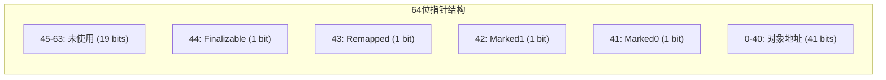
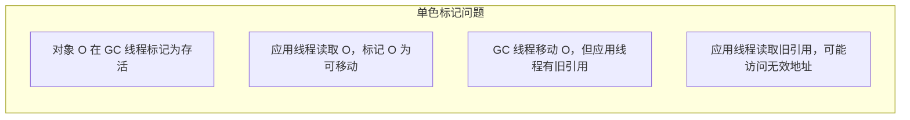
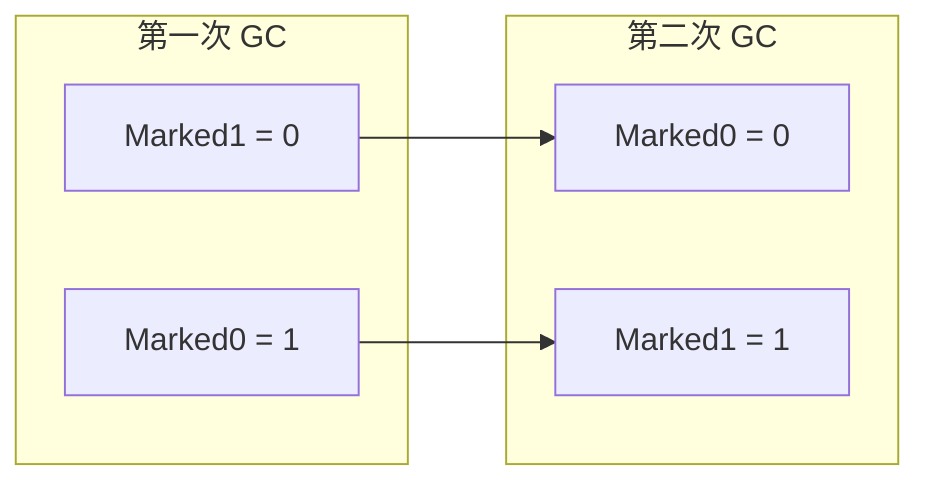
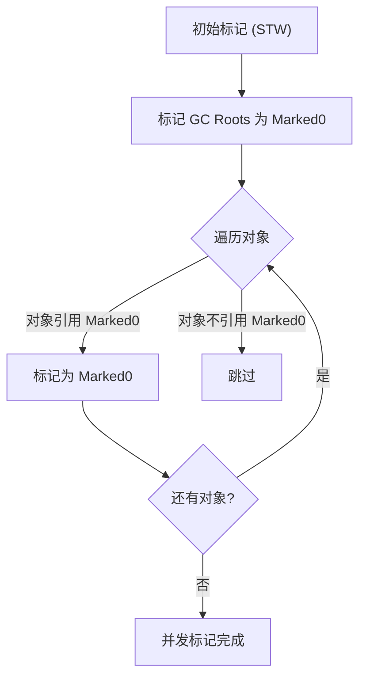
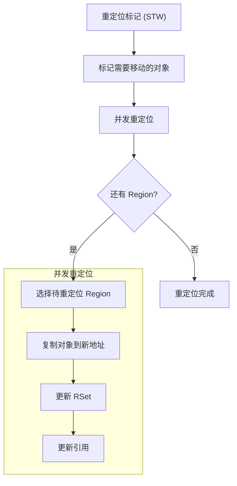
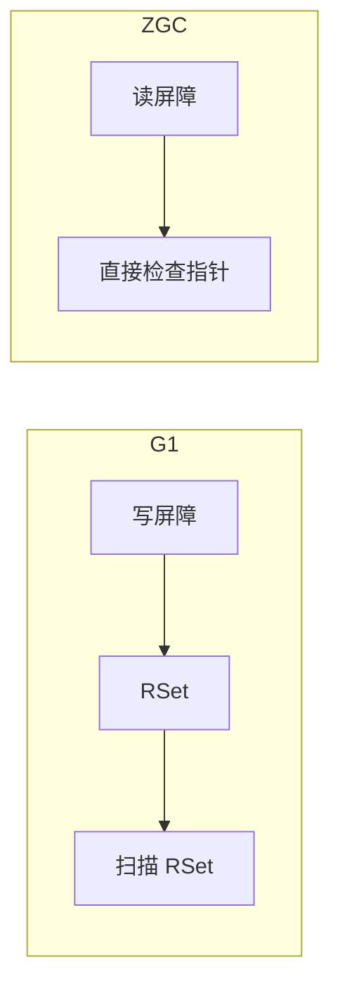

# ZGC 染色指针与读屏障

**目标级别**：P7

## 面试官最关心的 3 个问题

1. 什么是染色指针？它如何实现并发标记？
2. 读屏障的作用是什么？为什么需要它？
3. ZGC 如何处理对象移动？

---

## 一、染色指针详解

面试官问：「ZGC 的染色指针是怎么工作的？」你说「64 位指针中的标记位」——然后面试官追问「Marked0 和 Marked1 怎么交替使用？为什么需要两个标记位？」你愣住了。染色指针是 ZGC 的核心创新，理解它才能理解 ZGC 的低停顿原理。

### 指针结构



| 位 | 名称 | 说明 |
|----|------|------|
| **Marked0/Marked1** | 标记位 | 交替使用，用于并发标记 |
| **Remapped** | 重定位位 | 标记对象是否已移动 |
| **Finalizable** | 终结位 | 标记对象是否需要终结处理 |
| **Address** | 地址位 | 对象实际地址（41 位） |

### 为什么需要两个标记位？

双色标记的问题：



**解决方案**：两色交替（Marked0/Marked1）



---

## 二、并发标记过程

### 标记流程



### 标记位判断

```java
// 标记位判断
boolean isMarked(Object obj) {
    return obj.marked0() || obj.marked1();
}

// 当前 GC 使用哪个标记位
boolean currentMarked() {
    return gcCycle % 2 == 0 ? Marked0 : Marked1;
}
```

---

## 三、读屏障详解

### 为什么需要读屏障

ZGC 在并发重定位阶段会移动对象，需要保证应用线程读取的引用是正确的。

```java
// 无读屏障的问题
Object load(Object* addr) {
    return *addr;  // 如果对象已移动，可能读到无效地址
}

// 有读屏障
Object load(Object* addr) {
    Object obj = *addr;
    
    // 读屏障：检查是否需要重定位
    if (needsRelocation(obj)) {
        return relocate(obj);  // 重定位到新地址
    }
    
    return obj;
}
```

### 读屏障的实现

```c
// 读屏障伪代码（汇编）
mov rax, [rsi + offset]  // 读取引用
test rax, 0x1             // 检查 Remapped 位
jnz slow_path             // 如果已移动，跳转到慢路径
ret

slow_path:
    call runtime_zgc_relocate  // 调用运行时重定位
    ret
```

---

## 四、并发重定位

### 重定位过程



### 引用更新

```java
// 引用更新
void updateReference(Object** slot) {
    Object obj = *slot;
    
    if (needsRelocation(obj)) {
        // 重定位对象
        Object newObj = relocate(obj);
        // 原子更新引用
        *slot = newObj;
    }
}
```

---

## 五、染色指针的优势

### 与 RSet 的对比

| 维度 | RSet (G1) | 染色指针 (ZGC) |
|------|-----------|----------------|
| **内存开销** | 5%~10% | 极低 |
| **维护成本** | 写屏障 | 读屏障 |
| **扩展性** | 堆越大开销越大 | 不随堆增大 |
| **实现复杂度** | 高 | 中 |
| **并发正确性** | 写屏障维护 | 读屏障保证 |

### 为什么染色指针更高效



1. **无需额外数据结构**：标记信息存储在指针本身
2. **维护成本低**：只需在读取引用时检查
3. **无内存开销**：不占用堆内存

---

## 六、高频面试题

### 🔴 第一层：染色指针原理

**问题**：什么是染色指针？它如何实现并发标记？

**标准答案**：

染色指针使用 **64 位指针中的 4 位**存储对象的 GC 状态信息：

- **Marked0/Marked1**：用于并发标记，两色交替使用
- **Remapped**：标记对象是否已重定位
- **Finalizable**：标记对象是否需要终结处理

**并发标记原理**：

1. GC 线程通过标记位标记存活对象
2. 应用线程可以同时读取和修改引用
3. 通过读屏障确保读取的引用是最新的

> **第二层追问**：为什么需要两个标记位（Marked0/Mark1）？
>
> 两个标记位交替使用，解决并发标记中的「重新标记」问题。当 GC 线程在并发标记时，标记位是 Marked0，如果需要重新标记，可以使用 Marked1，而不影响当前并发标记。

> **第三层追问**：读屏障会带来多少开销？
>
> 读屏障的开销取决于应用特性，通常在 2%~5% 之间。相比于 G1 的长时间停顿，这个开销是可接受的。

---

### 🟡 ZGC 如何处理对象移动

**问题**：ZGC 在并发重定位时如何保证引用正确？

**标准答案**：

1. **读屏障检查**：应用线程读取引用时，检查对象是否需要重定位
2. **惰性重定位**：对象在被访问时才重定位，而不是预先全部移动
3. **批量重定位**：GC 线程批量移动对象，更新 RSet

---

### 🟢 ZGC vs G1 的并发机制

**问题**：ZGC 和 G1 的并发机制有什么不同？

**标准答案**：

| 维度 | G1 | ZGC |
|------|-----|-----|
| **并发结构** | 写屏障 + RSet | 染色指针 + 读屏障 |
| **内存开销** | 高（RSet） | 低（指针标记） |
| **维护方** | 写入时维护 | 读取时检查 |
| **停顿时间** | 较长 | **极短** |

---

## 七、常见错误与陷阱

### ⚠️ 陷阱 1：染色指针占用地址空间

染色指针使用 41 位存储地址，最大支持 2TB 堆内存。如果需要更大堆，需要使用压缩指针或扩展地址。

### ⚠️ 陷阱 2：读屏障没有开销

读屏障虽然开销相对较低，但在高频读取引用的场景（如缓存）下可能成为瓶颈。

### ⚠️ 陷阱 3：ZGC 不需要 GC

ZGC 的读屏障和并发重定位仍然需要 CPU 资源。在单核或资源受限环境中，ZGC 可能不是最优选择。

---

## 八、对比总结表

| 维度 | 传统指针 | ZGC 染色指针 |
|------|----------|--------------|
| **地址位数** | 64 位 | 41 位 |
| **标记信息** | 无 | 4 位 |
| **GC 状态存储** | 对象头 | **指针本身** |
| **并发正确性** | 需要额外机制 | **内置** |
| **内存开销** | 对象头 16 字节 | **无** |

---

## 九、加分回答

### 💡 ZGC 的分代扩展（JDK21）

JDK21 引入了 **ZGC Generational**，在原有 ZGC 基础上增加年轻代支持，进一步提升吞吐量。

```bash
# JDK21 启用分代 ZGC
-XX:+UseZGC -XX:+ZGenerational
```

### 💡 ZGC 与 NUMA

ZGC 对 NUMA（Non-Uniform Memory Access）友好，可以优化内存分配到最近 CPU 的节点。

```bash
# 启用 NUMA 优化
-XX:+UseNUMA
```

---

## 十、扩展思考

如果一个应用读取引用非常频繁（99% 的操作是读），ZGC 的读屏障开销会不会超过其优势？

> **答案**：
>
> 在极端读密集场景下，ZGC 的读屏障开销可能达到 10% 甚至更高。此时需要权衡：
>
> | 方案 | 停顿时间 | 吞吐量 |
> |------|----------|--------|
> | ZGC | **极短** | 略低 |
> | G1 | 中等 | 中等 |
> | ZGC + 优化 | **极短** | 改善 |
>
> **优化建议**：
> 1. 调整 ConcGCThreads，增加 GC 线程
> 2. 考虑 ZGC Generational（ JDK21+）
> 3. 评估应用是否真的需要极低停顿
