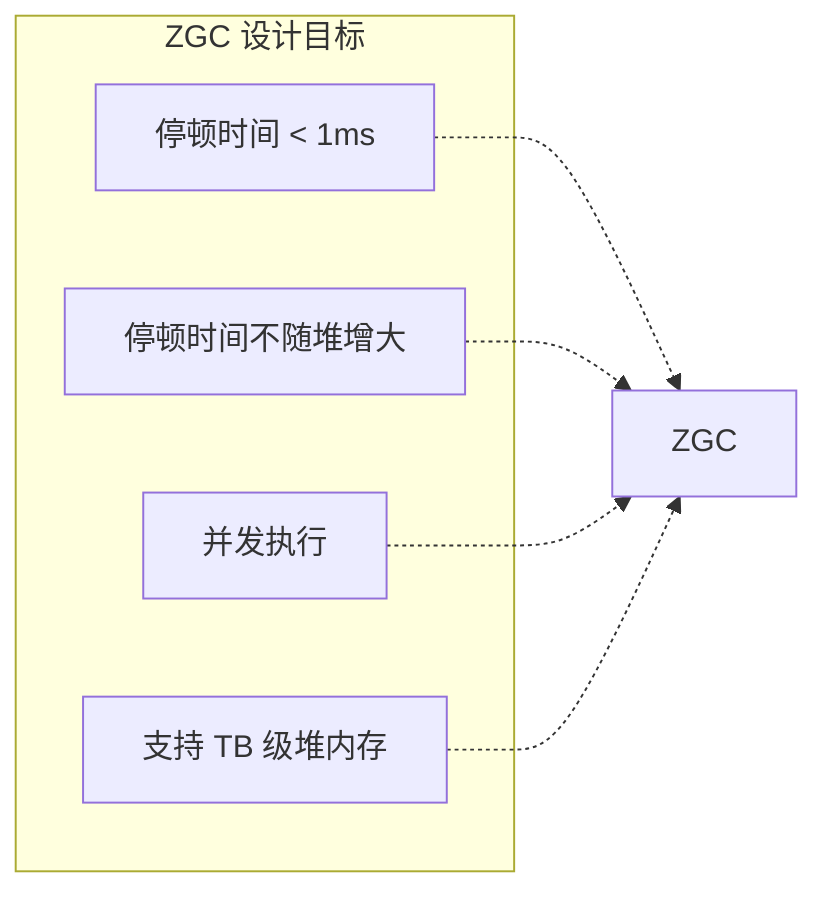
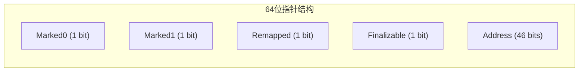
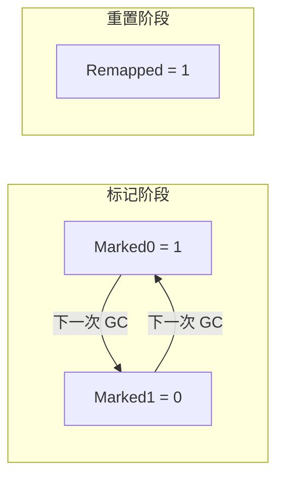
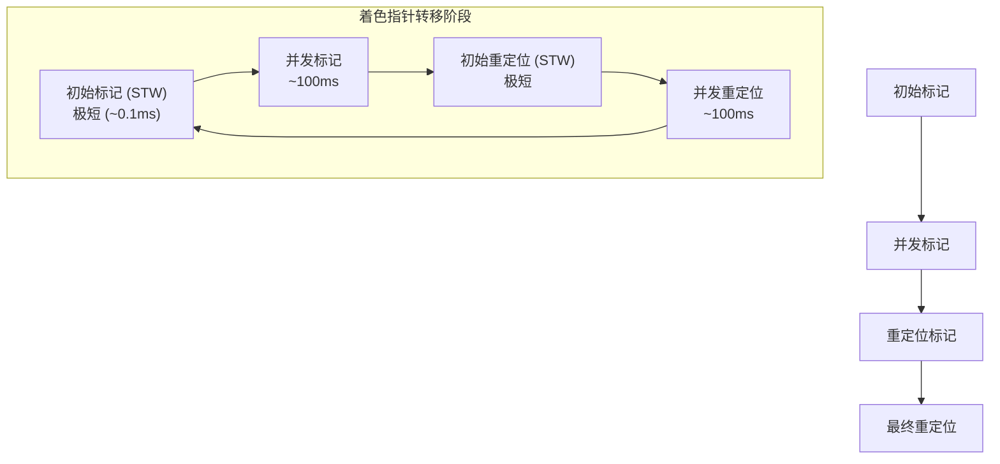
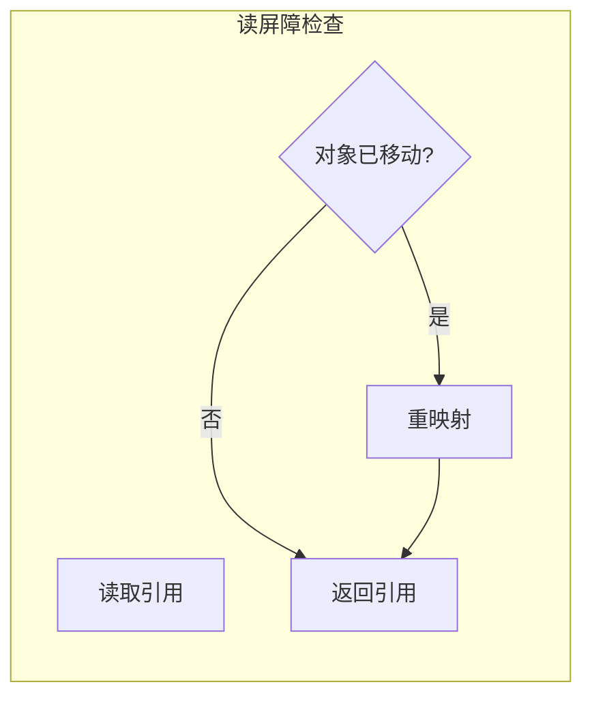
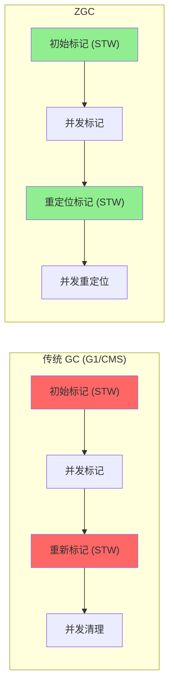

# ZGC 策略原理

**目标级别**：P6/P7

## 面试官最关心的 3 个问题

1. ZGC 收集器是如何实现低停顿的？
2. 什么是染色指针？它有什么作用？
3. ZGC 和 G1 有什么区别？

---

## 一、ZGC 概述

面试官问：「ZGC 收集器是怎么工作的？」你说「着色指针」——然后面试官追问「着色指针和 G1 的 RSet 有什么区别？为什么 ZGC 的停顿时间这么短？」你愣住了。ZGC 是 JDK11+ 引入的新一代收集器，以亚毫秒级的停顿时间著称。

### ZGC 的设计目标



### ZGC vs G1 vs CMS

| 维度 | CMS | G1 | ZGC |
|------|-----|-----|-----|
| **停顿时间** | STW 较长 | 可控 | **`<` 1ms** |
| **停顿时间与堆大小** | 相关 | 相关 | **无关** |
| **并发阶段** | 部分并发 | 部分并发 | **全并发** |
| **内存算法** | 标记清除 | 标记整理 | 标记整理 |
| **支持堆大小** | `<` 4GB | `<` 64GB | **TB 级** |
| **JDK 版本** | 5-14 | 9+ | **11+** |

---

## 二、染色指针原理

### 指针结构

ZGC 使用 **64 位指针**，其中 4 位用于标记对象状态：



| 位 | 名称 | 作用 |
|----|------|------|
| **Marked0/Marked1** | 标记位 | 用于并发标记 |
| **Remapped** | 重定位位 | 用于对象移动 |
| **Finalizable** | 终结位 | 用于终结处理 |

### 标记过程



**两色切换**：Marked0 和 Marked1 交替使用，解决并发标记中的「重新标记」问题。

---

## 三、ZGC 的并发阶段

### 收集周期



### 各阶段说明

| 阶段 | STW | 耗时 | 说明 |
|------|-----|------|------|
| **初始标记** | ✅ | `<` 1ms | 标记 GC Roots 直接引用 |
| **并发标记** | ❌ | 长 | 从 GC Roots 追踪存活对象 |
| **重定位标记** | ✅ | `<` 1ms | 标记需要重定位的对象 |
| **并发重定位** | ❌ | 长 | 移动对象，更新引用 |

---

## 四、读屏障与对象移动

### 为什么需要读屏障

ZGC 在并发阶段会移动对象，需要在读取引用时检查对象是否已移动。

```java
// 读屏障伪代码
Object load(Object* addr) {
    Object obj = *addr;
    
    // 读屏障：检查对象是否需要重定位
    if (!isRemapped(obj)) {
        obj = remap(obj);  // 重定位
    }
    
    return obj;
}
```

### 读屏障的作用



| 作用 | 说明 |
|------|------|
| **重定位检查** | 检查对象是否已移动到新地址 |
| **并发修复** | 移动对象时，应用线程可以继续读取 |
| **一致性保证** | 确保读取到最新版本的对象 |

---

## 五、ZGC 的优势

### 低停顿原理



**关键区别**：

- G1/CMS 的 STW 阶段需要扫描堆或处理 RSet
- ZGC 的 STW 阶段只处理 GC Roots，数量少，停顿极短

### 不随堆增大的停顿时间

```bash
# 停顿时间与堆大小无关的原因
# ZGC 的 STW 只扫描 GC Roots（~1000 个），不扫描整个堆
# 并发阶段与应用线程同时运行
```

---

## 六、ZGC 参数配置

### 启用 ZGC

```bash
# JDK11+ 启用 ZGC
-XX:+UseZGC

# JDK15+ 可使用 ZGC
# 无需额外参数，已设为默认
```

### 常用参数

```bash
# 设置堆大小
-Xmx32g -Xms32g

# 设置 GC 线程数
-XX:ConcGCThreads=8

# 设置 GC 间隔（默认 0，自动调整）
-ZCollectionInterval=60

# 设置 GC 停顿目标（默认 10ms）
-XX:MaxGCPauseMillis=10

# 设置日志
-Xlog:gc*:file=gc.log
```

### JDK17 最佳实践

```bash
java -Xmx32g -Xms32g \
     -XX:+UseZGC \
     -XX:MaxGCPauseMillis=10 \
     -XX:ConcGCThreads=8 \
     Application
```

---

## 七、高频面试题

### 🔴 第一层：ZGC 的工作原理

**问题**：请描述 ZGC 收集器的工作原理。

**标准答案**：

ZGC（Z Garbage Collector）使用**染色指针**和**读屏障**实现极低停顿：

1. **染色指针**：64 位指针中 4 位用于标记对象状态，支持并发标记和重定位
2. **并发标记**：应用线程和 GC 线程同时运行
3. **并发重定位**：对象移动时，通过读屏障确保引用正确

**四个阶段**：
- 初始标记（STW，`<` 1ms）
- 并发标记
- 重定位标记（STW，`<` 1ms）
- 并发重定位

> **第二层追问**：为什么 ZGC 的停顿时间这么短？
>
> ZGC 的 STW 只扫描 GC Roots（~1000 个），不扫描整个堆。并发阶段与应用线程同时运行，停顿时间不随堆增大而增加。

> **第三层追问**：ZGC 怎么保证并发正确性？
>
> 通过**读屏障**。读取对象引用时检查对象是否已移动，如果已移动则重映射到新地址。

---

### 🟡 ZGC vs G1

**问题**：ZGC 和 G1 有什么区别？

**标准答案**：

| 维度 | G1 | ZGC |
|------|-----|-----|
| **停顿时间** | ~200ms | **`<` 1ms** |
| **停顿时间与堆大小** | 相关 | **无关** |
| **内存算法** | 标记整理 | 标记整理 |
| **并发机制** | 写屏障 + RSet | **染色指针 + 读屏障** |
| **支持堆大小** | `<` 64GB | **TB 级** |
| **内存开销** | RSet（5%~10%） | 极低 |
| **JDK 版本** | 9+ | 11+ |

---

### 🟢 ZGC 的局限性

**问题**：ZGC 有什么局限性？

**标准答案**：

1. **不支持类卸载（JDK15 之前）**：JDK15+ 支持
2. **不支持 JVM TI 的一些功能**：调试代理受限
3. **不支持 Zing**：需要使用 Azul Zulu
4. **读屏障开销**：在读密集型应用中可能有影响

---

## 八、常见错误与陷阱

### ⚠️ 陷阱 1：ZGC 完全没有停顿

ZGC 的 STW 阶段非常短（`<` 1ms），但不是 0。在某些场景（如 GC Roots 很多）下可能稍长。

### ⚠️ 陷阱 2：ZGC 不需要调优

虽然 ZGC 是自适应的，但仍需要根据应用特性调整参数（如 ConcGCThreads）。

### ⚠️ 陷阱 3：ZGC 比 G1 慢

ZGC 的吞吐量通常略低于 G1，但停顿时间远低于 G1。适合对延迟敏感的应用。

---

## 九、对比总结表

| 维度 | CMS | G1 | ZGC |
|------|-----|-----|-----|
| **停顿时间** | 长 | 可控 | **`<` 1ms** |
| **停顿时间可控性** | ❌ | 较好 | **极好** |
| **吞吐量** | 中 | 中 | 中高 |
| **并发机制** | 写屏障 | 写屏障+RSet | **染色指针+读屏障** |
| **内存开销** | 低 | 中 | **极低** |
| **堆大小支持** | < 4GB | < 64GB | **TB 级** |
| **碎片问题** | 有 | 无 | 无 |

---

## 十、加分回答

### 💡 ZGC 的未来

- **JDK15**：ZGC 支持类卸载
- **JDK16**：ZGC 性能进一步优化
- **JDK21**：ZGC 支持分代（ZGCGenerational），进一步提升吞吐量

### 💡 何时选择 ZGC

| 场景 | 推荐收集器 |
|------|-----------|
| 延迟敏感（< 10ms） | ZGC |
| 超大堆（> 64GB） | ZGC |
| 吞吐量优先 | G1 或 Parallel |
| 低版本 JDK（< 11） | G1 |

---

## 十一、扩展思考

ZGC 的读屏障会带来多少性能开销？

> **答案**：
>
> 读屏障的开销取决于应用特性：
>
> | 应用类型 | 读密集程度 | 开销估计 |
> |----------|-----------|---------|
> | 计算密集 | 低 | < 1% |
> | 普通业务 | 中 | 2%~5% |
> | 读密集（缓存） | 高 | 5%~10% |
>
> 总体来说，ZGC 的读屏障开销是可接受的，相比于停顿时间带来的用户体验提升，利大于弊。
