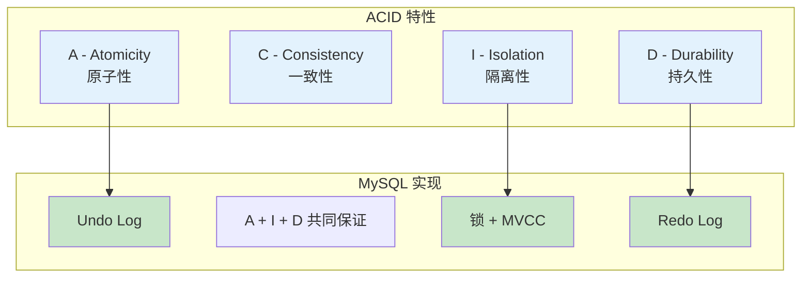
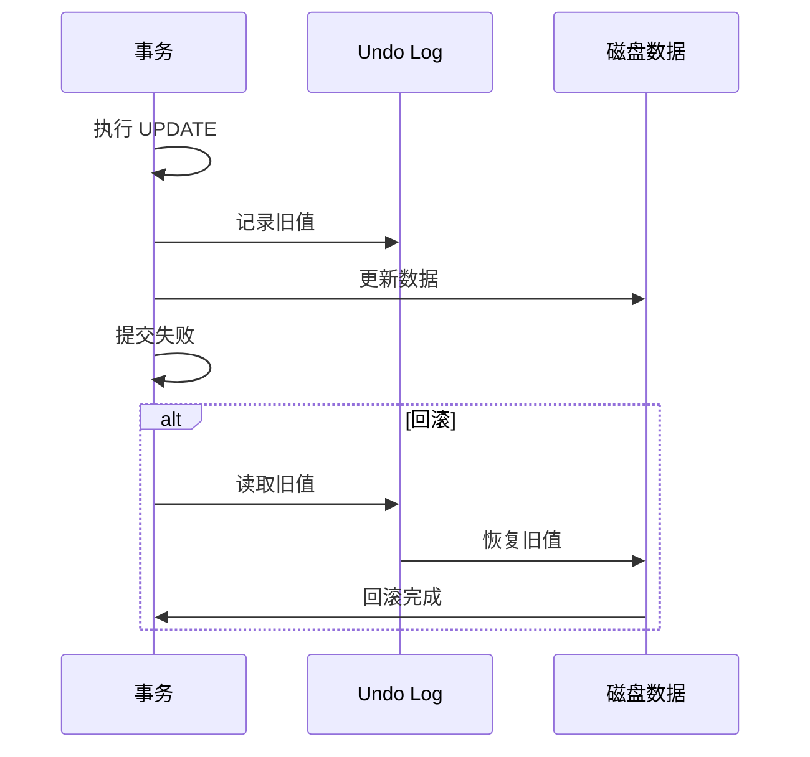
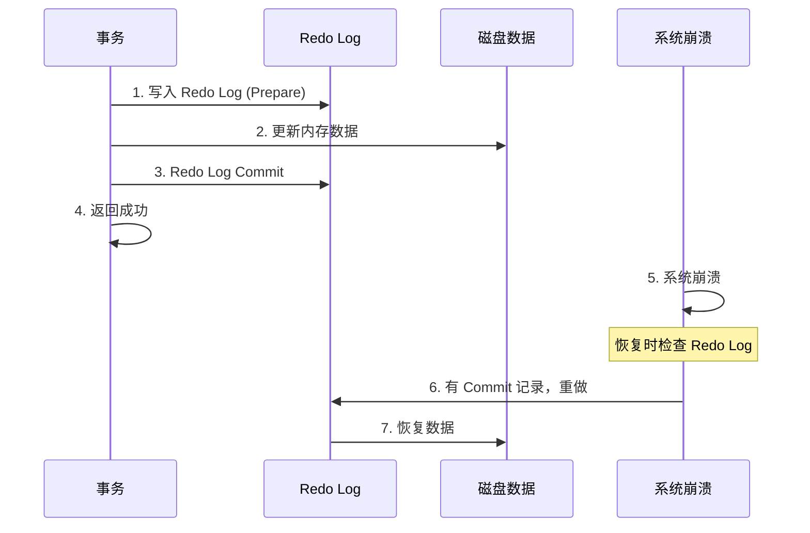
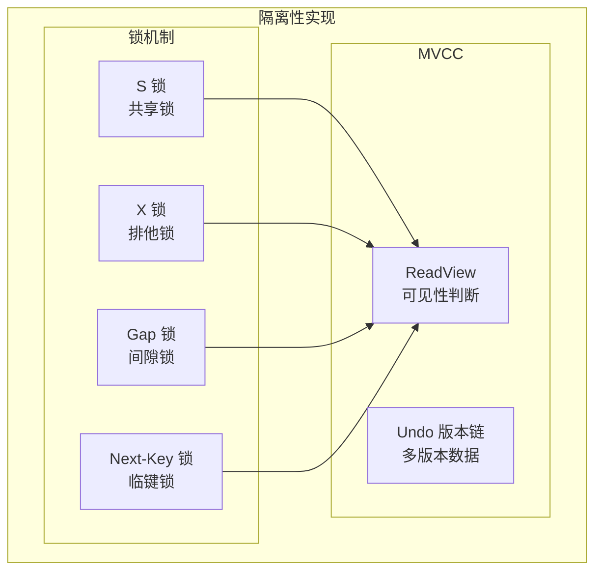

# 事务四大特性（ACID）

> **目标级别**：P5/P6
> **面试频率**：🔴 高频
> **面试官最关心的 3 个问题**：
> 1. 事务的 ACID 特性是什么？
> 2. MySQL 是如何保证事务的 ACID 特性的？
> 3. 不同存储引擎对事务的支持情况如何？

面试官问：「MySQL 的事务是怎么实现的？」你说「就是 BEGIN...COMMIT」——然后面试官紧接着追问「那 ACID 四个特性分别是怎么实现的？」你沉默了。

这就是 MySQL 事务面试的真实面貌：表面上问的是概念，实际上考的是对存储引擎内部机制的理解深度。

## 一、ACID 四大特性



### 1.1 原子性（Atomicity）

**定义**：事务是最小执行单位，一个事务中的所有操作要么全部成功，要么全部失败回滚。

```sql
-- 转账场景：原子性保证
START TRANSACTION;

UPDATE account SET balance = balance - 100 WHERE id = 1;  -- 扣款
UPDATE account SET balance = balance + 100 WHERE id = 2;  -- 存款

-- 如果第二条失败，第一条也会回滚
COMMIT;
-- 或者 ROLLBACK;
```

### 1.2 一致性（Consistency）

**定义**：事务执行前后，数据库的完整性约束没有被破坏，数据保持一致状态。

| 约束类型 | 示例 |
|----------|------|
| 主键唯一 | `id` 在表中唯一 |
| 外键约束 | `user_id` 引用 `user.id` |
| 唯一约束 | `email` 不能重复 |
| 检查约束 | `age `>=` 0` |
| 非空约束 | `name NOT NULL` |

```sql
-- 一致性保证：余额不能为负数
START TRANSACTION;

UPDATE account SET balance = balance - 500 WHERE id = 1;
-- 如果 balance = 200，扣款后 balance = -300
-- 检查约束会阻止这个操作

COMMIT;
```

### 1.3 隔离性（Isolation）

**定义**：并发执行的事务之间相互隔离，不能互相干扰。

```sql
-- 事务 A：读取
START TRANSACTION;
SELECT balance FROM account WHERE id = 1;  -- balance = 1000
-- 事务 B 正在执行...

-- 事务 B：修改
START TRANSACTION;
UPDATE account SET balance = balance - 500 WHERE id = 1;
COMMIT;

-- 事务 A：再次读取
SELECT balance FROM account WHERE id = 1;  -- 结果取决于隔离级别
COMMIT;
```

### 1.4 持久性（Durability）

**定义**：事务提交后，对数据库的修改是永久性的，即使系统崩溃也不会丢失。

```sql
START TRANSACTION;

INSERT INTO orders (order_no, amount) VALUES ('ORD001', 100);

COMMIT;  -- 提交后，即使 MySQL 重启，数据也不会丢失
```

## 二、ACID 的实现机制

### 2.1 原子性实现：Undo Log



**Undo Log 记录内容**：

| 操作 | Undo Log 记录 |
|------|---------------|
| INSERT | 主键值（��于回滚删除） |
| UPDATE | 更新前的旧值 |
| DELETE | 被删除的行数据 |

### 2.2 持久性实现：Redo Log



### 2.3 隔离性实现：锁 + MVCC



### 2.4 一致性实现

一致性的实现依赖于其他三个特性：

| 特性 | 作用 |
|------|------|
| **原子性** | 保证所有操作要么都成功，要么都失败 |
| **隔离性** | 保证并发执行不会破坏数据完整性 |
| **持久性** | 保证提交的数据不会丢失 |

## 三、事务与存储引擎

### 3.1 不同存储引擎的事务支持

| 存储引擎 | 事务支持 | 说明 |
|----------|----------|------|
| **InnoDB** | ✅ 支持 | 默认存储引擎 |
| **MyISAM** | ❌ 不支持 | 不支持事务 |
| **MEMORY** | ❌ 不支持 | 内存表，不支持事务 |
| **NDB** | ✅ 支持 | MySQL Cluster |

### 3.2 MyISAM 与 InnoDB 对比

```sql
-- InnoDB：支持事务
START TRANSACTION;
UPDATE account SET balance = balance - 100 WHERE id = 1;
UPDATE account SET balance = balance + 100 WHERE id = 2;
COMMIT;  -- 或 ROLLBACK;

-- MyISAM：不支持事务
UPDATE account SET balance = balance - 100 WHERE id = 1;  -- 直接执行
UPDATE account SET balance = balance + 100 WHERE id = 2;  -- 立即执行
-- 第二条失败时，第一条无法回滚
```

## 四、事务控制语句

### 4.1 基本语法

```sql
-- 开启事务
START TRANSACTION;
-- 或
BEGIN;

-- 提交事务
COMMIT;

-- 回滚事务
ROLLBACK;

-- 设置保存点
SAVEPOINT savepoint1;

-- 回滚到保存点
ROLLBACK TO SAVEPOINT savepoint1;

-- 释放保存点
RELEASE SAVEPOINT savepoint1;
```

### 4.2 自动提交

```sql
-- 查看自动提交状态
SHOW VARIABLES LIKE 'autocommit';

-- 关闭自动提交
SET GLOBAL autocommit = 0;

-- 恢复自动提交
SET GLOBAL autocommit = 1;

-- 注意：关闭自动提交后，每个语句都需要手动 COMMIT
```

### 4.3 事务嵌套

```sql
-- MySQL 不支持真正的嵌套事务
START TRANSACTION;

UPDATE account SET balance = balance - 100 WHERE id = 1;

SAVEPOINT sp1;
UPDATE account SET balance = balance + 50 WHERE id = 2;
ROLLBACK TO SAVEPOINT sp1;

COMMIT;  -- 只提交第一条 UPDATE
```

## 五、面试追问链设计

> **第一层**：事务的 ACID 特性是什么？
> **第二层**：MySQL 是如何保证原子性的？
> **第三层**：Redo Log 和 Undo Log 有什么区别？

> **第一层**：MySQL 是如何保证事务持久性的？
> **第二层**：如果只在内存中修改数据，然后系统崩溃，数据会丢失吗？
> **第三层**：如何配置 MySQL 使事务更安全（同时丧失性能）？

> **第一层**：MyISAM 为什么不支持事务？
> **第二层**：什么场景下可以使用 MyISAM？
> **第三层**：如何选择存储引擎？

## 六、常见面试陷阱

**⚠️ 陷阱 1**：混淆 Commit 和 Rollback 的作用
- Commit 提交事务，永久保存修改
- Rollback 回滚事务，撤销未提交的修改

**⚠️ 陷阱 2**：忽略隐式提交
- DDL 语句（CREATE、ALTER、DROP）会自动提交
- TRUNCATE TABLE 也会自动提交

**⚠️ 陷阱 3**：认为事务可以保证任何一致性
- 事务只能保证数据库内部的一致性
- 业务逻辑的一致性需要应用层保证

## 七、对比总结表

| 特性 | 定义 | MySQL 实现 | 潜在问题 |
|------|------|------------|----------|
| **原子性** | 全有或全无 | Undo Log | DDL 自动提交 |
| **一致性** | 数据完整 | A+I+D 保证 | 应用层逻辑 |
| **隔离性** | 并发隔离 | 锁+MVCC | 隔离级别选择 |
| **持久性** | 永久保存 | Redo Log | 刷盘策略 |

## 八、加分回答

> **💡 面试加分点**：如果能说出 MySQL 的组提交（Group Commit）机制和二阶段提交，会给面试官留下深刻印象：
>
> 1. **组提交**：多个事务的 Redo Log 可以一起刷新，减少 IO 次数
>
> 2. **二阶段提交**：Redo Log 和 Binlog 的两阶段提交保证一致性
>
> 3. **崩溃恢复**：MySQL 重启时根据 Redo Log 恢复未持久化的数据
>
> 4. **刷盘策略**：`innodb_flush_log_at_trx_commit` 控制刷盘频率
