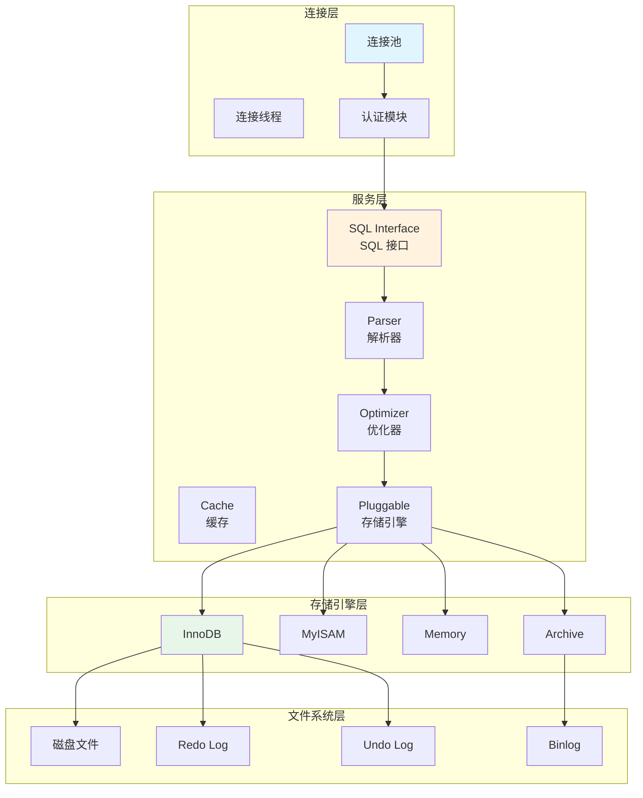
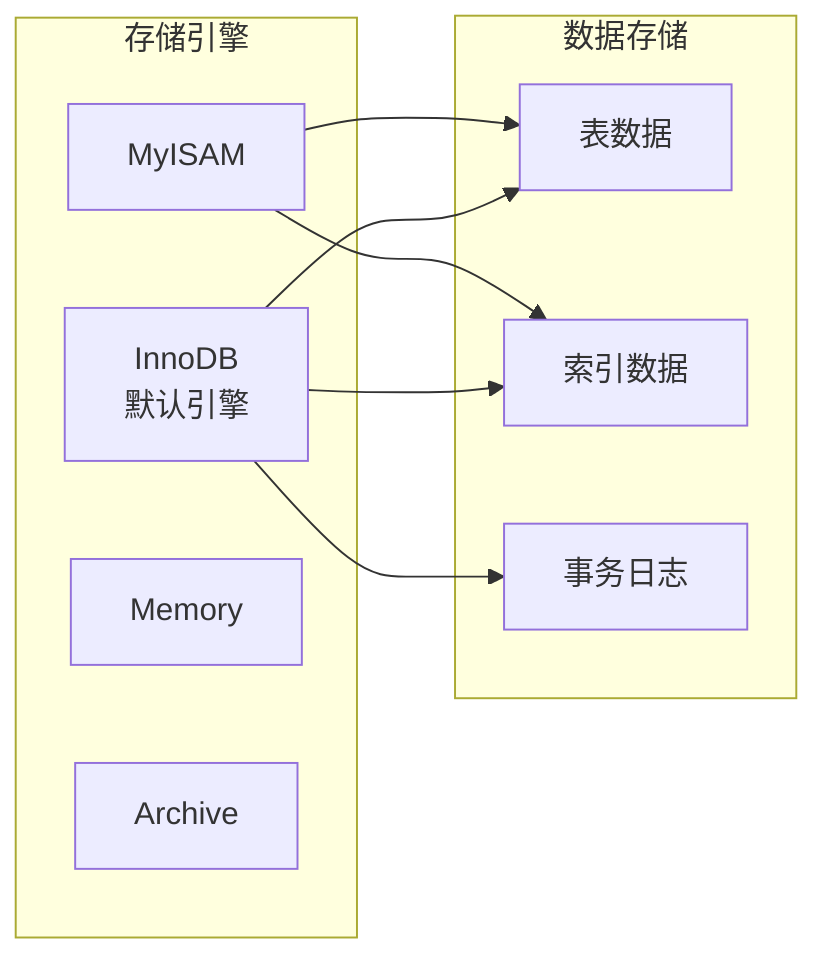
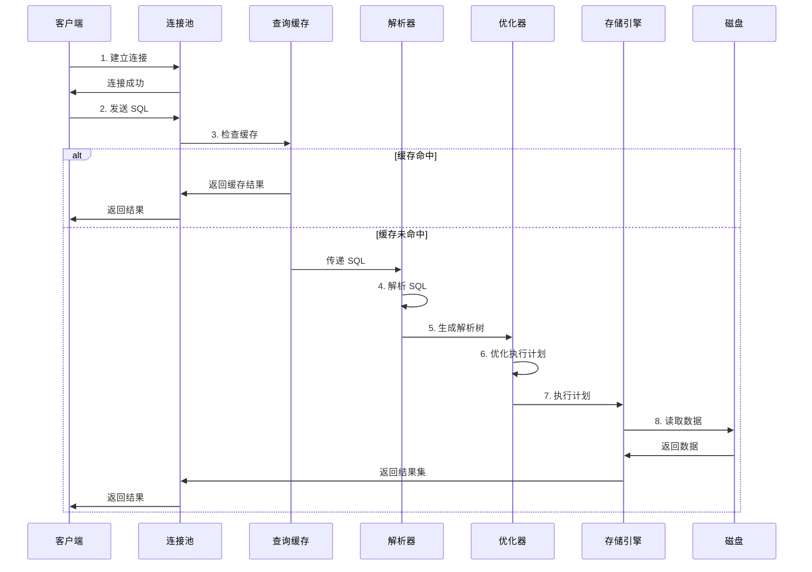
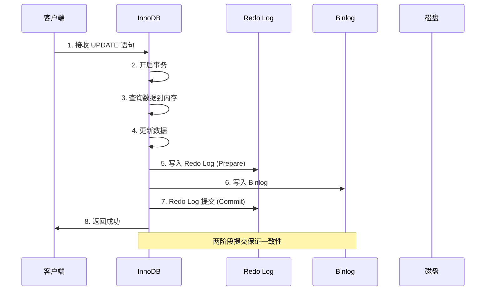
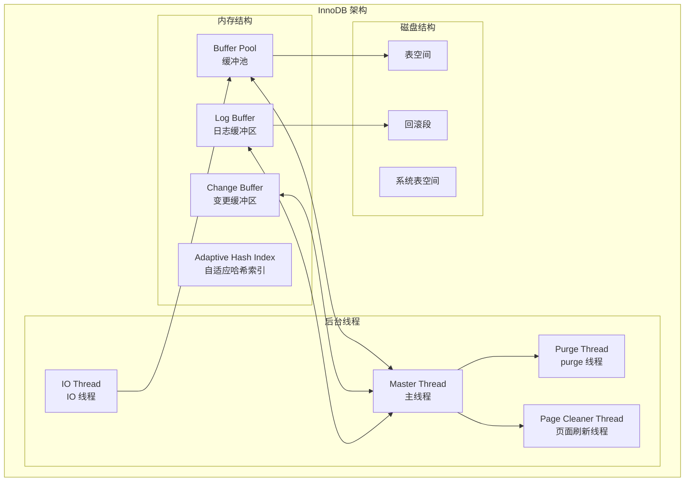

# MySQL 整体架构

> **目标级别**：P5/P6
> **面试频率**：🔴 高频
> **面试官最关心的 3 个问题**：
> 1. MySQL 的整体架构是怎样的？
> 2. MySQL 有哪些核心组件？各自的作用是什么？
> 3. 一条 SQL 语句的执行流程是怎样的？

面试官问：「MySQL 是怎么工作的？」你说「就是一个数据库，存数据的」——然后面试官紧接着追问「那 MySQL 内部有哪些组件？一条查询语句是怎么被执行的？」你沉默了。

这就是 MySQL 架构面试的真实面貌：表面上问的是概念，实际上考的是对数据库内部工作原理的理解深度。

## MySQL 整体架构图



## 一、MySQL 逻辑架构详解

### 1.1 连接层

连接层负责处理客户端的连接请求，包括：

| 组件 | 作用 |
|------|------|
| **连接池** | 管理数据库连接，避免频繁创建销毁连接的开销 |
| **连接线程** | 每个连接对应一个线程，负责与客户端通信 |
| **认证模块** | 验证用户名、密码、权限 |

```sql
-- 查看当前连接数
SHOW STATUS LIKE 'Threads_connected';

-- 查看最大连接数
SHOW VARIABLES LIKE 'max_connections';

-- 查看服务器运行时间
SHOW STATUS LIKE 'Uptime';
```

**⚠️ 常见面试坑**：
- 连接池大小设置不当：设置过小会导致连接等待，设置过大会消耗过多资源
- 长连接占用资源：未及时释放的连接会占用连接池资源

### 1.2 服务层（核心层）

服务层是 MySQL 的核心，负责处理 SQL 语句的解析、优化和执行。

#### SQL 接口（SQL Interface）

接收并执行各类 SQL 语句：
- DDL（数据定义语言）：`CREATE`、`ALTER`、`DROP`
- DML（数据操作语言）：`INSERT`、`UPDATE`、`DELETE`
- DQL（数据查询语言）：`SELECT`
- DCL（数据控制语言）：`GRANT`、`REVOKE`

#### 解析器（Parser）

将 SQL 语句解析成解析树（Parse Tree），包含：
- 词法分析：识别关键字、标识符、运算符
- 语法分析：检查语法是否正确
- 语义分析：检查表名、列名是否存在

```sql
-- 解析器会检查以下内容
SELECT id, name FROM user WHERE age > 18;

-- 词法分析结果
SELECT(关键字) id(列) ,(运算符) name(列) FROM(关键字) user(表) WHERE(关键字) age(列) >(运算符) 18(字面量)
```

#### 优化器（Optimizer）

优化器将解析树转换为执行计划，选择最优执行路径：

| 优化类型 | 说明 |
|----------|------|
| **成本优化** | 选择最小成本的执行计划 |
| **索引选择** | 决定使用哪个索引 |
| **关联顺序** | 多表关联时的连接顺序 |
| **范围优化** | `WHERE` 条件的范围扫描 |

```sql
-- EXPLAIN 查看优化器的执行计划
EXPLAIN SELECT * FROM user WHERE age > 18 AND city = 'Beijing';
```

#### 缓存（Cache）

MySQL 8.0 之前有查询缓存，8.0 之后已移除：

| 版本 | 缓存机制 |
|------|----------|
| MySQL 5.6 及之前 | 支持查询缓存 |
| MySQL 5.7 | 默认关闭查询缓存 |
| MySQL 8.0 | 完全移除查询缓存 |

> **💡 为什么移除查询缓存？**
> 查询缓存的失效非常频繁，任何对表的修改都会导致该表的所有缓存失效，在高并发场景下缓存命中率很低，反而消耗大量内存。

### 1.3 存储引擎层

存储引擎负责数据的存储和提取，MySQL 采用插件式架构。



## 二、一条 SQL 的执行流程

### 2.1 查询语句执行流程



### 2.2 更新语句执行流程



**💡 两阶段提交原理**：
1. **Prepare 阶段**：写入 Redo Log，设置事务状态为 Prepare
2. **Commit 阶段**：写入 Binlog，然后提交事务

如果中途崩溃，恢复时会检查：
- Redo Log 有记录 + Binlog 无记录 → 回滚
- Redo Log 有记录 + Binlog 有记录 → 提交

## 三、InnoDB 架构详解



### 3.1 Buffer Pool（缓冲池）

Buffer Pool 是 InnoDB 在内存中缓存表和索引数据的区域：

| 参数 | 说明 | 推荐值 |
|------|------|--------|
| `innodb_buffer_pool_size` | 缓冲池大小 | 机器内存的 50%-80% |
| `innodb_buffer_pool_instances` | 缓冲池实例数 | CPU 核心数 |

```sql
-- 查看缓冲池大小
SHOW VARIABLES LIKE 'innodb_buffer_pool_size';

-- 查看缓冲池状态
SHOW ENGINE INNODB STATUS;

-- 设置缓冲池大小（需重启）
SET GLOBAL innodb_buffer_pool_size = 2147483648; -- 2GB
```

### 3.2 Redo Log 与 Binlog

| 对比项 | Redo Log | Binlog |
|--------|----------|--------|
| **所属层** | InnoDB 存储引擎层 | MySQL 服务层 |
| **内容** | 物理日志（页修改） | 逻辑日志（SQL 语句） |
| **写入时机** | 事务执行过程中 | 事务提交时 |
| **用途** | 崩溃恢复 | 主从复制、数据恢复 |
| **文件** | `ib_logfile0`, `ib_logfile1` | `mysql-bin.000001` |

## 四、面试追问链设计

> **第一层**：MySQL 的整体架构是怎样的？
> **第二层**：连接层、服务层、存储引擎层各自的作用是什么？
> **第三层**：InnoDB 和 MyISAM 的区别是什么？为什么 InnoDB 成为默认引擎？

> **第一层**：一条 SELECT 语句的执行流程是怎样的？
> **第二层**：MySQL 8.0 为什么移除了查询缓存？
> **第三层**：如果缓存没有命中，数据是怎么从磁盘读取到内存的？

> **第一层**：Redo Log 和 Binlog 有什么区别？
> **第二层**：什么是两阶段提交？为什么需要两阶段提交？
> **第三层**：如果只在 Write Redo Log 后崩溃，数据会丢失吗？

## 五、常见面试陷阱

**⚠️ 陷阱 1**：认为 MySQL 是单进程架构
- 实际上 MySQL 是多线程架构，包括连接线程、IO 线程、Purge 线程等

**⚠️ 陷阱 2**：混淆 Buffer Pool 和查询缓存
- Buffer Pool 缓存磁盘数据页
- 查询缓存缓存 SQL 结果集（8.0 已移除）

**⚠️ 陷阱 3**：认为所有存储引擎都支持事务
- 只有 InnoDB 支持事务
- MyISAM 不支持事务

## 六、对比总结表

| 对比维度 | MySQL 5.6 | MySQL 5.7 | MySQL 8.0 |
|----------|-----------|-----------|-----------|
| 查询缓存 | 支持 | 可关闭 | 移除 |
| 默认存储引擎 | MyISAM | InnoDB | InnoDB |
| 字符集默认 | latin1 | utf8mb4 | utf8mb4_0900_ai_ci |
| 窗口函数 | 不支持 | 不支持 | 支持 |
| CTF | 不支持 | 不支持 | 支持 |
| JSON 支持 | 基础 | 增强 | 原生 JSON_TABLE |

## 七、加分回答

> **💡 面试加分点**：如果能说出 MySQL 8.0 的架构变化，会给面试官留下深刻印象：
>
> 1. **移除查询缓存**：因为在多核 CPU 和高并发场景下，缓存失效开销太大
> 2. **新增 Data Dictionary**：元数据存储从文件系统移到了 InnoDB 引擎
> 3. **增强的原子 DDL**：DDL 操作支持原子性
> 4. **隐藏索引**：可以隐藏索引用于测试索引效果
> 5. **直出 JSON**：新增 JSON_TABLE 函数
