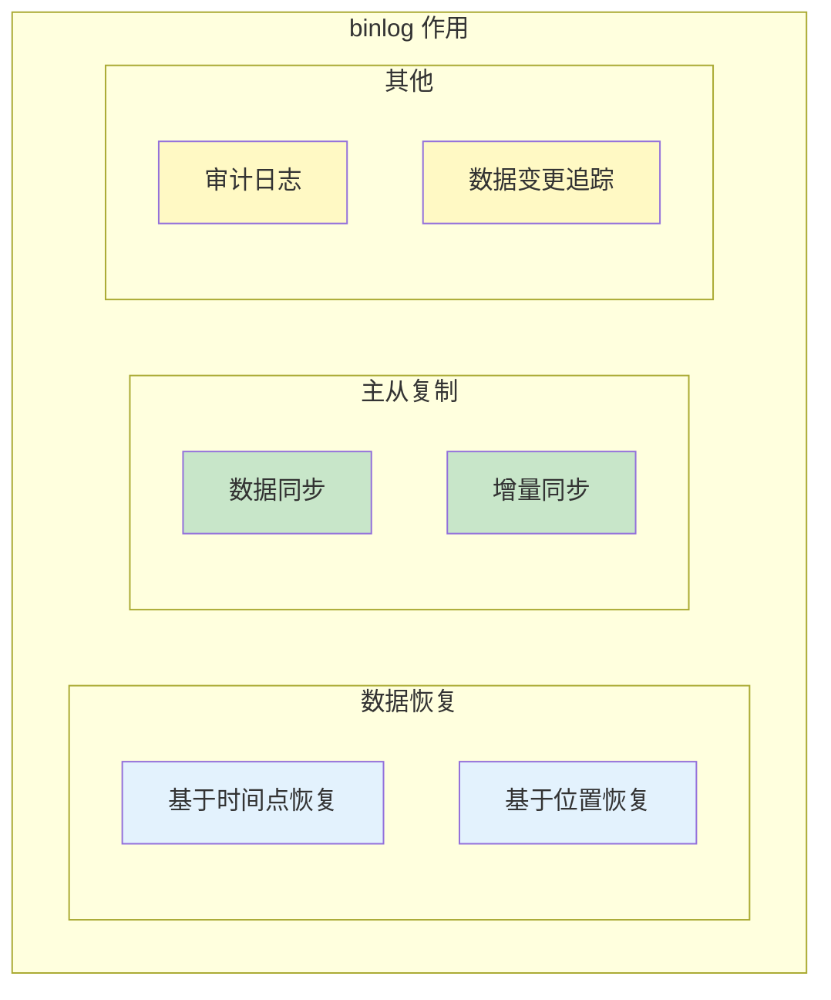

# binlog 三种格式对比

> **目标级别**：P5/P6
> **面试频率**：🔴 高频
> **面试官最关心的 3 个问题**：
> 1. binlog 有哪三种格式？有什么区别？
> 2. 为什么 MySQL 5.7 默认使用 ROW 格式？
> 3. 不同格式的优缺点是什么？

面试官问：「binlog 有哪几种格式？」你说「有 STATEMENT、ROW、MIXED」——然后面试官紧接着追问「那为什么 UPDATE 语句有时会记录多条数据而不是一条？这和 binlog 格式有什么关系？」你沉默了。

这就是 MySQL binlog 格式面试的真实面貌：表面上问的是概念，实际上考的是对主从复制和数据安全的理解深度。

## 一、binlog 概述

### 1.1 binlog 的作用



### 1.2 三种 binlog 格式

| 格式 | 说明 | MySQL 5.7 默认 | MySQL 8.0 默认 |
|------|------|----------------|----------------|
| **STATEMENT** | 记录 SQL 语句 | ❌ | ❌ |
| **ROW** | 记录行变更 | ✅ | ✅ |
| **MIXED** | 混合使用 | ❌ | ❌ |

### 1.3 配置 binlog 格式

```sql
-- 查看当前格式
SHOW VARIABLES LIKE 'binlog_format';

-- 设置 binlog 格式（临时）
SET SESSION binlog_format = 'ROW';
SET GLOBAL binlog_format = 'ROW';

-- 配置文件设置（my.cnf）
[mysqld]
binlog_format = ROW
```

## 二、STATEMENT 格式

### 2.1 STATEMENT 格式原理

**STATEMENT 格式**：记录原始 SQL 语句，从库执行相同的 SQL。

```sql
-- 主库执行
UPDATE orders SET amount = amount * 0.9 WHERE status = 1;

-- binlog 记录
UPDATE orders SET amount = amount * 0.9 WHERE status = 1;
```

### 2.2 STATEMENT 格式示例

```sql
-- STATEMENT 格式的 binlog 内容
#240115 10:30:00 server id 1
Query    thread_id=100    exec_time=0    error_code=0
SET TIMESTAMP=1705295400;
UPDATE orders SET amount = amount * 0.9 WHERE status = 1;
```

### 2.3 STATEMENT 格式优点

| 优点 | 说明 |
|------|------|
| **日志量小** | 一条 SQL 对应一条记录 |
| **可读性强** | 可以直接看到执行的 SQL |
| **执行速度快** | 不需要记录每行数据 |

### 2.4 STATEMENT 格式缺点

| 缺点 | 说明 |
|------|------|
| **不确定性函数** | `NOW()`、`RAND()` 等执行结果不确定 |
| **主从不一致** | 从库执行结果可能与主库不同 |
| **触发器问题** | 触发器行为可能导致不一致 |

```sql
-- ❌ 不适合 STATEMENT 格式的 SQL
UPDATE user SET created_at = NOW() WHERE id = 1;
UPDATE user SET token = MD5(RAND()) WHERE id = 1;
INSERT INTO log SELECT * FROM orders;

-- ✅ 适合 STATEMENT 格式的 SQL
UPDATE user SET name = '张三' WHERE id = 1;
DELETE FROM orders WHERE status = 0;
```

## 三、ROW 格式

### 3.1 ROW 格式原理

**ROW 格式**：记录每行数据的变化，从库执行相同的行变更。

```sql
-- 主库执行
UPDATE orders SET amount = amount * 0.9 WHERE status = 1;
-- 假设 status=1 的订单有 10000 条

-- binlog 记录
### UPDATE `orders`.`orders`
### WHERE
###   @1=1  /* id */
###   @2='ORD001'  /* order_no */
###   @3=100.00  /* amount (修改前) */
### SET
###   @3=90.00  /* amount (修改后) */
```

### 3.2 ROW 格式示例

```sql
-- ROW 格式的 binlog 内容（使用 mysqlbinlog 查看）
#240115 10:30:00 server id 1
Table_map: orders
  on table `orders`.`orders`
### UPDATE orders.orders
### WHERE
###   @1=1 @2='ORD001' @3=100
### SET
###   @1=1 @2='ORD001' @3=90
```

### 3.3 ROW 格式优点

| 优点 | 说明 |
|------|------|
| **确定性** | 每行数据变更都是确定的 |
| **主从一致** | 主从执行结果完全一致 |
| **完整记录** | 记录所有行变更，不遗漏 |

### 3.4 ROW 格式缺点

| 缺点 | 说明 |
|------|------|
| **日志量大** | 每行变更都记录，数据量大 |
| **可读性差** | 不能直接看到 SQL |
| **解析慢** | 需要解析每行数据 |

## 四、MIXED 格式

### 4.1 MIXED 格式原理

**MIXED 格式**：根据情况自动选择 STATEMENT 或 ROW 格式。

```sql
-- MIXED 格式的判断规则

-- ✅ 使用 STATEMENT 格式
UPDATE user SET name = '张三' WHERE id = 1;
DELETE FROM orders WHERE status = 0;

-- ✅ 使用 ROW 格式
UPDATE user SET amount = amount * 0.9 WHERE status = 1;  -- 触发器可能影响
INSERT INTO log SELECT * FROM orders;  -- 复杂查询
DELETE FROM orders WHERE status IN (SELECT id FROM old_orders);  -- 子查询
```

### 4.2 MIXED 格式触发条件

| 触发条件 | 使用格式 |
|----------|----------|
| 使用 `NOW()`、`RAND()` 等不确定函数 | ROW |
| 使用触发器 | ROW |
| 涉及多表关联 | ROW |
| 使用存储过程（可能调用不确定函数） | ROW |
| 普通 DML 语句 | STATEMENT |

### 4.3 MIXED 格式优缺点

| 优点 | 缺点 |
|------|------|
| 结合 STATEMENT 和 ROW 的优点 | 行为不可预测 |
| 减少日志量 | 问题排查困难 |
| 保证主从一致 | 需要仔细分析 |

## 五、三种格式对比

### 5.1 对比表

| 对比维度 | STATEMENT | ROW | MIXED |
|----------|-----------|------|-------|
| **日志量** | 小 | 大 | 中 |
| **主从一致** | 不保证 | 保证 | 保证 |
| **可读性** | 高 | 低 | 中 |
| **不确定性函数** | ❌ | ✅ | 自动切换 |
| **触发器** | ❌ | ✅ | 自动切换 |
| **执行速度** | 快 | 慢 | 中 |
| **恢复精度** | 差 | 高 | 高 |

### 5.2 性能对比

```sql
-- 测试场景：更新 10000 条数据

-- STATEMENT 格式
-- binlog 大小：约 500 字节
-- 执行时间：约 0.1 秒

-- ROW 格式
-- binlog 大小：约 500KB
-- 执行时间：约 0.5 秒

-- MIXED 格式
-- binlog 大小：取决于 SQL 类型
-- 执行时间：取决于 SQL 类型
```

## 六、binlog 查看方法

### 6.1 使用 mysqlbinlog 查看

```bash
# 查看 STATEMENT 格式
mysqlbinlog mysql-bin.000001

# 查看 ROW 格式（带参数）
mysqlbinlog -v mysql-bin.000001
mysqlbinlog -vv mysql-bin.000001  # 包含更多信息

# 按时间查看
mysqlbinlog --start-datetime="2024-01-15 10:00:00" \
            --stop-datetime="2024-01-15 11:00:00" \
            mysql-bin.000001

# 按位置查看
mysqlbinlog --start-position=100 \
            --stop-position=200 \
            mysql-bin.000001
```

### 6.2 查看事件类型

```sql
-- 查看 binlog 文件列表
SHOW BINARY LOGS;

-- 查看当前 binlog
SHOW MASTER STATUS;

-- 查看 binlog 事件
SHOW BINLOG EVENTS IN 'mysql-bin.000001' LIMIT 10;
```

### 6.3 数据恢复示例

```bash
# 基于时间点恢复
mysqlbinlog --stop-datetime="2024-01-15 10:00:00" mysql-bin.000001 | mysql -uroot -p

# 基于位置恢复
mysqlbinlog --start-position=100 --stop-position=200 mysql-bin.000001 | mysql -uroot -p

# 恢复指定数据库
mysqlbinlog -d mydb mysql-bin.000001 | mysql -uroot -p mydb
```

## 七、面试追问链设计

> **第一层**：binlog 有哪三种格式？有什么区别？
> **第二层**：为什么 MySQL 5.7 默认使用 ROW 格式？
> **第三层**：STATEMENT 格式有什么问题？

> **第一层**：UPDATE 语句在 ROW 格式下会记录多少条数据？
> **第二层**：为什么 ROW 格式的日志量比 STATEMENT 格式大？
> **第三层**：如何减少 ROW 格式的日志量？

> **第一层**：MIXED 格式是怎么自动选择格式的？
> **第二层**：什么样的 SQL 会触发 MIXED 使用 ROW 格式？
> **第三层**：MIXED 格式有什么优缺点？

## 八、常见面试陷阱

**⚠️ 陷阱 1**：认为 ROW 格式一定比 STATEMENT 好
- ROW 格式日志量大，消耗磁盘和带宽
- 只需要确定性，主从一致时 STATEMENT 更好

**⚠️ 陷阱 2**：忽略 binlog 格式对主从延迟的影响
- ROW 格式日志量大，增加传输时间
- 从库重放 ROW 格式日志更耗时

**⚠️ 陷阱 3**：不了解 binlog 格式对数据恢复的影响
- ROW 格式可以精确恢复每一行
- STATEMENT 格式恢复可能不准确

## 九、加分回答

> **💡 面试加分点**：如果能说出 MySQL 8.0 对 binlog 的改进，会给面试官留下深刻印象：
>
> 1. **binlog 压缩**：MySQL 8.0 支持 binlog 压缩，减少磁盘和网络开销
>
> 2. **binlog 事务压缩**：使用 zstd 算法压缩事务
>
> 3. **crc32 校验**：binlog 数据完整性校验
>
> 4. **Writeset 优化**：MySQL 8.0 的组提交优化，减少 binlog 写入
