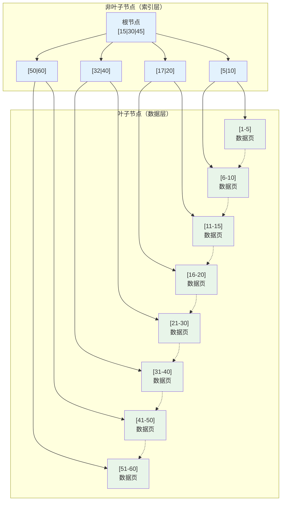
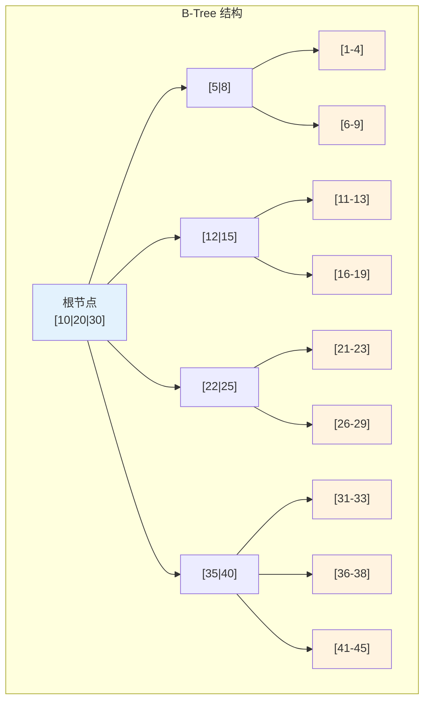
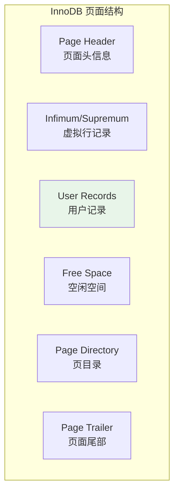
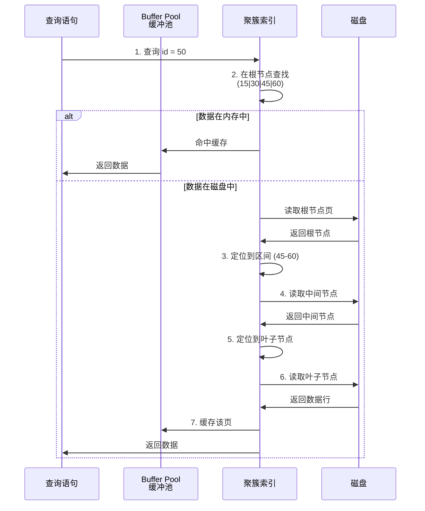

# B+Tree 索引原理

> **目标级别**：P5/P6
> **面试频率**：🔴 高频
> **面试官最关心的 3 个问题**：
> 1. B+Tree 索引的结构是怎样的？
> 2. 为什么 MySQL 选择 B+Tree 而不是二叉树或 B-Tree？
> 3. B+Tree 是如何实现范围查询的？

面试官问：「MySQL 的索引是什么？」你说「索引就像书的目录，能加快查询速度」——然后面试官紧接着追问「那索引底层是什么结构？为什么不用二叉树？为什么 B+Tree 比 B-Tree 更适合磁盘存储？」你沉默了。

这就是 MySQL 索引面试的真实面貌：表面上问的是概念，实际上考的是对数据结构原理的理解深度。

## 一、B+Tree 数据结构

### 1.1 B+Tree 的定义

B+Tree 是一种自平衡的多路搜索树（B-Tree 的变体），具有以下特性：

| 特性 | 说明 |
|------|------|
| **多路平衡** | 每个节点可以拥有多个子节点（度 degree `>` 2） |
| **所有数据在叶子节点** | 非叶子节点只存储索引，叶子节点包含所有数据 |
| **叶子节点链表** | 所有叶子节点通过指针连接成一个有序链表 |
| **树高平衡** | 所有叶子节点在同一层，树高一致 |

### 1.2 B+Tree 结构图



## 二、为什么 MySQL 选择 B+Tree

### 2.1 与二叉树对比

| 对比维度 | 二叉树 | B+Tree |
|----------|--------|--------|
| **树高** | O(log₂N) | O(log_m N)，m 是每个节点的子节点数 |
| **IO 次数** | 树高 = IO 次数 | 树高远小于二叉树 |
| **100 万数据** | 树高约 20 | 树高约 3-4 |

```sql
-- 二叉树查询：id = 500000
-- 需要 IO 次数：约 20 次
-- B+Tree 查询：id = 500000
-- 需要 IO 次数：约 3-4 次
SELECT * FROM user WHERE id = 500000;
```

### 2.2 与 B-Tree 对比



| 对比维度 | B-Tree | B+Tree |
|----------|--------|--------|
| **数据存储位置** | 所有节点都存储数据 | 只有叶子节点存储数据 |
| **查询稳定性** | 不稳定（可能在任意层找到） | 稳定（必须到叶子节点） |
| **范围查询** | 需要中序遍历 | 叶子节点链表直接遍历 |
| **查询效率** | 最好情况快，最坏情况慢 | 查询效率稳定 |
| **空间利用率** | 非叶子节点也存数据，利用率低 | 非叶子节点只存索引，利用率高 |

**💡 为什么 B+Tree 更适合磁盘存储？**

1. **IO 次数更少**：非叶子节点不存储数据，每个节点可以存储更多的索引
2. **查询稳定**：所有查询都需要到叶子节点，树高一致
3. **范围查询友好**：叶子节点链表支持快速范围遍历

### 2.3 InnoDB 中 B+Tree 的实现



```sql
-- InnoDB 页面大小默认 16KB
SHOW VARIABLES LIKE 'innodb_page_size';

-- 查看索引信息
SHOW INDEX FROM user;

-- 查看表的索引大小
SELECT 
    OBJECT_NAME,
    INDEX_NAME,
    PAGE_NUMBER,
    PAGE_TYPE
FROM information_schema.INNODB_BUFFER_PAGE
WHERE TABLE_NAME = 'user'
ORDER BY PAGE_NUMBER;
```

## 三、B+Tree 查询过程

### 3.1 聚簇索引查询流程



### 3.2 范围查询优化

```sql
-- 范围查询：id BETWEEN 20 AND 50
SELECT * FROM user WHERE id BETWEEN 20 AND 50;

-- B+Tree 范围查询流程：
-- 1. 定位 id=20（找到起始叶子节点）
-- 2. 沿着叶子节点链表顺序遍历
-- 3. 直到 id > 50 停止
```

## 四、B+Tree 的高度计算

### 4.1 计算公式

```
假设：
- InnoDB 页面大小：16KB = 16384 字节
- 索引字段大小：8 字节（bigint）
- 指针大小：6 字节（InnoDB 伪记录指针）
- 每行记录头信息：13 字节

每个非叶子节点可存储索引数：
(16384 - 16384 * 2%) / (8 + 6) ≈ 1170 个索引

每个叶子节点可存储数据数：
(16384 - 16384 * 2%) / (200 + 27) ≈ 72 行（假设平均行大小 200 字节）
```

### 4.2 高度与数据量关系

| 树高 | 最大数据量 |
|------|-----------|
| 1 | 1170 行 |
| 2 | 1170 `*` 1170 `≈` 136 万行 |
| 3 | 1170³ `*` 72 `≈` 1 亿行 |
| 4 | 1170⁴ `*` 72 `≈` 1000 亿行 |

```sql
-- 查看索引高度
SELECT 
    b.name,
    a.name,
    index_id,
    height,
    leaf_pages,
    n_leaf_pages
FROM information_schema.innodb_sys_indexes a
JOIN information_schema.innodb_sys_tables b
ON a.table_id = b.table_id
WHERE b.name = 'test/user';
```

## 五、面试追问链设计

> **第一层**：B+Tree 的结构是怎样的？
> **第二层**：B+Tree 和 B-Tree 有什么区别？
> **第三层**：InnoDB 中 B+Tree 的页面大小是多少？如何计算每个节点能存储多少索引？

> **第一层**：为什么 MySQL 选择 B+Tree 作为索引结构？
> **第二层**：二叉树有什么问题？为什么不适合作为数据库索引？
> **第三层**：Hash 索引和 B+Tree 索引各有什么优缺点？

> **第一层**：范围查询在 B+Tree 中是怎么实现的？
> **第二层**：为什么 B+Tree 的叶子节点需要用链表连接？
> **第三层**：如果我要查询 id `>` 100 AND id `<` 200，B+Tree 是怎么遍历的？

## 六、常见面试陷阱

**⚠️ 陷阱 1**：认为 B+Tree 的所有节点都在内存中
- 实际上 B+Tree 的节点（页面）存储在磁盘上，每次查询都是一次磁盘 IO
- 正是这个原因，B+Tree 的多路平衡设计才如此重要

**⚠️ 陷阱 2**：忽略页面大小对索引的影响
- InnoDB 默认页面大小是 16KB
- 页面大小影响每个节点能存储的索引数量，进而影响树高

**⚠️ 陷阱 3**：不理解非叶子节点不存储数据的原因
- 非叶子节点只存储索引和指针，不存储完整数据行
- 这样可以让非叶子节点容纳更多索引，减少树高

## 七、对比总结表

| 对比维度 | 二叉树 | 红黑树 | B-Tree | B+Tree |
|----------|--------|--------|--------|--------|
| **平衡方式** | 自然平衡 | 自平衡 | 多路平衡 | 多路平衡 |
| **树高** | 高 | 较高 | 中等 | 低 |
| **IO 次数** | 多 | 多 | 中等 | 少 |
| **范围查询** | 差 | 差 | 中等 | 好 |
| **查询稳定性** | 稳定 | 稳定 | 不稳定 | 稳定 |
| **适用场景** | 内存 | 内存 | 通用 | 磁盘 |

## 八、加分回答

> **💡 面试加分点**：如果能说出 MySQL 中 B+Tree 的实际存储细节，会给面试官留下深刻印象：
>
> 1. **页面（Page）概念**：InnoDB 将 B+Tree 的每个节点存储为一个 16KB 的页面
> 2. **页面类型**：索引页面（INDEX）、数据页面（INDEX）、撤销页面（UNDO）等
> 3. **页目录（Page Directory）**：每个页面有一个页目录，用于二分查找加速定位
> 4. **自适应哈希索引**：InnoDB 会自动将热点数据构建成哈希索引
>
> **为什么 MySQL 查询有时比预期慢？**
> - 数据不在 Buffer Pool 中，需要从磁盘读取
> - 页面不是有序存储，存在随机 IO
> - 索引统计信息不准确，优化器选择了次优执行计划
