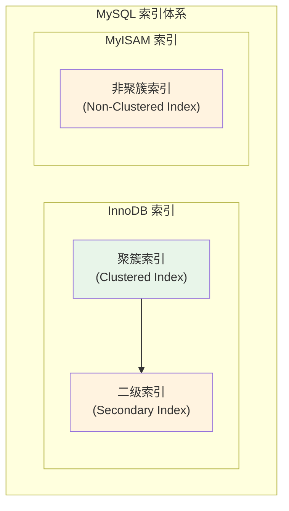
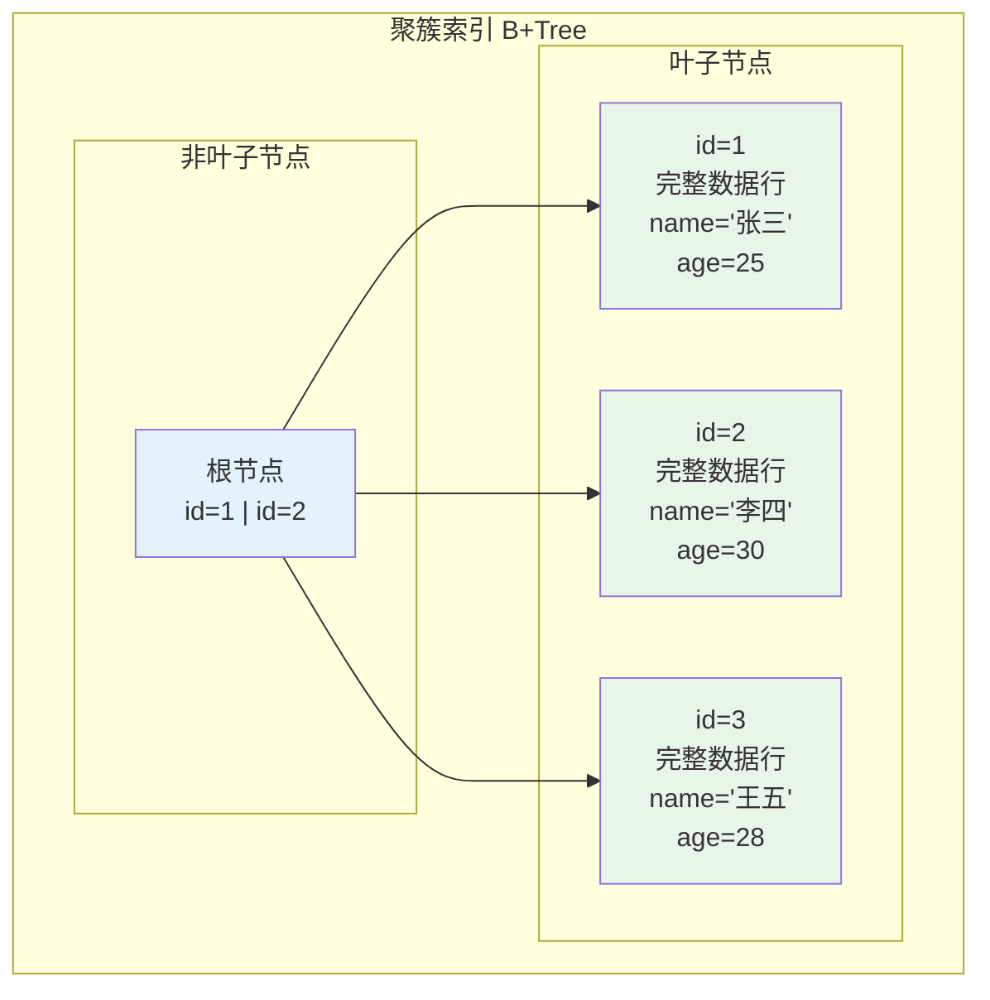
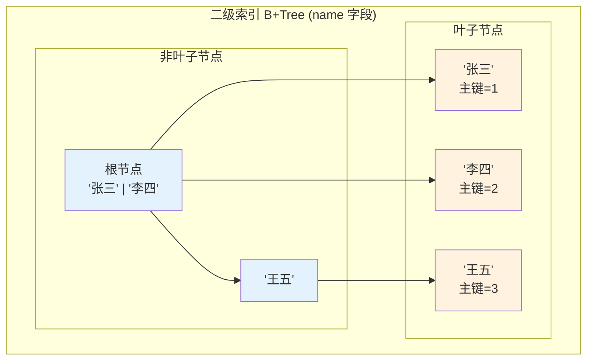
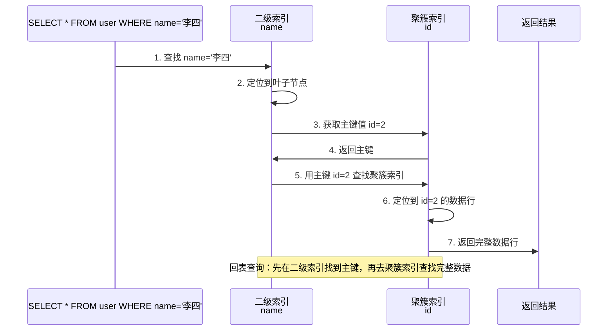

# 聚簇索引与二级索引

> **目标级别**：P5/P6
> **面试频率**：🔴 高频
> **面试官最关心的 3 个问题**：
> 1. 什么是聚簇索引？什么是二级索引？
> 2. 聚簇索引和二级索引有什么区别？
> 3. 回表查询是怎么回事？如何减少回表？

面试官问：「聚簇索引和二级索引有什么区别？」你说「都是索引」——然后面试官紧接着追问「那为什么主键查询比普通索引查询快？回表是什么概念？」你沉默了。

这就是 MySQL 索引类型面试的真实面貌：表面上问的是概念，实际上考的是对索引存储结构的理解深度。

## 一、索引类型概览



### 1.1 核心概念

| 索引类型 | 定义 | 数据存储位置 |
|----------|------|--------------|
| **聚簇索引** | 以主键为索引键，构建的 B+Tree | 叶子节点存储完整数据行 |
| **二级索引** | 以普通字段为索引键，构建的 B+Tree | 叶子节点存储主键值 |

## 二、聚簇索引

### 2.1 聚簇索引的规则

InnoDB 表必须有且只有一个聚簇索引，按照以下顺序选择：

1. **显式主键**：优先使用显式定义的主键
2. **第一个唯一索引**：如果没有主键，使用第一个唯一索引
3. **隐藏 row_id**：如果都没有，InnoDB 生成一个 6 字节的隐藏主键

```sql
-- 场景 1：显式主键
CREATE TABLE t1 (
    id INT PRIMARY KEY,  -- 聚簇索引
    name VARCHAR(50)
);

-- 场景 2：唯一索引
CREATE TABLE t2 (
    id INT,  -- 无主键
    name VARCHAR(50) UNIQUE  -- 聚簇索引（第一个唯一索引）
);

-- 场景 3：无主键无唯一索引
CREATE TABLE t3 (
    id INT,
    name VARCHAR(50)  -- InnoDB 会生成隐藏 row_id 作为聚簇索引
);
```

### 2.2 聚簇索引结构



### 2.3 聚簇索引查询特点

```sql
-- 主键查询：直接定位到数据行，不需要回表
SELECT * FROM user WHERE id = 1;

-- 执行过程：
-- 1. 在聚簇索引 B+Tree 中查找 id=1
-- 2. 叶子节点直接返回完整数据行
-- 3. 无需额外 IO（只需要 1-2 次 IO）
```

## 三、二级索引

### 3.1 二级索引的结构



### 3.2 二级索引查询特点

```sql
-- 普通索引查询：需要回表
SELECT * FROM user WHERE name = '李四';

-- 执行过程：
-- 1. 在二级索引 B+Tree 中查找 name='李四'
-- 2. 叶子节点返回主键值 id=2
-- 3. 使用 id=2 去聚簇索引查找完整数据行（回表）
-- 4. 返回完整数据行
```

### 3.3 回表查询过程



## 四、回表与覆盖索引对比

### 4.1 回表查询

```sql
-- 回表查询：需要查询聚簇索引获取所有字段
SELECT * FROM user WHERE name = '李四';

-- 流程：
-- 1. 二级索引找到主键 id=2
-- 2. 聚簇索引获取完整数据行
-- 3. 返回所有字段
```

### 4.2 覆盖索引

```sql
-- 覆盖索引：只需要查询二级索引，不需要回表
SELECT id, name FROM user WHERE name = '李四';

-- 流程：
-- 1. 二级索引找到 name='李四'
-- 2. 二级索引叶子节点已经包含 id 和 name
-- 3. 直接返回（无需回表）
```

### 4.3 对比表

| 对比维度 | 回表查询 | 覆盖索引 |
|----------|----------|----------|
| **查询字段** | 需要非索引字段 | 只查询索引字段 |
| **IO 次数** | 2 次（索引 + 数据） | 1 次（索引） |
| **性能** | 较差 | 优秀 |
| **实现条件** | 任何查询 | 查询字段都在索引中 |

## 五、二级索引分类

### 5.1 按索引列数分类

| 类型 | 说明 | 示例 |
|------|------|------|
| **单列索引** | 一个字段上的索引 | `INDEX idx_name (name)` |
| **联合索引** | 多个字段上的索引 | `INDEX idx_name_age (name, age)` |

### 5.2 联合索引与回表

```sql
-- 联合索引：INDEX idx_name_age (name, age)
CREATE TABLE user (
    id INT PRIMARY KEY,
    name VARCHAR(50),
    age INT,
    email VARCHAR(100),
    INDEX idx_name_age (name, age)
);

-- 查询分析：
-- SELECT name, age FROM user WHERE name = '李四'
-- ✅ 覆盖索引：name 和 age 都在索引中，无需回表

-- SELECT * FROM user WHERE name = '李四'
-- ⚠️ 回表查询：* 包含 email，需要回聚簇索引获取

-- SELECT name FROM user WHERE name = '李四' AND age = 30
-- ✅ 覆盖索引：name 和 age 都在索引中，无需回表
```

### 5.3 联合索引结构

```mermaid
graph TB
    subgraph "联合索引 (name, age)"
        subgraph "非叶子节点"
            N1["根节点<br/>('张三', 25) | ('李四', 30) | ('王五', 28)"]
        end

        subgraph "叶子节点"
            L1["('张三', 25)<br/>主键=1"]
            L2["('张三', 28)<br/>主键=4"]
            L3["('李四', 30)<br/>主键=2"]
            L4["('王五', 28)<br/>主键=3"]
        end
    end

    N1 --> L1 & L2 & L3 & L4

    style L1 fill:#fff3e0
    style L2 fill:#fff3e0
    style L3 fill:#fff3e0
    style L4 fill:#fff3e0
    style N1 fill:#e3f2fd

    Note at L1: 先按 name 排序<br/>name 相同时按 age 排序
```

## 六、面试追问链设计

> **第一层**：聚簇索引和二级索引有什么区别？
> **第二层**：二级索引的叶子节点存储什么？回表是什么概念？
> **第三层**：如何减少回表查询？覆盖索引的实现条件是什么？

> **第一层**：为什么主键查询比普通索引查询快？
> **第二层**：如果表没有主键，二级索引的叶子节点存储什么？
> **第三层**：InnoDB 的隐藏主键 row_id 有什么问题？

> **第一层**：联合索引的叶子节点存储什么？
> **第二层**：为什么联合索引能支持部分列查询？（最左前缀原则）
> **第三层**：联合索引 `(name, age)` 和 `(age, name)` 有什么不同？

## 七、常见面试陷阱

**⚠️ 陷阱 1**：认为所有索引都是聚簇索引
- 只有主键索引是聚簇索引
- 普通索引、联合索引、唯一索引都是二级索引

**⚠️ 陷阱 2**：忽略回表的代价
- 回表意味着需要两次 B+Tree 查找
- 如果回表数据量大，性能会明显下降

**⚠️ 陷阱 3**：认为覆盖索引可以减少所有查询的 IO
- 覆盖索引的前提是查询字段都在索引中
- `SELECT *` 永远无法使用覆盖索引

## 八、生产优化实践

### 8.1 索引设计原则

```sql
-- 原则 1：主键使用自增 ID，避免页分裂
CREATE TABLE orders (
    id BIGINT AUTO_INCREMENT PRIMARY KEY,  -- 自增主键
    order_no VARCHAR(32) UNIQUE,
    amount DECIMAL(10,2)
);

-- 原则 2：覆盖索引避免回表
-- 查询订单详情（经常查询）
CREATE INDEX idx_order_no_amt ON orders(order_no, amount);

-- 查询时使用覆盖索引
SELECT order_no, amount FROM orders WHERE order_no = 'ORD20240101';

-- 原则 3：避免使用 SELECT *
SELECT * FROM orders WHERE order_no = 'ORD20240101';  -- 回表

SELECT order_no, amount FROM orders WHERE order_no = 'ORD20240101';  -- 覆盖索引
```

### 8.2 使用 EXPLAIN 判断回表

```sql
EXPLAIN SELECT * FROM user WHERE name = '李四';
-- Using index: 否（使用了回表）
-- Extra: Using index condition: 使用了索引条件下推

EXPLAIN SELECT id, name FROM user WHERE name = '李四';
-- Using index: 是（覆盖索引，无需回表）
-- Extra: Using index: 直接使用索引
```

## 九、对比总结表

| 对比维度 | 聚簇索引 | 二级索引 |
|----------|---------|----------|
| **索引键** | 主键 | 普通字段 |
| **叶子节点** | 存储完整数据行 | 存储主键值 |
| **B+Tree 数量** | 1 个 | 任意多个 |
| **查询次数** | 1 次 | 2 次（需回表） |
| **数据物理顺序** | 按主键排序 | 按索引字段排序 |
| **插入性能** | 可能页分裂 | 一般不分裂 |

## 十、加分回答

> **💡 面试加分点**：如果能说出索引覆盖判断���法和实战优化技巧，会给面试官留下深刻印象：
>
> 1. **Using index vs Using index condition**：
>    - `Using index` = 覆盖索引，无需回表
>    - `Using index condition` = 索引条件下推，但仍需回表
>
> 2. **ICP（Index Condition Pushdown）**：MySQL 5.6+ 优化，将 WHERE 条件下推到索引层面
>
> 3. **MRR（Multi-Range Read）**：优化随机 IO，将回表查询改为顺序 IO
