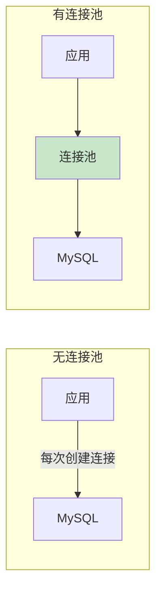

# 数据库连接池配置

> **目标级别**：P5/P6
> **面试频率**：🟡 中频
> **面试官最关心的 3 个问题**：
> 1. 什么是数据库连接池？为什么要用连接池？
> 2. 连接池有哪些核心参数？如何配置？
> 3. 连接池配置不当会有什么后果？

面试官问：「数据库连接池怎么配置？」你说「就是配置一下最大连接数」——然后面试官紧接着追问「那最小连接数、超时时间、连接回收策略怎么配置？这些参数之间有什么关系？」你沉默了。

这就是 MySQL 连接池面试的真实面貌：表面上问的是配置，实际上考的是对连接池原理和性能优化的理解深度。

## 一、连接池概述

### 1.1 什么是连接池



### 1.2 连接池优势

| 优势 | 说明 | 性能提升 |
|------|------|----------|
| **减少连接创建** | 复用已有连接 | 连接创建时间 ~100ms |
| **减少连接销毁** | 复用已有连接 | 连接销毁时间 ~50ms |
| **连接管理** | 控制连接数量 | 防止数据库过载 |
| **健康检查** | 自动检测连接状态 | 保证连接可用 |

### 1.3 常见连接池

| 连接池 | 语言 | 特点 |
|--------|------|------|
| **Druid** | Java | 功能丰富，阿里开源 |
| **HikariCP** | Java | 性能最优，Spring Boot 默认 |
| **DBCP** | Java | 老牌连接池 |
| **c3p0** | Java | 功能丰富，已停止维护 |
| **PgBouncer** | 多语言 | PostgreSQL 专用 |

## 二、核心参数配置

### 2.1 Druid 连接池配置

```yaml
# Druid 配置示例
spring:
  datasource:
    druid:
      # 基础配置
      initial-size: 5              # 初始连接数
      min-idle: 5                 # 最小空闲连接数
      max-active: 20              # 最大活跃连接数
      max-wait: 60000             # 最大等待时间（毫秒）

      # 连接检测
      test-while-idle: true       # 空闲时检测
      test-on-borrow: false       # 借用时检测
      test-on-return: false       # 归还时检测
      validation-query: SELECT 1  # 检测 SQL
      validation-query-timeout: 3  # 检测超时时间

      # 空闲回收
      min-evictable-idle-time-millis: 60000     # 最小空闲时间
      time-between-eviction-runs-millis: 60000  # 检测间隔

      # 连接属性
      keep-alive: true            # 保持连接活跃
      remove-abandoned: true      # 移除超时连接
      remove-abandoned-timeout: 300  # 超时时间（秒）
```

### 2.2 HikariCP 配置

```yaml
# HikariCP 配置示例
spring:
  datasource:
    hikari:
      # 基础配置
      minimum-idle: 5             # 最小空闲连接数
      maximum-pool-size: 20       # 最大连接数
      connection-timeout: 30000    # 连接超时（毫秒）

      # 连接检测
      connection-test-query: SELECT 1  # 测试 SQL
      validation-timeout: 5           # 测试超时

      # 空闲回收
      idle-timeout: 600000        # 空闲超时（毫秒）
      max-lifetime: 1800000       # 最大生命周期（毫秒）

      # 其他
      pool-name: MyHikariCP       # 连接池名称
      auto-commit: true           # 自动提交
```

### 2.3 核心参数说明

| 参数 | 说明 | 推荐值 | 注意事项 |
|------|------|--------|----------|
| **initialSize** | 初始连接数 | CPU 核心�� | 不宜过大 |
| **minIdle** | 最小空闲连接 | 5-10 | 保证响应速度 |
| **maxActive** | 最大连接数 | 20-50 | 根据数据库配置 |
| **maxWait** | 最大等待时间 | 30000ms | 超时后抛异常 |
| **validationQuery** | 检测 SQL | `SELECT 1` | 简单高效 |

## 三、参数配置策略

### 3.1 最小连接数配置

```sql
-- 查看 MySQL 最大连接数
SHOW VARIABLES LIKE 'max_connections';

-- 计算连接池大小
-- 经验公式：连接数 = (核心数 * 2) + 磁盘数
-- 例如：4 核 CPU，连接数 = (4 * 2) + 0 = 8

-- 考虑业务特点
-- CPU 密集型：连接数 = 核心数
-- IO 密集型：连接数 = 核心数 * 2
```

### 3.2 最大连接数配置

```sql
-- 查看当前连接数
SHOW STATUS LIKE 'Threads_connected';

-- 查看最大连接数
SHOW VARIABLES LIKE 'max_connections';

-- 设置最大连接数（临时）
SET GLOBAL max_connections = 500;

-- 配置文件永久设置
[mysqld]
max_connections = 500
```

### 3.3 连接超时配置

| 参数 | 说明 | 推荐值 |
|------|------|--------|
| **connectionTimeout** | 获取连接超时 | 30000ms |
| **idleTimeout** | 空闲连接超时 | 600000ms |
| **maxLifetime** | 连接最大生命周期 | 1800000ms |

## 四、连接池监控

### 4.1 Druid 监控

```yaml
# Druid 监控配置
spring:
  datasource:
    druid:
      filter:
        stat:
          enabled: true
        wall:
          enabled: true
        log4j2:
          enabled: true

# Druid Web 监控页面
# http://localhost:8080/druid
```

### 4.2 Druid 监控 SQL

```sql
-- 查看连接池状态
SHOW DATABASES;

-- 查看活跃连接
SHOW PROCESSLIST;

-- 查看连接池统计
SELECT * FROM information_schema.INNODB_BUFFER_POOL_STATS;
```

### 4.3 监控指标

| 指标 | 说明 | 告警阈值 |
|------|------|----------|
| **活跃连接数** | 当前正在使用的连接 | `>` 80% maxActive |
| **等待连接数** | 等待获取连接的线程 | `>` 0 |
| **连接创建数** | 单位时间内创建的连接 | 持续增长 |
| **连接销毁数** | 单位时间内销毁的连接 | 持续增长 |
| **获取连接时间** | 等待获取连接的时间 | `>` 1000ms |

## 五、常见问题与解决

### 5.1 连接泄漏

```yaml
# Druid 配置防止连接泄漏
spring:
  datasource:
    druid:
      remove-abandoned: true         # 启用移除
      remove-abandoned-timeout: 180   # 180 秒
      log-abandoned: true             # 记录日志
```

### 5.2 连接超时

```yaml
# 配置合理的超时时间
spring:
  datasource:
    druid:
      max-wait: 30000              # 30 秒超时
      time-between-eviction-runs-millis: 60000  # 每 60 秒检测
```

### 5.3 数据库连接数不足

```sql
-- 如果连接池连接数不足
-- 1. 检查是否有长连接未释放
SHOW PROCESSLIST;

-- 2. 增加 MySQL 最大连接数
SET GLOBAL max_connections = 500;

-- 3. 使用连接池管理连接
```

## 六、面试追问链设计

> **第一层**：什么是数据库连接池？为什么要用连接池？
> **第二层**：连接池有哪些核心参数？
> **第三层**：Druid 和 HikariCP 有什么区别？

> **第一层**：如何计算连接池的大小？
> **第二层**：最大连接数设置过大有什么问题？
> **第三层**：连接池满了怎么办？

> **第一层**：连接池是怎么检测连接状态的？
> **第二层**：连接泄漏是什么原因？怎么解决？
> **第三层**：如何监控连接池状态？

## 七、常见面试陷阱

**⚠️ 陷阱 1**：连接数设置过大
- 连接数过大消耗 MySQL 资源
- 应该根据 MySQL 配置合理设置

**⚠️ 陷阱 2**：忽略连接超时配置
- 连接超时设置不当会导致应用假死
- 需要合理配置各种超时时间

**⚠️ 陷阱 3**：不做连接池监控
- 连接池问题难以发现
- 需要完善的监控和告警机制

## 八、对比总结表

| 连接池 | 性能 | 功能 | 适用场景 |
|--------|------|------|----------|
| **HikariCP** | 最优 | 一般 | 高性能场景 |
| **Druid** | 良好 | 丰富 | 监控需求 |
| **DBCP** | 一般 | 丰富 | 老项目 |

## 九、加分回答

> **💡 面试加分点**：如果能说出连接池的高级特性和调优经验，会给面试官留下深刻印象：
>
> 1. **连接池预热**：启动时创建初始连接
>
> 2. **连接泄漏检测**：自动检测并移除泄漏连接
>
> 3. **多数据源配置**：主从分离场景下的连接池配置
>
> 4. **JMX 监控**：通过 JMX 监控连接池状态
