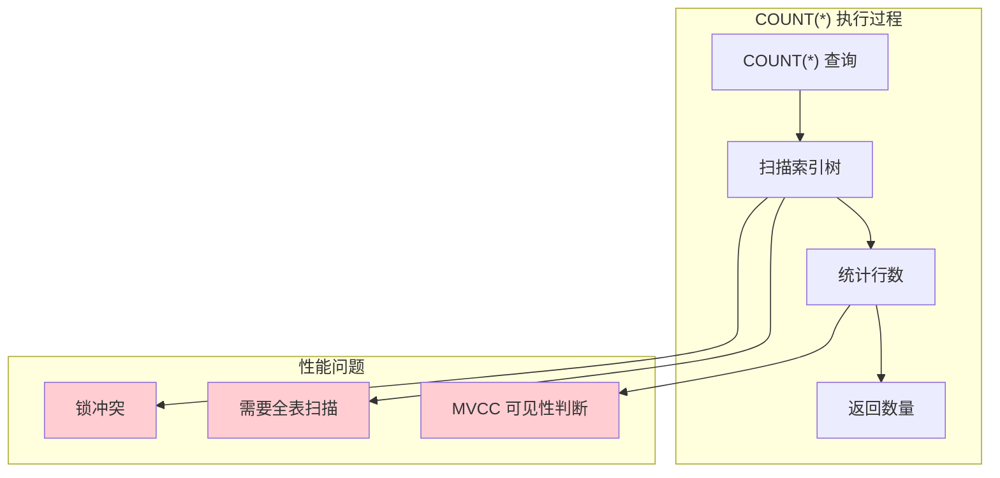

# COUNT 查询优化

> **目标级别**：P5/P6
> **面试频率**：🟡 中频
> **面试官最关心的 3 个问题**：
> 1. COUNT(*) 和 COUNT(1) 有什么区别？
> 2. 如何优化 COUNT 查询？
> 3. 为什么 InnoDB 的 COUNT(*) 这么慢？

面试官问：「COUNT(*) 和 COUNT(1) 有什么区别？」你说「差不多」——然后面试官紧接着追问「那为什么 COUNT(*) 在大表上这么慢？怎么优化？」你沉默了。

这就是 MySQL COUNT 查询面试的真实面貌：表面上问的是语法，实际上考的是对 InnoDB 存储引擎和查询优化的理解深度。

## 一、COUNT 语法区别

### 1.1 COUNT 用法对比

```sql
-- COUNT(*) vs COUNT(1) vs COUNT(column)

-- COUNT(*)：统计所有行数，包括 NULL
SELECT COUNT(*) FROM orders;  -- ✅ 推荐

-- COUNT(1)：统计所有行数，忽略 NULL
SELECT COUNT(1) FROM orders;  -- 与 COUNT(*) 几乎相同

-- COUNT(column)：统计非 NULL 行数
SELECT COUNT(status) FROM orders;  -- 统计 status 不为 NULL 的行数
SELECT COUNT(DISTINCT status) FROM orders;  -- 统计 status 不重复且非 NULL 的数量
```

### 1.2 性能对比

```sql
-- InnoDB 引擎
-- COUNT(*) 和 COUNT(1) 性能几乎相同
-- MySQL 优化器会优化 COUNT(1) 为 COUNT(*)

-- COUNT(column) 可能更慢
-- 需要检查每一行的 column 是否为 NULL
```

### 1.3 优化器行为

```sql
EXPLAIN SELECT COUNT(*) FROM orders;
-- type: index
-- key: PRIMARY  -- 使用主键索引
-- rows: 1000000  -- 预估行数

EXPLAIN SELECT COUNT(1) FROM orders;
-- type: index
-- key: PRIMARY  -- 同样使用主键索引
-- rows: 1000000
```

## 二、COUNT 查询慢的原因

### 2.1 InnoDB 的 COUNT(*) 实现



### 2.2 为什么慢

| 原因 | 说明 |
|------|------|
| **需要全表扫描** | 必须遍历所有数据 |
| **MVCC 可见性判断** | 每个事务看到的数量可能不同 |
| **索引选择** | 如果没有合适索引，会选择最少的索引 |
| **锁冲突** | 并发 COUNT 可能导致锁等待 |

### 2.3 COUNT 性能对比

| 查询 | 性能 | 说明 |
|------|------|------|
| `COUNT(*)` | 较慢 | 全表扫描或扫描最小索引 |
| `COUNT(1)` | 较慢 | 与 COUNT(*) 类似 |
| `COUNT(id)` | 较慢 | 需要检查 id 是否为 NULL |
| `COUNT(status)` | 慢 | 需要检查每一行的 status |

## 三、COUNT 优化方案

### 3.1 使用缓存

```sql
-- 使用 Redis 缓存总数
-- 写入时更新缓存
INCR orders:count  -- 订单数 +1
DECR orders:count  -- 订单数 -1

-- 读取时从缓存获取
GET orders:count
```

### 3.2 异步统计

```sql
-- 创建统计表
CREATE TABLE order_stats (
    stat_date DATE PRIMARY KEY,
    total_count BIGINT DEFAULT 0,
    updated_at DATETIME
);

-- 定时任务更新统计
INSERT INTO order_stats (stat_date, total_count, updated_at)
VALUES (CURDATE(), (SELECT COUNT(*) FROM orders), NOW())
ON DUPLICATE KEY UPDATE total_count = (SELECT COUNT(*) FROM orders);
```

### 3.3 使用索引

```sql
-- 添加统计用索引
CREATE INDEX idx_count ON orders(status);

-- 如果只统计某种状态的订单
SELECT COUNT(*) FROM orders WHERE status = 1;
-- 可以使用索引
```

### 3.4 近似 COUNT

```sql
-- 使用 EXPLAIN 获取近似值
EXPLAIN SELECT COUNT(*) FROM orders;
-- rows: 1000000（近似值）

-- MySQL 8.0 优化
-- 统计信息会缓存表的行数
-- 小表可能直接返回缓存值
```

## 四、不同 COUNT 用法

### 4.1 COUNT(*) vs COUNT(id)

```sql
-- COUNT(*)：MySQL 优化后，不需要检查是否为 NULL
SELECT COUNT(*) FROM orders;

-- COUNT(id)：需要检查 id 是否为 NULL（主键不可能为 NULL）
SELECT COUNT(id) FROM orders;  -- 与 COUNT(*) 性能相同

-- COUNT(普通字段)：需要检查是否为 NULL
SELECT COUNT(remark) FROM orders;  -- 比 COUNT(*) 慢
```

### 4.2 COUNT(DISTINCT)

```sql
-- 统计不重复的数量
SELECT COUNT(DISTINCT user_id) FROM orders;
SELECT COUNT(DISTINCT status) FROM orders;

-- 多个字段的不重复数量
SELECT COUNT(DISTINCT user_id, status) FROM orders;
```

### 4.3 COUNT 加条件

```sql
-- 统计符合条件的数量
SELECT COUNT(*) FROM orders WHERE status = 1;

-- 统计多个条件的数量
SELECT
    COUNT(*) AS total,
    COUNT(IF(status = 1, 1, NULL)) AS paid,
    COUNT(IF(status = 2, 1, NULL)) AS shipped,
    COUNT(IF(status = 3, 1, NULL)) AS completed
FROM orders;
```

## 五、实战优化案例

### 5.1 场景一：用户订单数统计

```sql
-- ❌ 低效：每次查询都 COUNT
SELECT COUNT(*) FROM orders WHERE user_id = 1;

-- ✅ 优化 1：使用计数器表
CREATE TABLE user_order_count (
    user_id BIGINT PRIMARY KEY,
    order_count BIGINT DEFAULT 0
);

-- 订单创建时更新
UPDATE user_order_count SET order_count = order_count + 1 WHERE user_id = 1;
INSERT INTO user_order_count (user_id, order_count) VALUES (1, 1);

-- 订单取消时减少
UPDATE user_order_count SET order_count = order_count - 1 WHERE user_id = 1;
```

### 5.2 场景二：多条件统计

```sql
-- ❌ 低效：多次 COUNT
SELECT
    COUNT(*) AS total,
    (SELECT COUNT(*) FROM orders WHERE status = 1) AS paid,
    (SELECT COUNT(*) FROM orders WHERE status = 2) AS shipped,
    (SELECT COUNT(*) FROM orders WHERE status = 3) AS completed
FROM orders LIMIT 1;

-- ✅ 优化：一次扫描
SELECT
    COUNT(*) AS total,
    SUM(status = 1) AS paid,
    SUM(status = 2) AS shipped,
    SUM(status = 3) AS completed
FROM orders;
```

## 六、面试追问链设计

> **第一层**：COUNT(*) 和 COUNT(1) 有什么区别？
> **第二层**：为什么 InnoDB 的 COUNT(*) 这么慢？
> **第三层**：COUNT(*) 需要扫描全表吗？

> **第一层**：如何优化 COUNT 查询？
> **第二层**：有哪些 COUNT 优化的方案？
> **第三层**：缓存 COUNT 结果有什么问题？怎么解决？

> **第一层**：COUNT(DISTINCT) 有什么特点？
> **第二层**：COUNT(*) 和 COUNT(column) 有什么区别？
> **第三层**：MySQL 8.0 对 COUNT 有什么优化？

## 七、常见面试陷阱

**⚠️ 陷阱 1**：认为 COUNT(*) 和 COUNT(1) 有本质区别
- MySQL 优化器会优化两者
- 实际性能几乎相同

**⚠️ 陷阱 2**：忽略缓存一致性问题
- 使用缓存存储 COUNT 结果
- 需要处理并发更新

**⚠️ 陷阱 3**：在大表上频繁执行 COUNT
- 大表 COUNT 非常慢
- 应该使用统计表或缓存

## 八、对比总结表

| COUNT 类型 | 性能 | 说明 |
|------------|------|------|
| `COUNT(*)` | 快 | MySQL 优化后最快 |
| `COUNT(1)` | 快 | 与 COUNT(*) 相同 |
| `COUNT(id)` | 快 | 与 COUNT(*) 相同（主键不为 NULL） |
| `COUNT(column)` | 慢 | 需要检查 NULL |
| `COUNT(DISTINCT)` | 慢 | 需要去重统计 |

## 九、加分回答

> **💡 面试加分点**：如果能说出 MySQL 8.0 对 COUNT 的优化，会给面试官留下深刻印象：
>
> 1. **统计信息缓存**：MySQL 8.0 缓存表统计信息
>
> 2. **EXPLAIN 近似值**：使用 EXPLAIN 获取近似 COUNT
>
> 3. **窗口函数统计**：使用窗口函数优化分组统计
>
> 4. **ClickHouse**：大数据量时考虑 ClickHouse 等 OLAP 引擎
