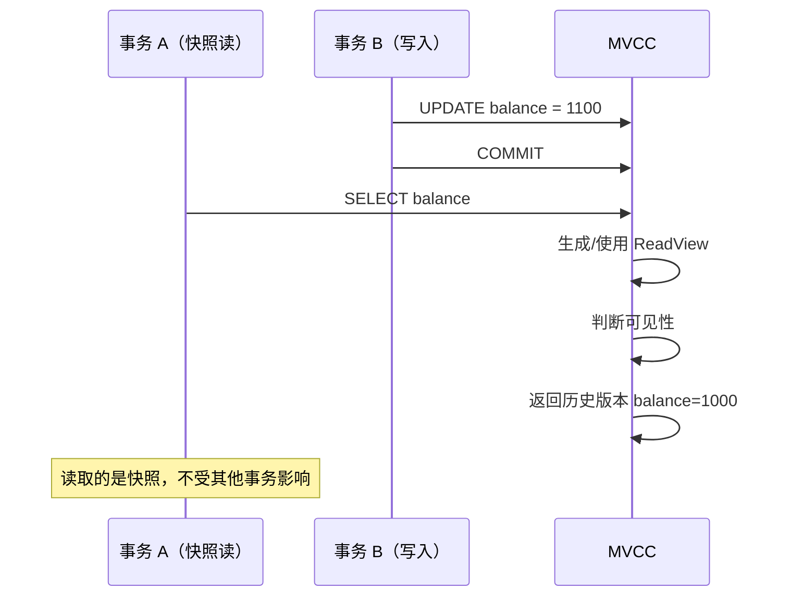
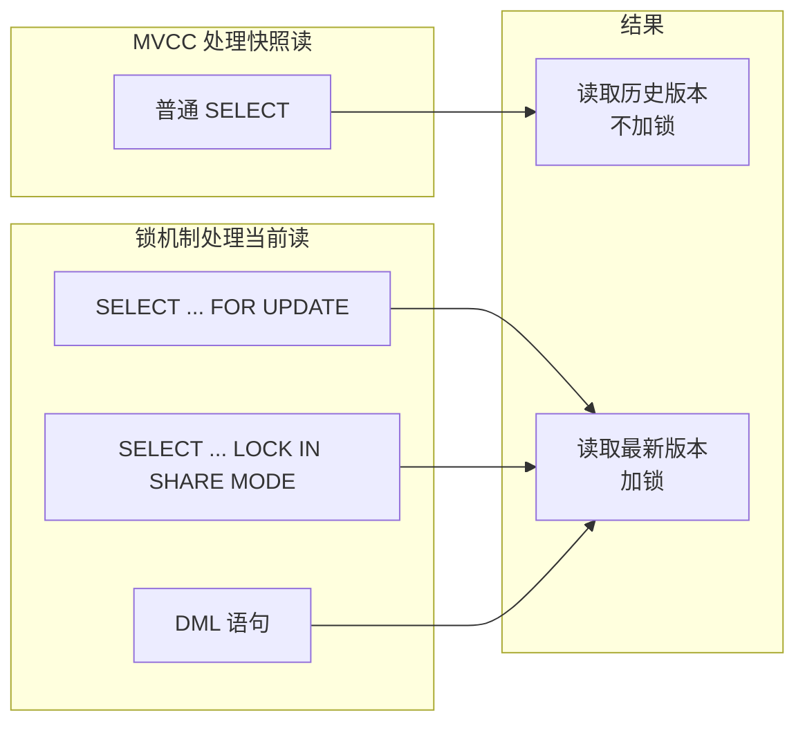
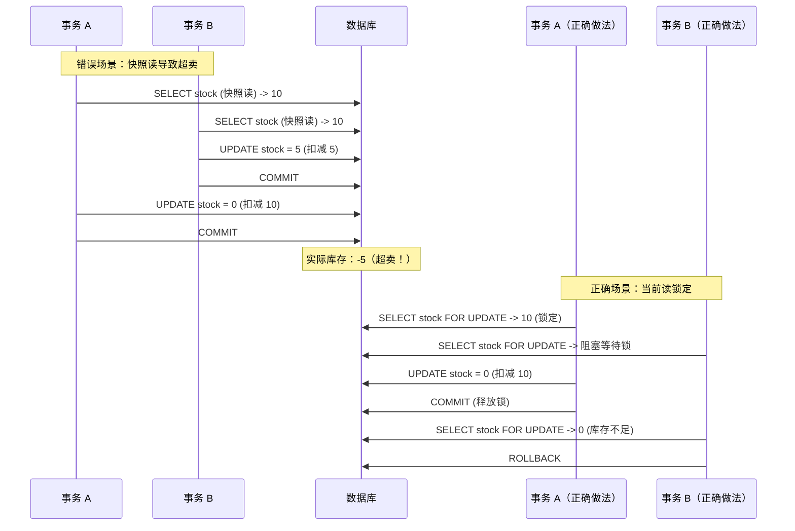

# 当前读与快照读

> **目标级别**：P5/P6
> **面试频率**：🟡 中频
> **面试官最关心的 3 个问题**：
> 1. 当前读和快照读有什么区别？
> 2. 哪些操作是当前读？哪些是快照读？
> 3. 当前读和快照读如何配合 MVCC？

面试官问：「什么是当前读？什么是快照读？」你说「当前读是最新数据，快照读是历史数据」——然后面试官紧接着追问「那 `SELECT ... FOR UPDATE` 和普通 `SELECT` 有什么区别？为什么说当前读可以解决幻读问题？」你沉默了。

这就是 MySQL 当前读与快照读面试的真实面貌：表面上问的是概念，实际上考的是对 MVCC 和锁机制配合的理解深度。

## 一、快照读 vs 当前读

### 1.1 基本概念

| 类型 | 别名 | 说明 | 使用技术 |
|------|------|------|----------|
| **快照读** | 一致性非锁定读 | 读取历史版本，不加锁 | MVCC |
| **当前读** | 一致性锁定读 | 读取最新版本，加锁 | 锁机制 |

### 1.2 对比表

| 对比维度 | 快照读 | 当前读 |
|----------|--------|--------|
| **读取数据** | 历史版本 | 最新版本 |
| **是否加锁** | 不加锁 | 加锁 |
| **并发性能** | 高 | 低 |
| **幻读问题** | 可能出现 | 不会出现 |
| **使用场景** | 普通查询 | 数据修改 |

## 二、快照读（Snapshot Read）

### 2.1 快照读的定义

**快照读**：读取数据在某个时间点的快照，不读取正在被其他事务修改的数据。

```sql
-- 普通 SELECT 是快照读
SELECT * FROM account WHERE id = 1;
SELECT * FROM account WHERE user_id = 1 ORDER BY created_at DESC LIMIT 10;
```

### 2.2 快照读的 MVCC 实现



### 2.3 快照读的特点

| 特点 | 说明 |
|------|------|
| **不加锁** | 不会阻塞其他事务的读写 |
| **读取历史** | 可能读取旧数据 |
| **性能高** | 读写不冲突 |
| **使用 MVCC** | 基于 ReadView 判断可见性 |

## 三、当前读（Locking Read）

### 3.1 当前读的定义

**当前读**：读取数据的最新版本，并对读取的数据加锁。

```sql
-- SELECT ... FOR UPDATE
SELECT * FROM account WHERE id = 1 FOR UPDATE;

-- SELECT ... LOCK IN SHARE MODE
SELECT * FROM account WHERE id = 1 LOCK IN SHARE MODE;

-- INSERT / UPDATE / DELETE
INSERT INTO account (id, balance) VALUES (1, 1000);
UPDATE account SET balance = 1100 WHERE id = 1;
DELETE FROM account WHERE id = 1;
```

### 3.2 当前读的锁类型

| 语句 | 锁类型 | 锁定范围 |
|------|--------|----------|
| `SELECT ... FOR UPDATE` | X 锁（排他锁） | 读取的行 |
| `SELECT ... LOCK IN SHARE MODE` | S 锁（共享锁） | 读取的行 |
| `INSERT` | X 锁（隐含） | 插入的行 |
| `UPDATE / DELETE` | X 锁 | 更新的行 |

### 3.3 当前读解决幻读

```sql
-- 会话 A：使用当前读锁定范围
START TRANSACTION;
SELECT * FROM orders WHERE user_id = 1 FOR UPDATE;
-- 锁定 user_id=1 的所有记录 + 间隙

-- 会话 B：尝试插入（被锁定阻塞）
INSERT INTO orders (user_id, amount) VALUES (1, 100);
-- 等待锁释放或超时

COMMIT;  -- 提交后释放锁
-- 会话 B 的 INSERT 才能执行
```

## 四、两种读的配合

### 4.1 MVCC + 锁的组合



### 4.2 实战案例

```sql
-- 场景：订单扣库存

-- ✅ 正确做法：使用当前读
START TRANSACTION;
-- 读取库存并锁定
SELECT stock FROM product WHERE id = 1 FOR UPDATE;
-- 检查库存
IF stock >= quantity THEN
    -- 更新库存
    UPDATE product SET stock = stock - quantity WHERE id = 1;
    -- 创建订单
    INSERT INTO orders (product_id, quantity) VALUES (1, quantity);
    COMMIT;
ELSE
    ROLLBACK;
END IF;

-- ❌ 错误做法：使用快照读
START TRANSACTION;
-- 快照读读取库存
SELECT stock FROM product WHERE id = 1;  -- stock=10
-- 检查库存（此时其他事务可能已经修改）

-- 其他事务可能已经扣减库存
UPDATE product SET stock = stock - quantity WHERE id = 1;
COMMIT;

-- 可能导致超卖！（库存已经变为 0，但快照读读到的是 10）
```

### 4.3 扣库存场景分析



## 五、读已提交 vs 可重复读

### 5.1 不同隔离级别下的快照读

```sql
-- READ COMMITTED：每次读取都生成新 ReadView
SET SESSION transaction_isolation = 'READ-COMMITTED';
START TRANSACTION;
SELECT balance FROM account WHERE id = 1;  -- ReadView 1
SELECT balance FROM account WHERE id = 1;  -- ReadView 2（可能不同）
COMMIT;

-- REPEATABLE READ���事务开始时生成 ReadView
SET SESSION transaction_isolation = 'REPEATABLE-READ';
START TRANSACTION;
SELECT balance FROM account WHERE id = 1;  -- ReadView（事务级别）
SELECT balance FROM account WHERE id = 1;  -- 同一 ReadView（总是一致）
COMMIT;
```

### 5.2 不同隔离级别下的当前读

```sql
-- 当前读在不同隔离级别下行为一致
SET SESSION transaction_isolation = 'READ-COMMITTED';
START TRANSACTION;
SELECT * FROM account WHERE id = 1 FOR UPDATE;
-- 总是读取最新版本，并锁定

SET SESSION transaction_isolation = 'REPEATABLE-READ';
START TRANSACTION;
SELECT * FROM account WHERE id = 1 FOR UPDATE;
-- 总是读取最新版本，并锁定
```

## 六、面试追问链设计

> **第一层**：什么是当前读？什么是快照读？
> **第二层**：哪些操作是当前读？哪些是快照读？
> **第三层**：当前读和快照读使用的技术分别是什么？

> **第一层**：当前读可以解决幻读问题，快照读可以吗？
> **第二层**：为什么说「当前读 + 间隙锁」可以完全解决幻读？
> **第三层**：快照读出现幻读的场景是什么？

> **第一层**：`SELECT ... FOR UPDATE` 和 `SELECT ... LOCK IN SHARE MODE` 有什么区别？
> **第二层**：这两种当前读分别加什么锁？
> **第三层**：锁的兼容矩阵是怎样的？

## 七、常见面试陷阱

**⚠️ 陷阱 1**：认为快照读不加锁，所以不会影响并发
- 快照读虽然不加锁，但读取的数据可能被其他事务锁定
- 后续更新时可能因为锁等待超时

**⚠️ 陷阱 2**：在扣库存场景使用快照读
- 快照读可能导致超卖
- 必须使用当前读锁定数据

**⚠️ 陷阱 3**：忽略不同隔离级别下当前读的行为差异
- 在 SERIALIZABLE 下，普通 SELECT 也会加锁（等效于 LOCK IN SHARE MODE）

## 八、实战最佳实践

### 8.1 读操作：使用快照读

```sql
-- 普通查询：使用快照读（性能好）
SELECT * FROM product WHERE id = 1;
SELECT * FROM orders WHERE user_id = 1 LIMIT 10;
```

### 8.2 写操作：使用当前读

```sql
-- 更新操作：使用当前读（保证一致性）
START TRANSACTION;
-- 1. 当前读锁定数据
SELECT * FROM account WHERE id = 1 FOR UPDATE;
-- 2. 业务检查
-- 3. 更新数据
UPDATE account SET balance = balance - 100 WHERE id = 1;
COMMIT;
```

### 8.3 分布式场景

```sql
-- 分布式锁场景
-- 使用 SELECT ... FOR UPDATE 获取行锁
START TRANSACTION;
SELECT * FROM distributed_lock WHERE lock_key = 'order:123'
FOR UPDATE;
-- 获取锁成功，执行业务逻辑
UPDATE distributed_lock SET owner = 'instance-1' WHERE id = 1;
COMMIT;
```

## 九、加分回答

> **💡 面试加分点**：如果能说出 MVCC 和锁的完整配合机制，会给面试官留下深刻印象：
>
> 1. **读写分离优化**：快照读用于查询，当前读用于更新
>
> 2. **锁与 MVCC 的边界**：当前读仍然会创建 ReadView，但不用于读取数据
>
> 3. **半一致性读**：InnoDB 的特殊优化，用于减少锁冲突
>
> 4. **Gap Lock 的作用**：不仅锁定记录，还锁定间隙，防止幻读
