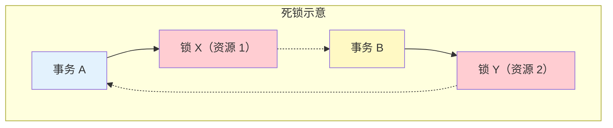
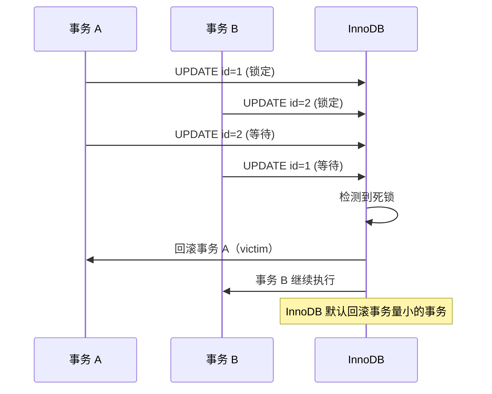

# 死锁排查与解决

> **目标级别**：P6
> **面试频率**：🔴 高频
> **面试官最关心的 3 个问题**：
> 1. 什么是死锁？死锁的必要条件是什么？
> 2. 如何排查和解决 MySQL 死锁？
> 3. 如何避免死锁？

面试官问：「线上出现死锁了，怎么排查？」你说「看日志」——然后面试官紧接着追问「具体看什么日志？怎么分析死锁信息？怎么从代码层面避免死锁？」你沉默了。

这就是 MySQL 死锁面试的真实面貌：表面上问的是排查，实际上考的是对死锁机制的理解和实战经验。

## 一、死锁的定义

### 1.1 什么是死锁

**死锁**：两个或多个事务相互持有对方需要的锁，形成循环等待，导致事务无法继续执行。



### 1.2 死锁的四个必要条件

| 条件 | 说明 |
|------|------|
| **互斥条件** | 资源一次只能被一个事务持有 |
| **持有并等待** | 事务持有资源的同时请求其他资源 |
| **不可抢占** | 资源不能被强制抢占，只能手动释放 |
| **循环等待** | 形成事务间的循环等待链 |

## 二、死锁的产生过程

### 2.1 经典死锁场景

```sql
-- 事务 A
START TRANSACTION;
UPDATE account SET balance = balance - 100 WHERE id = 1;  -- 锁定 id=1
UPDATE account SET balance = balance + 100 WHERE id = 2;  -- 等待锁定 id=2

-- 事务 B（并发执行）
START TRANSACTION;
UPDATE account SET balance = balance - 100 WHERE id = 2;  -- 锁定 id=2
UPDATE account SET balance = balance + 100 WHERE id = 1;  -- 等待锁定 id=1

-- 死锁形成：事务 A 等 id=2，事务 B 等 id=1
```

### 2.2 死锁时序图



## 三、死锁排查方法

### 3.1 启用死锁日志

```sql
-- 查看死锁日志开关
SHOW VARIABLES LIKE 'innodb_print_all_deadlocks';  -- 默认 OFF

-- 开启死锁日志（临时）
SET GLOBAL innodb_print_all_deadlocks = ON;

-- 开启后，SHOW ENGINE INNODB STATUS 会输出死锁信息
```

### 3.2 查看死锁信息

```sql
-- 查看死锁详细信息
SHOW ENGINE INNODB STATUS;

-- 查看最近一次死锁的部分输出示例：
---TRANSACTION 123456, ACTIVE 5 sec inserting
mysql table lock test t, lock mode S
lock wait timeout 50 sec
lock_space: 12345
lock_page: 678
lock_rec: 90
lock_data: 1
*** WE ROLL BACK TRANSACTION 123456
```

### 3.3 查看锁等待信息

```sql
-- 查看当前锁等待
SELECT
    r.trx_id,
    r.trx_mysql_thread_id,
    r.trx_query,
    r.trx_state,
    r.trx_started,
    l.lock_id,
    l.lock_mode,
    l.lock_type,
    l.lock_table
FROM information_schema.INNODB_TRX r
JOIN information_schema.INNODB_LOCKS l
ON r.trx_id = l.lock_trx_id;

-- 查看锁等待
SELECT * FROM information_schema.INNODB_LOCK_WAITS;

-- 查看事务等待的锁
SELECT
    r.trx_id,
    r.trx_query,
    l.lock_id,
    l.lock_mode,
    l.lock_type,
    l.lock_table
FROM information_schema.INNODB_TRX r
JOIN information_schema.INNODB_LOCK_WAITS w
ON r.trx_id = w.requesting_trx_id
JOIN information_schema.INNODB_LOCKS l
ON w.blocking_trx_id = l.lock_trx_id;
```

## 四、死锁日志分析

### 4.1 死锁日志结构

```sql
-- SHOW ENGINE INNODB STATUS 输出示例
========================
LATEST DETECTED DEADLOCK
------------------------
2024-01-15 10:30:00 0x7f8a9c123400

*** (1) TRANSACTION A:
TRANSACTION 1001, ACTIVE 2 sec updating
UPDATE account SET balance = balance - 100 WHERE id = 1
LOCK WAIT 3 lock struct(s), heap size 1136, 2 row lock(s)
LOCK A: locks rec but not gap, lock_mode X locks rec but not gap
lock_data: 1

*** (2) TRANSACTION B:
TRANSACTION 1002, ACTIVE 2 sec updating
UPDATE account SET balance = balance - 100 WHERE id = 2
LOCK WAIT 3 lock struct(s), heap size 1136, 2 row lock(s)
LOCK A: locks rec but not gap, lock_mode X locks rec but not gap
lock_data: 2

*** (1) TRANSACTION A WAITING FOR THIS LOCK TO BE GRANTED:
RECORD LOCKS space id 123 page no 456 n bits 72 index PRIMARY of table `test`.`account`
lock_mode X locks rec but not gap waiting
lock_data: 2

*** (2) TRANSACTION B WAITING FOR THIS LOCK TO BE GRANTED:
RECORD LOCKS space id 123 page no 456 n bits 72 index PRIMARY of table `test`.`account`
lock_mode X locks rec but not gap waiting
lock_data: 1

*** WE ROLL BACK TRANSACTION 1001
```

### 4.2 关键字段解读

| 字段 | 说明 |
|------|------|
| **TRANSACTION** | 事务 ID 和活跃时间 |
| **ACTIVE** | 事务活跃时长 |
| **updating** | 当前执行的操作 |
| **lock_struct(s)** | 锁结构数量 |
| **row lock(s)** | 行锁数量 |
| **lock_mode** | 锁模式（S/X） |
| **lock_data** | 锁定的记录主键 |
| **WE ROLL BACK** | 回滚的事务 |

## 五、死锁解决方案

### 5.1 监控告警

```sql
-- 开启死锁日志后，可以在日志中搜索
-- 错误日志路径
SHOW VARIABLES LIKE 'log_error';

-- 设置告警规则
-- 1. 监控死锁错误
-- 2. 告警通知
-- 3. 自动记录死锁上下文
```

### 5.2 业务代码优化

```sql
-- ❌ 错误示例：不同事务顺序不一致导致死锁

-- 事务 A：先锁 id=1，再锁 id=2
START TRANSACTION;
UPDATE account SET balance = balance - 100 WHERE id = 1;
UPDATE account SET balance = balance + 100 WHERE id = 2;
COMMIT;

-- 事务 B：先锁 id=2，再锁 id=1（顺序不一致！）
START TRANSACTION;
UPDATE account SET balance = balance - 100 WHERE id = 2;
UPDATE account SET balance = balance + 100 WHERE id = 1;
COMMIT;

-- ✅ 正确示例：所有事务使用相同的加锁顺序

-- 事务 A 和 B 都先锁 id=1，再锁 id=2
START TRANSACTION;
UPDATE account SET balance = balance - 100 WHERE id = 1;
UPDATE account SET balance = balance + 100 WHERE id = 2;
COMMIT;
```

### 5.3 减少锁持有时间

```sql
-- ❌ 错误示例：长时间持有锁

START TRANSACTION;
-- 查询（可能锁住大量数据）
SELECT * FROM orders WHERE user_id = 1;
-- 业务逻辑处理（耗时 10 秒）
process_order();
-- 更新
UPDATE orders SET status = 'paid' WHERE user_id = 1;
COMMIT;  -- 锁持有时间过长

-- ✅ 正确示例：减少锁持有时间

START TRANSACTION;
-- 使用主键精确查询，只锁一行
SELECT * FROM orders WHERE id = 100 FOR UPDATE;
-- 快速更新
UPDATE orders SET status = 'paid' WHERE id = 100;
COMMIT;  -- 锁持有时间短
```

## 六、避免死锁的最佳实践

### 6.1 锁顺序一致

```sql
-- 所有事务按相同顺序访问资源

-- 统一按主键从小到大顺序加锁
START TRANSACTION;
UPDATE account SET balance = balance - 100 WHERE id = 1;
UPDATE account SET balance = balance + 100 WHERE id = 2;
COMMIT;
```

### 6.2 使用低隔离级别

```sql
-- 使用 READ COMMITTED 替代 REPEATABLE READ
-- READ COMMITTED 下间隙锁可能不生效

SET SESSION transaction_isolation = 'READ-COMMITTED';

START TRANSACTION;
UPDATE account SET balance = balance - 100 WHERE id = 1;
COMMIT;
```

### 6.3 合理设计索引

```sql
-- 确保查询使用索引，避免锁住过多数据

-- ❌ 没有索引，全表扫描
UPDATE account SET balance = balance - 100 WHERE name = '张三';
-- 可能锁住整张表

-- ✅ 有索引，精确锁定
CREATE INDEX idx_name ON account(name);
UPDATE account SET balance = balance - 100 WHERE name = '张三';
-- 只锁定符合条件的行
```

### 6.4 使用应用层锁

```sql
-- 使用分布式锁替代数据库锁
-- Redis SETNX、ZooKeeper 等

-- 应用层获取分布式锁后，再操作数据库
SETNX(lock_key, lock_value);
-- 业务操作
DEL(lock_key);
```

## 七、面试追问链设计

> **第一层**：什么是死锁？死锁的必要条件是什么？
> **第二层**：MySQL 是如何检测死锁的？
> **第三层**：InnoDB 默认会回滚哪个事务？

> **第一层**：如何排查死锁？
> **第二层**：SHOW ENGINE INNODB STATUS 的死锁日志包含哪些信息？
> **第三层**：如何从日志中分析死锁的原因？

> **第一层**：如何避免死锁？
> **第二层**：为什么要保持锁顺序一致？
> **第三层**：减少锁持有时间对死锁有什么影响？

## 八、常见面试陷阱

**⚠️ 陷阱 1**：认为死锁是可以完全避免的
- 在高并发系统中，死锁是不可避免的
- 重要的是检测和处理死锁

**⚠️ 陷阱 2**：忽略死锁检测的开销
- 死锁检测需要遍历等待图
- 死锁越多，检测越慢

**⚠️ 陷阱 3**：过度优化导致性能下降
- 为避免死锁而过度加锁
- 可能导致并发性能大幅下降

## 九、对比总结表

| 对比维度 | 死锁 | 锁等待 |
|----------|------|--------|
| **定义** | 循环等待，无法继续 | 单向等待，可以继续 |
| **自动恢复** | 回滚一个事务 | 等待锁释放 |
| **影响范围** | 多个事务受影响 | 单个事务受影响 |
| **检测机制** | InnoDB 死锁检测 | 锁等待超时 |

## 十、加分回答

> **💡 面试加分点**：如果能说出 MySQL 8.0 对死锁检测的优化，会给面试官留下深刻印象：
>
> 1. **死锁检测算法**：从循环检测改为图算法，更高效
>
> 2. **innodb_deadlock_detect**：控制是否开启死锁检测
>
> 3. **victim 选择策略**：优先回滚 lock_struct 少的事务
>
> 4. **锁监控**：通过 performance_schema 监控锁信息
