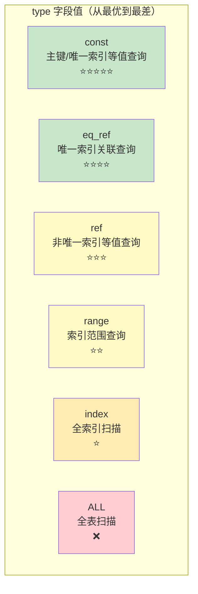
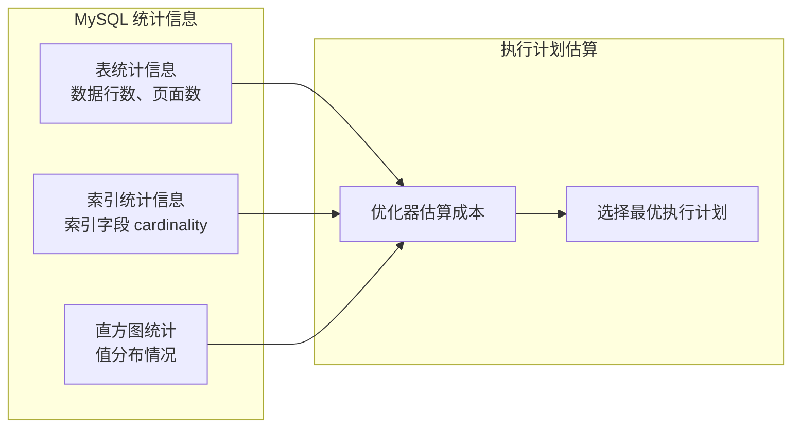

# Explain 执行计划解读

> **目标级别**：P5/P6
> **面试频率**：🔴 高频
> **面试官最关心的 3 个问题**：
> 1. Explain 各字段的含义是什么？
> 2. 如何通过 Explain 判断索引是否生效？
> 3. `Using filesort` 和 `Using temporary` 怎么优化？

面试官问：「这条 SQL 慢，怎么分析？」你说「看执行计划」——然后面试官紧接着追问「Explain 输出的 `type` 字段有哪些值？`Using filesort` 是什么意思？怎么优化？」你沉默了。

这就是 MySQL 执行计划面试的真实面貌：表面上问的是工具使用，实际上考的是对查询优化器原理的理解深度。

## 一、Explain 使用方法

### 1.1 基本语法

```sql
-- 基本用法
EXPLAIN SELECT * FROM user WHERE id = 1;

-- 格式化输出（MySQL 5.6+）
EXPLAIN FORMAT=JSON SELECT * FROM user WHERE id = 1;

-- 查看更详细的信息（MySQL 5.6+）
EXPLAIN ANALYZE SELECT * FROM user WHERE id = 1;
-- 会显示预估行数和实际行数
```

### 1.2 可视化工具

MySQL Workbench、Navicat 等工具提供了可视化的执行���划展示：

| 工具 | 说明 |
|------|------|
| MySQL Workbench | 图形化展示执行计划 |
| Navicat | 可视化 SQL 分析 |
| pt-query-digest | 慢查询分析工具 |

## 二、Explain 输出字段详解

### 2.1 字段概览

| 字段 | 说明 |
|------|------|
| **id** | 查询中 SELECT 的序号 |
| **select_type** | SELECT 查询的类型 |
| **table** | 查询涉及的表 |
| **type** | 访问类型（最重要） |
| **possible_keys** | 可能使用的索引 |
| **key** | 实际使用的索引 |
| **key_len** | 索引长度 |
| **ref** | 与索引比较的列 |
| **rows** | 预估扫描行数 |
| **Extra** | 附加说明（最重要） |

### 2.2 type 字段（访问类型）



| type 值 | 说明 | 示例 |
|--------|------|------|
| **const** | 主键或唯一索引等值查询（最快） | `WHERE id = 1` |
| **eq_ref** | 唯一索引关联查询 | `JOIN ON id` |
| **ref** | 非唯一索引等值查询 | `WHERE name = '张三'` |
| **range** | 索引范围扫描 | `WHERE id `>=` 100` |
| **index** | 全索引扫描 | `SELECT name FROM t` |
| **ALL** | 全表扫描（最慢） | 无索引时 |

### 2.3 select_type 字段

| select_type | 说明 |
|-------------|------|
| **SIMPLE** | 简单 SELECT（无 UNION 或子查询） |
| **PRIMARY** | 外层查询 |
| **SUBQUERY** | 子查询 |
| **DERIVED** | 派生表（FROM 子句中的子查询） |
| **UNION** | UNION 中的第二个及之后的 SELECT |
| **UNION RESULT** | UNION 的结果集 |

### 2.4 Extra 字段（关键！）

| Extra 值 | 含义 | 优化建议 |
|----------|------|----------|
| **Using index** | 覆盖索引，无需回表 | ✅ 最佳 |
| **Using index condition** | 使用了索引下推 | ✅ 良好 |
| **Using where** | 需要在存储引擎层过滤 | ⚠️ 需注意 |
| **Using filesort** | 需要额外排序 | ❌ 需优化 |
| **Using temporary** | 使用临时表 | ❌ 需优化 |
| **Using join buffer** | 使用连接缓存 | ⚠️ 需注意 |
| **Impossible WHERE** | WHERE 条件永真 | ❌ SQL 错误 |
| **Select tables optimized away** | 使用了聚合函数优化 | ✅ 良好 |

## 三、实战案例分析

### 3.1 案例一：全表扫描

```sql
EXPLAIN SELECT * FROM orders WHERE status = 1;
```

| 字段 | 值 | 说明 |
|------|-----|------|
| type | ALL | ⚠️ 全表扫描 |
| possible_keys | NULL | 没有可用索引 |
| key | NULL | 未使用索引 |
| rows | 100000 | 扫描 10 万行 |
| Extra | Using where | 需要过滤 status=1 |

**优化方案**：

```sql
-- 添加索引
CREATE INDEX idx_status ON orders(status);

-- 再次分析
EXPLAIN SELECT * FROM orders WHERE status = 1;
-- type: ref
-- key: idx_status
-- rows: 100（预估扫描行数大幅减少）
```

### 3.2 案例二：覆盖索引

```sql
EXPLAIN SELECT order_no, amount FROM orders WHERE user_id = 1;
```

| 字段 | 值 | 说明 |
|------|-----|------|
| type | ref | 使用索引 |
| key | idx_user_id | 实际使用索引 |
| key_len | 8 | 索引长度 |
| rows | 10 | 扫描行数 |
| Extra | **Using index** | ✅ 覆盖索引，无需回表 |

### 3.3 案例三：文件排序

```sql
EXPLAIN SELECT * FROM orders WHERE user_id = 1 ORDER BY created_at DESC;
```

| 字段 | 值 | 说明 |
|------|-----|------|
| type | ref | 使用索引 |
| key | idx_user_id | 实际使用索引 |
| Extra | Using index condition; **Using filesort** | ❌ 需要额外排序 |

**优化方案**：

```sql
-- 添加覆盖索引：包含排序字段
CREATE INDEX idx_user_created ON orders(user_id, created_at);

EXPLAIN SELECT * FROM orders WHERE user_id = 1 ORDER BY created_at DESC;
-- Extra: Using index condition
-- Extra 中不再有 Using filesort ✅
```

### 3.4 案例四：临时表

```sql
EXPLAIN SELECT name, COUNT(*) FROM orders GROUP BY name;
```

| 字段 | 值 | 说明 |
|------|-----|------|
| type | ALL | 全表扫描 |
| rows | 100000 | 扫描 10 万行 |
| Extra | Using temporary; **Using filesort** | ❌ 需要临时表和排序 |

**优化方案**：

```sql
-- 添加索引：让 GROUP BY 使用索引
CREATE INDEX idx_name ON orders(name);

EXPLAIN SELECT name, COUNT(*) FROM orders GROUP BY name;
-- type: index
-- key: idx_name
-- Extra: Using index
-- 不再有 Using temporary ✅
```

## 四、EXPLAIN 深度解读

### 4.1 rows 字段的估算



### 4.2 key_len 的含义

```sql
-- 索引：idx_name_age (name VARCHAR(50), age INT)

EXPLAIN SELECT * FROM user WHERE name = '张三' AND age = 30;

-- key_len = 字段长度 + 变长字段开销
-- VARCHAR(50) 的 key_len = 50 * 3(utf8mb4) + 2(变长) + 1(NULL) = 153
-- INT 的 key_len = 4

-- 如果只使用了 name：
-- key_len = 153

-- 如果使用了 name 和 age：
-- key_len = 153 + 4 = 157
```

### 4.3 ref 字段的含义

| ref 值 | 说明 |
|--------|------|
| const | 使用常量与索引比较 |
| func | 使用函数与索引比较 |
| db_name.table_name.column | 使用其他表的字段 |

## 五、面试追问链设计

> **第一层**：Explain 的 type 字段有哪些值？
> **第二层**：什么情况下 type 会是 ALL？如何避免全表扫描？
> **第三层**：如何根据 type 值判断查询性能？

> **第一层**：Extra 字段的 `Using filesort` 是什么意思？
> **第二层**：如何优化 `Using filesort`？
> **第三层**：如果 ORDER BY 字段不是索引，MySQL 是怎么排序的？

> **第一层**：如何判断查询是否使用了覆盖索引？
> **第二层**：`Using index condition` 和 `Using where` 有什么区别？
> **第三层**：ICP 和覆盖索引有什么关系？

## 六、常见面试陷阱

**⚠️ 陷阱 1**：只看 rows 字段判断性能
- rows 是预估行数，不是实际行数
- 优化器估算可能不准确

**⚠️ 陷阱 2**：认为 type=ALL 一定慢
- 小表全表扫描可能比索引查询更快
- 索引区分度低时全表扫描更优

**⚠️ 陷阱 3**：忽略 Extra 字段
- Extra 字段包含最重要的优化信息
- `Using filesort` 和 `Using temporary` 是常见性能问题

## 七、对比总结表

| 场景 | type | key | Extra | 优化建议 |
|------|------|-----|-------|----------|
| 主键等值查询 | const | 主键 | - | ✅ 最优 |
| 唯一索引查询 | eq_ref | 唯一索引 | - | ✅ 最优 |
| 普通索引查询 | ref | 索引 | - | ✅ 良好 |
| 索引范围扫描 | range | 索引 | - | ⚠️ 良好 |
| 全表扫描 | ALL | - | Using where | ❌ 需优化 |
| 覆盖索引 | ref | 索引 | Using index | ✅ 最优 |
| 额外排序 | ref | 索引 | Using filesort | ⚠️ 需优化 |

## 八、加分回答

> **💡 面试加分点**：如果能说出 EXPLAIN 的高级用法和优化器原理，会给面试官留下深刻印象：
>
> 1. **EXPLAIN ANALYZE（MySQL 8.0）**：显示实际执行时间和预估时间对比
>
> 2. **optimizer_trace**：跟踪优化器的决策过程
>
> 3. **直方图统计**：MySQL 8.0 支持列值分布统计，更准确估算成本
>
> 4. **执行计划稳定性**：参数 `optimizer_search_depth` 影响优化器搜索深度
