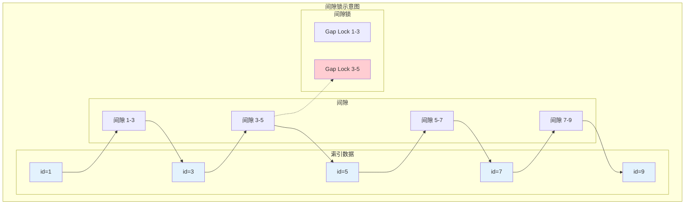
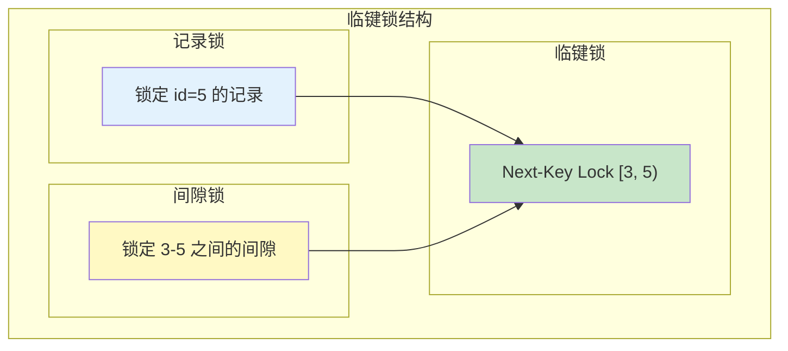
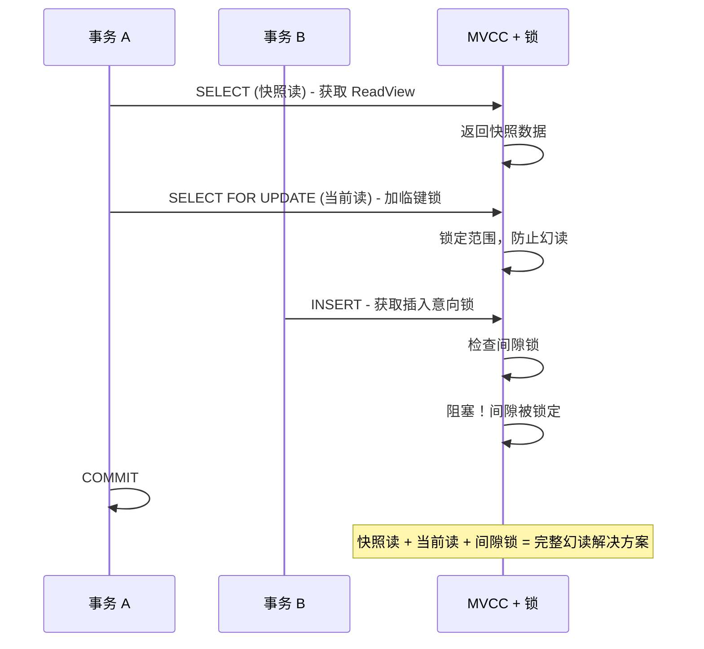

# 间隙锁解决幻读

> **目标级别**：P6
> **面试频率**：🔴 高频
> **面试官最关心的 3 个问题**：
> 1. 什么是间隙锁？它是如何解决幻读问题的？
> 2. 临键锁和间隙锁有什么关系？
> 3. 间隙锁在什么场景下会锁定不存在的值？

面试官问：「间隙锁是怎么解决幻读的？」你说「就是锁定记录之间的间隙」——然后面试官紧接着追问「那为什么等值查询 `id = 5` 也会锁定 id=5 附近的其他记录？间隙锁的锁定范围是怎么确定的？」你沉默了。

这就是 MySQL 间隙锁面试的真实面貌：表面上问的是概念，实际上考的是对 InnoDB 锁算法实现细节的理解深度。

## 一、间隙锁的概念

### 1.1 什么是间隙锁

**间隙锁（Gap Lock）**：锁定索引记录之间的间隙，防止其他事务在间隙中插入新的记录，从而解决幻读问题。



### 1.2 为什么需要间隙锁

```sql
-- 幻读场景：没有间隙锁

-- 会话 A
START TRANSACTION;
SELECT COUNT(*) FROM orders WHERE user_id = 1;  -- 返回 10

-- 会话 B
START TRANSACTION;
INSERT INTO orders (user_id, amount) VALUES (1, 100);  -- 插入
INSERT INTO orders (user_id, amount) VALUES (1, 200);  -- 插入
COMMIT;

-- 会话 A：再次查询
SELECT COUNT(*) FROM orders WHERE user_id = 1;  -- 返回 12（幻读！）
COMMIT;
```

## 二、临键锁（Next-Key Lock）

### 2.1 临键锁的定义

**临键锁（Next-Key Lock）**：记录锁 + 间隙锁的组合，是 InnoDB 在可重复读隔离级别下的默认锁算法。



### 2.2 临键锁的锁定范围

| 查询条件 | 临键锁范围 |
|----------|-----------|
| `id = 5` | [3, 5) 和 (5, 7]，即锁定前后间隙 |
| `id BETWEEN 3 AND 5` | [1, 3)、[3, 5)、(5, 7]，锁定整个范围 |
| `id > 3 AND id < 7` | [3, 7)，锁定整个区间 |

### 2.3 临键锁解决幻读

```sql
-- 会话 A：使用临键锁
START TRANSACTION;
SELECT * FROM orders WHERE id BETWEEN 3 AND 5 FOR UPDATE;
-- 锁定范围：[1, 3)、[3, 5)、(5, 7]

-- 会话 B：尝试插入
INSERT INTO orders (id, amount) VALUES (4, 100);  -- 被锁定阻塞
INSERT INTO orders (id, amount) VALUES (6, 100);  -- 被锁定阻塞

COMMIT;  -- 提交后释放锁
```

## 三、间隙锁的锁定范围

### 3.1 主键索引的间隙锁

```sql
-- 假设表中有 id: 1, 3, 5, 7, 9

-- 等值查询：SELECT * FROM t WHERE id = 5 FOR UPDATE;
-- 临键锁范围：[3, 5) 和 (5, 7]
-- 锁定：id=5 的记录 + 前后间隙

-- 范围查询：SELECT * FROM t WHERE id BETWEEN 3 AND 7 FOR UPDATE;
-- 临键锁范围：[1, 3)、[3, 5)、[5, 7)、(7, 9]
-- 锁定：整个区间内的所有记录和间隙
```

### 3.2 唯一索引的间隙锁

```sql
-- 唯一索引的等值查询不会产生间隙锁

-- 唯一索引等值查询：SELECT * FROM t WHERE unique_key = 'X' FOR UPDATE;
-- 只锁定 unique_key='X' 的记录
-- 不锁定前后间隙！

-- 唯一索引范围查询会产生间隙锁
SELECT * FROM t WHERE unique_key BETWEEN 'A' AND 'Z' FOR UPDATE;
-- 锁定 A-Z 之间的所有间隙
```

### 3.3 普通索引的间隙锁

```sql
-- 普通索引：INDEX idx_age (age)

-- 表数据：age: 18, 20, 22, 25, 28

-- 等值查询：SELECT * FROM t WHERE age = 22 FOR UPDATE;
-- 临键锁范围：锁定 age=22 的记录 + 前后间隙
-- 锁定：age 在 [20, 22) 和 (22, 25) 之间的数据无法插入
```

## 四、间隙锁的特殊情况

### 4.1 锁定不存在的值

```sql
-- 表中 id: 1, 3, 5, 7, 9

-- 查询不存在的值
SELECT * FROM t WHERE id = 4 FOR UPDATE;
-- 临键锁范围：(3, 5)
-- 锁定 id=4 所在的前后间隙

-- 其他事务无法插入 id=4
INSERT INTO t (id, name) VALUES (4, 'test');  -- 被锁定阻塞
```

### 4.2 负无穷到正无穷的锁

```sql
-- 如果查询的边界是负无穷或正无穷

-- SELECT * FROM t WHERE id < 5 FOR UPDATE;
-- 临键锁范围：(-∞, 5)
-- 锁定所有小于 5 的间隙

-- SELECT * FROM t WHERE id > 10 FOR UPDATE;
-- 临键锁范围：(10, +∞)
-- 锁定所有大于 10 的间隙
```

### 4.3 多列索引的间隙锁

```sql
-- 联合索引：(a, b)

-- 表中数据：(1, 1), (1, 3), (1, 5), (2, 1), (2, 3)

-- 等值查询：SELECT * FROM t WHERE a = 1 AND b = 3 FOR UPDATE;
-- 锁定：(a=1, b=3) 的记录 + (a=1, b=[1,3)) + (a=1, b=(3,5))
-- 锁定：(a=1, b=[1,3)) + (a=1, b=(3,5))
-- 注意：不锁定 (a=1, b=1) 和 (a=1, b=5)
```

## 五、间隙锁与 MVCC

### 5.1 快照读 vs 当前读

```sql
-- 快照读：不会加间隙锁
SELECT * FROM orders WHERE user_id = 1;  -- 普通查询，不加锁

-- 当前读：会加间隙锁
SELECT * FROM orders WHERE user_id = 1 FOR UPDATE;  -- 加锁
```

### 5.2 两者配合解决幻读



## 六、实战案例分析

### 6.1 案例一：分页查询中的幻读

```sql
-- 场景：分页查询订单
SELECT * FROM orders
WHERE user_id = 1
ORDER BY id DESC
LIMIT 10 OFFSET 0;

-- 第一次查询：返回 10 条记录，id: 100-91

-- 新增订单
INSERT INTO orders (id, user_id, amount) VALUES (101, 1, 100);

-- 再次查询第一页
SELECT * FROM orders
WHERE user_id = 1
ORDER BY id DESC
LIMIT 10 OFFSET 0;
-- 如果不加锁，会出现 id=101，幻读！
```

### 6.2 正确做法

```sql
-- 使用当前读锁定范围
START TRANSACTION;

SELECT * FROM orders
WHERE user_id = 1
ORDER BY id DESC
LIMIT 10 OFFSET 0
FOR UPDATE;  -- 锁定 id >= 91 的范围

-- 新增订单（被阻塞）
INSERT INTO orders (id, user_id, amount) VALUES (101, 1, 100);

COMMIT;  -- 提交后，新订单才能插入
```

## 七、面试追问链设计

> **第一层**：什么是间隙锁？它是如何解决幻读问题的？
> **第二层**：临键锁和间隙锁有什么区别？
> **第三层**：InnoDB 在什么隔离级别下使用间隙锁？

> **第一层**：间隙锁会锁定不存在的值吗？
> **第二层**：为什么要锁定不存在的值？
> **第三层**：这种设计有什么优缺点？

> **第一层**：唯一索引的等值查询会产生间隙锁吗？
> **第二层**：唯一索引和普通索引的间隙锁有什么区别？
> **第三层**：如果一个字段没有索引，会发生什么？

## 八、常见面试陷阱

**⚠️ 陷阱 1**：认为间隙锁只锁定存在的记录
- 间隙锁锁定的是「间隙」，不是「记录」
- 查询 id=4 可能锁定 (3, 5) 的间隙

**⚠️ 陷阱 2**：忽略索引对间隙锁的影响
- 如果查询字段没有索引，会锁定更大的范围
- 甚至可能变成表锁

**⚠️ 陷阱 3**：在高并发场景下过度使用间隙锁
- 间隙锁会锁定更大的范围，影响并发
- 读已提交隔离级别下间隙锁可能不生效

## 九、对比总结表

| 锁类型 | 锁定内容 | 作用范围 | 兼容情况 |
|--------|----------|----------|----------|
| **记录锁** | 具体索引记录 | 单行 | 与记录锁冲突 |
| **间隙锁** | 索引间的间隙 | 多个值之间 | 与插入意向锁兼容 |
| **临键锁** | 记录 + 间隙 | 记录和前后间隙 | 与排他锁冲突 |

## 十、加分回答

> **💡 面试加分点**：如果能说出 MySQL 8.0 对锁机制的优化，会给面试官留下深刻印象：
>
> 1. **死锁检测优化**：MySQL 8.0 使用图算法而非循环检测死锁
>
> 2. **自适应哈希索引**：热点数据自动构建哈希索引，减少锁冲突
>
> 3. **意向锁的改进**：更高效的锁协调
>
> 4. **锁内存优化**：减少锁的内存开销
