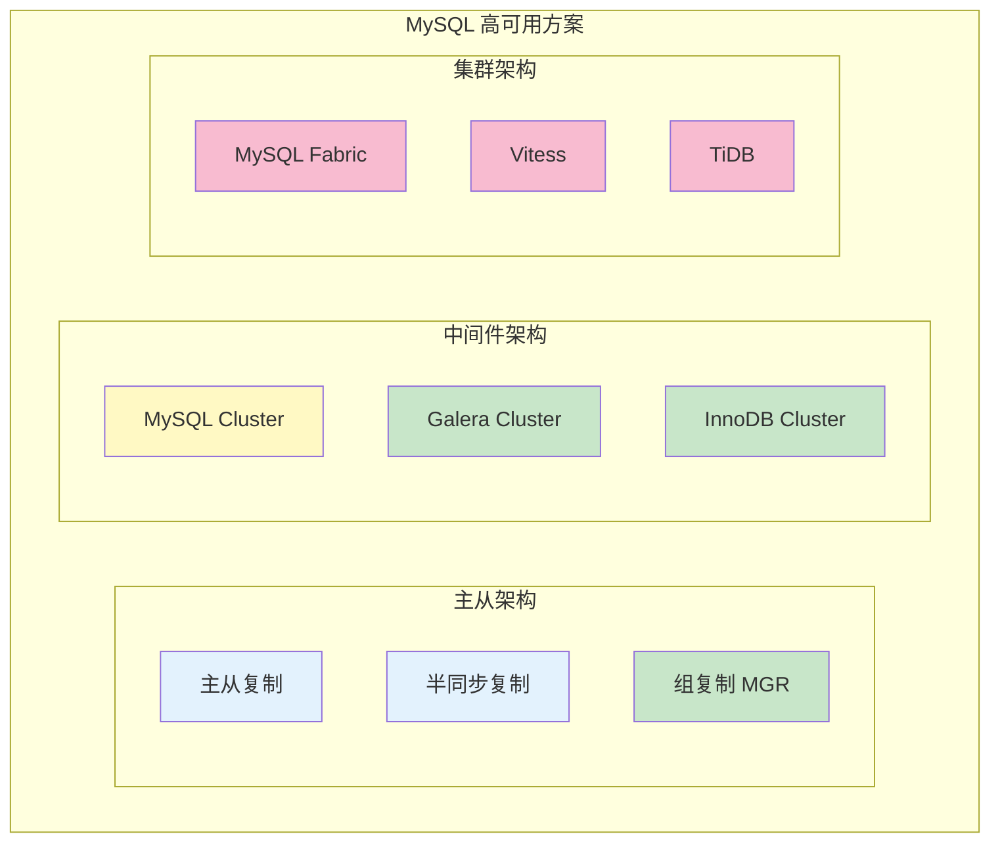
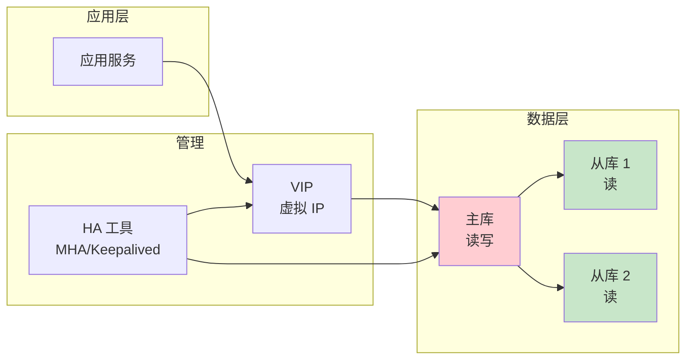
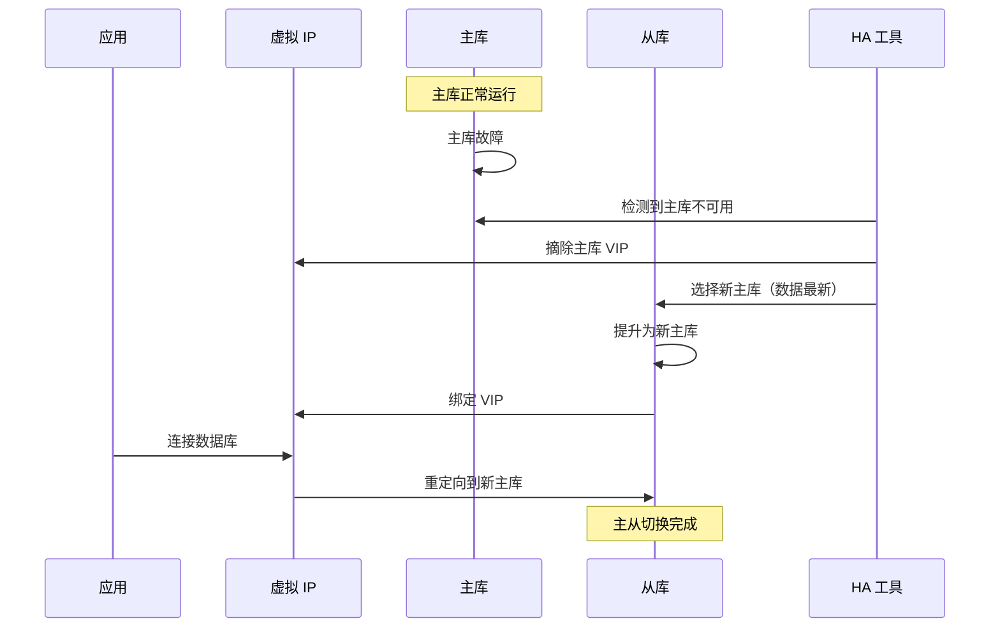
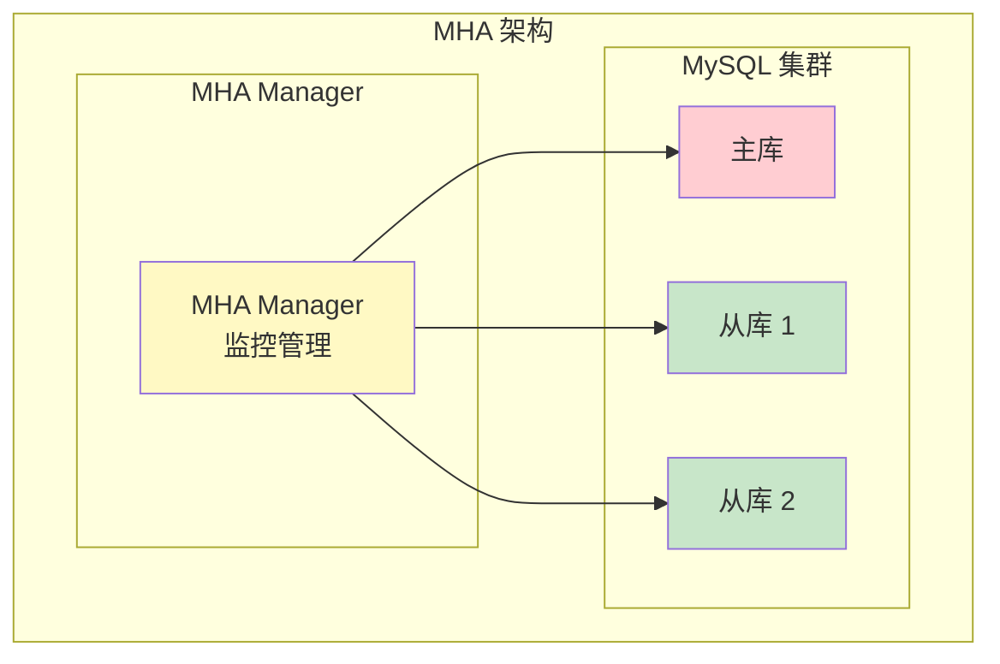
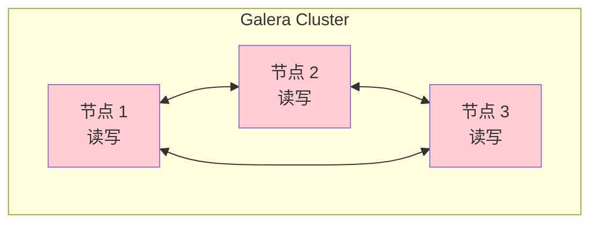

# MySQL 高可用方案

> **目标级别**：P6/P7
> **面试频率**：🟡 中频
> **面试官最关心的 3 个问题**：
> 1. MySQL 有哪些高可用方案？
> 2. 主从切换怎么实现？
> 3. 如何保证数据一致性？

面试官问：「MySQL 怎么保证高可用？」你说「做主从复制」——然后面试官紧接着追问「主库挂了怎么办？如何自动切换到从库？数据会不会丢？」你沉默了。

这就是 MySQL 高可用面试的真实面貌：表面上问的是架构，实际上考的是对分布式系统和数据一致性的理解深度。

## 一、高可用方案概览

### 1.1 常见方案对比



### 1.2 方案对比表

| 方案 | 一致性 | 可用性 | 复杂度 | 适用场景 |
|------|--------|--------|--------|----------|
| **主从复制** | 弱 | 中 | 低 | 一般业务 |
| **半同步复制** | 强 | 中 | 中 | 数据敏感 |
| **MGR 组复制** | 强 | 高 | 高 | 金融 |
| **Galera Cluster** | 强 | 高 | 高 | 金融 |
| **InnoDB Cluster** | 强 | 高 | 高 | 金融 |

## 二、主从复制架构

### 2.1 基础主从架构



### 2.2 主从切换流程



## 三、MHA 方案

### 3.1 MHA 架构

**MHA（MySQL Master High Availability）**：自动化主从故障切换工具。



### 3.2 MHA 特点

| 特点 | 说明 |
|------|------|
| **自动切换** | 主库故障时自动切换 |
| **零数据丢失** | 使用半同步复制保证数据 |
| **快速切换** | 通常 10-30 秒完成 |
| **远程切换** | 支持跨机房切换 |

## 四、InnoDB Cluster

### 4.1 InnoDB Cluster 架构

**InnoDB Cluster**：MySQL 官方高可用解决方案。

```mermaid
graph TB
    subgraph "InnoDB Cluster"
        subgraph "MySQL Shell"
            Shell["MySQL Shell<br/>管理工具"]
        end

        subgraph "Metadata"
            Meta["Metadata<br/>元数据"]
        end

        subgraph "MySQL Servers"
            S1["MySQL Server 1<br/>Primary"]
            S2["MySQL Server 2<br/>Secondary"]
            S3["MySQL Server 3<br/>Secondary"]
        end

        subgraph "Router"
            Router["MySQL Router<br/>路由"]
        end

        subgraph "应用"
            App["应用"]
        end

        Shell --> Meta
        Meta --> S1 & S2 & S3
        Router --> S1 & S2 & S3
        App --> Router
    end

    style S1 fill:#ffcdd2
    style S2 fill:#c8e6c9
    style S3 fill:#c8e6c9
    style Shell fill:#fff9c4
    style Router fill:#fff9c4
```

### 4.2 InnoDB Cluster 配置

```sql
-- 1. 创建集群
dba.createCluster('myCluster')

-- 2. 添加实例
cluster.addInstance('root@mysql-2:3306')
cluster.addInstance('root@mysql-3:3306')

-- 3. 查看集群状态
cluster.status()

-- 4. 配置 Router
mysqlrouter --bootstrap root@localhost:3306
```

### 4.3 InnoDB Cluster 优势

| 优势 | 说明 |
|------|------|
| **官方支持** | MySQL 官方出品 |
| **自动切换** | 主库故障自动切换 |
| **读写分离** | MySQL Router 自动路由 |
| **组复制** | 基于 MGR 组复制 |

## 五、Galera Cluster

### 5.1 Galera 架构

**Galera Cluster**：基于同步复制的多主集群。



### 5.2 Galera 特点

| 特点 | 说明 |
|------|------|
| **多主架构** | 所有节点都可读写 |
| **同步复制** | 数据强一致性 |
| **无数据丢失** | 不存在数据丢失问题 |
| **自动选主** | 自动选择主节点 |

## 六、故障切换方案

### 6.1 VIP 切换

```bash
# 使用 Keepalived 实现 VIP 切换

# keepalived.conf
vrrp_instance VI_1 {
    state MASTER
    interface eth0
    virtual_router_id 51
    priority 100
    advert_int 1

    virtual_ipaddress {
        192.168.1.100  # VIP
    }

    track_script {
        chk_mysql
    }
}

# chk_mysql 脚本
#!/bin/bash
mysqladmin -uroot -ppassword ping
if [ $? -ne 0 ]; then
    systemctl stop keepalived
fi
```

### 6.2 中间件切换

```yaml
# ProxySQL 配置故障切换

# 添加 MySQL 实例
INSERT INTO mysql_servers (hostgroup_id, hostname, port) VALUES (1, 'master', 3306);
INSERT INTO mysql_servers (hostgroup_id, hostname, port) VALUES (2, 'slave1', 3306);

# 健康检查
INSERT INTO mysql_server_read_only_transactions (hostname, port, mode) VALUES ('slave1', 3306, 1);

# 配置故障转移规则
INSERT INTO mysql_query_rules (rule_id, match_pattern, destination_hostgroup, apply)
VALUES (1, '^SELECT.*', 2, 1);  -- 读操作路由到从库
```

## 七、数据一致性保证

### 7.1 半同步复制

```sql
-- 安装半同步插件
INSTALL PLUGIN rpl_semi_sync_master SONAME 'semisync_master.so';
INSTALL PLUGIN rpl_semi_sync_slave SONAME 'semisync_slave.so';

-- 启用半同步
SET GLOBAL rpl_semi_sync_master_enabled = 1;
SET GLOBAL rpl_semi_sync_slave_enabled = 1;

-- 配置超时时间
SET GLOBAL rpl_semi_sync_master_timeout = 10000;  -- 10 秒
```

### 7.2 GTID 复制

```sql
-- GTID 配置
gtid_mode = ON
enforce_gtid_consistency = ON

-- GTID 自动定位
CHANGE MASTER TO
    MASTER_HOST = 'master',
    MASTER_PORT = 3306,
    MASTER_USER = 'repl',
    MASTER_PASSWORD = 'password',
    MASTER_AUTO_POSITION = 1;
```

## 八、面试追问链设计

> **第一层**：MySQL 有哪些高可用方案？
> **第二层**：MHA 和 InnoDB Cluster 有什么区别？
> **第三层**：Galera Cluster 有什么特点？

> **第一层**：主库故障时怎么切换？
> **第二层**：如何保证切换过程数据不丢失？
> **第三层**：VIP 切换和 ProxySQL 切换有什么区别？

> **第一层**：如何保证数据一致性？
> **第二层**：半同步复制是怎么工作的？
> **第三层**：GTID 复制有什么优势？

## 九、常见面试陷阱

**⚠️ 陷阱 1**：认为主从复制是同步的
- 主从复制是异步的，存在延迟
- 需要使用半同步复制才能保证数据安全

**⚠️ 陷阱 2**：忽略主从延迟的影响
- 主从切换时可能丢失数据
- 需要先追平延迟再切换

**⚠️ 陷阱 3**：过度依赖自动切换
- 自动切换可能失败
- 需要完善的监控和人工干预机制

## 十、对比总结表

| 方案 | 数据一致性 | 切换时间 | 复杂度 | 适用场景 |
|------|-----------|----------|--------|----------|
| **MHA** | 半同步保证 | 10-30s | 中 | 一般业务 |
| **Keepalived** | 异步 | 秒级 | 低 | 一般业务 |
| **InnoDB Cluster** | 强一致 | 秒级 | 高 | 金融 |
| **Galera** | 强一致 | 秒级 | 高 | 金融 |

## 十一、加分回答

> **💡 面试加分点**：如果能说出高可用架构的设计经验和最佳实践，会给面试官留下深刻印象：
>
> 1. **多机房部署**：主从跨机房部署，保证机房级容灾
>
> 2. **延迟监控**：实时监控主从延迟，设置告警阈值
>
> 3. **切换演练**：定期进行故障切换演练，确保可用性
>
> 4. **读写分离 + HA**：读写分离和 HA 方案配合使用
