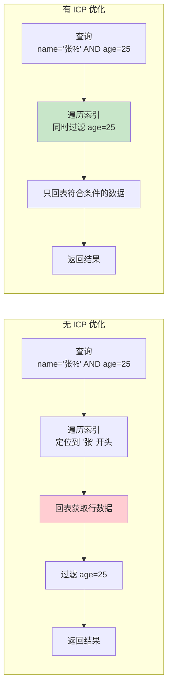

# 索引下推（Index Condition Pushdown）

> **目标级别**：P5/P6
> **面试频率**：🟡 中频
> **面试官最关心的 3 个问题**：
> 1. 什么是索引下推（ICP）？
> 2. 索引下推和覆盖索引有什么区别？
> 3. MySQL 5.6 之前的版本是怎么处理 WHERE 条件的？

面试官问：「MySQL 5.6 有什么新特性？」你说「支持索引下推」——然后面试官紧接着追问「索引下推是什么原理？它是怎么减少回表的？」你沉默了。

这就是 MySQL 索引下推面试的真实面貌：表面上问的是新特性，实际上考的是对查询优化器执行流程的理解深度。

## 一、索引下推概念

### 1.1 什么是索引下推

**索引下推（Index Condition Pushdown，ICP）**：MySQL 5.6+ 引入的优化技术，将 WHERE 条件的过滤下推到存储引擎层，在索引遍历过程中就完成过滤，减少回表次数。



### 1.2 ICP 的作用

| 对比项 | 无 ICP | 有 ICP |
|--------|--------|--------|
| **WHERE 过滤时机** | 回表后 | 索引遍历时 |
| **回表次数** | 多 | 少 |
| **存储引擎层** | 只负责读取 | 负责读取 + 过滤 |
| **网络传输** | 传输全部数据 | 只传输符合条件的数据 |

## 二、ICP 工作原理

### 2.1 无 ICP 的执行流程

```mermaid
sequenceDiagram
    participant SQL as SQL 语句
    participant Opt as MySQL 优化器
    participant Eng as InnoDB 存储引擎
    participant Idx as 二级索引
    participant Client as 返回结果

    SQL->>Opt: 解析 SQL
    Opt->>Opt: 生成执行计划
    Opt->>Eng: 执行计划

    Eng->>Idx: 1. 定位 name='张%' 的起始位置
    Idx->>Eng: 返回索引记录

    loop 遍历所有 '张%' 的索引记录
        Eng->>Eng: 2. 回表获取完整数据
        Eng->>Eng: 3. 过滤 age=25
        alt age=25
            Eng->>Client: 4. 返回符合条件的行
        end
    end

    Note over Eng: 每次回表都要判断 age=25<br/>大量无效回表
```

### 2.2 有 ICP 的执行流程

```mermaid
sequenceDiagram
    participant SQL as SQL 语句
    participant Opt as MySQL 优化器
    participant Eng as InnoDB 存储引擎
    participant Idx as 二级索引
    participant Client as 返回结果

    SQL->>Opt: 解析 SQL
    Opt->>Opt: 生成执行计划（包含 ICP）
    Opt->>Eng: 执行计划

    Eng->>Idx: 1. 定位 name='张%' 的起始位置

    loop 遍历索引记录
        Idx->>Eng: 2. 返回索引记录 (name, age)
        Eng->>Eng: 3. 索引层直接过滤 age=25
        alt age=25
            Eng->>Eng: 4. 回表获取其他字段
            Eng->>Client: 5. 返回符合条件的行
        end
    end

    Note over Eng: 索引层先过滤 age=25<br/>只回表符合条件的记录
```

### 2.3 性能对比

```sql
-- 假设：
-- 表数据：10000 行
-- name='张%'：500 行
-- age=25 且 name='张%'：10 行

-- 无 ICP：
-- 回表次数 = 500 次
-- 过滤次数 = 500 次

-- 有 ICP：
-- 回表次数 = 10 次
-- 过滤次数 = 500 次（索引层）
```

## 三、ICP 适用场景

### 3.1 适用条件

| 条件 | 说明 |
|------|------|
| **索引字段** | WHERE 条件涉及的字段必须是索引字段 |
| **复合索引** | 条件字段必须在复合索引的前缀范围内 |
| **存储引擎** | 仅适用于 InnoDB 和 MyISAM |
| **查询类型** | `SELECT`、`UPDATE`、`DELETE` |

### 3.2 适用场景

```sql
-- 联合索引：(name, age, city)

-- ✅ 适用 ICP
SELECT * FROM user WHERE name = '张%' AND age = 25;
-- name 在索引中，可以定位范围
-- age 在索引中，可以在遍历时过滤

-- ✅ 适用 ICP
SELECT * FROM user WHERE name LIKE '张%' AND city = '北京';
-- name 在索引中
-- city 不在索引中（不在前缀范围内），不能 ICP

-- ❌ 不适用 ICP
SELECT * FROM user WHERE age = 25;
-- age 不在联合索引前缀位置

-- ❌ 不适用 ICP
SELECT * FROM user WHERE name = '张%' AND phone = '138';
-- phone 不是索引字段
```

### 3.3 EXPLAIN 中的 ICP

```sql
-- 查看 ICP 是否生效
EXPLAIN SELECT * FROM user WHERE name = '张%' AND age = 25;

-- 关键字段：
-- type: range（范围扫描）
-- key: idx_name_age（使用索引）
-- Extra: Using index condition（使用了 ICP）

-- 无 ICP 时：
-- Extra: Using where（回表后在 server 层过滤）
```

## 四、ICP 与覆盖索引对比

### 4.1 概念对比

| 对比维度 | 索引下推（ICP） | 覆盖索引 |
|----------|----------------|----------|
| **原理** | 在索引层过滤 WHERE 条件 | 所有字段都在索引中 |
| **回表** | 减少回表次数 | 完全避免回表 |
| **适用条件** | WHERE 条件涉及索引字段 | SELECT 字段都在索引中 |
| **优化效果** | 减少无效回表 | 消除回表 |

### 4.2 性能对比

```sql
-- 联合索引：(name, age, city)

-- 场景 1：查询所有字段
SELECT * FROM user WHERE name = '张%' AND age = 25;

-- 无优化：500 次回表
-- ICP：10 次回表
-- 覆盖索引：不可用（* 不在索引中）

-- 场景 2：只查询索引字段
SELECT name, age FROM user WHERE name = '张%' AND age = 25;

-- 覆盖索引：0 次回表
-- ICP：无意义（已经覆盖）
```

### 4.3 组合优化

```sql
-- 联合索引：(name, age, city)

-- 最优查询
SELECT name, age, city FROM user WHERE name = '张%' AND age = 25;
-- ✅ 覆盖索引：无需回表
-- ✅ ICP：加速定位

-- 较好的查询
SELECT * FROM user WHERE name = '张%' AND age = 25;
-- ✅ ICP：减少回表次数
-- ❌ 无法覆盖索引

-- 一般的查询
SELECT city FROM user WHERE name = '张%' AND age = 25;
-- city 不在索引中，无法覆盖
-- ❌ 无法覆盖索引
-- ✅ ICP：仍然有效
```

## 五、面试追问链设计

> **第一层**：什么是索引下推（ICP）？
> **第二层**：ICP 和覆盖索引有什么区别？
> **第三层**：ICP 是怎么减少回表次数的？

> **第一层**：MySQL 5.6 之前是怎么处理 WHERE 条件的？
> **第二层**：为什么说 ICP 是「下推」到存储引擎层？
> **第三层**：ICP 的过滤是在哪里发生的？

> **第一层**：哪些情况不适合使用 ICP？
> **第二层**：ICP 对所有查询都有效吗？
> **第三层**：如何判断查询是否使用了 ICP？

## 六、常见面试陷阱

**⚠️ 陷阱 1**：混淆 ICP 和覆盖索引
- ICP 减少回表次数，但仍然需要回表
- 覆盖索引完全避免回表

**⚠️ 陷阱 2**：认为 ICP 适用于所有 WHERE 条件
- WHERE 条件必须是索引字段才能 ICP
- 非索引字段无法下推

**⚠️ 陷阱 3**：忽略最左前缀原则
- 联合索引 `(name, age)`，WHERE `age = 25` 无法 ICP
- 跳过最左前缀导致无法定位索引范围

## 七、对比总结表

| 优化技术 | 原理 | 回表次数 | 适用条件 |
|----------|------|----------|----------|
| 无优化 | 回表后过滤 | 多 | 任何查询 |
| ICP | 索引层过滤 WHERE | 减少 | WHERE 涉及索引字段 |
| 覆盖索引 | 索引包含所有字段 | 0 | SELECT 字段都在索引 |
| MRR | 顺序回表 | 不变（IO 优化） | 范围查询 |

## 八、加分回答

> **💡 面试加分点**：如果能说出 ICP 的实现细节和与其他优化的配合，会给面试官留下深刻印象：
>
> 1. **ICP 的实现层级**：ICP 是通过 `Handler` 接口下推给存储引擎的
>
> 2. **ICP 与 MRR 配合**：ICP 过滤后的数据，再使用 MRR 进行顺序回表
>
> 3. **ICP 的局限性**：
>    - 全文索引不支持 ICP
>    - 虚拟列不支持 ICP
>
> 4. **MySQL 8.0 的增强**：MRR 默认开启，ICP 默认开启
