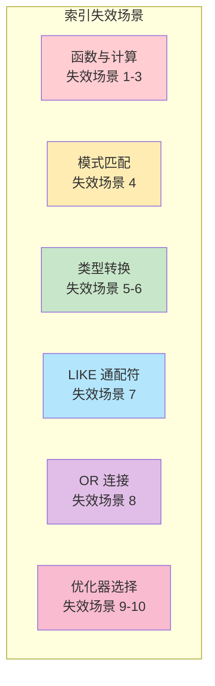

# 索引失效场景

> **目标级别**：P5/P6
> **面试频率**：🔴 高频
> **面试官最关心的 3 个问题**：
> 1. 哪些情况会导致索引失效？
> 2. 为什么 `!=` 和 `<>` 会导致索引失效？
> 3. 如何避免索引失效？

面试官问：「为什么加了索引查询还是很慢？」你说「可能是索引失效了」——然后面试官紧接着追问「那哪些情况会导致索引失效？你能列举 5 个吗？」你沉默了。

这就是 MySQL 索引失效面试的真实面貌：表面上问的是规则，实际上考的是对索引原理和查询优化器的理解深度。

## 一、索引失效场景一览



## 二、十大索引失效场景详解

### 2.1 场景一：索引列使用函数

```sql
-- 联合索引：(created_at, status)

-- ❌ 使用函数：索引失效
SELECT * FROM orders 
WHERE YEAR(created_at) = 2024;
-- 原因：created_at 被函数包裹，无法直接比较

-- ✅ 改写为范围查询：索引生效
SELECT * FROM orders 
WHERE created_at >= '2024-01-01' AND created_at < '2025-01-01';
```

### 2.2 场景二：索引列进行计算

```sql
-- 索引：(price)

-- ❌ 计算：索引失效
SELECT * FROM products WHERE price * 0.8 `>` 100;
-- 原因：price * 0.8 是计算表达式

-- ✅ 改写为反向计算：索引生效
SELECT * FROM products WHERE price `>` 100 / 0.8;
```

### 2.3 场景三：索引列使用表达式

```sql
-- 索引：(name)

-- ❌ 前缀操作：索引失效
SELECT * FROM user WHERE SUBSTRING(name, 1, 1) = '张';

-- ❌ 后缀匹配：索引失效
SELECT * FROM user WHERE REVERSE(name) = '三张';
-- 如果要支持后缀搜索，考虑使用倒排索引

-- ⚠️ 可以考虑模拟后缀索引
ALTER TABLE user ADD COLUMN name_reversed VARCHAR(50);
UPDATE user SET name_reversed = REVERSE(name);
CREATE INDEX idx_name_reversed ON user(name_reversed);
-- 查询时使用 name_reversed 字段
SELECT * FROM user WHERE name_reversed = REVERSE('张三');
```

### 2.4 场景四：LIKE 以通配符开头

```sql
-- 索引：(name)

-- ❌ 前缀通配符：索引失效
SELECT * FROM user WHERE name LIKE '%三%';
SELECT * FROM user WHERE name LIKE '%三';

-- ✅ 前缀匹配：索引生效
SELECT * FROM user WHERE name LIKE '张三%';
```

### 2.5 场景五：隐式类型转换

```sql
-- 索引：(phone)，phone 是 VARCHAR 类型

-- ❌ 字符串列使用数字查询：索引失效
SELECT * FROM user WHERE phone = 13800138000;
-- MySQL 会将 phone 转换为数字，无法利用索引

-- ✅ 类型匹配：索引生效
SELECT * FROM user WHERE phone = '13800138000';
```

### 2.6 场景六：字符集不匹配

```sql
-- 表字符集：utf8mb4
-- 索引：(name)

-- ❌ 字符集不匹配：索引可能失效
SET NAMES gbk;
SELECT * FROM user WHERE name = '张三';
-- 不同字符集比较可能导致索引失效

-- ✅ 保持字符集一致
SET NAMES utf8mb4;
SELECT * FROM user WHERE name = '张三';
```

### 2.7 场景七：OR 连接条件

```sql
-- 索引：(name) 和 (phone)

-- ❌ OR 一方无索引：索引失效
SELECT * FROM user WHERE name = '张三' OR phone = '13800138000';
-- 如果 name 或 phone 有一个没有索引，会导致全表扫描

-- ✅ 改为 UNION
SELECT * FROM user WHERE name = '张三'
UNION
SELECT * FROM user WHERE phone = '13800138000';

-- ✅ 或者确保两列都有索引
ALTER TABLE user ADD INDEX idx_name (name);
ALTER TABLE user ADD INDEX idx_phone (phone);
SELECT * FROM user WHERE name = '张三' OR phone = '13800138000';
```

### 2.8 场景八：不等式使用不当

```sql
-- 索引：(status)

-- ⚠️ != 和 <>：索引可能失效
SELECT * FROM orders WHERE status != 1;
SELECT * FROM orders WHERE status `<>` 1;
-- 原因：优化器可能认为全表扫描更快

-- 如果确实需要 !=，考虑使用组合索引
CREATE INDEX idx_status_created ON orders(status, created_at);
SELECT * FROM orders WHERE status != 1 AND created_at > '2024-01-01';
```

### 2.9 场景九：优化器选择全表扫描

```sql
-- 索引：(status)，status 只有 0/1 两种值

-- ⚠️ 区分度低导致索引失效
SELECT * FROM orders WHERE status = 0;
-- 如果 status=0 的数据占 99%，优化器可能选择全表扫描

-- ✅ 使用强制索引
SELECT * FROM orders FORCE INDEX(idx_status) WHERE status = 0;

-- ✅ 或者重建索引提高区分度
ANALYZE TABLE orders;
```

### 2.10 场景十：IS NULL / IS NOT NULL

```sql
-- 索引：(status)

-- ⚠️ IS NULL：索引可能失效
SELECT * FROM orders WHERE status IS NULL;
-- 原因：NULL 值的处理方式比较特殊

-- ✅ 改写为显式比较
SELECT * FROM orders WHERE status = 0 OR status IS NULL;
-- 或者使用默认值避免 NULL
ALTER TABLE orders MODIFY status TINYINT NOT NULL DEFAULT 0;
```

## 三、使用 EXPLAIN 排查索引失效

### 3.1 EXPLAIN 输出解读

```sql
EXPLAIN SELECT * FROM user WHERE name LIKE '%三%';
```

| 字段 | 值 | 说明 |
|------|-----|------|
| type | ALL | 全表扫描 |
| key | NULL | 未使用索引 |
| rows | 100000 | 扫描了 10 万行 |
| Extra | Using filesort | 需要额外排序 |

### 3.2 关键字段含义

| type 值 | 说明 |
|--------|------|
| ALL | 全表扫描（最差） |
| index | 全索引扫描 |
| range | 范围扫描 |
| ref | 非唯一索引等值查询 |
| eq_ref | 唯一索引等值查询 |
| const | 主键或唯一索引等值查询（最优） |

### 3.3 Extra 字段常见值

| Extra 值 | 说明 |
|----------|------|
| Using filesort | 需要额外排序（性能差） |
| Using temporary | 使用临时表（性能差） |
| Using index | 覆盖索引，无需回表 |
| Using index condition | 索引条件下推 |
| Using where | 需要在存储引擎过滤行 |

## 四、面试追问链设计

> **第一层**：哪些情况会导致索引失效？
> **第二层**：为什么 `WHERE name = 123` 会导致索引失效？
> **第三层**：MySQL 是怎么把 `123`（数字）和 `'123'`（字符串）进行比较的？

> **第一层**：为什么 `LIKE '%三'` 会导致索引失效？
> **第二层**：如果要实现后缀搜索，应该怎么设计？
> **第三层**：有办法让 `%三%` 使用索引吗？

> **第一层**：OR 条件为什么会导致索引失效？
> **第二层**：如果要用 OR 查询，应该怎么优化？
> **第三层**：UNION 和 OR 有什么区别？

## 五、对比总结表

| 场景 | 索引失效 | 优化方案 |
|------|----------|----------|
| **函数计算** | `YEAR(created_at) = 2024` | 改为 `created_at `>=` '2024-01-01'` |
| **隐式类型转换** | `phone = 12345678901`（字符串列用数字） | 改为 `phone = '12345678901'` |
| **LIKE 前缀通配符** | `name LIKE '%三'` | 考虑全文索引或 ES |
| **OR 条件** | `name = '张三' OR phone = '...'` | 改为 UNION |
| **不等于** | `status != 1` | 结合其他条件或强制索引 |
| **IS NULL** | `status IS NULL` | 改写为显式比较或使用默认值 |
| **优化器选择** | 区分度低的列 | FORCE INDEX 或分析表 |

## 六、生产环境检查清单

### 6.1 上线前检查

```sql
-- 1. 检查 SQL 是否使用索引
EXPLAIN SELECT * FROM orders WHERE order_no = 'ORD20240101';

-- 2. 检查索引是否存在
SHOW INDEX FROM orders;

-- 3. 检查表统计信息是否准确
ANALYZE TABLE orders;

-- 4. 检查慢查询日志
SHOW VARIABLES LIKE 'slow_query_log';
SHOW VARIABLES LIKE 'long_query_time';
```

### 6.2 常见优化模式

```sql
-- 问题 SQL
SELECT * FROM user 
WHERE YEAR(birthday) = 1990 AND status = 1;

-- 优化方案 1：改写 SQL
SELECT * FROM user 
WHERE birthday `>=` '1990-01-01' 
  AND birthday `<` '1991-01-01' 
  AND status = 1;

-- 优化方案 2：添加虚拟列（MySQL 5.7+）
ALTER TABLE user ADD COLUMN birth_year INT
GENERATED ALWAYS AS (YEAR(birthday));
CREATE INDEX idx_birth_year ON user(birth_year);

-- 优化后 SQL
SELECT * FROM user 
WHERE birth_year = 1990 AND status = 1;
```

## 七、加分回答

> **💡 面试加分点**：如果能说出索引失效的深层原因和优化器决策机制，会给面试官留下深刻印象：
>
> 1. **优化器成本模型**：MySQL 优化器会根据统计信息估算成本，选择最小成本的执行计划
>
> 2. **直方图统计**：MySQL 8.0 支持直方图统计，更准确地估算成本
>
> 3. ** FORCE INDEX 强制索引**：在优化器选择错误时可以使用
>
> 4. **SQL Hint**：使用 `IGNORE INDEX`、`USE INDEX`、`FORCE INDEX` 引导优化器
