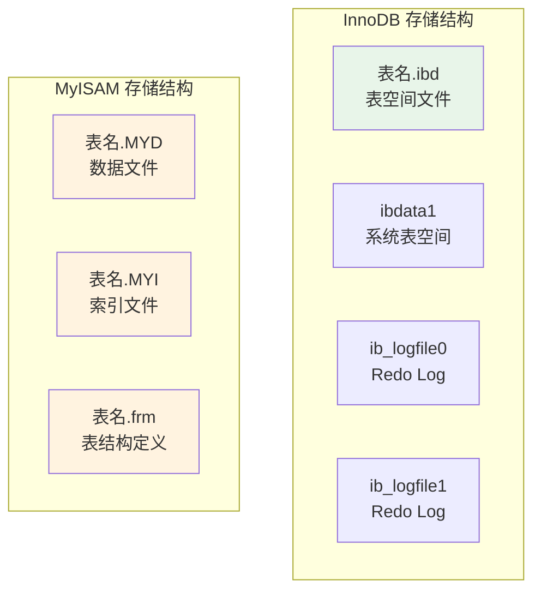
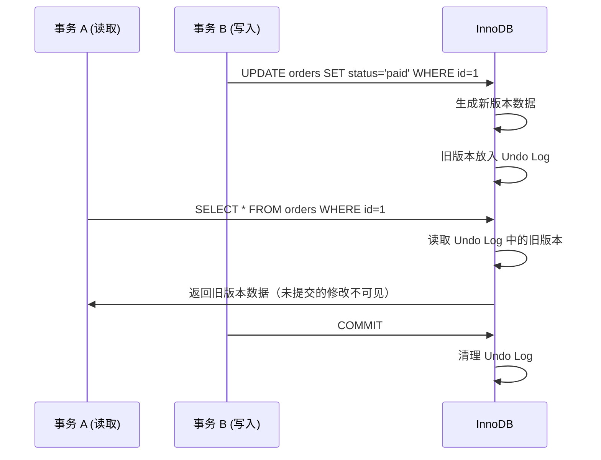
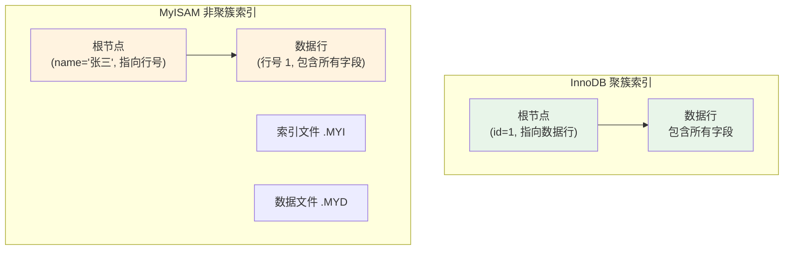
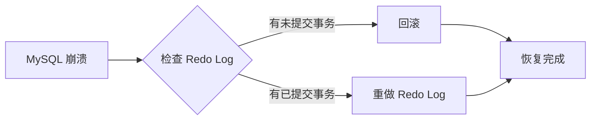

# InnoDB 与 MyISAM 对比

> **目标级别**：P5/P6
> **面试频率**：🔴 高频
> **面试官最关心的 3 个问题**：
> 1. InnoDB 和 MyISAM 有什么区别？
> 2. 为什么 InnoDB 成为 MySQL 的默认存储引擎？
> 3. 什么场景下适合用 MyISAM？

面试官问：「你们项目用的什么存储引擎？」你说「InnoDB」——然后面试官紧接着追问「那 MyISAM 和 InnoDB 有什么区别？为什么你们选 InnoDB？」你沉默了。

这就是 MySQL 存储引擎面试的真实面貌：表面上问的是选型，实际上考的是对存储引擎原理的理解深度。

## 一、核心特性对比

### 1.1 基本特性对比表

| 对比维度 | InnoDB | MyISAM |
|----------|--------|--------|
| **事务支持** | 支持 ACID 事务 | 不支持事务 |
| **行级锁** | 支持行锁 | 只支持表锁 |
| **外键约束** | 支持外键 | 不支持外键 |
| **MVCC** | 支持 MVCC | 不支持 MVCC |
| **崩溃恢复** | 自动恢复 | 需手动修复 |
| **全文索引** | 5.6+ 支持 | 原生支持 |
| **索引缓存** | 共享索引缓存 | 独立索引缓存 |
| **存储限制** | 64TB | 256TB（MyISAM） |

### 1.2 表结构对比

```sql
-- InnoDB 表结构
CREATE TABLE innodb_table (
    id INT PRIMARY KEY,
    name VARCHAR(50),
    age INT,
    INDEX idx_name (name),
    INDEX idx_age (age)
) ENGINE=InnoDB;

-- MyISAM 表结构
CREATE TABLE myisam_table (
    id INT PRIMARY KEY,
    name VARCHAR(50),
    age INT,
    INDEX idx_name (name),
    INDEX idx_age (age)
) ENGINE=MyISAM;
```

### 1.3 物理存储对比



## 二、InnoDB 核心优势

### 2.1 事务支持

```sql
-- InnoDB 支持事务
START TRANSACTION;

UPDATE account SET balance = balance - 100 WHERE id = 1;
UPDATE account SET balance = balance + 100 WHERE id = 2;

-- 如果第二条语句失败，第一条也会回滚
COMMIT;
```

**💡 事务的 ACID 特性在 InnoDB 中的实现**：

| 特性 | 实现机制 |
|------|----------|
| **原子性** | Undo Log |
| **一致性** | Redo Log + Undo Log |
| **隔离性** | 锁机制 + MVCC |
| **持久性** | Redo Log |

### 2.2 行级锁与并发

InnoDB 采用行级锁，只锁定需要修改的行：

```sql
-- 事务 A：更新 id=1 的行
BEGIN;
UPDATE orders SET status = 'paid' WHERE id = 1;  -- 只锁定 id=1 这行

-- 事务 B：可以同时更新 id=2 的行（不受影响）
UPDATE orders SET status = 'shipped' WHERE id = 2;

COMMIT;
```

**⚠️ 常见面试坑**：
- InnoDB 的行锁是「在索引上加锁」，如果 SQL 没有命中索引，会变成表锁
- 范围查询会锁定区间内的所有行（包括不存在的行）

```sql
-- 如果 name 字段没有索引
UPDATE orders SET status = 'paid' WHERE name = '张三';

-- 这会锁定整张表！
-- ⚠️ 因为 name 没有索引，InnoDB 会全表扫描并加锁
```

### 2.3 MVCC 与一致性读



## 三、MyISAM 适用场景

### 3.1 MyISAM 的特点

| 特点 | 说明 |
|------|------|
| **表级锁** | 所有操作加表锁，并发写入差 |
| **只支持表锁** | 无行锁概念 |
| **不支持事务** | 数据修改立即生效，无法回滚 |
| **索引非聚集** | 索引与数据分开存储 |
| **表损坏风险** | 崩溃后可能丢失数据 |

### 3.2 适用场景

```sql
-- 场景 1：只读报表系统
-- 数据量大、几乎不修改、只需要查询
CREATE TABLE report_data (
    id BIGINT AUTO_INCREMENT PRIMARY KEY,
    report_date DATE,
    metric_name VARCHAR(100),
    metric_value DECIMAL(15,2),
    INDEX idx_date (report_date)
) ENGINE=MyISAM;

-- 场景 2：全文搜索
-- MyISAM 对 FULLTEXT 索引支持更成熟
CREATE TABLE articles (
    id INT AUTO_INCREMENT PRIMARY KEY,
    title VARCHAR(200),
    content TEXT,
    FULLTEXT KEY ft_title_content (title, content)
) ENGINE=MyISAM;
```

### 3.3 MyISAM 修复命令

```bash
# 检查表是否损坏
myisamchk -c /var/lib/mysql/db/articles.MYI

# 修复损坏的表
myisamchk -r /var/lib/mysql/db/articles.MYI

# 检查并尝试修复
myisamchk -e /var/lib/mysql/db/articles.MYI
```

## 四、数据结构对比

### 4.1 索引结构差异



### 4.2 主键查询效率对比

| 场景 | InnoDB | MyISAM |
|------|--------|--------|
| 主键查询 | 1 次 IO（直接定位数据） | 2 次 IO（索引→数据） |
| 范围查询 | 顺序 IO，性能好 | 随机 IO，性能差 |
| 插入速度 | 可能触发页分裂 | 顺序写入，速度快 |

## 五、崩溃恢复对比

### 5.1 InnoDB 崩溃恢复机制



```sql
-- InnoDB 自动恢复
-- 查看恢复状态
SHOW ENGINE INNODB STATUS;

-- 设置崩溃恢复模式
SET GLOBAL innodb_flush_log_at_trx_commit = 1;  -- 最安全
SET GLOBAL innodb_flush_log_at_trx_commit = 2;  -- 性能优先
SET GLOBAL innodb_flush_log_at_trx_commit = 0;  -- 可能丢失 1 秒数据
```

### 5.2 MyISAM 崩溃处理

```bash
# MyISAM 崩溃后需要手动修复
# 1. 停止 MySQL 服务
# 2. 使用 myisamchk 修复
myisamchk -r -o /var/lib/mysql/db/table_name

# 3. 重启 MySQL 服务
# 4. 验证数据完整性
```

## 六、面试追问链设计

> **第一层**：InnoDB 和 MyISAM 有什么区别？
> **第二层**：为什么 InnoDB 支持行锁而 MyISAM 只支持表锁？
> **第三层**：InnoDB 的行锁是如何实现的？

> **第一层**：MyISAM 适合什么场景？
> **第二层**：MyISAM 为什么不适合高并发写入场景？
> **第三层**：如果 MyISAM 崩溃了，数据会丢失吗？怎么恢复？

> **第一层**：InnoDB 的聚簇索引和 MyISAM 的非聚簇索引有什么区别？
> **第二层**：主键查询时，两者的 IO 次数分别是多少？
> **第三层**：为什么 InnoDB 必须有主键？

## 七、常见面试陷阱

**⚠️ 陷阱 1**：认为 MyISAM 比 InnoDB 快
- 在纯读场景下 MyISAM 确实快，但在高并发写入、事务需求场景下 InnoDB 更优
- MyISAM 的「快」是因为不支持事务，代价是数据安全性差

**⚠️ 陷阱 2**：忽略索引与数据的关系
- InnoDB 主键索引直接存储数据行
- MyISAM 所有索引都是「指针」指向数据行，查询多一次 IO

**⚠️ 陷阱 3**：不知道 InnoDB 的表必须要有主键
- 如果没有显式主键，InnoDB 会生成隐藏的 row_id 作为主键
- 这个 row_id 是全局共享的，有上限（2^48）

## 八、生产环境选型建议

| 场景 | 推荐引擎 | 原因 |
|------|----------|------|
| **核心业务系统** | InnoDB | 事务支持、崩溃恢复、行锁 |
| **只读报表** | MyISAM | 查询快、无事务开销 |
| **全文搜索** | InnoDB (5.6+) | 原生支持，减少架构复杂度 |
| **高并发写入** | InnoDB | 行锁 + MVCC |
| **日志系统** | MyISAM 或 Archive | 写入快、占用空间小 |

## 九、加分回答

> **💡 面试加分点**：如果能说出存储引擎的演进历史，会给面试官留下深刻印象：
>
> 1. **MySQL 5.1**：默认 MyISAM，InnoDB 需手动启用
> 2. **MySQL 5.5**：InnoDB 成为默认存储引擎
> 3. **MySQL 5.6**：InnoDB 支持全文索引，减少对 MyISAM 的依赖
> 4. **MySQL 8.0**：InnoDB 支持隐藏索引、直出 JSON，进一步增强
>
> **为什么 InnoDB 能取代 MyISAM？**
> - 互联网业务对数据安全性要求高
> - 高并发场景下表锁成为瓶颈
> - 事务支持是核心业务系统的刚需
