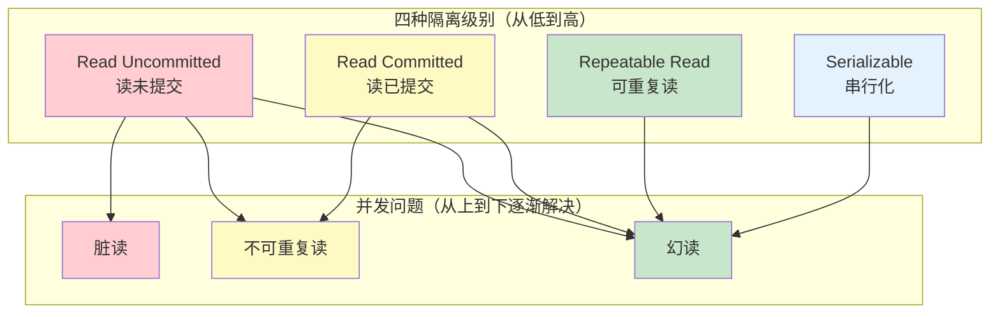
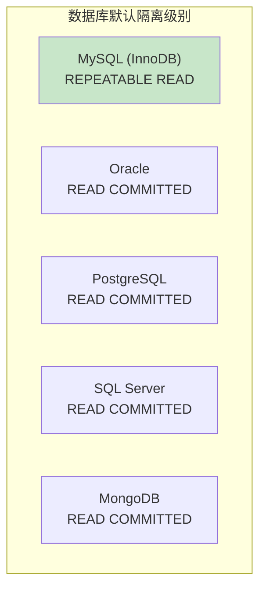

# 事务隔离级别

> **目标级别**：P5/P6
> **面试频率**：🔴 高频
> **面试官最关心的 3 个问题**：
> 1. MySQL 有哪些事务隔离级别？
> 2. 不同隔离级别分别解决什么问题？
> 3. InnoDB 默认使用什么隔离级别？为什么？

面试官问：「MySQL 的事务隔离级别有哪些？」你说「读已提交、可重复读...」——然后面试官紧接着追问「MySQL 默认是哪个级别？为什么 MySQL 默认是可重复读而不是读已提交？」你沉默了。

这就是 MySQL 事务隔离级别面试的真实面貌：表面上问的是概念，实际上考的是对隔离级别实现原理的理解深度。

## 一、四种隔离级别



### 1.1 隔离级别定义

| 隔离级别 | 英文 | 解决脏读 | 解决不可重复读 | 解决幻读 |
|----------|------|----------|----------------|----------|
| **READ UNCOMMITTED** | 读未提交 | ❌ | ❌ | ❌ |
| **READ COMMITTED** | 读已提交 | ✅ | ❌ | ❌ |
| **REPEATABLE READ** | 可重复读 | ✅ | ✅ | ✅* |
| **SERIALIZABLE** | 串行化 | ✅ | ✅ | ✅ |

> *注：InnoDB 的可重复读通过 MVCC + 间隙锁解决了幻读问题

### 1.2 并发问题详解

| 问题 | 定义 | 场景 |
|------|------|------|
| **脏读** | 读取到其他事务未提交的数据 | 事务 A 读取了事务 B 修改但未提交的数据 |
| **不可重复读** | 同一事务中两次读取同一数据结果不同 | 事务 A 读取数据后，事务 B 修改并提交，事务 A 再读取 |
| **幻读** | 同一事务中两次查询返回的记录数不同 | 事务 A 查询数据后，事务 B 新增了符合条件的数据 |

## 二、不同数据库的默认级别



### 2.1 MySQL 为什么默认是可重复读？

| 原因 | 说明 |
|------|------|
| **历史原因** | MySQL 早期只有 InnoDB，InnoDB 默认使用可重复读 |
| **解决幻读** | 通过间隙锁机制解决幻读问题 |
| **主从复制** | 语句级 binlog 需要可重复读保证一致性 |
| **业务需求** | 大多数业务需要同一事务中数据一致 |

### 2.2 为什么 Oracle 默认是读已提交？

| 原因 | 说明 |
|------|------|
| **性能考虑** | 读已提交比可重复读性能更好 |
| **MVCC 实现** | Oracle 的多版本读已提交就足够 |
| **业务场景** | 大多数业务可以接受读已提交 |

## 三、设置隔离级别

### 3.1 查看当前隔离级别

```sql
-- 查看当前会话隔离级别
SELECT @@transaction_isolation;

-- 查看全局隔离级别
SELECT @@global.transaction_isolation;

-- 查看隔离级别（MySQL 5.7）
SHOW VARIABLES LIKE 'transaction_isolation';
```

### 3.2 设置隔离级别

```sql
-- 设置当前会话隔离级别
SET SESSION transaction_isolation = 'READ-COMMITTED';

-- 设置全局隔离级别（需重启生效）
SET GLOBAL transaction_isolation = 'READ-COMMITTED';

-- 临时设置（MySQL 5.7）
SET @@tx_isolation = 'READ-COMMITTED';

-- 配置文件设置（my.cnf）
[mysqld]
transaction-isolation = READ-COMMITTED
```

### 3.3 不同会话隔离级别

```sql
-- 会话 1：设置可重复读
SET SESSION transaction_isolation = 'REPEATABLE-READ';
START TRANSACTION;
SELECT * FROM orders WHERE user_id = 1;  -- 10 条记录

-- 会话 2：设置读已提交
SET SESSION transaction_isolation = 'READ-COMMITTED';
START TRANSACTION;
INSERT INTO orders (user_id, amount) VALUES (1, 100);
COMMIT;

-- 会话 1：再次查询
SELECT * FROM orders WHERE user_id = 1;  -- REPEATABLE-READ 仍为 10 条
COMMIT;

-- 会话 1：重新开启事务
START TRANSACTION;
SELECT * FROM orders WHERE user_id = 1;  -- 现在是 11 条（幻读场景）
COMMIT;
```

## 四、隔离级别与锁

### 4.1 读已提交的锁策略

```sql
-- 读已提交：每次读取都生成新快照
SET SESSION transaction_isolation = 'READ-COMMITTED';

START TRANSACTION;
-- 读取时释放锁
SELECT * FROM orders WHERE user_id = 1;

-- 写入时加锁
INSERT INTO orders (user_id, amount) VALUES (2, 100);
COMMIT;
```

### 4.2 可重复读的锁策略

```sql
-- 可重复读：事务开始时生成快照
SET SESSION transaction_isolation = 'REPEATABLE-READ';

START TRANSACTION;
-- 读取时不释放锁（使用 MVCC）
SELECT * FROM orders WHERE user_id = 1;

-- 范围操作时加间隙锁
SELECT * FROM orders WHERE user_id = 1 AND id > 100 FOR UPDATE;
-- 防止幻读
COMMIT;
```

### 4.3 串行化的锁策略

```sql
-- 串行化：读写都加锁
SET SESSION transaction_isolation = 'SERIALIZABLE';

START TRANSACTION;
-- 读取时加共享锁
SELECT * FROM orders WHERE user_id = 1;  -- S 锁

-- 其他事务无法写入
COMMIT;  -- 释放锁
```

## 五、实战配置建议

### 5.1  OLTP 场景

```sql
-- 高并发业务系统
SET SESSION transaction_isolation = 'READ-COMMITTED';  -- 性能优先

-- 对数据一致性要求高
SET SESSION transaction_isolation = 'REPEATABLE-READ';  -- 一致性优先
```

### 5.2 OLAP 场景

```sql
-- 数据分析
SET SESSION transaction_isolation = 'READ-COMMITTED';

-- 只读报表
SET SESSION transaction_isolation = 'READ-COMMITTED';
SET SESSION TRANSACTION READ ONLY;
```

### 5.3 金融场景

```sql
-- 金融转账
SET SESSION transaction_isolation = 'SERIALIZABLE';
START TRANSACTION;

UPDATE account SET balance = balance - 100 WHERE id = 1;
UPDATE account SET balance = balance + 100 WHERE id = 2;

COMMIT;
```

## 六、面试追问链设计

> **第一层**：MySQL 有哪些事务隔离级别？
> **第二层**：不同隔离级别分别解决什么问题？
> **第三层**：MySQL 默认使用哪个隔离级别？为什么？

> **第一层**：什么是脏读、不可重复读、幻读？
> **第二层**：可重复读是怎么解决幻读问题的？
> **第三层**：InnoDB 的间隙锁和临键锁是什么？

> **第一层**：为什么大多数数据库默认隔离级别是读已提交？
> **第二层**：MySQL 为什么选择可重复读作为默认级别？
> **第三层**：SERIALIZABLE 有什么性能问题？

## 七、常见面试陷阱

**⚠️ 陷阱 1**：认为 MySQL 的可重复读完全解决幻读
- 可重复读 + 间隙锁才能解决幻读
- 快照读不会加锁，可能出现幻读

**⚠️ 陷阱 2**：忽略隔离级别对性能的影响
- 隔离级别越高，性能越差
- 串行化可能导致大量锁等待

**⚠️ 陷阱 3**：不了解不同数据库的默认级别
- MySQL：可重复读
- Oracle：读已提交
- 混淆可能导致配置错误

## 八、对��总结表

| 隔离级别 | 脏读 | 不可重复读 | 幻读 | 性能 | 适用场景 |
|----------|------|------------|------|------|----------|
| READ UNCOMMITTED | ❌ | ❌ | ❌ | 最优 | 调试/日志 |
| READ COMMITTED | ✅ | ❌ | ❌ | 良好 | 大多数场景 |
| REPEATABLE READ | ✅ | ✅ | ✅* | 一般 | MySQL 默认 |
| SERIALIZABLE | ✅ | ✅ | ✅ | 差 | 金融/强一致 |

## 九、加分回答

> **💡 面试加分点**：如果能说出 MySQL 8.0 的新特性和隔离级别的演进，会给面试官留下深刻印象：
>
> 1. **MySQL 8.0 废弃 tx_isolation**：改用 transaction_isolation
>
> 2. **Pessimi stic vs Optimistic**：悲观锁和乐观锁的选择
>
> 3. **MVCC 实现差异**：Oracle 使用回滚段，MySQL 使用 Undo Log
>
> 4. **读写分离场景**：主库使用可重复读，从库使用读已提交
