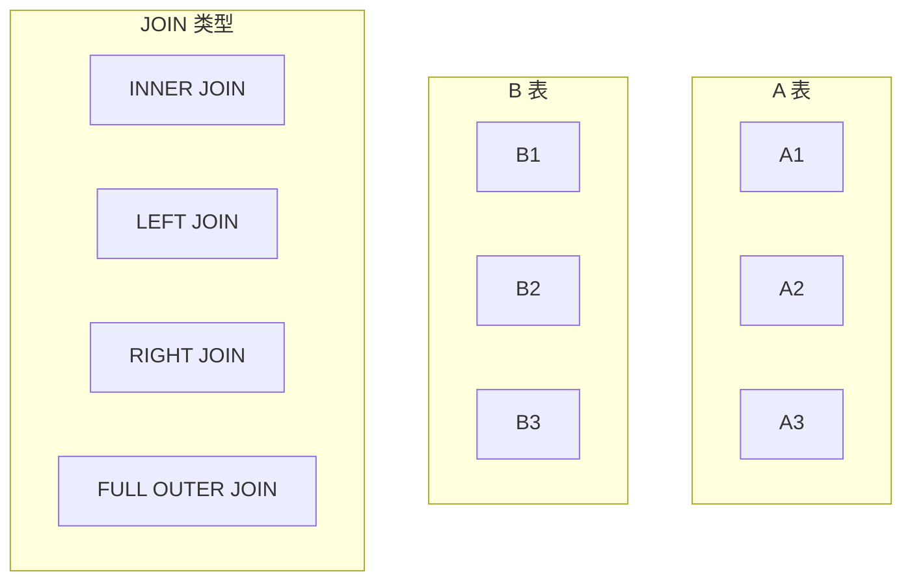
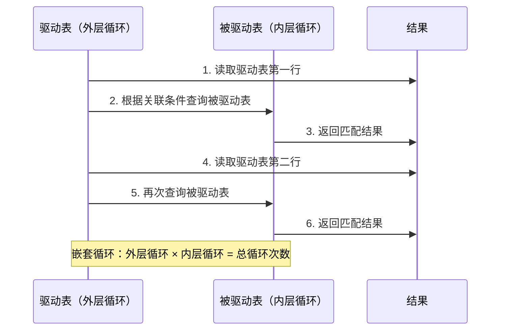

# JOIN 查询优化

> **目标级别**：P5/P6
> **面试频率**：🔴 高频
> **面试官最关心的 3 个问题**：
> 1. JOIN 的执行原理是什么？
> 2. 如何优化 JOIN 查询？
> 3. 小表驱动大表是什么意思？

面试官问：「多表 JOIN 怎么优化？」你说「加索引」——然后面试官紧接着追问「那小表驱动大表是什么意思？为什么这样更快？」你沉默了。

这就是 MySQL JOIN 查询面试的真实面貌：表面上问的是优化，实际上考的是对 JOIN 执行原理的理解深度。

## 一、JOIN 类型

### 1.1 七种 JOIN 类型



### 1.2 JOIN 类型对比

```sql
-- INNER JOIN：只保留两表都有的记录
SELECT * FROM A INNER JOIN B ON A.id = B.a_id;

-- LEFT JOIN：保留左表所有记录，右表没有的为 NULL
SELECT * FROM A LEFT JOIN B ON A.id = B.a_id;

-- RIGHT JOIN：保留右表所有记录，左表没有的为 NULL
SELECT * FROM A RIGHT JOIN B ON A.id = B.a_id;

-- CROSS JOIN：笛卡尔积
SELECT * FROM A CROSS JOIN B;
```

## 二、JOIN 执行原理

### 2.1 嵌套循环 JOIN（NLJ）



### 2.2 小表驱动大表原理

```sql
-- 假设 A 表 100 行，B 表 100000 行

-- ❌ A 驱动 B
SELECT * FROM A INNER JOIN B ON A.id = B.a_id;
-- 循环次数：100 × 100000 = 10000000 次

-- ✅ B 驱动 A（如果 B.id 有索引）
SELECT * FROM B INNER JOIN A ON A.id = B.a_id;
-- 循环次数：100000 × 1 = 100000 次（假设使用索引）
```

### 2.3 驱动表选择规则

| 规则 | 说明 |
|------|------|
| **数据量小** | 小表作为驱动表 |
| **有索引** | 被驱动表的关联字段有索引 |
| **过滤条件** | WHERE 条件多的表作为驱动表 |

## 三、JOIN 优化方法

### 3.1 使用合适的索引

```sql
-- 确保关联字段有索引
CREATE INDEX idx_user_id ON orders(user_id);

-- 多表 JOIN
SELECT o.*, u.name
FROM orders o
INNER JOIN user u ON o.user_id = u.id
WHERE o.status = 1;

-- 确保两个表的关联字段都有索引
CREATE INDEX idx_user_id ON user(id);
CREATE INDEX idx_user_id ON orders(user_id);
```

### 3.2 避免 SELECT *

```sql
-- ❌ SELECT *：返回大量数据
SELECT *
FROM orders o
INNER JOIN user u ON o.user_id = u.id
INNER JOIN product p ON o.product_id = p.id;

-- ✅ 只查询需要的字段
SELECT o.id, o.amount, u.name, p.product_name
FROM orders o
INNER JOIN user u ON o.user_id = u.id
INNER JOIN product p ON o.product_id = p.id;
```

### 3.3 减少 JOIN 数量

```sql
-- ❌ 多表 JOIN
SELECT *
FROM orders o
INNER JOIN user u ON o.user_id = u.id
INNER JOIN product p ON o.product_id = p.id
INNER JOIN category c ON p.category_id = c.id
WHERE u.city = '北京';

-- ✅ 分解为多个简单查询
-- 1. 先查询北京用户
SELECT id FROM user WHERE city = '北京';
-- 2. 再查询这些用户的订单
SELECT * FROM orders WHERE user_id IN (...);
-- 3. 应用层关联
```

### 3.4 使用小表

```sql
-- ❌ 大表 JOIN
SELECT * FROM orders o
INNER JOIN product p ON o.product_id = p.id
WHERE p.status = 1;

-- ✅ 过滤后小表 JOIN
SELECT o.* FROM orders o
INNER JOIN (
    SELECT id FROM product WHERE status = 1
) p ON o.product_id = p.id;
```

## 四、EXPLAIN 分析 JOIN

### 4.1 EXPLAIN 输出解读

```sql
EXPLAIN SELECT o.*, u.name
FROM orders o
INNER JOIN user u ON o.user_id = u.id;
```

| 字段 | 说明 |
|------|------|
| **id** | SELECT 的序号 |
| **select_type** | JOIN 的类型 |
| **table** | 表名 |
| **type** | 访问类型 |
| **key** | 使用的索引 |
| **rows** | 预估扫描行数 |
| **Extra** | 附加信息 |

### 4.2 优化目标

```sql
EXPLAIN SELECT o.*, u.name
FROM orders o
INNER JOIN user u ON o.user_id = u.id;

-- 优化目标：
-- type: ref 或 eq_ref（不是 ALL 或 index）
-- key: 索引名（不是 NULL）
-- rows: 尽量小
-- Extra: Using index（覆盖索引）
```

## 五、实战优化案例

### 5.1 场景一：订单详情查询

```sql
-- ❌ 低效：多表 JOIN
SELECT o.*, u.name, p.product_name
FROM orders o
INNER JOIN user u ON o.user_id = u.id
INNER JOIN product p ON o.product_id = p.id
WHERE o.user_id = 1;

-- ✅ 优化：使用覆盖索引
CREATE INDEX idx_user_id ON orders(user_id);
CREATE INDEX idx_product_id ON orders(product_id);
CREATE INDEX idx_id ON user(id);
CREATE INDEX idx_id ON product(id);

EXPLAIN SELECT o.id, o.amount, o.status, u.name, p.product_name
FROM orders o
INNER JOIN user u ON o.user_id = u.id
INNER JOIN product p ON o.product_id = p.id
WHERE o.user_id = 1;
-- Extra: Using index ✅ 覆盖索引
```

### 5.2 场景二：动态条件 JOIN

```sql
-- ❌ 低效：根据条件决定 JOIN 哪个表
SELECT *
FROM orders o
LEFT JOIN user ON o.user_id = user.id
LEFT JOIN admin ON o.admin_id = admin.id
WHERE o.user_id = 1;

-- ✅ 优化：使用 UNION
(SELECT o.*, u.name AS user_name, NULL AS admin_name
 FROM orders o
 INNER JOIN user u ON o.user_id = u.id
 WHERE o.user_id = 1)
UNION ALL
(SELECT o.*, NULL AS user_name, a.name AS admin_name
 FROM orders o
 INNER JOIN admin a ON o.admin_id = a.id
 WHERE o.admin_id IS NOT NULL);
```

## 六、面试追问链设计

> **第一层**：JOIN 的执行原理是什么？
> **第二层**：什么是小表驱动大表？
> **第三层**：为什么小表驱动大表更快？

> **第一层**：如何优化 JOIN 查询？
> **第二层**：JOIN 字段需要加索引吗？
> **第三层**：为什么不能 SELECT *？

> **第一层**：多表 JOIN 有什么性能问题？
> **第二层**：什么时候应该分解 JOIN？
> **第三层**：分解 JOIN 后性能为什么可能提升？

## 七、常见面试陷阱

**⚠️ 陷阱 1**：认为 JOIN 一定会用到索引
- JOIN 的关联字段需要有索引
- 没有索引会变成全表扫描

**⚠️ 陷阱 2**：忽略驱动表的影响
- 驱动表决定循环次数
- 选择错误的驱动表会导致性能严重下降

**⚠️ 陷阱 3**：过度使用 JOIN
- JOIN 越多，性能越差
- 应该考虑分解为多个简单查询

## 八、对比总结表

| JOIN 类型 | 数据保留 | 性能 |
|-----------|-----------|------|
| INNER JOIN | 两表都有 | 较快 |
| LEFT JOIN | 左表全部 | 一般 |
| RIGHT JOIN | 右表全部 | 一般 |
| CROSS JOIN | 笛卡尔积 | 慢 |

## 九、加分回答

> **💡 面试加分点**：如果能说出 JOIN 的进阶知识和优化技巧，会给面试官留下深刻印象：
>
> 1. **Block Nested Loop**：大表无索引时的 JOIN 算法
>
> 2. **Batched Key Access**：批量 KEY 访问，使用 MRR 优化
>
> 3. **Semi Join**：半连接，只返回驱动表数据
>
> 4. **JOIN BUFFER**：增大 JOIN BUFFER 减少扫描次数
