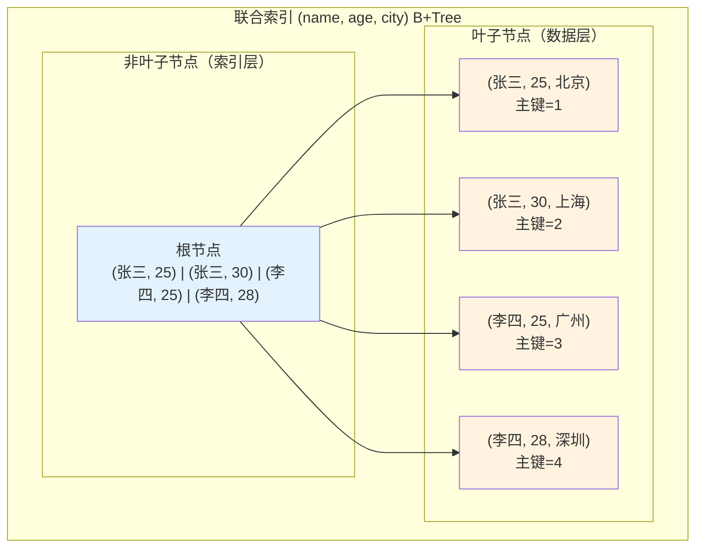
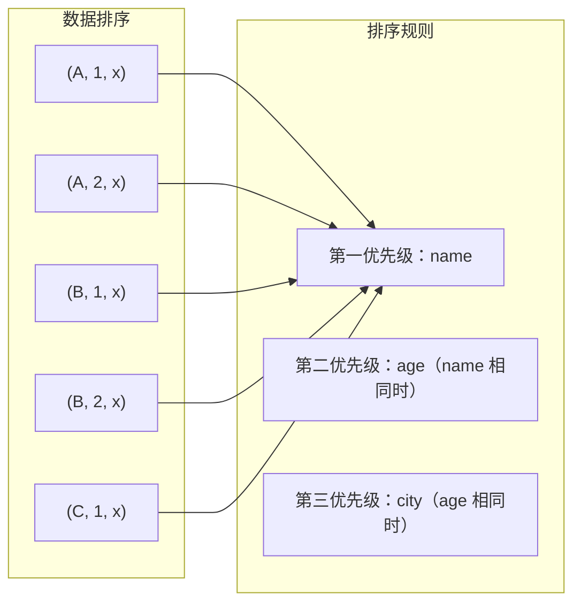
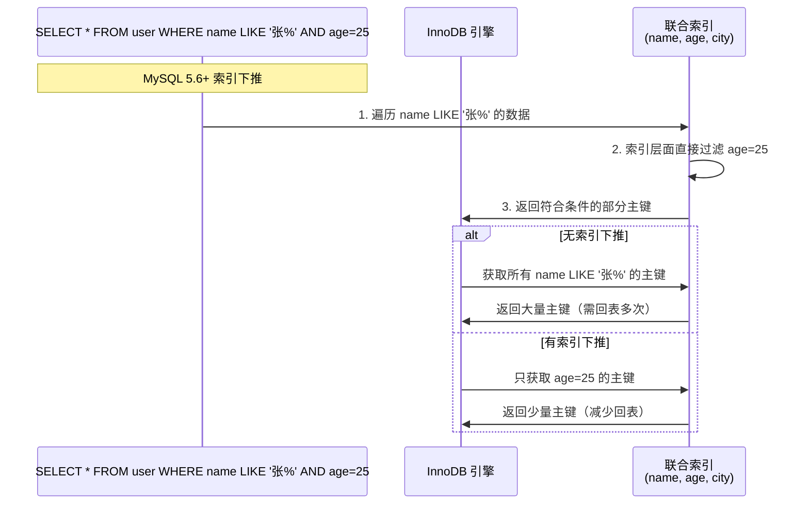

# 联合索引最左前缀原则

> **目标级别**：P5/P6
> **面试频率**：🔴 高频
> **面试官最关心的 3 个问题**：
> 1. 什么是联合索引的最左前缀原则？
> 2. 为什么联合索引必须从最左边开始使用？
> 3. 哪些情况会导致联合索引失效？

面试官问：「`(a, b, c)` 联合索引，查询 `WHERE b = 2 AND c = 3` 能用到索引吗？」你说「能用到」——然后面试官紧接着追问「为什么不行？索引不是 `(a, b, c)` 三个字段都有吗？」你沉默了。

这就是 MySQL 最左前缀原则面试的真实面貌：表面上问的是索引规则，实际上考的是对 B+Tree 索引数据组织方式的理解深度。

## 一、最左前缀原则原理

### 1.1 联合索引的数据组织

联合索引 `(name, age, city)` 的 B+Tree 结构如下：



**⚠️ 核心理解**：联合索引的数据按照从左到右的顺序排序，就像查字典时先看第一个字，再看第二个字。

### 1.2 最左前缀原则的定义

**最左前缀原则**：从联合索引的最左边第一个字段开始，连续使用索引字段，才能命中索引。

```sql
-- 联合索引：INDEX idx_name_age_city (name, age, city)

-- ✅ 能命中索引的情况
SELECT * FROM user WHERE name = '张三';                    -- 使用 name
SELECT * FROM user WHERE name = '张三' AND age = 25;       -- 使用 name, age
SELECT * FROM user WHERE name = '张三' AND age > 20;       -- 使用 name, age
SELECT * FROM user WHERE name = '张三' AND age = 25 AND city = '北京';  -- 使用全部

-- ❌ 不能命中索引的情况
SELECT * FROM user WHERE age = 25;                         -- 跳过 name
SELECT * FROM user WHERE city = '北京';                    -- 跳过 name, age
SELECT * FROM user WHERE name = '张三' AND city = '北京';  -- 跳过 age（中间断层）
```

### 1.3 排序原理



**排序规则解读**：
1. 先按 `name` 排序（主排序键）
2. `name` 相同时，按 `age` 排序
3. `name` 和 `age` 都相同时，按 `city` 排序

## 二、使用场景分析

### 2.1 匹配最左前缀

```sql
-- ✅ 完全匹配：name = '张三'
SELECT * FROM user WHERE name = '张三';
-- 命中索引前缀 (name)

-- ✅ 范围匹配：name = '张三' AND age > 25
SELECT * FROM user WHERE name = '张三' AND age > 25;
-- 命中索引前缀 (name, age)

-- ⚠️ 注意事项：范围查询右边的列不参与排序
SELECT * FROM user WHERE name = '张三' AND age > 25 AND city = '北京';
-- 命中 (name, age)，city 虽然命中但不能优化排序
```

### 2.2 索引中断

```sql
-- 联合索引：(name, age, city)

-- ❌ age 单独查询：索引中断
SELECT * FROM user WHERE age = 25;
-- 跳过 name，索引无法定位，只能全表扫描

-- ✅ name 精确 + age 范围
SELECT * FROM user WHERE name = '张三' AND age BETWEEN 20 AND 30;
-- 命中 (name, age)

-- ❌ name 范围 + age 查询：索引中断
SELECT * FROM user WHERE name LIKE '张%' AND age = 25;
-- 索引可能被用于 name，但 age 无法利用索引
```

### 2.3 索引下推优化

MySQL 5.6+ 支持索引下推（ICP），可以在索引遍历时过滤 `WHERE` 条件：

```sql
-- 联合索引：(name, age, city)
SELECT * FROM user WHERE name LIKE '张%' AND age = 25;

-- 无 ICP：先定位 name LIKE '张%' 的所有数据，再回表过滤 age=25
-- 有 ICP：在索引遍历时直接过滤 age=25，减少回表次数
```



## 三、常见面试陷阱

### 3.1 陷阱一：OR 条件导致索引失效

```sql
-- 联合索引：(name, age, city)

-- ❌ OR 条件：索引可能失效
SELECT * FROM user WHERE name = '张三' OR age = 25;
-- OR 会导致查询计划不稳定，可能全表扫描

-- ✅ 改成 UNION
SELECT * FROM user WHERE name = '张三'
UNION ALL
SELECT * FROM user WHERE age = 25 AND name IS NOT NULL;
```

### 3.2 陷阱二：LIKE 以通配符开头

```sql
-- 联合索引：(name, age)

-- ❌ LIKE 以 % 开头：索引失效
SELECT * FROM user WHERE name LIKE '%三';
-- 无法定位索引范围，只能全表扫描

-- ✅ LIKE 以具体字符开头：索引生效
SELECT * FROM user WHERE name LIKE '张三%';
-- 可以定位到 '张三' 开头的索引范围
```

### 3.3 陷阱三：隐式类型转换

```sql
-- 联合索引：(name, age)

-- ❌ name 是 VARCHAR 类型，查询用 INT
SELECT * FROM user WHERE name = 123;
-- MySQL 会将 name 隐式转换为数字，无法使用索引

-- ✅ 正确类型匹配
SELECT * FROM user WHERE name = '123';
-- 使用索引
```

## 四、面试追问链设计

> **第一层**：什么是联合索引的最左前缀原则？
> **第二层**：为什么 `(a, b, c)` 索引，查询 `WHERE b = 1` 无法使用索引？
> **第三层**：联合索引的 B+Tree 是怎么组织的？排序规则是什么？

> **第一层**：`WHERE name = '张三' AND age `>` 25` 能用索引吗？
> **第二层**：范围查询后面的字段还能用索引吗？
> **第三层**：MySQL 5.6 的索引下推是怎么优化的？

> **第一层**：`WHERE name LIKE '张%'` 能用索引吗？
> **第二层**：`WHERE name LIKE '%三'` 能用索引吗？为什么？
> **第三层**：前缀匹配和后缀匹配有什么区别？

## 五、对比总结表

| 查询条件 | 使用索引 | 原因 |
|----------|----------|------|
| `name = '张三'` | ✅ (name) | 命中最左前缀 |
| `name = '张三' AND age = 25` | ✅ (name, age) | 完整匹配两个字段 |
| `name = '张三' AND age > 25` | ✅ (name, age) | 范围查询可优化 |
| `name LIKE '张%'` | ✅ (name) | 前缀匹配 |
| `name LIKE '%三'` | ❌ | 无法定位范围 |
| `age = 25` | ❌ | 跳过最左字段 |
| `name = '张三' AND city = '北京'` | ⚠️ (name) | 跳过 age，索引中断 |
| `name IN ('张三', '李四')` | ✅ (name) | IN 等价于多个等于 |

## 六、生产实践建议

### 6.1 索引设计原则

| 原则 | 说明 | 示例 |
|------|------|------|
| **将区分度高的列放前面** | 区分度高 = 该列唯一值多 | `(user_id, status)` 优于 `(status, user_id)` |
| **将等值查询放前面** | 等值查询可以利用索引定位 | `(name, status)` 优于 `(status, name)` |
| **覆盖高频查询** | 减少回表 | `(name, age)` 覆盖 `SELECT name, age WHERE name=?` |
| **避免冗余索引** | `(a, b)` 包含了 `(a)` | 不要同时建 `(a)` 和 `(a, b)` |

### 6.2 常见索引设计模式

```sql
-- 场景 1：用户查询（按状态筛选）
-- 高频查询：WHERE status = 1 AND created_at > '2024-01-01'
-- 索引设计：status + created_at
CREATE INDEX idx_status_created ON orders(status, created_at);

-- 场景 2：商品查询（按分类和价格）
-- 高频查询：WHERE category = '电子产品' ORDER BY price
-- 索引设计：category + price
CREATE INDEX idx_category_price ON products(category, price);

-- 场景 3：用户中心（按手机号查询）
-- 高频查询：WHERE phone = '13800138000'
-- 索引设计：phone
CREATE UNIQUE INDEX idx_phone ON user(phone);
```

## 七、加分回答

> **💡 面试加分点**：如果能说出索引列顺序设计原则和实战经验，会给面试官留下深刻印象：
>
> 1. **区分度原则**：将区分度高的列放在前面，可以让索引更高效
>
> 2. **等值优先于范围**：等值查询可以精确匹配，范围查询右边的列无法利用索引
>
> 3. **覆盖索引设计**：如果一个查询是高频查询，可以设计一个覆盖索引来减少回表
>
> 4. **联合索引 vs 多个单列索引**：联合索引优于多个单列索引，因为可以减少索引数量
