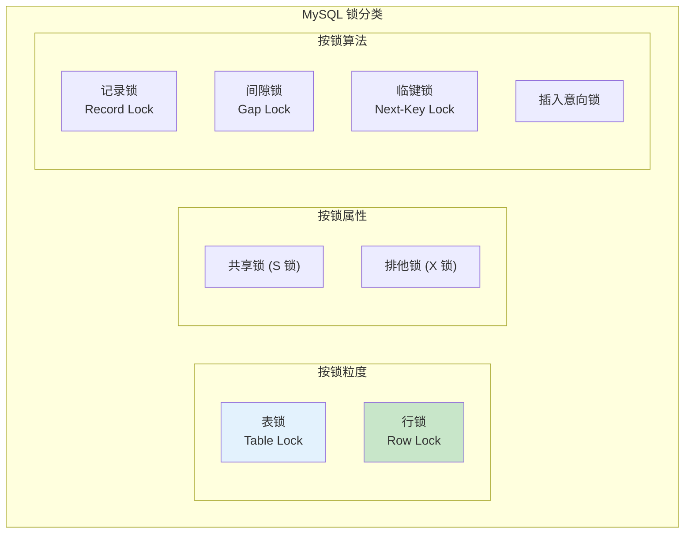
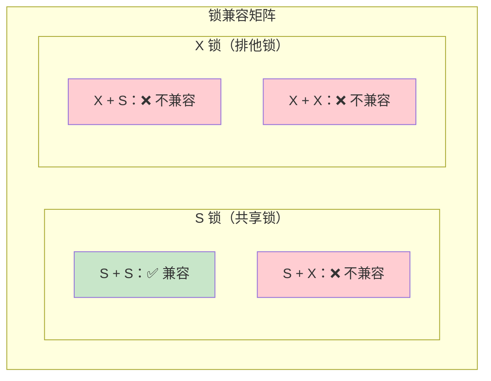
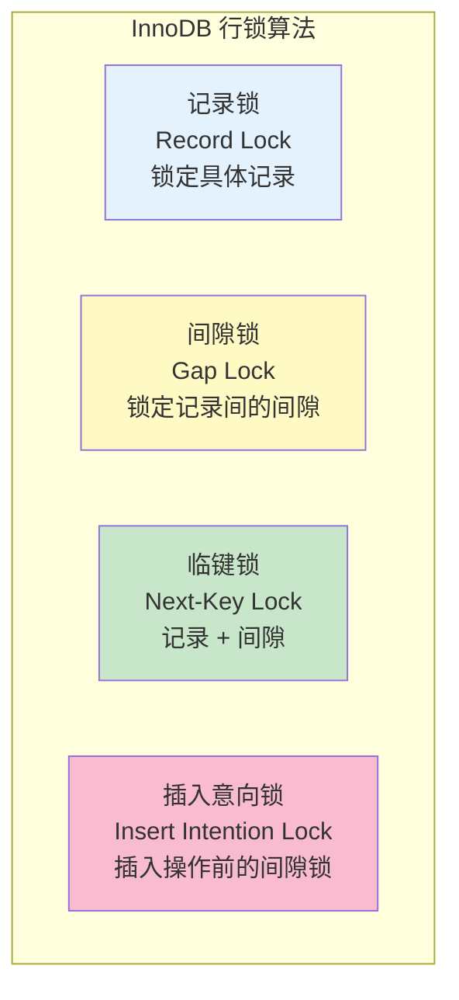

# MySQL 锁分类

> **目标级别**：P5/P6
> **面试频率**：🔴 高频
> **面试官最关心的 3 个问题**：
> 1. MySQL 有哪些锁类型？
> 2. 行锁和表锁有什么区别？
> 3. 共享锁和排他锁是什么？

面试官问：「MySQL 有哪些锁？」你说「有行锁和表锁」——然后面试官紧接着追问「那记录锁、间隙锁、临键锁又是什么？它们分别在什么场景下使用？」你沉默了。

这就是 MySQL 锁分类面试的真实面貌：表面上问的是概念，实际上考的是对 InnoDB 锁机制完整体系的理解深度。

## 一、锁的宏观分类



## 二、按锁粒度分类

### 2.1 表锁 vs 行锁对比

| 对比维度 | 表锁 | 行锁 |
|----------|------|------|
| **锁定范围** | 整张表 | 表中的单行或多行 |
| **加锁开销** | 小 | 大 |
| **并发性能** | 差 | 好 |
| **锁冲突概率** | 高 | 低 |
| **支持引擎** | MyISAM, InnoDB | InnoDB |
| **锁类型** | 共享/排他 | 共享/排他 |

### 2.2 表锁

```sql
-- 手动加表锁
LOCK TABLES user READ;      -- 读锁（共享表锁）
LOCK TABLES user WRITE;     -- 写锁（排他表锁）

-- 释放表锁
UNLOCK TABLES;

-- 自动加表锁的场景（MyISAM）
SELECT * FROM user;  -- 读锁
INSERT INTO user VALUES(...);  -- 写锁
```

### 2.3 行锁

```sql
-- InnoDB 行锁（自动加锁）
UPDATE user SET name = '张三' WHERE id = 1;  -- 行锁

-- 查看行锁信息
SHOW STATUS LIKE 'Innodb_row_lock%';

-- 强制加行锁
SELECT * FROM user WHERE id = 1 FOR UPDATE;  -- X 锁
SELECT * FROM user WHERE id = 1 LOCK IN SHARE MODE;  -- S 锁
```

### 2.4 行锁的隐式与显式

```sql
-- 隐式加锁（DML 语句自动加锁）
INSERT INTO user VALUES(...);  -- IX 锁
UPDATE user SET name = '张三' WHERE id = 1;  -- X 锁
DELETE FROM user WHERE id = 1;  -- X 锁

-- 显式加锁
SELECT * FROM user WHERE id = 1 FOR UPDATE;  -- 显式 X 锁
SELECT * FROM user WHERE id = 1 LOCK IN SHARE MODE;  -- 显式 S 锁
```

## 三、按锁属性分类

### 3.1 共享锁（S 锁）与排他锁（X 锁）



### 3.2 锁兼容矩阵表

| 请求锁 →<br/>持有锁 ↓ | X 锁 | S 锁 |
|----------------------|------|------|
| **X 锁** | ❌ | ❌ |
| **S 锁** | ❌ | ✅ |

### 3.3 实战演示

```sql
-- 会话 A：加排他锁
START TRANSACTION;
SELECT * FROM user WHERE id = 1 FOR UPDATE;  -- X 锁

-- 会话 B：尝试获取共享锁
START TRANSACTION;
SELECT * FROM user WHERE id = 1 LOCK IN SHARE MODE;
-- 阻塞！因为 X 锁和 S 锁不兼容

-- 会话 C：尝试获取排他锁
START TRANSACTION;
SELECT * FROM user WHERE id = 1 FOR UPDATE;
-- 阻塞！因为 X 锁和 X 锁不兼容

COMMIT;  -- 会话 A 提交，释放锁
-- 会话 B 和 C 的查询才能执行
```

## 四、按锁算法分类

### 4.1 四种锁算法概览



### 4.2 记录锁（Record Lock）

**记录锁**：锁定索引记录，无论有没有索引都会锁定主键。

```sql
-- 等值查询会使用记录锁
SELECT * FROM user WHERE id = 1 FOR UPDATE;
-- 锁定 id=1 的记录

-- 范围查询也可能有记录锁
SELECT * FROM user WHERE id BETWEEN 10 AND 20 FOR UPDATE;
-- 锁定 id=10 到 id=20 的每一条记录
```

### 4.3 间隙锁（Gap Lock）

**间隙锁**：锁定索引记录之间的间隙，防止其他事务在间隙中插入数据。

```sql
-- 范围查询会使用间隙锁
SELECT * FROM orders WHERE id BETWEEN 10 AND 20 FOR UPDATE;
-- 锁定 10 到 20 之间的间隙（包括 10 和 20）

-- 防止幻读：其他事务无法在 10-20 之间插入
INSERT INTO orders (id, amount) VALUES (15, 100);  -- 被阻塞
```

### 4.4 临键锁（Next-Key Lock）

**临键锁**：记录锁 + 间隙锁的组合，是 InnoDB 在可重复读隔离级别下的默认锁算法。

```sql
-- 主键 id 索引：1, 3, 5, 7, 9

-- 查询 id `>` 3 AND id `<` 7
SELECT * FROM orders WHERE id `>` 3 AND id `<` 7 FOR UPDATE;
-- 锁定范围：(3, 7)，包括 3 和 7 的记录，以及它们之间的间隙

-- 临键锁锁定的范围
-- [3, 7)：锁定 3 到 7 之间的所有值（包括 3，不包括 7）
```

### 4.5 插入意向锁（Insert Intention Lock）

**插入意向锁**：INSERT 操作在插入前设置的间隙锁，表示有多个事务尝试在同一个间隙插入不同位置。

```sql
-- 间隙锁内的多个插入意向锁可以兼容

-- 会话 A：插入 id=6
START TRANSACTION;
INSERT INTO orders (id, amount) VALUES (6, 100);  -- 等待获取插入意向锁

-- 会话 B：插入 id=8
START TRANSACTION;
INSERT INTO orders (id, amount) VALUES (8, 100);  -- 可以同时获取（id 不同位置）
```

## 五、锁与索引的关系

### 5.1 索引对锁的影响

```sql
-- 如果有索引：行锁
SELECT * FROM user WHERE id = 1 FOR UPDATE;
-- 锁定 id=1 这行

-- 如果没有索引：表锁
SELECT * FROM user WHERE name = '张三' FOR UPDATE;
-- 锁定所有 name='张三' 的行
-- 如果 name='张三' 的行太多，可能变成表锁
```

### 5.2 不同索引的锁范围

```sql
-- 表结构
CREATE TABLE orders (
    id INT PRIMARY KEY,
    order_no VARCHAR(32) UNIQUE,
    user_id INT,
    INDEX idx_user_id (user_id)
);

-- 主键等值查询：行锁（锁定 id=1 这一行）
SELECT * FROM orders WHERE id = 1 FOR UPDATE;

-- 唯一索引等值查询：行锁
SELECT * FROM orders WHERE order_no = 'ORD001' FOR UPDATE;

-- 普通索引等值查询：行锁 + 间隙锁
SELECT * FROM orders WHERE user_id = 1 FOR UPDATE;
-- 锁定 user_id=1 的所有记录 + 前后间隙
```

## 六、锁信息查看

### 6.1 查看锁状态

```sql
-- 查看当前锁信息
SHOW ENGINE INNODB STATUS;

-- 查看锁等待
SELECT * FROM information_schema.INNODB_LOCK_WAITS;

-- 查看当前锁
SELECT * FROM information_schema.INNODB_LOCKS;

-- 查看事务
SELECT * FROM information_schema.INNODB_TRX;
```

### 6.2 锁相关参数

```sql
-- 查看锁等待超时时间
SHOW VARIABLES LIKE 'innodb_lock_wait_timeout';  -- 默认 50 秒

-- 设置锁等待超时（临时）
SET innodb_lock_wait_timeout = 5;

-- 查看死锁检测
SHOW VARIABLES LIKE 'innodb_deadlock_detect';  -- 默认 ON
```

## 七、面试追问链设计

> **第一层**：MySQL 有哪些锁类型？
> **第二层**：行锁和表锁有什么区别？各自适用什么场景？
> **第三层**：InnoDB 为什么默认使用行锁？

> **第一层**：什么是记录锁、间隙锁、临键锁？
> **第二层**：它们分别在什么场景下使用？
> **第三层**：临键锁是怎么解决幻读问题的？

> **第一层**：S 锁和 X 锁的兼容矩阵是什么？
> **第二层**：为什么排他锁和共享锁不兼容？
> **第三层**：插入意向锁的作用是什么？

## 八、常见面试陷阱

**⚠️ 陷阱 1**：认为行锁总是锁定一行
- 如果查询没有索引或索引不命中，会锁定多行甚至整张表
- 锁定的行数取决于 WHERE 条件

**⚠️ 陷阱 2**：忽略索引对锁的影响
- 如果字段没有索引，UPDATE 可能变成表锁
- 生产环境中这是常见问题

**⚠️ 陷阱 3**：认为间隙锁只锁定存在的记录
- 间隙锁锁定的是「间隙」，不是「记录」
- 锁定不存在的值也可能被锁定

## 九、对比总结表

| 锁类型 | 锁定内容 | 作用 | 适用场景 |
|--------|----------|------|----------|
| **表锁** | 整张表 | 简单粗暴 | MyISAM、全表扫描 |
| **行锁** | 单行记录 | 细粒度控制 | InnoDB、索引查询 |
| **记录锁** | 具体索引记录 | 锁定单行 | 等值查询 |
| **间隙锁** | 记录间间隙 | 防止插入 | 范围查询 |
| **临键锁** | 记录 + 间隙 | 防止插入和删除 | 可重复读默认 |
| **插入意向锁** | 插入位置的间隙 | 允许并发插入 | INSERT 操作 |

## 十、加分回答

> **💡 面试加分点**：如果能说出 InnoDB 锁的实现细节和优化技巧，会给面试官留下深刻印象：
>
> 1. **自适应哈希索引**：热点数据自动构建哈希索引，减少锁冲突
>
> 2. **锁的内部实现**：基于事务 ID 和 DB_ROLL_PTR 实现
>
> 3. **意向锁**：表级别的 IX、IS 锁，用于快速判断是否有行锁冲突
>
> 4. **Gap Lock 的例外**：唯一索引等值查询时，不会锁定间隙
