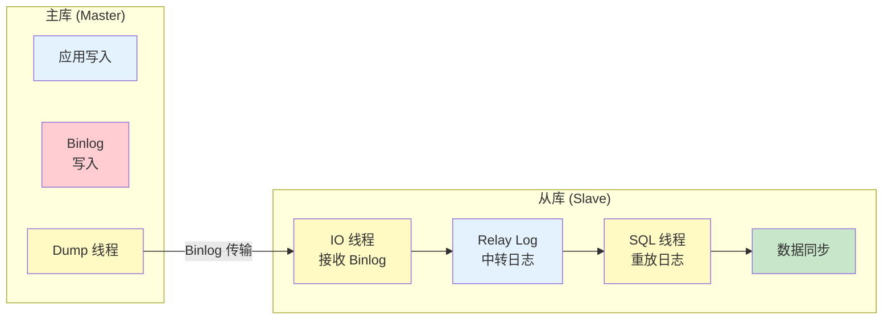
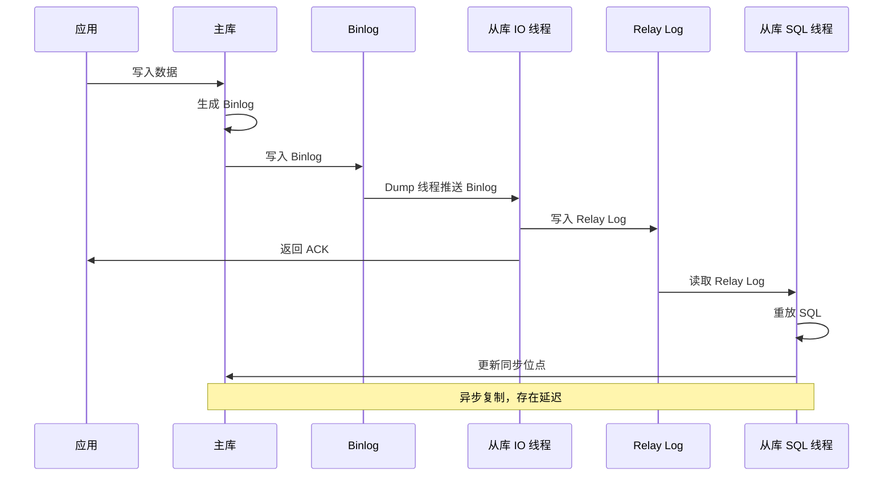
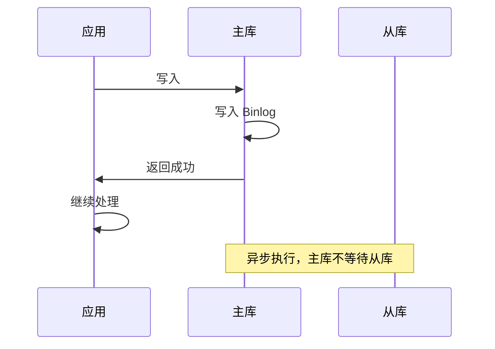
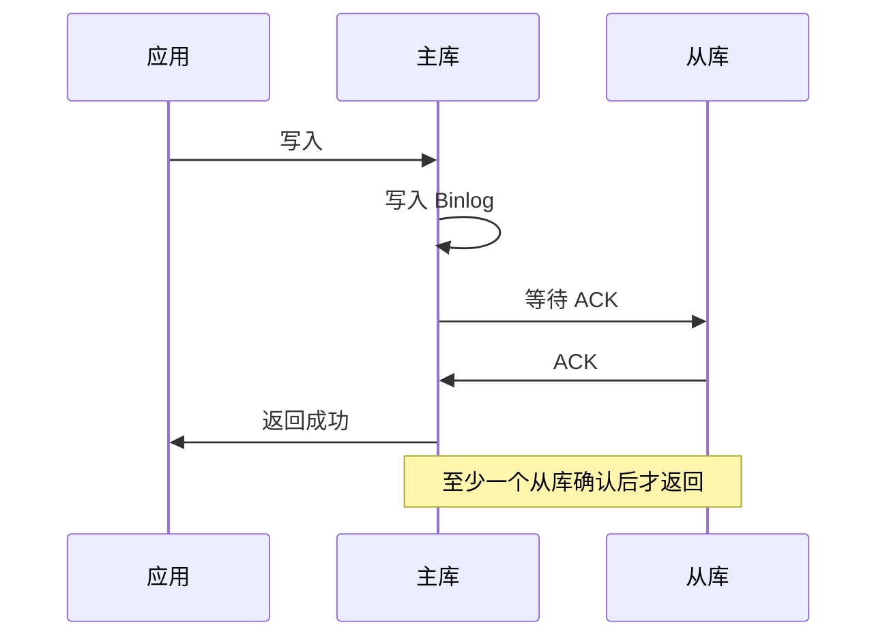
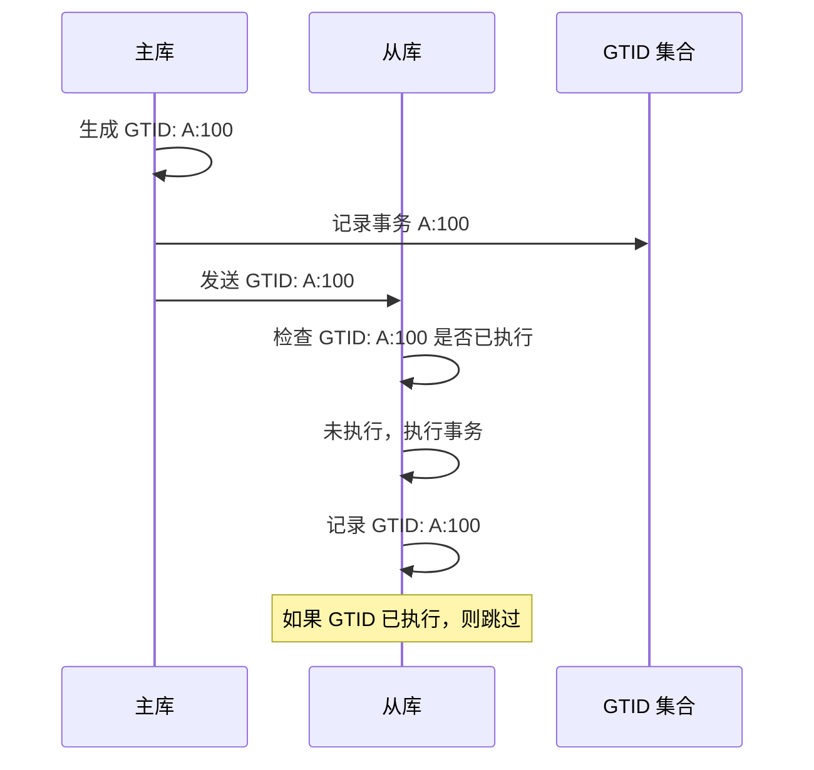
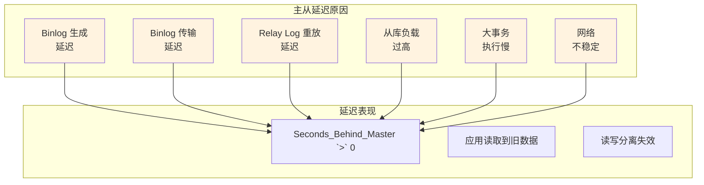

# MySQL 主从复制原理

> **目标级别**：P5/P6
> **面试频率**：🔴 高频
> **面试官最关心的 3 个问题**：
> 1. MySQL 主从复制的原理是什么？
> 2. 主从复制有哪些步骤？
> 3. 主从复制有哪些延迟问题？

面试官问：「MySQL 主从复制是怎么工作的？」你说「就是主库写入，从库读取」——然后面试官紧接着追问「具体的数据同步流程是什么？binlog 是怎么从主库传到从库的？」你沉默了。

这就是 MySQL 主从复制面试的真实面貌：表面上问的是架构，实际上考的是对数据同步原理的理解深度。

## 一、主从复制架构

### 1.1 基本架构



### 1.2 主从复制的作用

| 作用 | 说明 |
|------|------|
| **读写分离** | 写操作主库，读操作从库 |
| **数据备份** | 从库作为数据备份 |
| **故障切换** | 主库故障时，从库升级为主库 |
| **负载均衡** | 分散读请求压力 |

## 二、主从复制原理

### 2.1 复制三步骤



### 2.2 三个核心线程

| 线程 | 位置 | 作用 |
|------|------|------|
| **Dump 线程** | 主库 | 读取 Binlog，发送给从库 |
| **IO 线程** | 从库 | 接收 Binlog，写入 Relay Log |
| **SQL 线程** | 从库 | 读取 Relay Log，重放 SQL |

### 2.3 Binlog 同步位置

```sql
-- 从库记录同步位置
SHOW SLAVE STATUS\G

-- 关键字段：
-- Master_Log_File: 主库 Binlog 文件
-- Read_Master_Log_Pos: 读取位置
-- Relay_Log_File: Relay Log 文件
-- Relay_Log_Pos: Relay Log 位置
-- Exec_Master_Log_Pos: 已执行位置
-- Seconds_Behind_Master: 延迟秒数
```

## 三、复制类型

### 3.1 三种复制类型

| 类型 | 说明 | 优点 | 缺点 |
|------|------|------|------|
| **异步复制** | 主库写入后立即返回，不等待从库 | 性能高 | 可能丢数据 |
| **半同步复制** | 主库等待至少一个从库确认 | 数据安全 | 有延迟 |
| **同步复制** | 主库等待所有从库确认 | 数据最安全 | 性能差 |

### 3.2 异步复制



### 3.3 半同步复制



## 四、GTID 复制

### 4.1 GTID 概念

**GTID（Global Transaction Identifier）**：全局事务 ID，是每个事务的唯一标识。

| 格式 | 说明 |
|------|------|
| **server_uuid** | 服务器 UUID |
| **transaction_id** | 事务序号 |

```
GTID: 3E11FA47-71CA-11E1-9E33-C80AA9429562:23
```

### 4.2 GTID 优势

```sql
-- 查看 GTID 模式
SHOW VARIABLES LIKE 'gtid_mode';

-- GTID 复制的优势：
-- 1. 自动定位，无需指定文件名和位置
-- 2. 更容易搭建从库
-- 3. 更简单的故障转移
-- 4. 可以基于事务追踪数据变更
```

### 4.3 GTID 工作原理



## 五、主从延迟问题

### 5.1 延迟原因



### 5.2 监控延迟

```sql
-- 查看从库延迟
SHOW SLAVE STATUS\G
-- Seconds_Behind_Master: 0 表示没有延迟

-- 查看详细状态
SHOW SLAVE STATUS\G
-- Read_Master_Log_Pos - Exec_Master_Log_Pos = 延迟字节数

-- 开启慢日志监控
SHOW VARIABLES LIKE 'slow_query_log';
SHOW VARIABLES LIKE 'slave_rows_search_algorithms';
```

### 5.3 优化延迟

```sql
-- 优化 1：并行复制
SET GLOBAL slave_parallel_workers = 8;  -- 开启 8 个 SQL 线程
SET GLOBAL slave_parallel_type = 'LOGICAL_CLOCK';  -- 按事务并行

-- 优化 2：调整从库配置
SET GLOBAL innodb_flush_log_at_trx_commit = 2;  -- 减少刷盘
SET GLOBAL sync_binlog = 1000;  -- 批量同步 Binlog

-- 优化 3：使用多线程复制
STOP SLAVE;
SET GLOBAL slave_parallel_type = 'DATABASE';  -- 按库并行
START SLAVE;
```

## 六、实战配置

### 6.1 主库配置

```ini
[mysqld]
server-id = 1
log-bin = mysql-bin
binlog_format = ROW
sync_binlog = 1
gtid_mode = ON
enforce_gtid_consistency = ON
```

### 6.2 从库配置

```ini
[mysqld]
server-id = 2
relay-log = relay-bin
log-slave-updates = ON
gtid_mode = ON
enforce_gtid_consistency = ON
slave_parallel_workers = 8
slave_parallel_type = LOGICAL_CLOCK
read_only = ON
super_read_only = ON
```

### 6.3 配置从库复制

```sql
-- 方式 1：使用 binlog 文件和位置
CHANGE MASTER TO
    MASTER_HOST = '192.168.1.100',
    MASTER_PORT = 3306,
    MASTER_USER = 'repl',
    MASTER_PASSWORD = 'password',
    MASTER_LOG_FILE = 'mysql-bin.000001',
    MASTER_LOG_POS = 154;

-- 方式 2：使用 GTID
CHANGE MASTER TO
    MASTER_HOST = '192.168.1.100',
    MASTER_PORT = 3306,
    MASTER_USER = 'repl',
    MASTER_PASSWORD = 'password',
    MASTER_AUTO_POSITION = 1;

-- 启动复制
START SLAVE;

-- 查看复制状态
SHOW SLAVE STATUS\G
```

## 七、面试追问链设计

> **第一层**：MySQL 主从复制的原理是什么？
> **第二层**：主从复制有三个核心线程，它们分别负责什么？
> **第三层**：Binlog 是怎么从主库传到从库的？

> **第一层**：异步复制和半同步复制有什么区别？
> **第二层**：半同步复制是如何保证数据安全的？
> **第三层**：为什么半同步复制的性能比异步复制差？

> **第一层**：主从延迟是怎么产生的？
> **第二层**：如何监控主从延迟？
> **第三层**：如何优化主从延迟？

## 八、常见面试陷阱

**⚠️ 陷阱 1**：认为主从复制是同步的
- 主从复制是异步的，存在延迟
- 数据一致性需要应用层处理

**⚠️ 陷阱 2**：忽略延迟的影响
- 延迟可能导致读写分离失效
- 读从库可能读到旧数据

**⚠️ 陷阱 3**：主从数据不一致
- 主从切换时可能丢失数据
- 需要使用半同步复制或 GTID

## 九、对比总结表

| 对比维度 | 异步复制 | 半同步复制 | 同步复制 |
|----------|----------|------------|----------|
| **数据安全** | 可能丢数据 | 基本不丢 | 不丢 |
| **性能** | 最优 | 一般 | 最差 |
| **延迟** | 无等待 | 等待一个 ACK | 等待全部 |
| **适用场景** | 容忍延迟 | 一般业务 | 金融 |

## 十、加分回答

> **💡 面试加分点**：如果能说出 MySQL 主从复制的进阶知识和优化技巧，会给面试官留下深刻印象：
>
> 1. **并行复制**：按库并行、按表并行、LOGICAL_CLOCK 并行
>
> 2. **GTID 自动定位**：使用 GTID 简化从库搭建和故障转移
>
> 3. **复制过滤器**：replicate-do-db、replicate-ignore-table 等
>
> 4. **延迟复制**：使用 `MASTER_DELAY` 实现延迟复制，用于数据恢复
