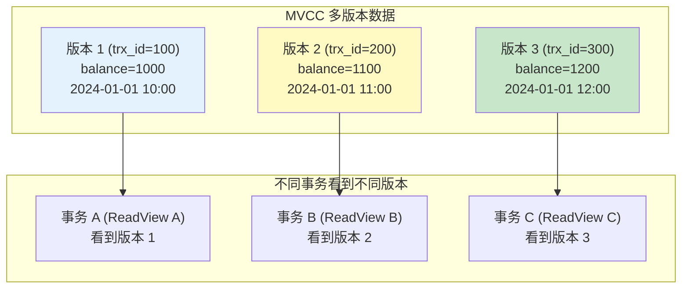
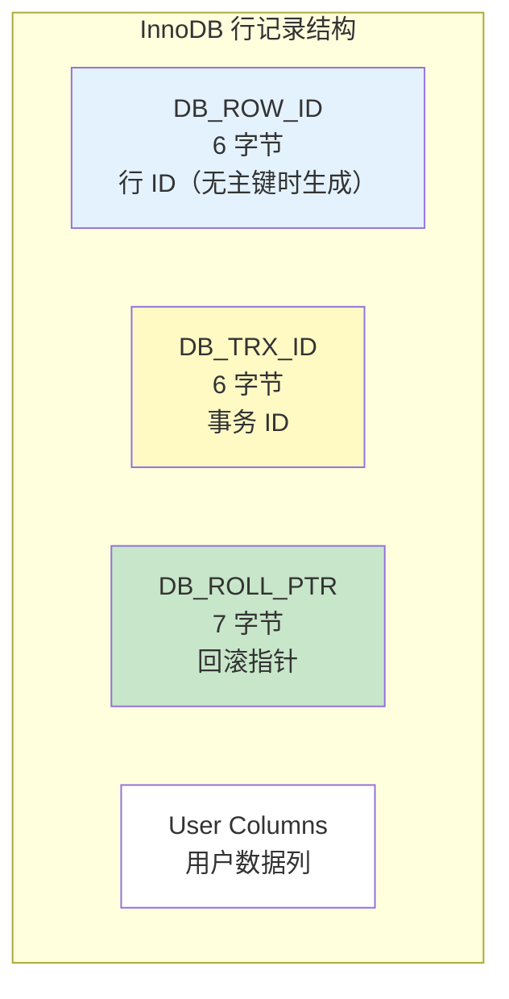
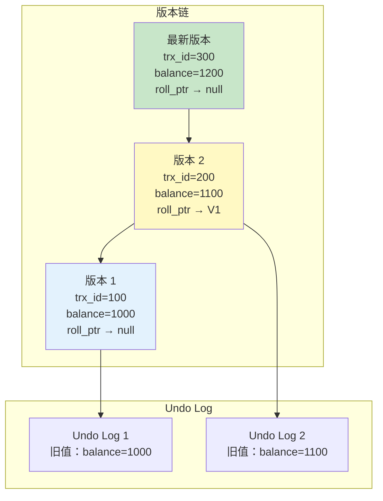
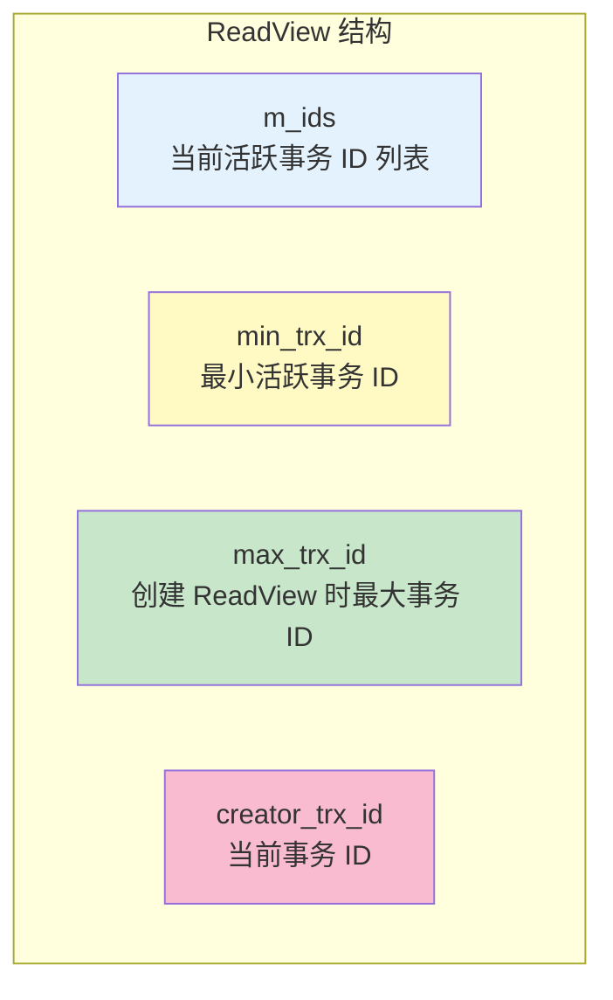
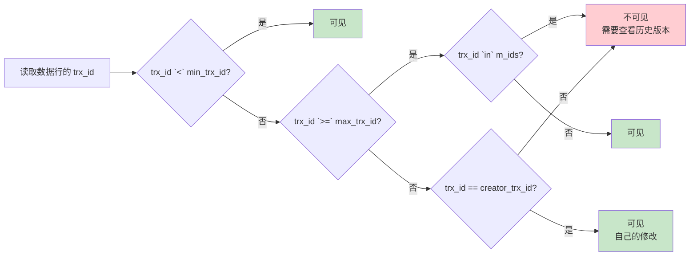
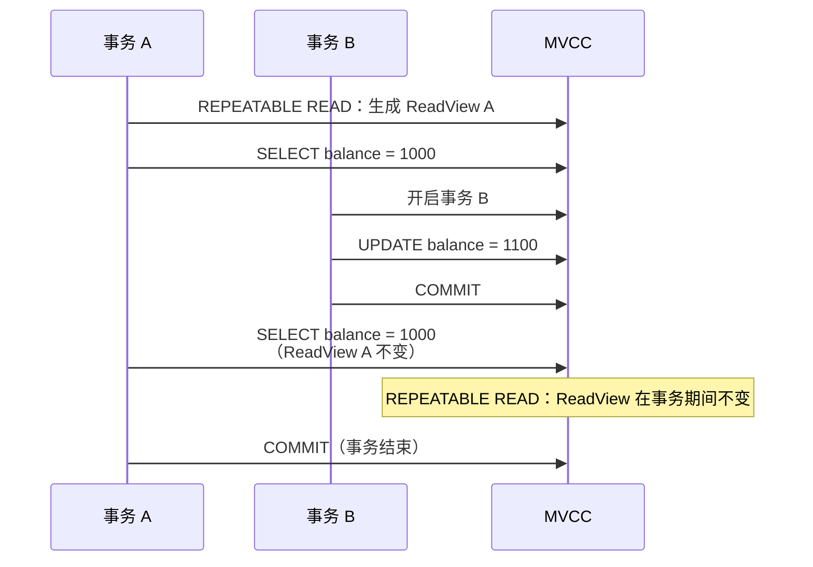

# MVCC 原理

> **目标级别**：P6
> **面试频率**：🔴 高频
> **面试官最关心的 3 个问题**：
> 1. MVCC 是什么？解决了什么问题？
> 2. MVCC 是如何实现的？
> 3. ReadView 是怎么工作的？

面试官问：「MySQL 是如何实现可重复读的？」你说「通过 MVCC」——然后面试官紧接着追问「MVCC 的原理是什么？ReadView 是怎么判断数据可见性的？」你沉默了。

这就是 MySQL MVCC 面试的真实面貌：表面上问的是概念，实际上考的是对多版本并发控制核心机制的理解深度。

## 一、MVCC 概述

### 1.1 MVCC 定义

**MVCC（Multi-Version Concurrency Control）**：多版本并发控制，通过保存数据的多个版本，实现读写不冲突，提高并发性能。



### 1.2 MVCC 解决的问题

| 问题 | 传统锁机制 | MVCC |
|------|------------|------|
| **脏读** | 使用 X 锁阻塞读 | 读取快照版本 |
| **不可重复读** | 使用 X 锁阻塞写 | 生成 ReadView |
| **并发性能** | 读写互相阻塞 | 读写不阻塞 |

### 1.3 MVCC 核心概念

| 概念 | 说明 |
|------|------|
| **事务 ID（trx_id）** | 每个事务有唯一 ID，递增分配 |
| **隐藏列** | 每行数据有两个隐藏列：`DB_TRX_ID`、`DB_ROLL_PTR` |
| **Undo Log** | 存储数据的历史版本 |
| **ReadView** | 事务快照，记录当前活跃事务 ID |

## 二、InnoDB 行结构

### 2.1 InnoDB 隐藏列



### 2.2 隐藏列作用

```sql
-- InnoDB 表的隐藏列
-- 类似于：
CREATE TABLE account (
    id INT PRIMARY KEY,         -- 主键
    balance DECIMAL(10,2),      -- 余额
    _DB_ROW_ID BIGINT,         -- 隐藏行 ID
    _DB_TRX_ID BIGINT,         -- 隐藏事务 ID
    _DB_ROLL_PTR BIGINT         -- 隐藏回滚指针
);
```

| 隐藏列 | 说明 |
|--------|------|
| **DB_ROW_ID** | 行 ID，如果表没有主键，InnoDB 自动生成 |
| **DB_TRX_ID** | 最近修改该行的事务 ID |
| **DB_ROLL_PTR** | 指向 Undo Log 中旧版本的指针 |

## 三、Undo Log 版本链

### 3.1 版本链的形成



### 3.2 版本链查询过程

```sql
-- 查询 balance 当前值
SELECT balance FROM account WHERE id = 1;

-- 查询过程：
-- 1. 读取当前行的 trx_id = 300
-- 2. 判断 ReadView 是否可见
-- 3. 如果不可见，通过 roll_ptr 找到历史版本
-- 4. 重复步骤 2-3，直到找到可见版本
```

## 四、ReadView 原理

### 4.1 ReadView 结构



### 4.2 ReadView 可见性判断规则



### 4.3 可见性判断规则表

| 条件 | 说明 | 结果 |
|------|------|------|
| `trx_id == creator_trx_id` | 自己的修改 | ✅ 可见 |
| `trx_id < min_trx_id` | 事务已提交 | ✅ 可见 |
| `trx_id >= max_trx_id` | 事务在 ReadView 创建后开始 | ❌ 不可见 |
| `trx_id in m_ids` | 事务仍在活跃 | ❌ 不可见 |

## 五、MVCC 与隔离级别

### 5.1 不同隔离级别的 ReadView 时机



### 5.2 Read Committed 的区别

```sql
-- READ COMMITTED：每次读取都生成新 ReadView

-- 会话 A
SET SESSION transaction_isolation = 'READ-COMMITTED';
START TRANSACTION;

SELECT balance FROM account WHERE id = 1;  -- ReadView A，balance=1000

-- 会话 B
START TRANSACTION;
UPDATE account SET balance = 1100 WHERE id = 1;
COMMIT;

-- 会话 A 再次读取
SELECT balance FROM account WHERE id = 1;  -- ReadView B，balance=1100
-- ReadView 重新生成，可以看到新数据
COMMIT;
```

### 5.3 隔离级别对比

| 隔离级别 | ReadView 生成时机 | 同一事务多次读取 |
|----------|-------------------|------------------|
| READ UNCOMMITTED | 不生成 ReadView | 总是读取最新数据 |
| READ COMMITTED | 每次读取时生成 | 可能不同 |
| REPEATABLE READ | 事务开始时生成 | 总是相同 |
| SERIALIZABLE | 使用锁 | - |

## 六、实战案例

### 6.1 快照读与当前读

```sql
-- 快照读：读取历史版本（MVCC）
SELECT * FROM account WHERE id = 1;  -- 快照读

-- 当前读：读取最新版本 + 加锁
SELECT * FROM account WHERE id = 1 FOR UPDATE;  -- 当前读
UPDATE account SET balance = balance - 100 WHERE id = 1;  -- 当前读
```

### 6.2 MVCC 解决不可重复读

```sql
-- 会话 A
START TRANSACTION;

-- 读取（生成 ReadView，假设 min_trx_id=100, max_trx_id=200）
SELECT * FROM account WHERE id = 1;
-- balance = 1000（事务 100 提交的数据）

-- 会话 B：开启事务 B（trx_id=200）
-- 修改 balance = 1100，提交

-- 会话 A：再次读取（ReadView 不变）
SELECT * FROM account WHERE id = 1;
-- balance 仍然是 1000（不可重复读被解决）
-- 因为事务 B 的 trx_id=200 在 ReadView 中不可见

COMMIT;
```

## 七、面试追问链设计

> **第一层**：MVCC 是什么？解决了什么问题？
> **第二层**：MVCC 是如何实现的？
> **第三层**：InnoDB 的行记录有哪些隐藏列？各自的作用是什么？

> **第一层**：ReadView 的结构是怎样的？
> **第二层**：ReadView 是如何判断数据可见性的？
> **第三层**：Read Committed 和 Repeatable Read 的 ReadView 有什么区别？

> **第一层**：MVCC 能完全解决所有并发问题吗？
> **第二层**：当前读会使用 MVCC 吗？
> **第三层**：为什么长事务会影响 MVCC？

## 八、常见面试陷阱

**⚠️ 陷阱 1**：认为 MVCC 完全解决了所有并发问题
- MVCC 解决了快照读的并发问题
- 当前读仍然需要使用锁机制

**⚠️ 陷阱 2**：混淆 ReadView 和 Undo Log
- ReadView 是判断可见性的快照
- Undo Log 是存储历史版本的数据结构

**⚠️ 陷阱 3**：忽略长事务的影响
- 活跃事务越多，ReadView 中的 m_ids 越大
- Undo Log 越多，占用空间越大

## 九、对比总结表

| 对比维度 | 传统锁机制 | MVCC |
|----------|------------|------|
| **读操作** | 可能阻塞 | 不阻塞 |
| **写操作** | 可能阻塞 | 可能阻塞 |
| **并发性能** | 较低 | 较高 |
| **一致性** | 强一致性 | 最终一致性（快照） |
| **实现复杂度** | 简单 | 复杂 |

## 十、加分回答

> **💡 面试加分点**：如果能说出 MVCC 的实现细节和优化技巧，会给面试官留下深刻印象：
>
> 1. **purge 线程**：定期清理不再需要的 Undo Log
>
> 2. **read view 的优化**：MySQL 8.0 使用 latch-free 数据结构
>
> 3. **长事务的影响**：活跃事务越多，undo 版本链越长
>
> 4. **purge 的协调**：根据最老的 ReadView 确定可以清理的 undo
