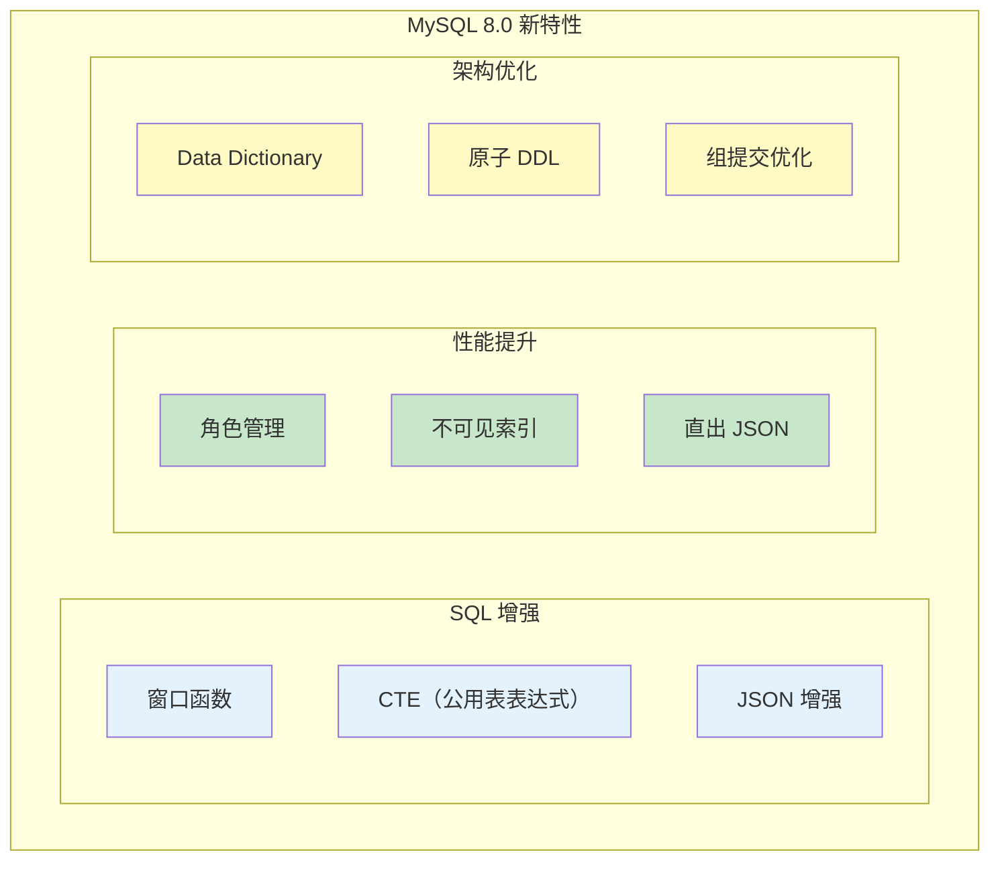

# MySQL 8.0 新特性

> **目标级别**：P6/P7
> **面试频率**：🟢 低频
> **面试官最关心的 3 个问题**：
> 1. MySQL 8.0 有哪些新特性？
> 2. MySQL 8.0 在性能上有哪些提升？
> 3. 从 MySQL 5.7 升级到 8.0 有什么需要注意的？

面试官问：「MySQL 8.0 有什么新特性？」你说「好像有窗口函数」——然后面试官紧接着追问「还有呢？窗口函数能解决什么问题？和 GROUP BY 有什么区别？」你沉默了。

这就是 MySQL 8.0 新特性面试的真实面貌：表面上问的是版本，实际上考的是对新特性和应用场景的理解深度。

## 一、MySQL 8.0 核心新特性

### 1.1 特性概览



## 二、窗口函数

### 2.1 窗口函数概念

**窗口函数**：在不舍弃行的前提下，对一组数据进行计算。

```sql
-- 与 GROUP BY 的区别
-- GROUP BY：每行返回一个聚合结果
-- 窗口函数：每行返回原始行 + 窗口计算结果

-- 示例数据
SELECT * FROM orders;
-- id | user_id | amount
-- 1  | 1       | 100
-- 2  | 1       | 200
-- 3  | 2       | 150
-- 4  | 1       | 300
```

### 2.2 窗口函数示例

```sql
-- 窗口函数：计算每个用户的累计金额
SELECT
    id,
    user_id,
    amount,
    SUM(amount) OVER (
        PARTITION BY user_id
        ORDER BY id
        ROWS BETWEEN UNBOUNDED PRECEDING AND CURRENT ROW
    ) AS running_total
FROM orders;

-- 结果：
-- id | user_id | amount | running_total
-- 1  | 1       | 100    | 100
-- 2  | 1       | 200    | 300
-- 3  | 2       | 150    | 150
-- 4  | 1       | 300    | 600
```

### 2.3 常用窗口函数

| 函数 | 说明 | 示例 |
|------|------|------|
| **ROW_NUMBER** | 行号 | `ROW_NUMBER() OVER (...)` |
| **RANK** | 排名（并列跳过） | `RANK() OVER (...)` |
| **DENSE_RANK** | 排名（并列不跳过） | `DENSE_RANK() OVER (...)` |
| **LAG** | 前一行值 | `LAG(col) OVER (...)` |
| **LEAD** | 后一行值 | `LEAD(col) OVER (...)` |
| **SUM/AVG/COUNT** | 聚合窗口函数 | `SUM(col) OVER (...)` |

### 2.4 排名问题

```sql
-- 场景：按金额排名

SELECT
    id,
    user_id,
    amount,
    ROW_NUMBER() OVER (ORDER BY amount DESC) AS row_num,
    RANK() OVER (ORDER BY amount DESC) AS `rank`,
    DENSE_RANK() OVER (ORDER BY amount DESC) AS dense_rank
FROM orders;

-- 结果：
-- id | amount | row_num | rank | dense_rank
-- 4  | 300    | 1       | 1    | 1
-- 2  | 200    | 2       | 2    | 2
-- 3  | 150    | 3       | 3    | 3
-- 1  | 100    | 4       | 4    | 4

-- 如果 amount = 200 有两条：
-- id | amount | row_num | rank | dense_rank
-- 2  | 200    | 1       | 1    | 1
-- 5  | 200    | 2       | 1    | 1
-- 3  | 150    | 3       | 3    | 2
```

## 三、CTE（公用表表达式）

### 3.1 WITH 语法

```sql
-- 普通 CTE
WITH user_orders AS (
    SELECT
        u.id,
        u.name,
        COUNT(o.id) AS order_count,
        SUM(o.amount) AS total_amount
    FROM user u
    LEFT JOIN orders o ON u.id = o.user_id
    GROUP BY u.id, u.name
)
SELECT * FROM user_orders WHERE order_count `>` 5;
```

### 3.2 递归 CTE

```sql
-- 递归 CTE：查询组织架构
WITH RECURSIVE org_tree AS (
    -- 基础查询：根节点
    SELECT id, name, manager_id, 1 AS level
    FROM org
    WHERE manager_id IS NULL

    UNION ALL

    -- 递归查询：子节点
    SELECT o.id, o.name, o.manager_id, ot.level + 1
    FROM org o
    INNER JOIN org_tree ot ON o.manager_id = ot.id
)
SELECT * FROM org_tree ORDER BY level, name;
```

### 3.3 CTE vs 子查询

```sql
-- CTE 写法（MySQL 8.0）
WITH active_users AS (
    SELECT id, name FROM user WHERE status = 1
),
user_orders AS (
    SELECT user_id, SUM(amount) AS total
    FROM orders
    GROUP BY user_id
)
SELECT u.id, u.name, o.total
FROM active_users u
LEFT JOIN user_orders o ON u.id = o.user_id;

-- 子查询写法（等价）
SELECT u.id, u.name, o.total
FROM (SELECT id, name FROM user WHERE status = 1) u
LEFT JOIN (
    SELECT user_id, SUM(amount) AS total
    FROM orders
    GROUP BY user_id
) o ON u.id = o.user_id;
```

## 四、JSON 增强

### 4.1 JSON_TABLE 函数

```sql
-- MySQL 8.0：JSON_TABLE 函数
SELECT *
FROM JSON_TABLE(
    '[{"name":"张三","scores":[90,80,70]},{"name":"李四","scores":[85,95,88]}]',
    '$[*]' COLUMNS (
        name VARCHAR(50) PATH '$.name',
        score1 INT PATH '$.scores[0]'
    )
) AS jt;

-- 结果：
-- name | score1
-- 张三 | 90
-- 李四 | 85
```

### 4.2 JSON 函数增强

```sql
-- JSON 聚合
SELECT
    user_id,
    JSON_ARRAYAGG(order_no) AS order_list
FROM orders
GROUP BY user_id;

-- JSON 对象聚合
SELECT
    user_id,
    JSON_OBJECTAGG(product_id, amount) AS product_amounts
FROM order_items
GROUP BY user_id;
```

## 五、不可见索引

### 5.1 什么是不可见索引

```sql
-- 创建不可见索引
CREATE INDEX idx_amount ON orders(amount) INVISIBLE;

-- 查看索引可见性
SHOW INDEX FROM orders;

-- 修改索引可见性
ALTER TABLE orders ALTER INDEX idx_amount INVISIBLE;
ALTER TABLE orders ALTER INDEX idx_amount VISIBLE;
```

### 5.2 使用场景

```sql
-- 场景：测试删除索引的影响

-- 1. 先将索引设置为不可见
ALTER TABLE orders ALTER INDEX idx_amount INVISIBLE;

-- 2. 观察查询性能
EXPLAIN SELECT * FROM orders WHERE amount > 1000;

-- 3. 如果性能没有下降，可以安全删除
DROP INDEX idx_amount ON orders;

-- 4. 如果性能下降，恢复索引
ALTER TABLE orders ALTER INDEX idx_amount VISIBLE;
```

## 六、角色管理

### 6.1 角色概念

```sql
-- 创建角色
CREATE ROLE 'app_read', 'app_write', 'app_admin';

-- 授予角色权限
GRANT SELECT ON mydb.* TO 'app_read';
GRANT SELECT, INSERT, UPDATE, DELETE ON mydb.* TO 'app_write';
GRANT ALL ON mydb.* TO 'app_admin';

-- 创建用户并分配角色
CREATE USER 'user1'@'%' IDENTIFIED BY 'password';
CREATE USER 'user2'@'%' IDENTIFIED BY 'password';

GRANT 'app_read' TO 'user1'@'%';
GRANT 'app_write' TO 'user2'@'%';

-- 激活角色
SET DEFAULT ROLE 'app_read' FOR 'user1'@'%';
SET DEFAULT ROLE 'app_write' FOR 'user2'@'%';
```

## 七、原子 DDL

### 7.1 原子 DDL 特性

```sql
-- MySQL 8.0 之前：DDL 可能部分成功
ALTER TABLE orders ADD COLUMN col1 INT;  -- 成功
ALTER TABLE orders ADD COLUMN col2 INT;  -- 失败
-- 结果：col1 添加成功，col2 失败

-- MySQL 8.0：原子 DDL
ALTER TABLE orders ADD COLUMN col1 INT, ADD COLUMN col2 INT;
-- 结果：要么都成功，要么都失败
```

## 八、面试追问链设计

> **第一层**：MySQL 8.0 有哪些新特性？
> **第二层**：窗口函数和 GROUP BY 有什么区别？
> **第三层**：窗口函数能解决什么问题？

> **第一层**：什么是 CTE？递归 CTE 有什么应用场景？
> **第二层**：不可见索引有什么用？
> **第三层**：原子 DDL 解决了什么问题？

## 九、对比总结表

| 特性 | MySQL 5.7 | MySQL 8.0 |
|------|-----------|-----------|
| 窗口函数 | ❌ | ✅ |
| CTE | ❌ | ✅ |
| JSON_TABLE | ❌ | ✅ |
| 不可见索引 | ❌ | ✅ |
| 角色管理 | ❌ | ✅ |
| 原子 DDL | ❌ | ✅ |
| 默认字符集 | utf8mb4 | utf8mb4_0900_ai_ci |
| 查询缓存 | 支持（可关闭） | ❌ 移除 |

## 十、加分回答

> **💡 面试加分点**：如果能说出 MySQL 8.0 的性能优化和最佳实践，会给面试官留下深刻印象：
>
> 1. **字符集改进**：utf8mb4_0900_ai_ci 比 utf8mb4_general_ci 排序更准确
>
> 2. **窗口函数优化**：比子查询性能更好，代码更简洁
>
> 3. **直出 JSON_TABLE**：无需 Java 解析，直接 SQL 提取
>
> 4. **升级注意事项**：字符集、配置文件兼容性测试
