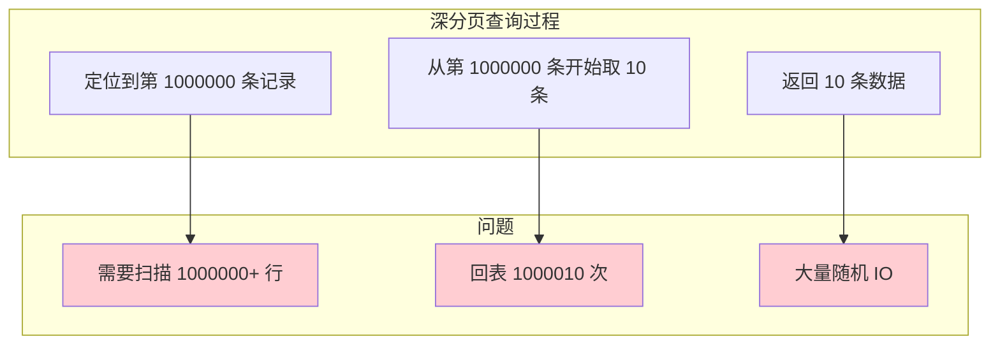
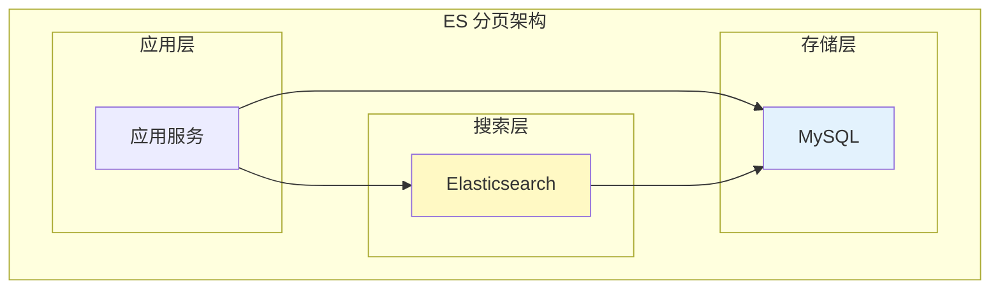

# 分页查询优化

> **目标级别**：P5/P6
> **面试频率**：🔴 高频
> **面试官最关心的 3 个问题**：
> 1. 深分页查询有什么性能问题？
> 2. 如何优化深分页查询？
> 3. 为什么 `LIMIT 1000000, 10` 会慢？

面试官问：「分页查询怎么优化？」你说「加索引」——然后面试官紧接着追问「为什么 `LIMIT 1000000, 10` 会慢？怎么优化？」你沉默了。

这就是 MySQL 分页查询面试的真实面貌：表面上问的是优化，实际上考的是对查询执行原理的理解深度。

## 一、深分页性能问题

### 1.1 问题原因

```sql
-- 深分页查询
SELECT * FROM orders ORDER BY created_at DESC LIMIT 1000000, 10;

-- 问题分析：
-- 1. MySQL 需要扫描 1000010 行数据
-- 2. 只返回最后 10 行
-- 3. 前 1000000 行数据都是"无效"的
```

### 1.2 性能对比

```sql
-- 小偏移量查询
SELECT * FROM orders ORDER BY id LIMIT 10;
-- 时间：0.001 秒
-- 扫描行数：10 行

-- 深分页查询
SELECT * FROM orders ORDER BY id LIMIT 1000000, 10;
-- 时间：5.234 秒
-- 扫描行数：1000010 行
```

### 1.3 原因分析



## 二、常见优化方案

### 2.1 延迟关联

```sql
-- ❌ 原始深分页
SELECT * FROM orders ORDER BY id LIMIT 1000000, 10;

-- ✅ 优化：延迟关联
SELECT o.* FROM orders o
INNER JOIN (
    SELECT id FROM orders
    ORDER BY id
    LIMIT 1000000, 10
) t ON o.id = t.id;

-- 原理：
-- 1. 子查询只查询主键，不需要回表
-- 2. 再用主键关联获取完整数据
-- 3. 只进行 10 次回表（而不是 1000010 次）
```

### 2.2 游标分页

```sql
-- ❌ 原始深分页
SELECT * FROM orders ORDER BY id LIMIT 1000000, 10;

-- ✅ 优化：基于主键的游标分页
-- 第一页
SELECT * FROM orders ORDER BY id LIMIT 10;
-- 返回最后一条的 id = 10

-- 第二页（使用上一页最后一条的 id）
SELECT * FROM orders
WHERE id `>` 10
ORDER BY id
LIMIT 10;

-- 第三页
SELECT * FROM orders
WHERE id `>` 20
ORDER BY id
LIMIT 10;
```

### 2.3 记录上次查询位置

```java
// 应用层记录分页位置
public class PageRequest {
    private Long lastId;  // 上次查询最后一条的 id
    private Integer pageSize;

    public List<Order> queryOrders(PageRequest request) {
        if (request.getLastId() == null) {
            // 第一页
            return orderMapper.selectPage(null, request.getPageSize());
        }
        // 后续页面
        return orderMapper.selectPageByLastId(request.getLastId(), request.getPageSize());
    }
}
```

### 2.4 倒排分页

```sql
-- 场景：按时间倒序分页

-- ❌ 原始深分页
SELECT * FROM orders
WHERE created_at `<` '2024-01-01'
ORDER BY created_at DESC
LIMIT 1000000, 10;

-- ✅ 优化：倒排分页
-- 假设每页 10 条，第一页返回 id: 1000-991

-- 第二页查询
SELECT * FROM orders
WHERE created_at `<` '2024-01-01'
  AND id `<` 991  -- 使用上一页最后一条的 id
ORDER BY created_at DESC
LIMIT 10;
```

## 三、覆盖索引优化

### 3.1 创建覆盖索引

```sql
-- 创建覆盖索引
CREATE INDEX idx_id_created ON orders(id, created_at DESC);

-- 使用覆盖索引
SELECT id FROM orders ORDER BY id LIMIT 1000000, 10;
-- 使用索引排序，不需要回表
-- 再用 id 查询完整数据
```

### 3.2 验证覆盖索引

```sql
EXPLAIN SELECT id FROM orders ORDER BY id LIMIT 1000000, 10;
-- type: index
-- key: idx_id_created
-- Extra: Using index ✅ 覆盖索引

EXPLAIN SELECT * FROM orders ORDER BY id LIMIT 1000000, 10;
-- type: ALL
-- key: NULL ❌ 全表扫描
```

## 四、实战优化案例

### 4.1 订单列表分页

```sql
-- 场景：查询用户的订单列表（需要分页）

-- ❌ 原始 SQL
SELECT * FROM orders
WHERE user_id = 1
ORDER BY created_at DESC
LIMIT 1000000, 10;

-- ✅ 优化方案 1：延迟关联
SELECT o.* FROM orders o
INNER JOIN (
    SELECT id FROM orders
    WHERE user_id = 1
    ORDER BY created_at DESC
    LIMIT 1000000, 10
) t ON o.id = t.id;

-- ✅ 优化方案 2：游标分页
SELECT * FROM orders
WHERE user_id = 1 AND id `<` #{lastId}
ORDER BY id DESC
LIMIT 10;

-- 创建覆盖索引
CREATE INDEX idx_user_created ON orders(user_id, created_at DESC, id);
```

### 4.2 搜索结果分页

```sql
-- 场景：搜索订单（支持条件筛选）

-- 原始 SQL
SELECT * FROM orders
WHERE user_id = 1
  AND status = 1
  AND created_at `>=` '2024-01-01'
ORDER BY created_at DESC
LIMIT 1000000, 10;

-- 优化方案：使用主键游标
SELECT * FROM orders o
INNER JOIN (
    SELECT id FROM orders
    WHERE user_id = 1
      AND status = 1
      AND created_at `>=` '2024-01-01'
      AND id `<` #{lastId}
    ORDER BY id DESC
    LIMIT 10
) t ON o.id = t.id;
```

## 五、ES 分页方案

### 5.1 使用搜索引擎



### 5.2 常见分页方式

| 分页方式 | 说明 | 适用场景 |
|----------|------|----------|
| **深度分页** | `from + size` | 小数据量 |
| **游标分页** | `search_after` | 大数据量 |
| **滚动分页** | `scroll` | 数据导出 |

```json
// ES 深度分页（不推荐超过 10000）
GET /orders/_search
{
  "from": 10000,
  "size": 10,
  "query": {
    "term": { "user_id": 1 }
  },
  "sort": [{ "created_at": "desc" }]
}

// ES 游标分页（推荐）
GET /orders/_search
{
  "size": 10,
  "query": { "term": { "user_id": 1 } },
  "search_after": [1704067200000, 12345],
  "sort": [{ "created_at": "desc" }, { "id": "asc" }]
}
```

## 六、面试追问链设计

> **第一层**：为什么 `LIMIT 1000000, 10` 会慢？
> **第二层**：深分页查询需要扫描多少行数据？
> **第三层**：如何减少扫描行数？

> **第一层**：延迟关联是怎么优化的？
> **第二层**：延迟关联有什么限制？
> **第三层**：如果 ORDER BY 的字段不是主键，怎么优化？

> **第一层**：游标分页的原理是什么？
> **第二层**：游标分页相比 OFFSET 分页有什么优势？
> **第三层**：游标分页有什么限制？

## 七、常见面试陷阱

**⚠️ 陷阱 1**：认为加索引就能解决深分页问题
- 索引只能加速排序和过滤
- OFFSET 仍然需要扫描前面所有行

**⚠️ 陷阱 2**：忽略数据一致性问题
- 游标分页在数据变化时可能重复或遗漏
- 需要根据业务场景选择

**⚠️ 陷阱 3**：过度依赖 ES
- ES 增加了系统复杂度
- 小数据量场景不需要引入 ES

## 八、对比总结表

| 优化方案 | 原理 | 优点 | 缺点 |
|----------|------|------|------|
| **延迟关联** | 子查询主键 + 关联 | 实现简单 | 需改写 SQL |
| **游标分页** | 记录位置 + WHERE | 性能好 | 需改写代码 |
| **覆盖索引** | 索引包含所有字段 | 无需回表 | 索引维护成本 |
| **ES 分页** | 搜索引擎分页 | 功能强大 | 引入复杂度 |

## 九、加分回答

> **💡 面试加分点**：如果能说出分页查询的进阶知识和最佳实践，会给面试官留下深刻印象：
>
> 1. **为什么要用 id 而不是 created_at 作为游标**：id 是自增的，更适合做游标
>
> 2. **分页缓存**：热点数据可以缓存，减少数据库压力
>
> 3. **无限滚动**：前端无限滚动通常使用游标分页
>
> 4. **数据导出**：大数据量导出使用流式查询，不要用分页
