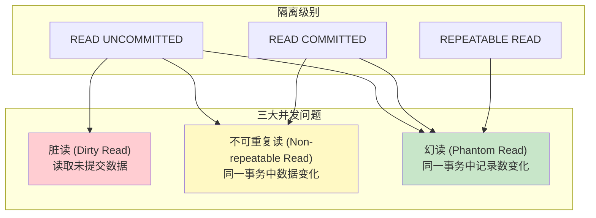
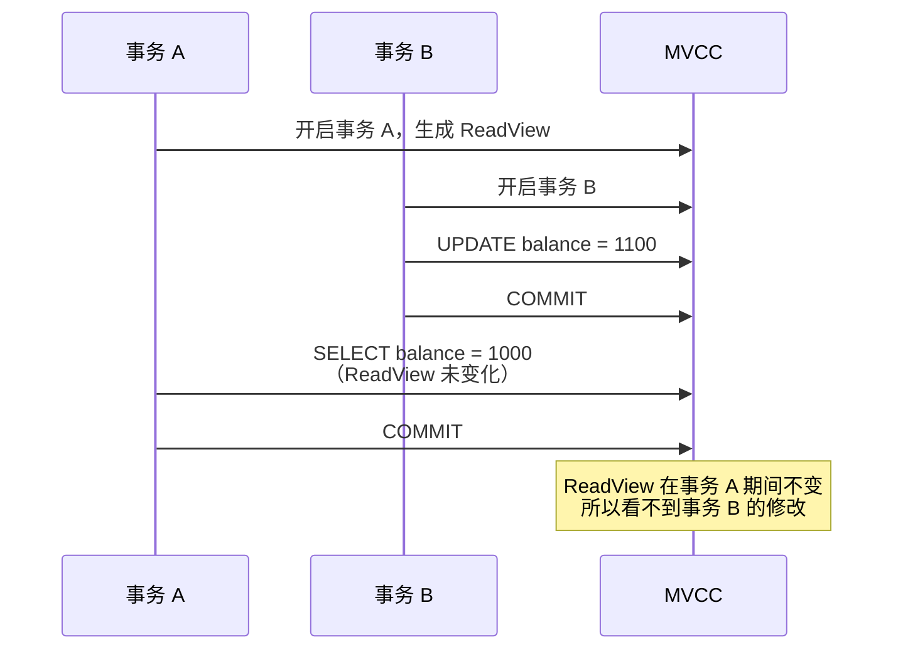

# 脏读、不可重复读与幻读

> **目标级别**：P5/P6
> **面试频率**：🔴 高频
> **面试官最关心的 3 个问题**：
> 1. 脏读、不可重复读、幻读有什么区别？
> 2. 哪些隔离级别可以解决这些问题？
> 3. InnoDB 是如何解决幻读问题的？

面试官问：「什么是幻读？」你说「就是两次查询结果不一样」——然后面试官紧接着追问「那不可重复读和幻读有什么区别？分别怎么解决？」你沉默了。

这就是 MySQL 并发问题面试的真实面貌：表面上问的是概念，实际上考的是对事务隔离级别实现原理的理解深度。

## 一、三大并发问题概览



## 二、脏读（Dirty Read）

### 2.1 脏读的定义

**脏读**：一个事务读取了另一个事务未提交的数据。

```sql
-- 时间线
-- T1: 事务 A 开启
-- T2: 事务 A 修改 balance = 1000 -> 900（未提交）
-- T3: 事务 B 读取 balance = 900（脏读！）
-- T4: 事务 A 回滚（balance 恢复为 1000）
-- T5: 事务 B 使用 balance = 900 做其他操作（数据不一致！）

-- 会话 A（脏读场景）
SET SESSION transaction_isolation = 'READ-UNCOMMITTED';
START TRANSACTION;
UPDATE account SET balance = 900 WHERE id = 1;
-- 未提交！

-- 会话 B（读取到未提交数据）
START TRANSACTION;
SELECT balance FROM account WHERE id = 1;  -- 返回 900（脏读）
-- 如果会话 A 回滚，会话 B 读取的就是不存在的数据
COMMIT;
```

### 2.2 脏读的危害

| 危害 | 说明 |
|------|------|
| **数据不一致** | 读取到不存在的数据 |
| **业务错误** | 基于脏数据做决策 |
| **级联问题** | 脏数据导致后续操作错误 |

## 三、不可重复读（Non-repeatable Read）

### 3.1 不可重复读的定义

**不可重复读**：在同一事务中，两次读取同一数据，得到不同的结果。

```sql
-- 时间线
-- T1: 事务 A 读取 balance = 1000
-- T2: 事务 B 修改 balance = 1100 并提交
-- T3: 事务 A 再次读取 balance = 1100（不可重复读！）

-- 会话 A（不可重复读场景）
SET SESSION transaction_isolation = 'READ-COMMITTED';
START TRANSACTION;

-- 第一次读取
SELECT balance FROM account WHERE id = 1;  -- 返回 1000

-- 会话 B（修改并提交）
START TRANSACTION;
UPDATE account SET balance = 1100 WHERE id = 1;
COMMIT;

-- 会话 A 再次读取
SELECT balance FROM account WHERE id = 1;  -- 返回 1100（不可重复读！）
COMMIT;
```

### 3.2 不可重复读 vs 脏读

| 对比维度 | 脏读 | 不可重复读 |
|----------|------|-------------|
| **读取数据** | 未提交的数据 | 已提交的数据 |
| **隔离级别** | READ UNCOMMITTED | READ COMMITTED |
| **回滚影响** | 读取的数据可能不存在 | 读取的数据确实存在 |

## 四、幻读（Phantom Read）

### 4.1 幻读的定义

**幻读**：在同一事务中，两次执行相同的查询，返回的记录数不同（新增或删除）。

```sql
-- 时间线
-- T1: 事务 A 查询 orders：10 条记录
-- T2: 事务 B 插入 2 条新记录并提交
-- T3: 事务 A 再次查询 orders：12 条记录（幻读！）

-- 会话 A（幻读场景）
SET SESSION transaction_isolation = 'REPEATABLE-READ';
START TRANSACTION;

-- 第一次查询
SELECT COUNT(*) FROM orders WHERE user_id = 1;  -- 返回 10

-- 会话 B（插入新记录）
START TRANSACTION;
INSERT INTO orders (user_id, amount) VALUES (1, 100);
INSERT INTO orders (user_id, amount) VALUES (1, 200);
COMMIT;

-- 会话 A 再次查询
SELECT COUNT(*) FROM orders WHERE user_id = 1;  -- 返回 12（幻读！）
COMMIT;
```

### 4.2 幻读的特殊性

```sql
-- 幻读不仅限于 INSERT，还包括 DELETE

-- 会话 A
SELECT * FROM orders WHERE user_id = 1;  -- 10 条记录

-- 会话 B
DELETE FROM orders WHERE user_id = 1 AND id = 100;
COMMIT;

-- 会话 A 再次查询
SELECT * FROM orders WHERE user_id = 1;  -- 9 条记录（幻读！）
```

### 4.3 当前读 vs 快照读

```sql
-- 幻读出现在快照读（SELECT）
-- 当前读（SELECT ... FOR UPDATE）不会出现幻读

-- 会话 A（当前读锁定范围）
START TRANSACTION;
SELECT * FROM orders WHERE user_id = 1 FOR UPDATE;
-- 锁定 user_id=1 的所有记录 + 间隙

-- 会话 B（无法插入）
INSERT INTO orders (user_id, amount) VALUES (1, 100);
-- 阻塞或报错：Lock wait timeout exceeded

COMMIT;
```

## 五、问题对比

### 5.1 三种问题对比表

| 问题 | 场景 | 读取内容 | 隔离级别 | 解决方案 |
|------|------|----------|----------|----------|
| **脏读** | 读取未提交 | 其他事务的修改 | READ UNCOMMITTED | 升级到 READ COMMITTED |
| **不可重复读** | 读取已提交 | 修改的数据行 | READ COMMITTED | 升级到 REPEATABLE READ |
| **幻读** | 读取已提交 | 新增/删除的记录 | REPEATABLE READ | InnoDB 间隙锁 |

### 5.2 可重复读 vs 不可重复读

```sql
-- 可重复读：同一事务中多次读取，数据不变
SET SESSION transaction_isolation = 'REPEATABLE-READ';
START TRANSACTION;
SELECT balance FROM account WHERE id = 1;  -- 1000
-- 事务 B 修改并提交
SELECT balance FROM account WHERE id = 1;  -- 仍然是 1000
COMMIT;

-- 不可重复读：同一事务中多次读取，数据可能变化
SET SESSION transaction_isolation = 'READ-COMMITTED';
START TRANSACTION;
SELECT balance FROM account WHERE id = 1;  -- 1000
-- 事务 B 修改并提交
SELECT balance FROM account WHERE id = 1;  -- 变成 1100
COMMIT;
```

## 六、InnoDB 解决方案

### 6.1 MVCC 解决不可重复读



### 6.2 间隙锁解决幻读

```sql
-- InnoDB 的 REPEATABLE READ 通过间隙锁解决幻读

-- 会话 A
START TRANSACTION;
SELECT * FROM orders WHERE user_id = 1;
-- 加锁：锁定 user_id=1 的记录和前后间隙

-- 会话 B（尝试插入）
INSERT INTO orders (user_id, amount) VALUES (1, 100);
-- 被间隙锁阻塞！

COMMIT;  -- 事务 A 提交，间隙锁释放
-- 会话 B 的 INSERT 才能执行
```

## 七、面试追问链设计

> **第一层**：脏读、不可重复读、幻读有什么区别？
> **第二层**：脏读和不可重复读有什么区别？
> **第三层**：不可重复读和幻读有什么区别？

> **第一层**：哪些隔离级别可以解决脏读？
> **第二层**：哪些隔离级别可以解决不可重复读？
> **第三层**：哪些隔离级别可以解决幻读？

> **第一层**：InnoDB 是如何解决幻读问题的？
> **第二层**：MVCC 和间隙锁是怎么配合的？
> **第三层**：为什么可重复读能解决幻读，而读已提交不能？

## 八、常见面试陷阱

**⚠️ 陷阱 1**：混淆不可重复读和幻读
- 不可重复读：同一数据行内容变化
- 幻读：查询结果集多了或少了记录

**⚠️ 陷阱 2**：认为可重复读完全解决幻读
- 只有使用当前读（FOR UPDATE）时，间隙锁才生效
- 快照读仍然可能出现幻读

**⚠️ 陷阱 3**：忽略锁的开销
- 间隙锁会锁定更大范围，影响并发
- 串行化隔离级别性能最差

## 九、实战配置建议

### 9.1 不同场景的配置

| 场景 | 推荐隔离级别 | 原因 |
|------|-------------|------|
| **普通业务系统** | READ COMMITTED | 性能与一致性平衡 |
| **金融转账** | REPEATABLE READ | 保证数据一致性 |
| **报表查询** | READ COMMITTED | 允许读取最新数据 |
| **数据导入** | READ UNCOMMITTED | 允许读取部分数据 |

### 9.2 生产环境建议

```sql
-- 推荐配置
SET SESSION transaction_isolation = 'READ-COMMITTED';

-- 对于需要强一致性的操作，使用 SELECT ... FOR UPDATE
START TRANSACTION;
SELECT * FROM account WHERE id = 1 FOR UPDATE;
UPDATE account SET balance = balance - 100 WHERE id = 1;
COMMIT;
```

## 十、加分回答

> **💡 面试加分点**：如果能说出 MVCC 和间隙锁的配合原理，会给面试官留下深刻印象：
>
> 1. **快照读 vs 当前读**：快照读使用 MVCC，当前读使用锁
>
> 2. **Gap Lock vs Next-Key Lock**：间隙锁锁定间隙，临键锁锁定记录+间隙
>
> 3. **插入意向锁**：INSERT 操作在间隙中设置的锁
>
> 4. **锁优化**：减少锁范围、使用覆盖索引减少锁粒度
