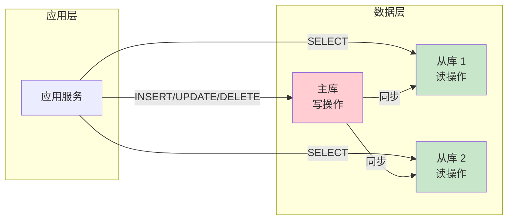
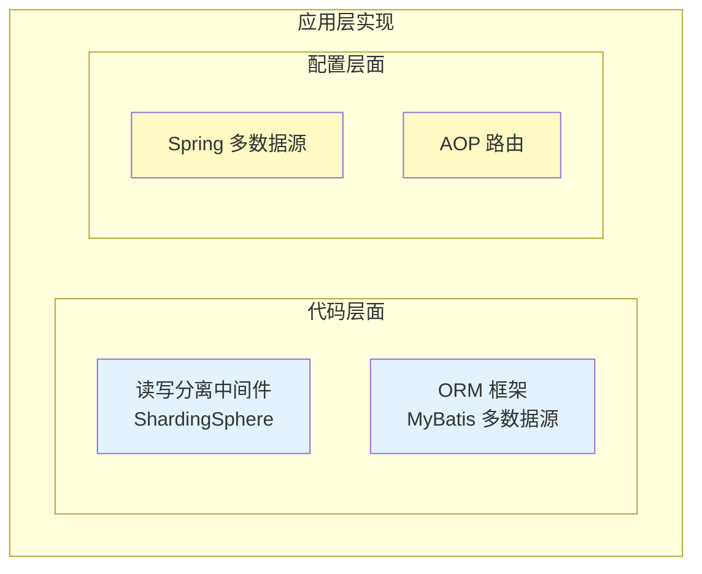
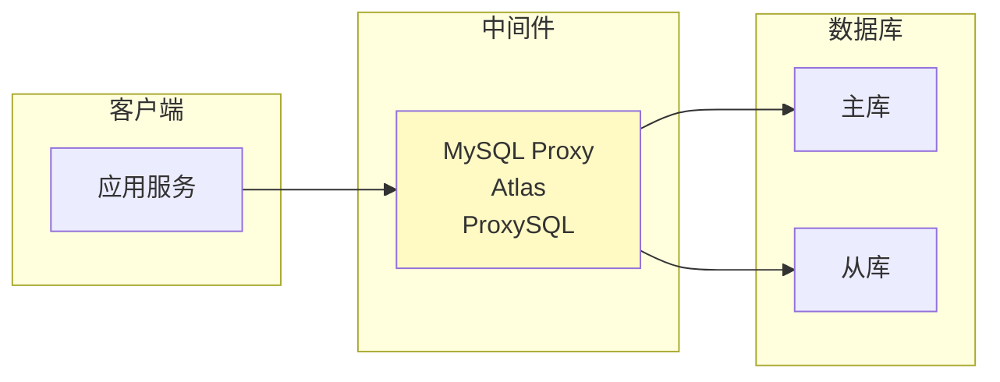
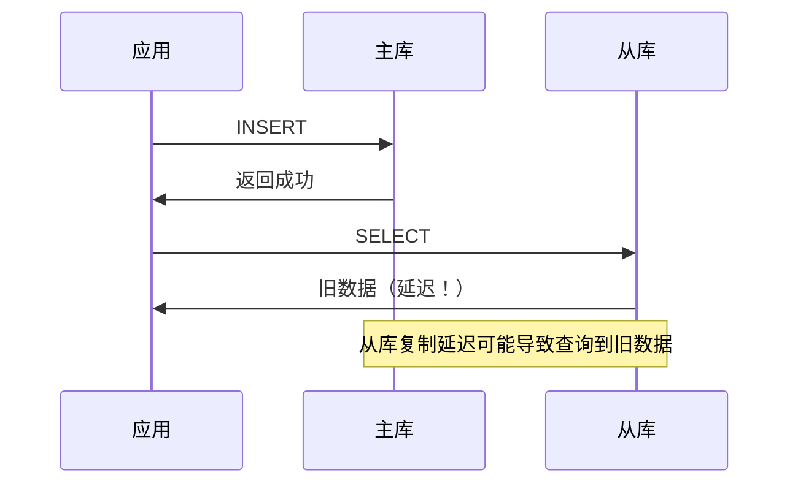

# 读写分离架构

> **目标级别**：P5/P6
> **面试频率**：🟡 中频
> **面试官最关心的 3 个问题**：
> 1. 什么是读写分离？为什么要读写分离？
> 2. 读写分离有哪些实现方式？
> 3. 读写分离有什么问题？如何解决？

面试官问：「你们系统用过读写分离吗？」你说「用过，就是读从库、写主库」——然后面试官紧接着追问「那主从延迟怎么处理？读写路由怎么实现的？」你沉默了。

这就是 MySQL 读写分离面试的真实面貌：表面上问的是架构，实际上考的是对主从复制和数据一致性的理解深度。

## 一、读写分离概述

### 1.1 什么是读写分离

**读写分离**：将读操作和写操作分配到不同的数据库实例，降低单一实例的负载压力。



### 1.2 读写分离的优势

| 优势 | 说明 |
|------|------|
| **负载均衡** | 分散读请求压力 |
| **性能提升** | 写操作不受读影响 |
| **可用性** | 从库故障不影响写 |
| **扩展性** | 方便增加从库 |

### 1.3 读写分离的挑战

| 挑战 | 说明 |
|------|------|
| **主从延迟** | 从库可能读到旧数据 |
| **数据一致性** | 延迟导致的数据不一致 |
| **路由复杂性** | 应用需要区分读写 |
| **故障切换** | 主库或从库故障处理 |

## 二、读写分离实现方式

### 2.1 应用层实现



#### 2.1.1 基于配置的方式

```yaml
# application.yml 配置多数据源
spring:
  datasource:
    master:
      url: jdbc:mysql://master:3306/mydb
      username: root
      password: xxx
    slave:
      url: jdbc:mysql://slave:3306/mydb
      username: root
      password: xxx
```

#### 2.1.2 基于 AOP 的方式

```java
@Aspect
@Component
public class ReadWriteSeparationAspect {

    @Around("@annotation(ReadOnly)")
    public Object routeToSlave(ProceedingJoinPoint point) throws Throwable {
        // 路由到从库
        DataSourceHolder.setDataSource(DataSourceType.SLAVE);
        try {
            return point.proceed();
        } finally {
            DataSourceHolder.clear();
        }
    }
}

// 使用
@ReadOnly
public List<Order> getOrders() {
    return orderMapper.selectList();
}
```

### 2.2 中间件实现



#### 2.2.1 常见中间件

| 中间件 | 说明 |
|--------|------|
| **MySQL Proxy** | MySQL 官方代理，已停止维护 |
| **Atlas** | 奇虎 360 开源，读写分离、连接池 |
| **ProxySQL** | MySQL 中间件，支持读写分离 |
| **ShardingSphere** | Apache 项目，强大的数据库生态 |

#### 2.2.2 ProxySQL 配置

```sql
-- ProxySQL 配置示例
INSERT INTO mysql_servers (hostgroup_id, hostname, port) VALUES (1, 'master', 3306);
INSERT INTO mysql_servers (hostgroup_id, hostname, port) VALUES (2, 'slave1', 3306);
INSERT INTO mysql_servers (hostgroup_id, hostname, port) VALUES (2, 'slave2', 3306);

-- 配置用户
INSERT INTO mysql_users (username, password, default_hostgroup) VALUES ('app', 'password', 1);

-- 配置路由规则
INSERT INTO mysql_query_rules (rule_id, match_pattern, destination_hostgroup, apply)
VALUES (1, '^SELECT.*', 2, 1);
INSERT INTO mysql_query_rules (rule_id, match_pattern, destination_hostgroup, apply)
VALUES (2, '^INSERT.*', 1, 1);
INSERT INTO mysql_query_rules (rule_id, match_pattern, destination_hostgroup, apply)
VALUES (3, '^UPDATE.*', 1, 1);
```

### 2.3 框架层面实现

```java
// ShardingSphere-JDBC 读写分离配置
DataSource dataSource = DataSourceFactory.createDataSource(
    DataSourceProperty.builder()
        .url("jdbc:mysql://master:3306/mydb")
        .username("root")
        .password("xxx")
        .build(),
    MasterSlaveRuleConfiguration.builder()
        .name("ds_master_slave")
        .masterDataSourceName("master")
        .slaveDataSourceNames(Arrays.asList("slave1", "slave2"))
        .build()
);
```

## 三、主从延迟问题

### 3.1 延迟原因



### 3.2 延迟处理策略

| 策略 | 说明 | 适用场景 |
|------|------|----------|
| **强制读主库** | 重要读操作读主库 | 金融、数据敏感 |
| **延迟检测** | 延迟过大时自动切换主库读 | 通用 |
| **缓存同步** | 写入后更新缓存 | 高一致性 |
| **半同步复制** | 等待从库确认 | 高一致性 |

### 3.3 延迟解决方案

#### 3.3.1 强制读主库

```java
// 基于注解的强制主库读
@ReadWrite
public class OrderService {

    // 强制���主库
    @Master  // 强制读主库
    public Order getOrderById(Long id) {
        return orderMapper.selectById(id);
    }

    // 读从库（默认）
    public List<Order> listOrders() {
        return orderMapper.selectList();
    }
}
```

#### 3.3.2 延迟检测与自动切换

```java
public class ReadWriteRouter {

    private static final long MAX_DELAY_MS = 1000;

    public DataSource route() {
        long delay = getSlaveDelay();
        if (delay > MAX_DELAY_MS) {
            // 延迟过大，读主库
            return masterDataSource;
        }
        return slaveDataSource;
    }

    private long getSlaveDelay() {
        // 从 SHOW SLAVE STATUS 获取延迟
        return slaveStatus.getSecondsBehindMaster() * 1000;
    }
}
```

## 四、常见问题与解决

### 4.1 问题一：读到旧数据

```sql
-- 场景：用户下单后立即查询订单

-- ❌ 出现问题
INSERT INTO orders (id, user_id, amount) VALUES (1, 1, 100);
-- 主库插入成功，立即返回

SELECT * FROM orders WHERE id = 1;
-- 从库可能还没同步，返回空（幻读！）

-- ✅ 解决方案：读主库
@Master
public Order getOrderById(Long id) {
    return orderMapper.selectById(id);
}
```

### 4.2 问题二：自增主键问题

```sql
-- 场景：获取刚插入数据的 ID

-- ❌ 可能出现问题
INSERT INTO orders (user_id, amount) VALUES (1, 100);
-- 返回自增 ID

SELECT * FROM orders WHERE id = #{id};
-- 从库可能还没同步，查询不到

-- ✅ 解决方案：读主库
@Master
public Long insertOrder(Order order) {
    orderMapper.insert(order);
    return getOrderById(order.getId());  // 读主库
}
```

### 4.3 问题三：分页查询问题

```sql
-- 场景：分页查询订单

-- 第一页查询
SELECT * FROM orders ORDER BY id LIMIT 10 OFFSET 0;
-- 返回 id: 100-91

-- 插入新订单
INSERT INTO orders (id, user_id, amount) VALUES (101, 1, 100);

-- 第二页查询（从库可能还没同步）
SELECT * FROM orders ORDER BY id LIMIT 10 OFFSET 10;
-- 重复返回 id: 100-91（第一页的部分数据）

-- ✅ 解决方案：使用主库分页
@Master
public List<Order> pageOrders(int page, int size) {
    return orderMapper.pageOrders(page, size);
}
```

## 五、面试追问链设计

> **第一层**：什么是读写分离？为什么要做读写分离？
> **第二层**：读写分离有哪些实现方式？
> **第三层**：如何判断一个查询应该路由到主库还是从库？

> **第一层**：读写分离有什么问题？
> **第二层**：主从延迟是怎么产生的？
> **第三层**：如何解决主从延迟导致的读写不一致问题？

> **第一层**：什么样的查询必须读主库？
> **第二层**：读写分离中间件是怎么实现的？
> **第三层**：ProxySQL 和 ShardingSphere 的读写分离有什么区别？

## 六、常见面试陷阱

**⚠️ 陷阱 1**：认为读写分离可以解决所有性能问题
- 读写分离主要用于读多写少场景
- 写多的场景需要其他方案

**⚠️ 陷阱 2**：忽略主从延迟的影响
- 主从延迟可能导致严重的数据不一致
- 需要根据业务场景选择读主库还是从库

**⚠️ 陷阱 3**：读写分离后不做延迟监控
- 延迟过大时需要自动切换到主库读
- 需要完善的监控和告警机制

## 七、对比总结表

| 实现方式 | 优点 | 缺点 | 适用场景 |
|----------|------|------|----------|
| **应用层 AOP** | 灵活、控制粒度细 | 侵入代码 | 微服务 |
| **中间件** | 无侵入 | 需要额外部署 | 中间件方案 |
| **框架层** | 配置简单 | 依赖框架 | 特定框架 |
| **数据库代理** | 功能丰富 | 性能损耗 | 企业级 |

## 八、加分回答

> **💡 面试加分点**：如果能说出读写分离的进阶知识和最佳实践，会给面试官留下深刻印象：
>
> 1. **延迟复制**：使用 `MASTER_DELAY` 实现延迟复制，用于数据恢复
>
> 2. **读写比例配置**：根据读写比例动态调整主从数量
>
> 3. **热点数据缓存**：读从库的数据加上缓存，减少数据库压力
>
> 4. **故障自动切换**：主库或从库故障时自动切换到其他节点
