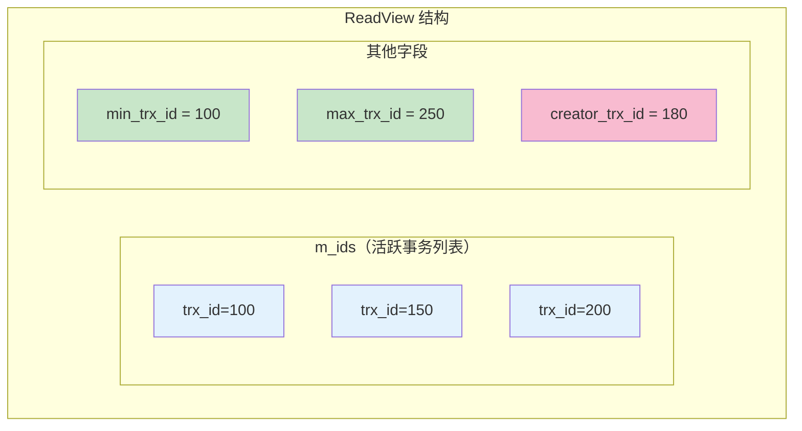
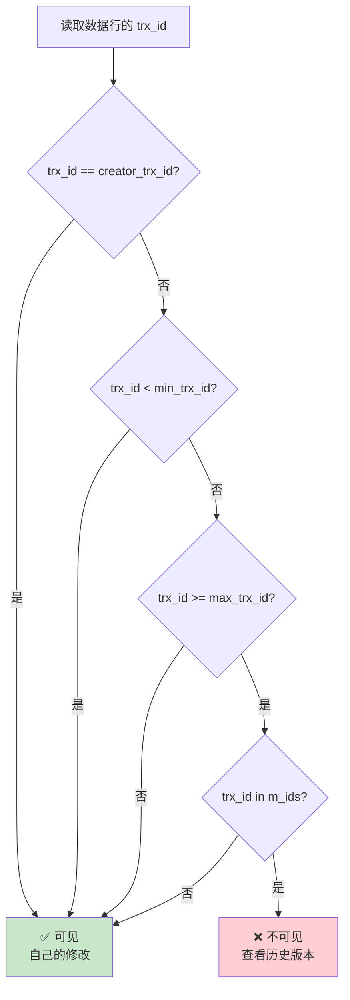
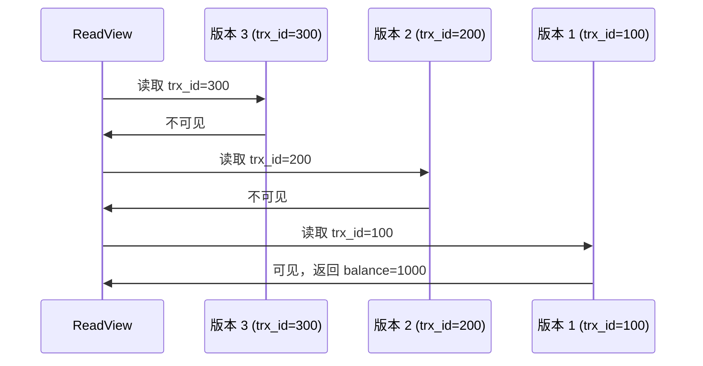

# ReadView 可见性判断

> **目标级别**：P6
> **面试频率**：🔴 高频
> **面试官最关心的 3 个问题**：
> 1. ReadView 的结构是怎样的？
> 2. ReadView 如何判断数据的可见性？
> 3. 不同隔离级别下 ReadView 的行为有什么不同？

面试官问：「ReadView 是怎么判断数据可见性的？」你说「就是判断事务 ID」——然后面试官紧接着追问「那具体怎么判断？为什么自己的修改可以看见，其他事务的修改不一定能看见？」你沉默了。

这就是 MySQL ReadView 可见性判断面试的真实面貌：表面上问的是规则，实际上考的是对 MVCC 核心机制的深入理解。

## 一、ReadView 核心结构

### 1.1 ReadView 的四个关键字段



### 1.2 字段含义详解

| 字段 | 说明 | 作用 |
|------|------|------|
| **m_ids** | 当前活跃事务的 ID 列表 | 判断事务是否仍在执行 |
| **min_trx_id** | m_ids 中的最小值 | 小于该值的事务已提交 |
| **max_trx_id** | 创建 ReadView 时的最大事务 ID + 1 | 大于等于该值的事务尚未创建 |
| **creator_trx_id** | 当前事务的 ID | 自己的修改总是可见 |

### 1.3 ReadView 生成时机

| 隔离级别 | ReadView 生成时机 | 说明 |
|----------|-------------------|------|
| READ UNCOMMITTED | 不生成 | 总是读取最新数据 |
| READ COMMITTED | 每次读取时生成 | 不同读取可能看到不同数据 |
| REPEATABLE READ | 事务开始时生成 | 同一事务多次读取数据相同 |
| SERIALIZABLE | 不使用 ReadView | 使用锁机制 |

## 二、可见性判断算法

### 2.1 判断流程图



### 2.2 判断规则总结

| 条件 | 结论 | 原因 |
|------|------|------|
| `trx_id == creator_trx_id` | ✅ 可见 | 自己的修改 |
| `trx_id < min_trx_id` | ✅ 可见 | 事务已提交 |
| `trx_id >= max_trx_id` | ❌ 不可见 | 事务尚未开始 |
| `trx_id in m_ids` | ❌ 不可见 | 事务仍在执行 |

### 2.3 伪代码实现

```sql
-- MySQL ReadView 可见性判断伪代码
CREATE DEFINER=`root`@`%` FUNCTION `readview_check`(
    IN read_view_min_trx_id BIGINT,
    IN read_view_max_trx_id BIGINT,
    IN read_view_m_ids JSON,
    IN read_view_creator_trx_id BIGINT,
    IN data_trx_id BIGINT
)
RETURNS tinyint(1)
BEGIN
    -- 1. 自己的修改总是可见
    IF data_trx_id = read_view_creator_trx_id THEN
        RETURN TRUE;
    END IF;

    -- 2. 事务已提交（trx_id 小于最小活跃事务）
    IF data_trx_id < read_view_min_trx_id THEN
        RETURN TRUE;
    END IF;

    -- 3. 事务尚未开始（trx_id 大于等于最大事务）
    IF data_trx_id >= read_view_max_trx_id THEN
        RETURN FALSE;
    END IF;

    -- 4. 事务仍在活跃
    IF data_trx_id IN (SELECT * FROM JSON_TABLE(
        read_view_m_ids, '$[*]' COLUMNS (id BIGINT PATH '$')
    )) THEN
        RETURN FALSE;
    END IF;

    RETURN TRUE;
END;
```

## 三、实战案例分析

### 3.1 案例一：自己的修改可见

```sql
-- 事务 A（trx_id=180）
START TRANSACTION;
UPDATE account SET balance = 1100 WHERE id = 1;  -- 自己的修改

SELECT balance FROM account WHERE id = 1;  -- balance=1100，✅ 可见
-- 判断：trx_id=180 == creator_trx_id=180

COMMIT;
```

### 3.2 案例二：已提交事务可见

```sql
-- 时间线：
-- T1: 事务 100 修改 balance=1000 并提交
-- T2: 事务 A（trx_id=180）开启，生成 ReadView

-- ReadView: m_ids=[180, 200], min_trx_id=180, max_trx_id=250

-- 事务 A 读取数据
-- 数据行的 trx_id=100
-- 判断：trx_id=100 < min_trx_id=180
-- 结论：✅ 可见（事务 100 已提交）
```

### 3.3 案例三：未开始事务不可见

```sql
-- 时间线：
-- T1: 事务 A（trx_id=180）开启，生成 ReadView
-- T2: 事务 250 还未开始

-- ReadView: m_ids=[180, 200], min_trx_id=180, max_trx_id=250

-- 事务 A 读取数据
-- 数据行的 trx_id=250
-- 判断：trx_id=250 >= max_trx_id=250
-- 结论：❌ 不可见（事务 250 尚未开始）
```

### 3.4 案例四：活跃事务不可见

```sql
-- 时间线：
-- T1: 事务 A（trx_id=180）开启，生成 ReadView
-- T2: 事务 B（trx_id=200）正在执行，未提交

-- ReadView: m_ids=[180, 200], min_trx_id=180, max_trx_id=250

-- 事务 A 读取数据
-- 数据行的 trx_id=200
-- 判断：trx_id=200 >= max_trx_id=250? 否
-- 判断：trx_id=200 in m_ids=[180, 200]? 是
-- 结论：❌ 不可见（事务 B 仍在活跃）
```

## 四、版本链回溯

### 4.1 不可见时的处理

```sql
-- 当数据行不可见时，通过 roll_ptr 找到历史版本
-- 重复可见性判断，直到找到可见版本或遍历完版本链

SELECT balance FROM account WHERE id = 1;

-- 1. 读取最新版本（trx_id=300）
-- 2. 判断：trx_id=300 不可见（事务 300 尚未提交）
-- 3. 通过 roll_ptr 找到历史版本（trx_id=200）
-- 4. 判断：trx_id=200 in m_ids，不可见
-- 5. 通过 roll_ptr 找到更早版本（trx_id=100）
-- 6. 判断：trx_id=100 < min_trx_id，可见
-- 7. 返回 trx_id=100 的 balance=1000
```

### 4.2 版本链遍历过程



## 五、隔离级别对比

### 5.1 READ COMMITTED vs REPEATABLE READ

```sql
-- READ COMMITTED：每次读取都生成新 ReadView
SET SESSION transaction_isolation = 'READ-COMMITTED';
START TRANSACTION;

SELECT balance FROM account WHERE id = 1;  -- ReadView 1
-- 事务 B 提交，trx_id=200

SELECT balance FROM account WHERE id = 1;  -- ReadView 2（新生成）
-- 可以看到事务 B 的修改
```

```sql
-- REPEATABLE READ：事务开始时生成 ReadView
SET SESSION transaction_isolation = 'REPEATABLE-READ';
START TRANSACTION;

SELECT balance FROM account WHERE id = 1;  -- ReadView（事务开始时生成）
-- 事务 B 提交，trx_id=200

SELECT balance FROM account WHERE id = 1;  -- 同一 ReadView
-- 看不到事务 B 的修改（trx_id=200 在 m_ids 中）
```

### 5.2 核心差异

| 场景 | READ COMMITTED | REPEATABLE READ |
|------|---------------|-----------------|
| ReadView 生成时机 | 每次读取时 | 事务开始时 |
| 同一事务多次读取 | 可能不同 | 总是相同 |
| 事务提交后可见性 | 下次读取即可见 | 事务结束后才可见 |

## 六、面试追问链设计

> **第一层**：ReadView 的结构是怎样的？
> **第二层**：ReadView 是如何判断数据可见性的？
> **第三层**：版本链回溯的过程是什么？

> **第一层**：Read Committed 和 Repeatable Read 的 ReadView 有什么区别？
> **第二层**：为什么可重复读��� ReadView 在事务期间不变化？
> **第三层**：这种设计对并发性能有什么影响？

> **第一层**：为什么 `trx_id == creator_trx_id` 的数据总是可见的？
> **第二层**：如果版本链太长会有什么性能问题？
> **第三层**：MySQL 是怎么优化版本链遍历的？

## 七、常见面试陷阱

**⚠️ 陷阱 1**：认为 ReadView 是实时更新的
- ReadView 在 REPEATABLE READ 下是事务级别的快照
- 不是实时反映其他事务的状态

**⚠️ 陷阱 2**：忽略 max_trx_id 的作用
- max_trx_id 是「创建 ReadView 时的最大事务 ID + 1」
- 大于等于 max_trx_id 的事务在 ReadView 创建时尚未开始

**⚠️ 陷阱 3**：混淆 m_ids 和 min_trx_id
- m_ids 是活跃事务 ID 列表
- min_trx_id 是 m_ids 中的最小值

## 八、性能优化建议

### 8.1 避免长事务

```sql
-- 长事务会导致 m_ids 包含大量事务 ID
-- 减少可见版本的可能性

-- ✅ 良好的事务设计
START TRANSACTION;
-- 业务操作
COMMIT;

-- ❌ 长事务
START TRANSACTION;
-- 大量业务操作（耗时 10 分钟）
COMMIT;
```

### 8.2 监控 ReadView 状态

```sql
-- 查看当前活跃事务
SELECT * FROM information_schema.INNODB_TRX
WHERE trx_state = 'RUNNING';

-- 查看事务等待情况
SELECT * FROM information_schema.INNODB_LOCK_WAITS;

-- 查看锁等待超时时间
SHOW VARIABLES LIKE 'innodb_lock_wait_timeout';
```

## 九、加分回答

> **💡 面试加分点**：如果能说出 MySQL 8.0 对 ReadView 的优化，会给面试官留下深刻印象：
>
> 1. **ReadView 数据结构优化**：MySQL 8.0 使用数组替代链表
>
> 2. **purge 线程与 ReadView 配合**：根据最老的 ReadView 清理 Undo Log
>
> 3. **一致性锁定读**：使用 `SELECT ... FOR UPDATE` 强制读取最新数据
>
> 4. **MVCC 与锁的配合**：快照读用 MVCC，当前读用锁
