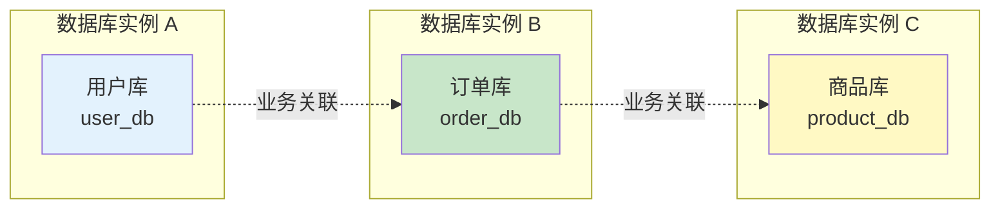
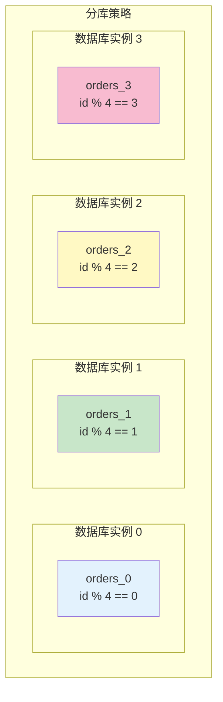

# 分库分表策略

> **目标级别**：P6
> **面试频率**：🟡 中频
> **面试官最关心的 3 个问题**：
> 1. 什么时候需要分库分表？
> 2. 分库分表有哪些策略？
> 3. 分库分表后如何跨表查询？

面试官问：「数据量太大了怎么办？」你说「分库分表」——然后面试官紧接着追问「怎么分？按什么维度分？分完之后怎么查询？」你沉默了。

这就是 MySQL 分库分表面试的真实面貌：表面上问的是方案，实际上考的是对数据架构和分布式系统的理解深度。

## 一、分库分表时机

### 1.1 分库分表的原因

| 原因 | 说明 |
|------|------|
| **单表数据量过大** | 单表超过 500 万行或 2GB |
| **单库连接数过多** | 连接数超过 1000 |
| **磁盘空间不足** | 磁盘使用超过 80% |
| **性能下降** | 查询变慢，索引失效 |

### 1.2 分库分表时机判断

```sql
-- 查看表大小
SELECT 
    table_name,
    ROUND(data_length / 1024 / 1024, 2) AS '数据大小(MB)',
    ROUND(index_length / 1024 / 1024, 2) AS '索引大小(MB)',
    ROUND((data_length + index_length) / 1024 / 1024, 2) AS '总大小(MB)',
    table_rows AS '行数'
FROM information_schema.tables
WHERE table_schema = 'mydb' AND table_name = 'orders';

-- 查看连接数
SHOW STATUS LIKE 'Threads_connected';
SHOW VARIABLES LIKE 'max_connections';
```

### 1.3 分库分表前优化

```sql
-- 在分库分表之前，先尝试以下优化：

-- 1. 优化索引
CREATE INDEX idx_created_at ON orders(created_at);

-- 2. 清理冷数据
DELETE FROM orders WHERE created_at `<` DATE_SUB(NOW(), INTERVAL 2 YEAR);

-- 3. 分区表
ALTER TABLE orders PARTITION BY RANGE (YEAR(created_at)) (
    PARTITION p2022 VALUES LESS THAN (2023),
    PARTITION p2023 VALUES LESS THAN (2024),
    PARTITION p2024 VALUES LESS THAN (2025),
    PARTITION p_future VALUES LESS THAN MAXVALUE
);
```

## 二、分库分表策略

### 2.1 垂直分库

**垂直分库**：按照业务将表分布到不同的数据库。



### 2.2 垂直分表

**垂直分表**：将大表按字段拆分成多个表。

```sql
-- 原始表
CREATE TABLE orders (
    id BIGINT PRIMARY KEY,
    order_no VARCHAR(32),
    user_id BIGINT,
    amount DECIMAL(10,2),
    status TINYINT,
    created_at DATETIME,
    updated_at DATETIME,
    -- 扩展字段
    remark TEXT,           -- 备注（可能很大）
    shipping_address TEXT, -- 收货地址（可能很大）
    extra JSON            -- 扩展信息
);

-- 垂直分表

-- 主表（核心字段，经常查询）
CREATE TABLE orders (
    id BIGINT PRIMARY KEY,
    order_no VARCHAR(32),
    user_id BIGINT,
    amount DECIMAL(10,2),
    status TINYINT,
    created_at DATETIME,
    updated_at DATETIME
);

-- 扩展表（不常用字段）
CREATE TABLE orders_ext (
    id BIGINT PRIMARY KEY,
    order_id BIGINT,
    remark TEXT,
    shipping_address TEXT,
    extra JSON,
    FOREIGN KEY (order_id) REFERENCES orders(id)
);
```

### 2.3 水平分库

**水平分库**：将数据分布到不同的数据库实例。



### 2.4 水平分表

**水平分表**：将数据分布到同一实例的不同表。

```sql
-- 按 ID 分表
CREATE TABLE orders_0 (
    id BIGINT,
    ...
    PRIMARY KEY (id)
);

CREATE TABLE orders_1 (
    id BIGINT,
    ...
    PRIMARY KEY (id)
);

CREATE TABLE orders_2 (
    id BIGINT,
    ...
    PRIMARY KEY (id)
);

CREATE TABLE orders_3 (
    id BIGINT,
    ...
    PRIMARY KEY (id)
);
```

## 三、分片键选择

### 3.1 分片键原则

| 原则 | 说明 |
|------|------|
| **业务相关性** | 选择查询最频繁的字段 |
| **数据均匀** | 数据分布要均匀 |
| **查询条件** | 大多数查询包含分片键 |
| **避免跨表查询** | 分片键要支持主要业务 |

### 3.2 常见分片键

| 分片键 | 适用场景 | 优点 | 缺点 |
|--------|----------|------|------|
| **user_id** | C 端业务 | 按用户查询快 | 用户数据不均匀 |
| **created_at** | 时间业务 | 数据自然增长 | 热点数据集中 |
| **region_id** | 地域业务 | 按地域查询快 | 地域数据不均 |
| **order_id** | 订单业务 | 均匀分布 | 需要 ID 生成器 |

### 3.3 分片算法

| 算法 | 说明 | 适用场景 |
|------|------|----------|
| **取模（Mod）** | `hash(key) % n` | ID 均匀分布 |
| **范围（Range）** | 按 ID 范围分 | 时间序列 |
| **哈希（Hash）** | 自定义哈希 | 字符串分片键 |
| **一致性哈希** | 哈希环分配 | 动态扩容 |

## 四、分库分表中间件

### 4.1 常见中间件

| 中间件 | 说明 |
|--------|------|
| **ShardingSphere-JDBC** | Java 客户端，分库分表 |
| **ShardingSphere-Proxy** | 代理模式，支持多语言 |
| **MyCat** | Java 代理，数据库中间件 |
| **Atlas** | 读写分离，分库分表 |

### 4.2 ShardingSphere 配置示例

```yaml
# ShardingSphere 分库分表配置
spring:
  shardingsphere:
    datasource:
      ds_0:
        url: jdbc:mysql://db0:3306/mydb
        username: root
        password: xxx
      ds_1:
        url: jdbc:mysql://db1:3306/mydb
        username: root
        password: xxx
    rules:
      sharding:
        tables:
          orders:
            actualDataNodes: ds_${0..1}.orders_${0..3}
            tableStrategy:
              standard:
                shardingColumn: user_id
                shardingAlgorithmName: orders_mod
            keyGenerateStrategy:
              column: id
              keyGeneratorName: snowflake
        shardingAlgorithms:
          orders_mod:
            type: INLINE
            props:
              algorithm-expression: orders_${user_id % 4}
```

## 五、跨表查询方案

### 5.1 广播表

```sql
-- 广播表：所有分片都存储完整数据
CREATE TABLE sys_config (
    id BIGINT PRIMARY KEY,
    config_key VARCHAR(100),
    config_value VARCHAR(500),
    created_at DATETIME
) ENGINE=InnoDB;

-- 配置为广播表，所有分片都存储完整数据
-- INSERT INTO sys_config VALUES(...); -- 所有分片都插入
-- SELECT * FROM sys_config WHERE config_key = 'xxx'; -- 路由到所有分片，结果聚合
```

### 5.2 跨分片查询

```sql
-- ❌ 不推荐：跨分片关联查询
SELECT o.*, u.name
FROM orders o
INNER JOIN user u ON o.user_id = u.id
WHERE o.user_id IN (1, 2, 3, 4, 5);

-- ✅ 推荐：业务层面聚合
-- 1. 查询订单
SELECT * FROM orders WHERE user_id = 1;
-- 2. 根据返回的 user_id 批量查询用户
SELECT * FROM user WHERE id IN (1, 2, 3);
-- 3. 应用层聚合结果
```

### 5.3 异构索引表

```sql
-- 订单按 user_id 分片，用户按 id 分片
-- 订单查询需要按订单号查询

-- 创建异构索引表（以订单号为分片键）
CREATE TABLE order_no_index (
    order_no VARCHAR(32) PRIMARY KEY,
    user_id BIGINT
);

-- 订单表按 user_id 分片，索引表按 order_no 分片
-- 查询时先查索引表获取 user_id，再查订单表
```

## 六、面试追问链设计

> **第一层**：什么时候需要分库分表？
> **第二层**：分库和分表有什么区别？各自适用什么场景？
> **第三层**：在分库分表之前，还有哪些优化手段？

> **第一层**：分片键怎么选择？
> **第二层**：如果用户表和订单表都按 user_id 分片，关联查询会更快吗？
> **第三层**：如果按时间分表，历史数据怎么归档？

> **第一层**：分库分表后如何跨表查询？
> **第二层**：什么是广播表？
> **第三层**：如何实现跨分片的分页查询？

## 七、常见面试陷阱

**⚠️ 陷阱 1**：过早分库分表
- 分库分表会增加系统复杂度
- 优先考虑分区表、冷热数据分离

**⚠️ 陷阱 2**：分片键选择不当
- 分片键选择不合理导致数据不均匀
- 跨分片查询成为瓶颈

**⚠️ 陷阱 3**：忽略运维成本
- 分库分表后运维复杂度大幅增加
- 需要考虑数据迁移、扩容、监控

## 八、对比总结表

| 分片策略 | 适用场景 | 优点 | 缺点 |
|----------|----------|------|------|
| **垂直分库** | 多业务分离 | 职责清晰 | 跨库查询 |
| **垂直分表** | 表字段过多 | 减少 IO | 需要关联 |
| **水平分库** | 数据量大 | 分散负载 | 跨库查询 |
| **水平分表** | 单表大 | 减少数据量 | 跨表查询 |

## 九、加分回答

> **💡 面试加分点**：如果能说出分库分表的最佳实践和进阶知识，会给面试官留下深刻印象：
>
> 1. **弹性扩容**：使用一致性哈希实现平滑扩容
>
> 2. **数据迁移**：使用双写方案实现平滑迁移
>
> 3. **分布式事务**：使用 Seata 实现跨库事务
>
> 4. **分库分表治理**：监控、告警、自动扩容
