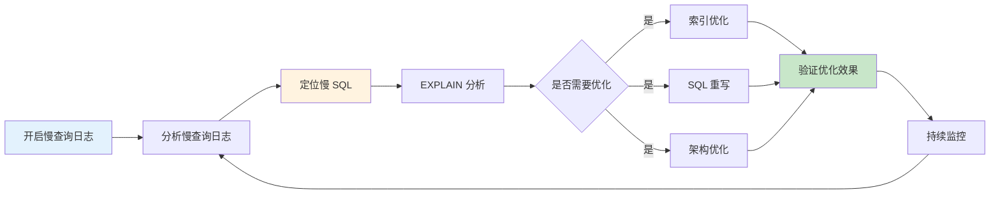

# 慢查询日志与优化

> **目标级别**：P5/P6
> **面试频率**：🔴 高频
> **面试官最关心的 3 个问题**：
> 1. 如何开启和配置慢查询日志？
> 2. 如何分析慢查询？
> 3. 常见的慢查询优化方法有哪些？

面试官问：「线上有个查询特别慢，怎么排查？」你说「看执行计划」——然后面试官紧接着追问「怎么找到慢查询？有哪些优化手段？」你沉默了。

这就是 MySQL 慢查询优化面试的真实面貌：表面上问的是工具，实际上考的是对查询优化全链路的能力。

## 一、慢查询日志配置

### 1.1 开启慢查询日志

```sql
-- 查看慢查询日志配置
SHOW VARIABLES LIKE 'slow_query%';
SHOW VARIABLES LIKE 'long_query_time';

-- 开启慢查询日志（临时生效）
SET GLOBAL slow_query_log = 'ON';
SET GLOBAL long_query_time = 1;  -- 超过 1 秒记录

-- 配置文件永久生效（my.cnf）
[mysqld]
slow_query_log = 1
slow_query_log_file = /var/log/mysql/slow.log
long_query_time = 1
log_queries_not_using_indexes = 1  -- 记录未使用索引的查询
```

### 1.2 慢查询日志格式

```bash
# Time: 2024-01-15T10:30:00.123456Z
# User@Host: app_user[app_user] @ localhost [127.0.0.1]
# Query_time: 3.542301  Lock_time: 0.000123 Rows_sent: 100  Rows_examined: 1000000
SET timestamp=1705312200;
SELECT * FROM orders WHERE user_id = 1 ORDER BY created_at DESC LIMIT 10;
```

### 1.3 慢查询日志字段说明

| 字段 | 说明 |
|------|------|
| **Query_time** | 查询执行时间 |
| **Lock_time** | 表锁等待时间 |
| **Rows_sent** | 返回行数 |
| **Rows_examined** | 扫描行数（最重要） |
| **Query** | SQL 语句 |

## 二、慢查询分析工具

### 2.1 mysqldumpslow

```bash
# 解析慢查询日志
mysqldumpslow -s t /var/log/mysql/slow.log

# 参数说明：
# -s t: 按执行时间排序
# -s c: 按扫描行数排序
# -s l: 按锁时间排序
# -s r: 按返回行数排序
# -t 10: 只显示前 10 条

# 常用命令
mysqldumpslow -s t -t 10 /var/log/mysql/slow.log          # 按时间取 Top10
mysqldumpslow -s c -t 10 /var/log/mysql/slow.log          # 按次数取 Top10
mysqldumpslow -s r -t 10 /var/log/mysql/slow.log          # 按返回行数取 Top10
```

### 2.2 pt-query-digest

```bash
# 安装 Percona Toolkit
# yum install percona-toolkit

# 分析慢查询
pt-query-digest /var/log/mysql/slow.log

# 生成报告
pt-query-digest --report-format=query_report \
    --filter='$event->{bytes} `>` 1024' \
    /var/log/mysql/slow.log
```

### 2.3 查询分析命令

```sql
-- 查看当前正在执行的慢查询
SHOW FULL PROCESSLIST;

-- 查看慢查询数量
SHOW STATUS LIKE 'Slow_queries';

-- 重置慢查询统计
RESET QUERY CACHE;

-- 查看所有索引使用情况
SHOW INDEX FROM orders;
```

## 三、慢查询优化步骤



## 四、常见慢查询优化方法

### 4.1 索引优化

```sql
-- 场景：全表扫描
SELECT * FROM orders WHERE status = 1;

-- 优化：添加索引
CREATE INDEX idx_status ON orders(status);

-- 验证优化效果
EXPLAIN SELECT * FROM orders WHERE status = 1;
-- type: ref ✅
-- rows: 10（大幅减少）
```

### 4.2 SQL 重写

```sql
-- 场景：深分页查询
SELECT * FROM orders LIMIT 1000000, 10;

-- 优化方案 1：延迟关联
SELECT o.* FROM orders o
INNER JOIN (
    SELECT id FROM orders
    ORDER BY created_at DESC
    LIMIT 1000000, 10
) t ON o.id = t.id;

-- 优化方案 2：游标分页
SELECT * FROM orders
WHERE id `<` 1000000
ORDER BY id DESC
LIMIT 10;

-- 优化方案 3：记录上次查询位置
-- 记录上一页最后一条的 id
SELECT * FROM orders
WHERE id `<` #{last_id}
ORDER BY id DESC
LIMIT 10;
```

### 4.3 减少扫描行数

```sql
-- 场景：扫描大量行但返回少量数据
SELECT * FROM orders WHERE YEAR(created_at) = 2024;

-- 优化方案 1：改写为范围查询
SELECT * FROM orders
WHERE created_at `>=` '2024-01-01'
  AND created_at `<` '2025-01-01';

-- 优化方案 2：添加虚拟列
ALTER TABLE orders ADD COLUMN order_year INT
GENERATED ALWAYS AS (YEAR(created_at));
CREATE INDEX idx_order_year ON orders(order_year);

-- 优化后 SQL
SELECT * FROM orders WHERE order_year = 2024;
```

### 4.4 避免排序

```sql
-- 场景：ORDER BY 导致文件排序
SELECT * FROM orders WHERE user_id = 1 ORDER BY created_at DESC;

-- 优化：使用覆盖索引避免排序
CREATE INDEX idx_user_created ON orders(user_id, created_at DESC);

EXPLAIN SELECT * FROM orders WHERE user_id = 1 ORDER BY created_at DESC;
-- Extra: Using index condition ✅
-- 不再有 Using filesort
```

### 4.5 分解联接查询

```sql
-- 场景：多表 JOIN 性能差
SELECT o.*, u.name
FROM orders o
INNER JOIN user u ON o.user_id = u.id
WHERE u.city = '北京';

-- 优化：分解为多个简单查询
-- 第一步：查询北京用户
SELECT id FROM user WHERE city = '北京';
-- 结果：100 个用户 ID

-- 第二步：查询这些用户的订单
SELECT * FROM orders
WHERE user_id IN (100, 101, 102, ...)
LIMIT 1000;
```

## 五、实战案例分析

### 5.1 案例一：未使用索引

```sql
-- 慢查询日志
# Query_time: 5.234
SELECT * FROM orders WHERE order_no = 'ORD20240101';

-- 分析
EXPLAIN SELECT * FROM orders WHERE order_no = 'ORD20240101';
-- type: ALL（全表扫描）
-- key: NULL（未使用索引）

-- 优化：添加索引
CREATE UNIQUE INDEX idx_order_no ON orders(order_no);

EXPLAIN SELECT * FROM orders WHERE order_no = 'ORD20240101';
-- type: const
-- key: idx_order_no
```

### 5.2 案例二：全表扫描

```sql
-- 慢查询日志
# Query_time: 3.456  Rows_examined: 500000
SELECT * FROM orders WHERE status = 0;

-- 分析
EXPLAIN SELECT * FROM orders WHERE status = 0;
-- type: ALL
-- rows: 500000

-- 优化：添加索引
CREATE INDEX idx_status ON orders(status);

-- 但如果 0 和 1 各占 50%，查询优化器可能选择全表扫描
-- 优化：使用 FORCE INDEX
SELECT * FROM orders FORCE INDEX(idx_status) WHERE status = 0;
```

### 5.3 案例三：临时表和文件排序

```sql
-- 慢查询日志
# Query_time: 8.234  Using temporary; Using filesort
SELECT name, SUM(amount) FROM orders GROUP BY name;

-- 分析
EXPLAIN SELECT name, SUM(amount) FROM orders GROUP BY name;
-- type: ALL
-- Extra: Using temporary; Using filesort

-- 优化：添加索引
CREATE INDEX idx_name ON orders(name);

EXPLAIN SELECT name, SUM(amount) FROM orders GROUP BY name;
-- type: index
-- Extra: Using index
-- 不再有临时表和文件排序 ✅
```

## 六、监控与预警

### 6.1 慢查询监控 SQL

```sql
-- 查询最近 10 条慢查询
SELECT
    start_time,
    query_time,
    rows_sent,
    rows_examined,
    sql_text
FROM mysql.slow_log
ORDER BY start_time DESC
LIMIT 10;

-- 按查询时间聚合
SELECT
    sql_text,
    COUNT(*) as exec_count,
    AVG(query_time) as avg_time,
    MAX(query_time) as max_time,
    SUM(rows_examined) as total_rows
FROM mysql.slow_log
GROUP BY sql_text
ORDER BY avg_time DESC
LIMIT 10;
```

### 6.2 配置监控告警

```bash
# 使用 pt-query-digest 定期分析
0 * * * * pt-query-digest --review h=localhost \
    --log-dialect=captain \
    /var/log/mysql/slow.log \
    --output /var/reports/slow_query_report.html
```

## 七、面试追问链设计

> **第一层**：如何开启慢查询日志？
> **第二层**：慢查询日志记录了哪些信息？
> **第三层**：`Rows_examined` 和 `Rows_sent` 有什么区别？

> **第一层**：常见的慢查询优化方法有哪些？
> **第二层**：深分页查询怎么优化？
> **第三层**：为什么 `SELECT *` 会导致全表扫描？

> **第一层**：`Using filesort` 和 `Using temporary` 怎么优化？
> **第二层**：如何避免文件排序？
> **第三层**：覆盖索引对排序有什么帮助？

## 八、常见面试陷阱

**⚠️ 陷阱 1**：只关注 Query_time
- Query_time 包含了锁等待时间
- 真正的问题是 Rows_examined 太大

**⚠️ 陷阱 2**：优化单个查询而忽略整体架构
- 有时需要从架构层面解决（如读写分离）
- 索引优化是最后手段

**⚠️ 陷阱 3**：过度优化
- 为低频查询添加索引会影响写入性能
- 优先优化高频查询

## 九、对比总结表

| 优化方法 | 适用场景 | 效果 |
|----------|----------|------|
| 添加索引 | 全表扫描、未使用索引 | ⭐⭐⭐⭐⭐ |
| SQL 重写 | 深分页、函数计算 | ⭐⭐⭐⭐ |
| 覆盖索引 | 减少回表、避免排序 | ⭐⭐⭐⭐ |
| 分解 JOIN | 多表复杂关联 | ⭐⭐⭐ |
| 架构优化 | 无法从 SQL 层面解决 | ⭐⭐⭐ |

## 十、加分回答

> **💡 面试加分点**：如果能说出慢查询监控体系的搭建和自动化优化，会给面试官留下深刻印象：
>
> 1. **慢查询自动分析**：通过定时任务自动分析慢查询日志，生成优化建议
>
> 2. **SQL Review**：在 CI/CD 流程中加入 SQL Review，阻止有问题的 SQL 上线
>
> 3. **查询重写器**：使用 Query Rewrite Plugin 在数据库层面优化 SQL
>
> 4. **智能索引推荐**：基于慢查询历史，自动推荐需要创建的索引
