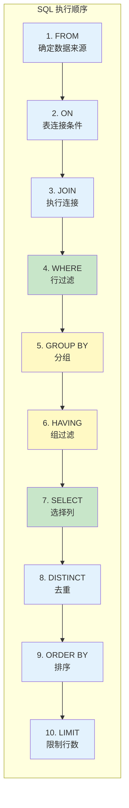

# SQL 执行顺序

> **目标级别**：P5/P6
> **面试频率**：🔴 高频
> **面试官最关心的 3 个问题**：
> 1. SQL 语句的执行顺序是什么？
> 2. 为什么 GROUP BY 在 WHERE 之后但在 SELECT 之前？
> 3. 了解执行顺序对 SQL 优化有什么帮助？

面试官问：「SELECT 语句的执行顺序是什么？」你说「从左到右」——然后面试官紧接着追问「那为什么 `WHERE` 不能用 `SELECT` 中定义的别名？`HAVING` 和 `WHERE` 有什么区别？」你沉默了。

这就是 MySQL SQL 执行顺序面试的真实面貌：表面上问的是顺序，实际上考的是对 SQL 执行原理的理解深度。

## 一、SQL 执行顺序概览

### 1.1 完整执行顺序



### 1.2 顺序对比

| 书写顺序 | 关键字 | 执行顺序 | 说明 |
|----------|--------|----------|------|
| 1 | FROM | 1 | 确定数据来源 |
| 2 | JOIN | 2-3 | 表连接 |
| 3 | WHERE | 4 | 行级过滤 |
| 4 | GROUP BY | 5 | 分组 |
| 5 | HAVING | 6 | 组级过滤 |
| 6 | SELECT | 7 | 选择列 |
| 7 | DISTINCT | 8 | 去重 |
| 8 | ORDER BY | 9 | 排序 |
| 9 | LIMIT | 10 | 限制行数 |

## 二、详细执行过程

### 2.1 FROM 阶段

```sql
-- 1. FROM 阶段：确定数据来源
FROM orders;  -- 从 orders 表获取数据
FROM orders o INNER JOIN user u ON o.user_id = u.id;  -- 多个表
```

### 2.2 ON 阶段

```sql
-- 2. ON 阶段：确定连接条件
SELECT *
FROM orders o
INNER JOIN user u ON o.user_id = u.id;  -- ON 在 JOIN 之前执行
```

### 2.3 JOIN 阶段

```sql
-- 3. JOIN 阶段：执行连���
SELECT *
FROM orders o
INNER JOIN user u ON o.user_id = u.id  -- ON 条件满足的行才会连接
LEFT JOIN product p ON o.product_id = p.id;  -- 左表所有行都保留
```

### 2.4 WHERE 阶段

```sql
-- 4. WHERE 阶段：行级过滤（不能用 SELECT 别名）
SELECT id, amount AS amt
FROM orders
WHERE amt > 100;  -- ❌ 错误：WHERE 不能用 SELECT 别名

WHERE amount > 100;  -- ✅ 正确：使用原字段名
```

### 2.5 GROUP BY 阶段

```sql
-- 5. GROUP BY 阶段：分组（聚合函数从这里开始生效）
SELECT user_id, COUNT(*) AS order_count, SUM(amount) AS total_amount
FROM orders
GROUP BY user_id;
```

### 2.6 HAVING 阶段

```sql
-- 6. HAVING 阶段：组级过滤（可以用 SELECT 别名）
SELECT user_id, COUNT(*) AS order_count, SUM(amount) AS total_amount
FROM orders
GROUP BY user_id
HAVING order_count `>` 5;  -- ✅ 正确：可以用 SELECT 别名
```

### 2.7 SELECT 阶段

```sql
-- 7. SELECT 阶段：选择列
SELECT
    user_id,
    COUNT(*) AS order_count,
    SUM(amount) AS total_amount
FROM orders
GROUP BY user_id;
```

### 2.8 DISTINCT 阶段

```sql
-- 8. DISTINCT 阶段：去重
SELECT DISTINCT status FROM orders;
SELECT DISTINCT user_id, status FROM orders;  -- 多列去重
```

### 2.9 ORDER BY 阶段

```sql
-- 9. ORDER BY 阶段：排序
SELECT user_id, SUM(amount) AS total
FROM orders
GROUP BY user_id
ORDER BY total DESC;  -- ✅ 可以用 SELECT 别名
```

### 2.10 LIMIT 阶段

```sql
-- 10. LIMIT 阶段：限制行数
SELECT user_id, SUM(amount) AS total
FROM orders
GROUP BY user_id
ORDER BY total DESC
LIMIT 10;  -- 只返回前 10 条
```

## 三、常见问题解析

### 3.1 WHERE 不能用 SELECT 别名

```sql
-- ❌ 错误：WHERE 在 SELECT 之前执行，不能用别名
SELECT amount AS amt FROM orders WHERE amt `>` 100;

-- ✅ 正确：WHERE 使用原字段名
SELECT amount AS amt FROM orders WHERE amount `>` 100;

-- ✅ 也可以使用 HAVING（如果分组后过滤）
SELECT amount AS amt FROM orders HAVING amt `>` 100;
```

### 3.2 HAVING vs WHERE

| 对比 | WHERE | HAVING |
|------|-------|--------|
| **执行顺序** | GROUP BY 之前 | GROUP BY 之后 |
| **过滤对象** | 单行数据 | 分组结果 |
| **可用别名** | 不能 | 可以 |
| **性能** | 更好（提前过滤） | 较差（后置过滤） |

```sql
-- WHERE：在分组前过滤
SELECT user_id, SUM(amount) AS total
FROM orders
WHERE status = 1  -- ✅ 使用 WHERE 过滤单行
GROUP BY user_id
HAVING total `>` 1000;  -- HAVING 过滤分组结果
```

### 3.3 执行顺序导致的问题

```sql
-- 场景：查询每个用户的订单数量和总金额

-- ❌ 低效写法
SELECT user_id, COUNT(*), SUM(amount)
FROM orders
GROUP BY user_id
HAVING COUNT(*) `>` 5;  -- 使用 HAVING 过滤，效率低

-- ✅ 高效写法
SELECT user_id, COUNT(*), SUM(amount)
FROM orders
WHERE user_id IS NOT NULL  -- 提前过滤
GROUP BY user_id
HAVING COUNT(*) `>` 5;
```

## 四、优化实践

### 4.1 过滤条件放 WHERE

```sql
-- ❌ 低效：过滤条件放 HAVING
SELECT status, COUNT(*)
FROM orders
GROUP BY status
HAVING status IN (1, 2, 3);

-- ✅ 高效：过滤条件放 WHERE
SELECT status, COUNT(*)
FROM orders
WHERE status IN (1, 2, 3)
GROUP BY status;
```

### 4.2 使用覆盖索引

```sql
-- 由于 SELECT 在 ORDER BY 之前执行
-- 可以利用覆盖索引优化

SELECT created_at FROM orders
WHERE status = 1
ORDER BY created_at DESC;  -- 使用索引排序
```

### 4.3 减少数据量

```sql
-- 在 FROM 和 WHERE 阶段减少数据量
-- 然后在 SELECT 阶段只选择需要的字段

-- ❌ 低效
SELECT * FROM orders WHERE status = 1 ORDER BY created_at;

-- ✅ 高效
SELECT id, amount, created_at FROM orders WHERE status = 1 ORDER BY created_at;
```

## 五、面试追问链设计

> **第一层**：SELECT 语句的执行顺序是什么？
> **第二层**：为什么 WHERE 不能用 SELECT 别名？
> **第三层**：执行顺序对 SQL 优化有什么影响？

> **第一层**：HAVING 和 WHERE 有什么区别？
> **第二层**：为什么聚合函数在 SELECT 中可以使用，但在 WHERE 中不行？
> **第三层**：DISTINCT 和 GROUP BY 有什么区别？

> **第一层**：如何根据执行顺序优化 SQL？
> **第二层**：为什么 ORDER BY 在 GROUP BY 之后？
> **第三层**：LIMIT 为什么最后执行？

## 六、常见面试陷阱

**⚠️ 陷阱 1**：认为 SQL 按书写顺序执行
- SQL 按优化器的执行计划执行
- 书写顺序和执行顺序不同

**⚠️ 陷阱 2**：混淆 WHERE 和 HAVING 的使用场景
- WHERE 在 GROUP BY 之前过滤
- HAVING 在 GROUP BY 之后过滤

**⚠️ 陷阱 3**：忽略执行顺序对索引的影响
- WHERE 条件可以使用索引
- HAVING 条件可能无法使用索引

## 七、对比总结表

| 执行顺序 | 关键字 | 作用 | 可用索引 |
|----------|--------|------|----------|
| 1 | FROM | 确定数据来源 | ✅ |
| 2-3 | ON/JOIN | 表连接 | ✅ |
| 4 | WHERE | 行过滤 | ✅ |
| 5 | GROUP BY | 分组 | ✅ |
| 6 | HAVING | 组过滤 | ❌ |
| 7 | SELECT | 选择列 | ❌ |
| 8 | DISTINCT | 去重 | ❌ |
| 9 | ORDER BY | 排序 | ✅ |
| 10 | LIMIT | 限制行数 | ❌ |

## 八、加分回答

> **💡 面试加分点**：如果能说出执行顺序与索引使用的关系，会给面试官留下深刻印象：
>
> 1. **索引下推（ICP）**：将 WHERE 条件下推到索引层面
>
> 2. **覆盖索引**：SELECT 和 ORDER BY 都在索引中完成
>
> 3. **MRR**：优化回表 IO 顺序
>
> 4. **执行计划查看**：使用 EXPLAIN 查看实际执行顺序
