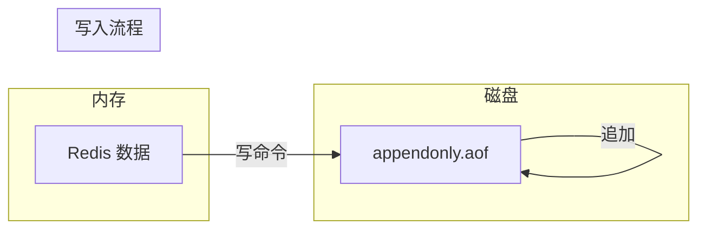
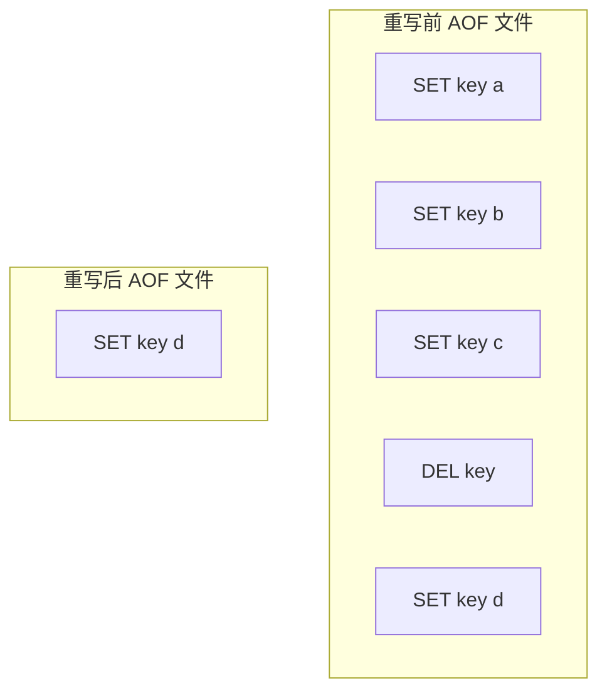
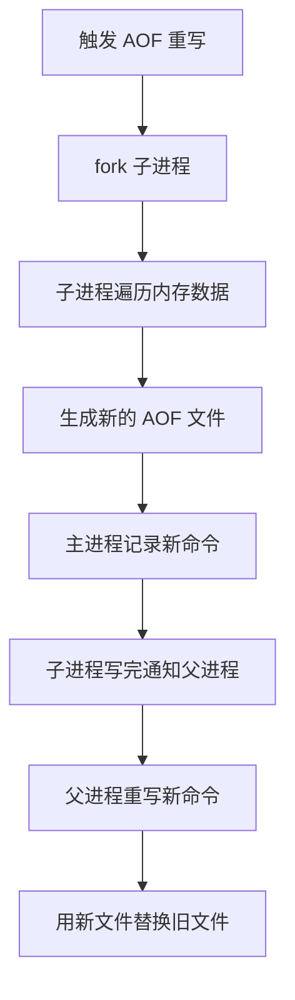
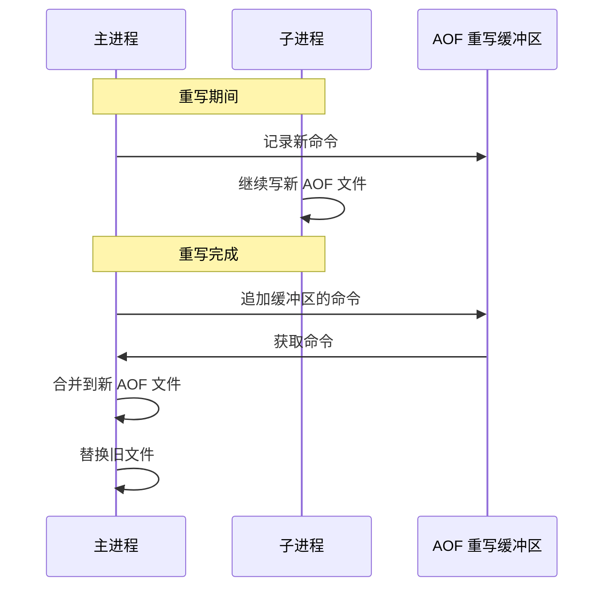

# AOF 持久化原理

> **目标级别**：P5/P6
> **面试频率**：🔴 高频
> **面试官最关心的 3 个问题**：
> 1. AOF 是什么？和 RDB 有什么区别？
> 2. AOF 的三种刷盘策略是什么？
> 3. AOF 重写是什么？有什么作用？

面试官问：「Redis 的 AOF 是什么？」你说「是持久化的一种」——然后面试官紧接着追问「AOF 的刷盘策略有哪些？appendfsync everysec 是什么意思？AOF 重写又是什么？」你沉默了。

这就是 Redis AOF 面试的真实面貌：不仅要回答"是什么"，还要理解"配置细节"。

## 一、AOF 简介

### 1.1 什么是 AOF

AOF（Append Only File）是将 Redis 的**写操作命令追加到文件末尾**的持久化方式。



### 1.2 与 RDB 的区别

| 维度 | RDB | AOF |
|------|-----|-----|
| **原理** | 全量快照 | 增量追加 |
| **文件格式** | 二进制 | 文本命令 |
| **数据完整性** | 可能丢失 | 可配置完整性 |
| **恢复速度** | 快 | 慢 |
| **文件大小** | 小 | 大 |

## 二、AOF 配置

### 2.1 基础配置

```bash
# 开启 AOF
appendonly yes

# AOF 文件名
appendfilename "appendonly.aof"

# 文件位置
dir ./

# 文件同步策略
appendfsync everysec
```

### 2.2 AOF 文件结构

```bash
# AOF 文件示例
*2\r\n$6\r\nSELECT\r\n$1\r\n0\r\n        # 选择数据库 0
*3\r\n$3\r\nSET\r\n$3\r\nkey\r\n$5\r\nvalue\r\n  # SET key value
*3\r\n$5\r\nHSET\r\n$6\r\nuser:1\r\n$4\r\nname\r\n$6\r\n张三\r\n  # HSET user:1 name 张三
```

## 三、刷盘策略（appendfsync）

### 3.1 三种策略对比

| 策略 | 说明 | 性能 | 安全性 |
|------|------|------|--------|
| `always` | 每条命令都刷盘 | 最慢 | 最高 |
| `everysec` | 每秒刷盘一次 | 中等 | 中等 |
| `no` | 由操作系统决定 | 最快 | 最低 |

### 3.2 刷盘流程图


### 3.3 性能对比

| 策略 | 写入性能 | 数据安全性 | 适用场景 |
|------|----------|-------------|----------|
| always | 差 | 高 | 数据安全要求极高 |
| everysec | 中 | 中 | 大多数生产环境 |
| no | 好 | 低 | 允许少量数据丢失 |

## 四、AOF 重写

### 4.1 为什么要重写



**问题**：
- AOF 文件会越来越大
- 很多操作是冗余的（如 SET key a → SET key b → SET key c）
- 恢复时需要执行所有命令

### 4.2 重写原理



### 4.3 重写配置

```bash
# 自动重写配置
auto-aof-rewrite-percentage 100  # 文件比上次大 100% 时重写
auto-aof-rewrite-min-size 64mb  # 文件大于 64MB 时才可能触发重写

# 手动触发
redis> BGREWRITEAOF
Background append only file rewriting started
```

### 4.4 重写安全机制

**⚠️ 防止数据丢失**：



## 五、AOF 恢复

### 5.1 启动时加载

```mermaid
flowchart TD
    A["Redis 启动"] --> B{"存在 AOF 文件?"}
    B -->|是| C{"AOF 文件正常?"}
    C -->|是| D["加载 AOF"]
    C -->|否| E["检查 RDB 文件"]
    D --> F["恢复完成"]
    E -->|"存在 RDB"| G["加载 RDB"]
    E -->|"不存在"| H["空数据库"]
    G --> F
    B -->|"否| J["检查 RDB 文件"]
    J --> F
```

### 5.2 AOF 损坏修复

```bash
# 使用 redis-check-aof 检查并修复
redis-check-aof --fix appendonly.aof
```

### 5.3 恢复优先级

| 文件 | 优先级 | 说明 |
|------|--------|------|
| AOF | 高 | 如果 AOF 开启且完整 |
| RDB | 低 | 如果没有 AOF 或 AOF 损坏 |

## 六、面试追问链设计

> **第一层**：AOF 的三种刷盘策略是什么？
> **第二层**：everysec 是每秒刷盘一次吗？会不会丢失数据？
> **第三层**：always 和 everysec 的性能差距有多大？

> **第一层**：什么是 AOF 重写？为什么要重写？
> **第二层**：AOF 重写会不会阻塞主进程？
> **第三层**：AOF 重写期间，主进程的新命令会不会丢失？

> **第一层**：RDB 和 AOF 哪个更好？
> **第二层**：什么场景下应该用 AOF？
> **第三层**：能不能同时使用 RDB 和 AOF？

## 七、常见面试陷阱

**⚠️ 陷阱 1**：误认为 everysec 不会丢数据
- everysec 可能丢失最多 1 秒的数据
- 机器宕机时，lastwrite 之后的数据可能丢失

**⚠️ 陷阱 2**：混淆 AOF 重写和压缩
- AOF 重写不是压缩文件
- 而是用更少的命令记录当前状态

**⚠️ 陷阱 3**：不了解重写期间的缓冲机制
- 重写期间主进程的新命令会写入缓冲区
- 重写完成后才合并到新文件

## 八、对比总结表

| 维度 | RDB | AOF |
|------|-----|-----|
| **原理** | 全量快照 | 增量追加 |
| **文件大小** | 小 | 大 |
| **恢复速度** | 快 | 慢 |
| **数据安全** | 可能丢失 | 可配置 |
| **性能影响** | fork 时阻塞 | 刷盘时阻塞 |
| **适用场景** | 备份、冷备 | 热备、实时 |

## 九、加分回答

> **💡 面试加分点**：如果能说出 AOF 的底层实现细节，会给面试官留下深刻印象：
>
> 1. **AOF 缓冲区**：使用固定大小缓冲区，循环使用
> 2. **后台刷盘**：子进程负责刷盘，不阻塞主进程
> 3. **混合持久化**：Redis 4.0+ 可以用 RDB 作为 AOF 的基础
> 4. **增量重写**：基于现有 AOF 文件进行增量优化
>
> ```bash
> # Redis 4.0+ 混合持久化配置
> aof-use-rdb-preamble yes
> # 重写后，新 AOF 文件前半部分是 RDB 格式，后半部分是增量命令
> ```
