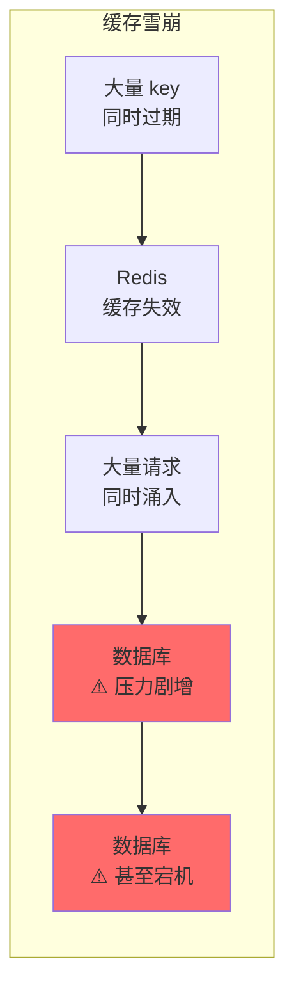
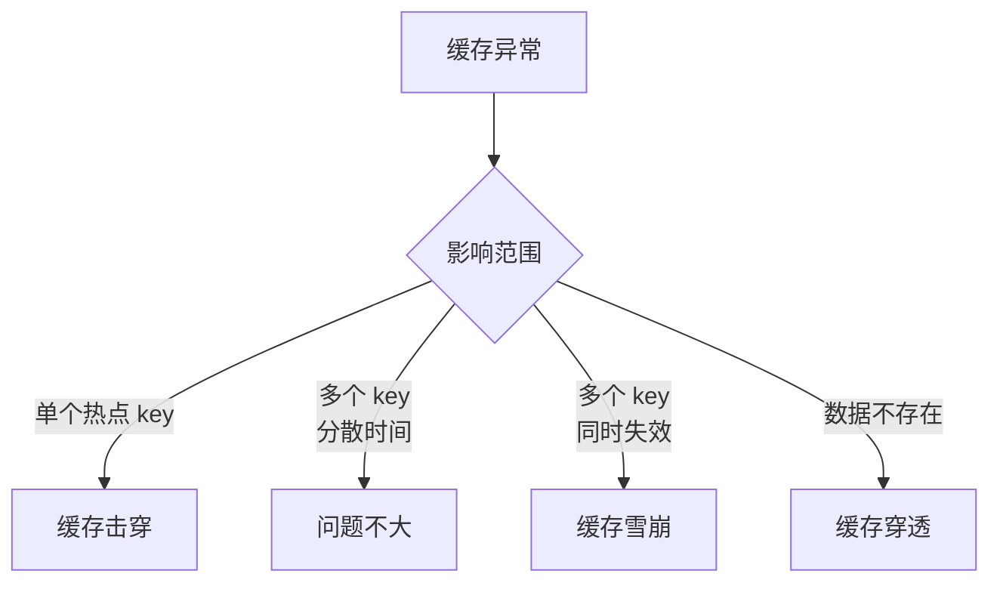
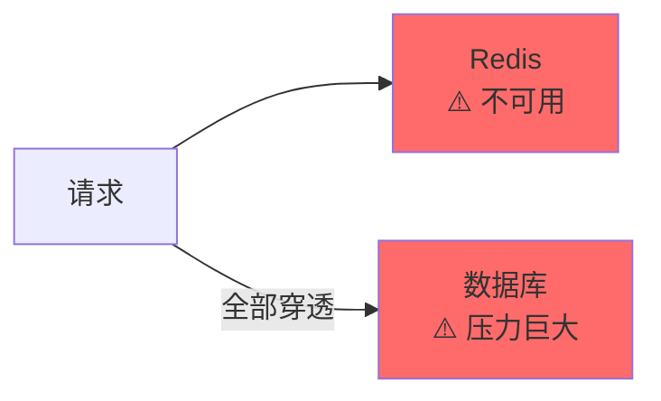
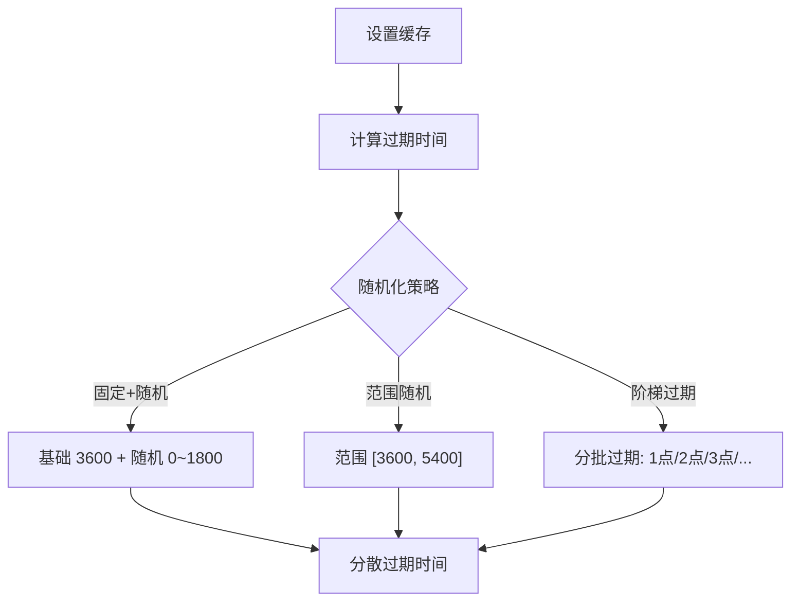
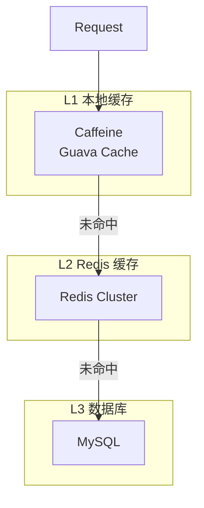
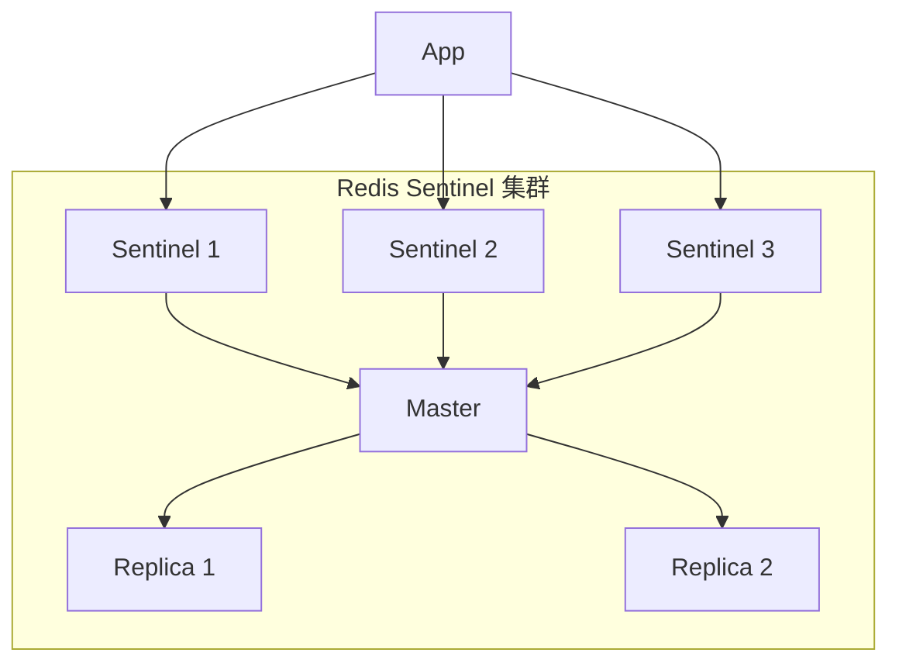

# 缓存雪崩与解决方案

> **目标级别**：P5/P6
> **面试频率**：🔴 高频
> **面试官最关心的 3 个问题**：
> 1. 什么是缓存雪崩？与缓存击穿有什么区别？
> 2. 缓存雪崩有哪些原因？
> 3. 如何预防和处理缓存雪崩？

面试官问：「如果某天凌晨你收到报警，Redis 集群的 CPU 飙升到 100%，大量请求超时，你知道发生了什么吗？」你说「可能是 Redis 挂了」——然后面试官追问「如果是大量 key 同时过期呢？」你沉默了。

这就是缓存雪崩：大量缓存同时失效的那一瞬间，数据库承受了不该承受的压力。

## 一、什么是缓存雪崩

### 1.1 定义

**缓存雪崩**：由于某种原因，**大量缓存 key 同时过期**或**缓存服务不可用**，导致大量请求同时穿透到数据库，数据库压力剧增甚至宕机。



### 1.2 缓存雪崩 vs 缓存击穿 vs 缓存穿透

| 维度 | 缓存穿透 | 缓存击穿 | 缓存雪崩 |
|------|----------|----------|----------|
| **问题数据** | 不存在的数据 | 热点 key | 大量 key |
| **发生时机** | key 不存在于缓存和数据库 | 热点 key 过期 | 大量 key 同时过期 |
| **请求特征** | 每次都查不存在的数据 | 并发查同一个 key | 并发查多个 key |
| **核心问题** | 数据库查询不存在的数据 | 并发查询同一个 key | 大量并发查询多个 key |
| **危害程度** | 持续性危害 | 瞬间冲击 | 大面积冲击 |



## 二、缓存雪崩的原因

### 2.1 原因分类

| 原因类型 | 说明 | 发生场景 |
|----------|------|----------|
| **大量 key 同时过期** | 缓存中大量 key 设置了相同的过期时间 | 促销活动、数据初始化 |
| **Redis 宕机** | Redis 服务不可用 | 硬件故障、网络分区 |
| **热点 key 集中失效** | 秒杀、抢购等场景 | 电商大促 |
| **预热不充分** | 系统重启后缓存为空 | 运维发布、故障恢复 |

### 2.2 原因详解

#### 2.2.1 大量 key 同时过期

这是最常见的缓存雪崩原因：

```bash
# 大量 key 使用相同的过期时间
SET product:1 "data" EX 3600    # 1 小时后过期
SET product:2 "data" EX 3600
...
SET product:10000 "data" EX 3600  # 全部 1 小时后同时过期
```

如果在某个整点（如 0 点、8 点）有大量 key 过期，数据库压力会剧增。

#### 2.2.2 Redis 宕机

Redis 集群不可用时，所有请求都会穿透到数据库：



#### 2.2.3 热点 key 集中失效

秒杀场景中，所有用户都在请求相同的热点数据：

```bash
# 秒杀商品数据
SET seckill:product:100 "库存:100" EX 3600

# 100 万用户同时抢购，全部查同一个 key
# key 过期后，全部打到数据库
```

## 三、解决方案

### 3.1 方案对比

| 方案 | 原理 | 优点 | 缺点 | 适用场景 |
|------|------|------|------|----------|
| **过期时间随机化** | 不同 key 设置不同过期时间 | 简单有效 | 可能影响缓存命中率 | 预防 key 同时过期 |
| **永不过期** | key 不设置过期时间 | 避免雪崩 | 数据可能不一致 | 更新不频繁的数据 |
| **多级缓存** | 本地缓存 + Redis | 多层保护 | 实现复杂 | 高可用系统 |
| **Redis 高可用** | 部署 Redis 集群 | 保证可用性 | 成本高 | 生产环境 |
| **熔断限流** | 保护数据库 | 兜底方案 | 影响用户体验 | 紧急处理 |
| **预热** | 系统启动时加载缓存 | 避免冷启动 | 实现复杂 | 系统重启 |

### 3.2 方案一：过期时间随机化

给缓存过期时间加上随机值，分散过期时间点：

```java
// 基础过期时间
private static final int BASE_EXPIRE = 3600; // 1 小时

// 设置过期时间时加随机值
public void setWithJitter(String key, String value) {
    // 过期时间 = 基础时间 + 随机时间（0~30 分钟）
    int expire = BASE_EXPIRE + new Random().nextInt(1800);
    redis.setex(key, expire, value);
}
```

```bash
# 改进前：所有 key 都在 3600 秒后过期
SET product:1 "data" EX 3600

# 改进后：过期时间在 3600~5400 秒之间随机
SET product:1 "data" EX 4200
SET product:2 "data" EX 3800
SET product:3 "data" EX 5100
```



**💡 面试加分点**：阶梯过期策略

对于某些业务，可以采用更精细的阶梯过期策略：

```java
public void setWithStepExpire(String key, String value) {
    // 根据 key 的特征分配不同的过期时间
    int hour = extractHour(key); // 从 key 中提取小时信息
    int expire = hour * 1800;    // 0-23 点对应 0~690 分钟过期
    redis.setex(key, expire, value);
}
```

### 3.3 方案二：多级缓存

构建多级缓存架构，本地缓存作为第一层保护：



```java
@Component
public class MultiLevelCacheService {
    // L1: 本地缓存（Caffeine）
    private final Cache<String, String> localCache = Caffeine.newBuilder()
        .maximumSize(10000)
        .expireAfterWrite(10, TimeUnit.SECONDS)
        .build();

    // L2: Redis
    private final RedisTemplate<String, String> redis;

    // L3: 数据库
    private final JdbcTemplate jdbc;

    public String get(String key) {
        // 1. 查 L1 本地缓存
        String value = localCache.getIfPresent(key);
        if (value != null) {
            return value;
        }

        // 2. 查 L2 Redis
        value = redis.opsForValue().get(key);
        if (value != null) {
            // 回填 L1
            localCache.put(key, value);
            return value;
        }

        // 3. 查 L3 数据库
        value = jdbc.queryForObject(
            "SELECT data FROM cache WHERE key = ?",
            key
        );

        // 回填 L2
        redis.opsForValue().set(key, value, 1, TimeUnit.HOURS);

        return value;
    }
}
```

### 3.4 方案三：Redis 高可用

部署 Redis 集群（主从 + 哨兵 / Cluster），确保 Redis 本身的高可用：



### 3.5 方案四：熔断限流

在应用层实现熔断限流机制，保护数据库：

```java
@Service
public class CacheService {
    // 限流器
    private final RateLimiter rateLimiter = RateLimiter.create(1000);

    // 熔断器
    private final CircuitBreaker circuitBreaker = CircuitBreaker.ofDefaults();

    public String get(String key) {
        // 1. 限流
        if (!rateLimiter.tryAcquire()) {
            return getDefaultValue(key); // 返回默认值或降级结果
        }

        // 2. 熔断保护
        return circuitBreaker.executeSupplier(() -> {
            String value = redis.get(key);
            if (value == null) {
                value = db.query(key);
                redis.setex(key, 3600, value);
            }
            return value;
        });
    }
}
```

### 3.6 方案五：预热

系统启动或故障恢复时，提前加载热点数据到缓存：

```java
@Component
public class CacheWarmingService {
    private final RedisTemplate<String, String> redis;
    private final JdbcTemplate jdbc;

    /**
     * 启动时预热缓存
     */
    @PostConstruct
    public void warmUp() {
        log.info("开始缓存预热...");

        // 1. 加载热点数据
        List<String> hotKeys = getHotKeys();
        for (String key : hotKeys) {
            String value = jdbc.queryForObject(
                "SELECT data FROM hot_data WHERE key = ?",
                key
            );
            // 永不过期或设置较长时间
            redis.opsForValue().set(key, value);
        }

        // 2. 延迟预热：非热点数据异步加载
        CompletableFuture.runAsync(this::warmUpNormalKeys);

        log.info("缓存预热完成，共加载 {} 个热点 key", hotKeys.size());
    }

    private List<String> getHotKeys() {
        // 从配置中心或监控平台获取热点 key 列表
        return Arrays.asList("product:*", "user:*");
    }
}
```

## 四、综合方案

实际项目中，通常组合使用多种方案：

```java
@Service
public class CacheService {
    // 1. 本地缓存（防止 Redis 不可用）
    private final Cache<String, String> localCache = Caffeine.newBuilder()
        .maximumSize(10000)
        .expireAfterWrite(30, TimeUnit.SECONDS)
        .build();

    // 2. Redis 集群
    private final RedisTemplate<String, String> redis;
    private final RedissonClient redisson;

    // 3. 熔断器
    private final CircuitBreaker circuitBreaker = CircuitBreaker.ofDefaults();

    public String get(String key) {
        // L1: 本地缓存
        String value = localCache.getIfPresent(key);
        if (value != null) {
            return value;
        }

        // L2: Redis
        try {
            value = redis.opsForValue().get(key);
            if (value != null) {
                localCache.put(key, value);
                return value;
            }

            // L3: 数据库（使用互斥锁）
            value = getWithLock(key);
            localCache.put(key, value);
            return value;

        } catch (Exception e) {
            // Redis 不可用时，返回本地缓存旧数据或默认值
            return getFallback(key);
        }
    }

    private String getWithLock(String key) {
        RLock lock = redisson.getLock("lock:" + key);
        lock.lock(10, TimeUnit.SECONDS);

        try {
            // 双重检查
            String value = redis.opsForValue().get(key);
            if (value != null) {
                return value;
            }

            // 查询数据库
            value = db.query(key);

            // 设置过期时间 + 随机 jitter
            int expire = 3600 + new Random().nextInt(1800);
            redis.opsForValue().set(key, value, expire, TimeUnit.SECONDS);

            return value;
        } finally {
            lock.unlock();
        }
    }

    private String getFallback(String key) {
        // 降级处理：返回默认值、空数据或友好提示
        log.warn("Redis 不可用，使用降级策略");
        return null;
    }
}
```

## 五、面试追问链设计

> **第一层**：什么是缓存雪崩？与缓存击穿有什么区别？
> **第二层**：缓存雪崩有哪些原因？
> **第三层**：如何预防和处理缓存雪崩？

> **第一层**：过期时间随机化能完全避免雪崩吗？
> **第二层**：Redis 集群模式下如何避免雪崩？
> **第三层**：熔断和限流有什么区别？

> **第一层**：多级缓存中，本地缓存和 Redis 缓存如何保持一致？
> **第二层**：本地缓存的容量怎么设置？
> **第三层**：如何发现热点 key？

## 六、常见面试陷阱

**⚠️ 陷阱 1**：混淆缓存雪崩和缓存击穿

两者核心区别是影响范围：缓存击穿是单个热点 key，缓存雪崩是大量 key。

**⚠️ 陷阱 2**：只考虑预防，不考虑处理

缓存雪崩发生时，如何快速恢复？需要准备降级方案。

**⚠️ 陷阱 3**：过期时间随机化不够随机

如果只加几秒的随机值，在大量请求下仍然会集中过期。需要足够大的随机范围。

## 七、对比总结表

| 维度 | 过期时间随机化 | 多级缓存 | Redis 高可用 | 熔断限流 | 预热 |
|------|----------------|----------|--------------|----------|------|
| **预防能力** | 预防 key 同时过期 | 预防 Redis 宕机 | 保证 Redis 可用 | 无法预防 | 预防冷启动 |
| **处理能力** | 无 | 有限 | 有 | 有 | 无 |
| **实现复杂度** | 低 | 高 | 中 | 中 | 中 |
| **成本** | 无 | 高（需要本地缓存） | 高（需要集群） | 低 | 低 |
| **适用场景** | 所有场景 | 高可用系统 | 生产环境 | 紧急处理 | 系统重启 |

## 八、加分回答

> **💡 面试加分点**：缓存雪崩的监控与预警：

1. **缓存命中率监控**：当命中率突然下降时，可能是雪崩前兆
2. **过期 key 监控**：监控即将过期的 key 数量
3. **数据库 QPS 监控**：当数据库 QPS 突然飙升时，可能是雪崩发生
4. **Redis 连接数监控**：连接数暴涨可能是大量重试导致

> **💡 面试加分点**：热点 key 探测方案：

1. **Redis 自带命令**：使用 `MONITOR` 命令监控（不推荐生产使用）
2. **开源工具**：`redis-hotspot`、`CacheCloud`
3. **客户端埋点**：在 Redis 客户端统计 key 访问频率
4. **代理层统计**：使用 Twemproxy、Codis 等代理统计
