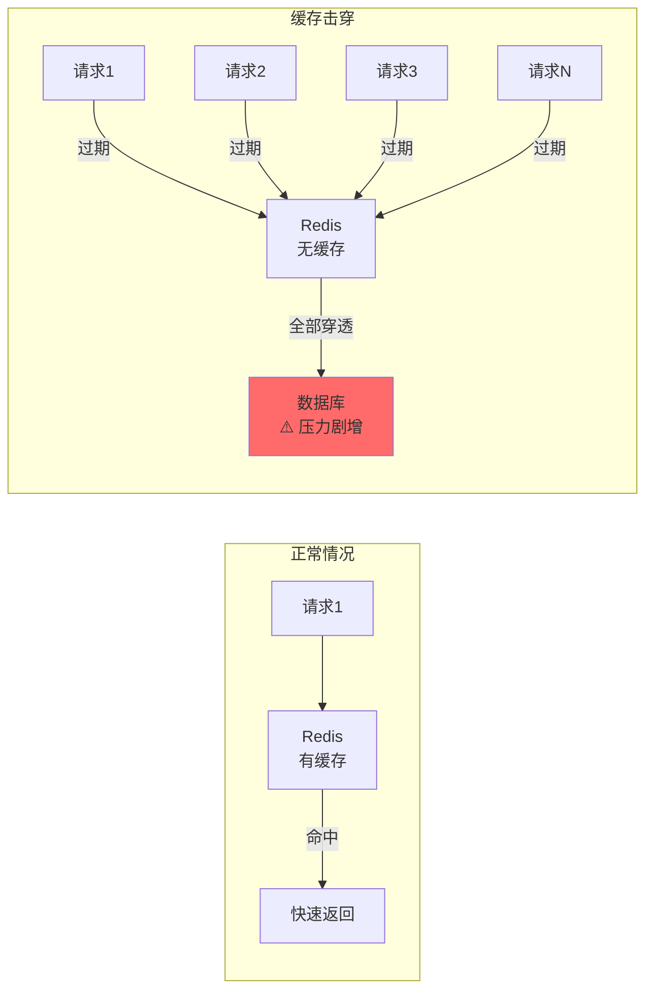
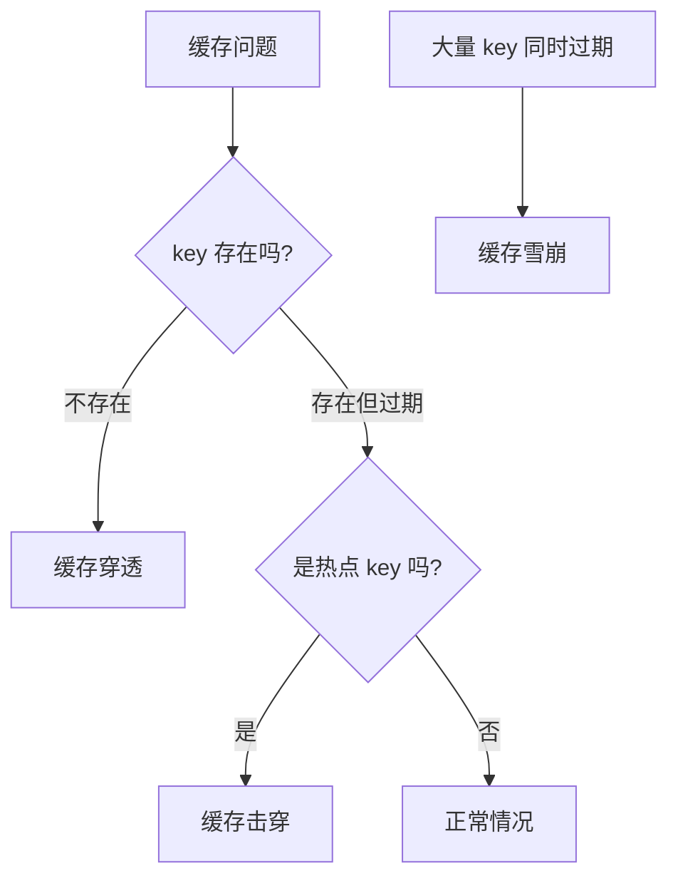
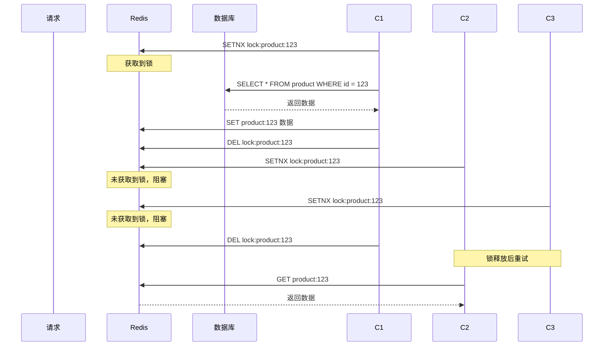
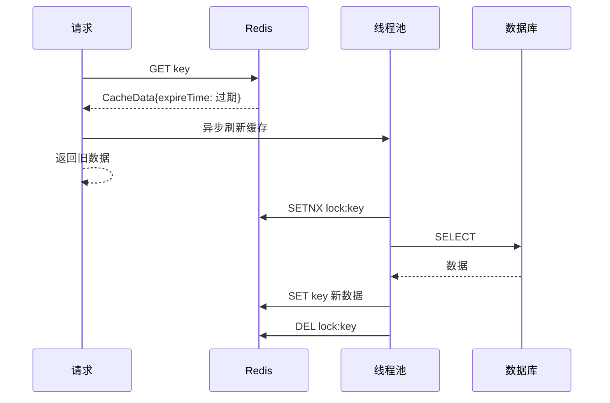

# 缓存击穿与互斥锁

> **目标级别**：P5/P6
> **面试频率**：🔴 高频
> **面试官最关心的 3 个问题**：
> 1. 什么是缓存击穿？与缓存穿透有什么区别？
> 2. 如何解决缓存击穿？
> 3. 互斥锁和乐观锁有什么区别？

面试官问：「如果缓存中的热点 key 过期了，大量的请求同时涌入，会发生什么？」你说「会重新从数据库加载」——然后面试官追问「那这大量的并发请求同时打向数据库，数据库会不会挂？」你沉默了。

这就是缓存击穿：热点 key 过期的一瞬间，数据库承受了不该承受的压力。

## 一、什么是缓存击穿

### 1.1 定义

**缓存击穿**：某个**热点 key** 在缓存中过期或失效的瞬间，大量并发请求同时涌入数据库查询数据，导致数据库压力剧增。



### 1.2 缓存击穿 vs 缓存穿透 vs 缓存雪崩

| 维度 | 缓存穿透 | 缓存击穿 | 缓存雪崩 |
|------|----------|----------|----------|
| **问题数据** | 不存在的数据 | 热点 key | 大量 key |
| **发生时机** | key 不存在于缓存和数据库 | 热点 key 过期 | 大量 key 同时过期 |
| **核心问题** | 数据库查询不存在的数据 | 并发查询同一个 key | 数据库压力突增 |
| **危害程度** | 持续性危害 | 瞬间冲击 | 大面积冲击 |



## 二、解决方案

### 2.1 方案对比

| 方案 | 原理 | 优点 | 缺点 | 适用场景 |
|------|------|------|------|----------|
| **互斥锁** | 只允许一个请求查数据库 | 简单可靠 | 性能略差 | 所有场景 |
| **逻辑过期** | 不设置真正过期，逻辑判断 | 性能好 | 实现复杂 | 高并发场景 |
| **永不过期** | key 不设置过期时间 | 简单 | 数据可能不一致 | 更新不频繁的数据 |
| **热点数据续期** | 快过期时主动刷新 | 体验好 | 实现复杂 | 有明显热点的数据 |

### 2.2 方案一：互斥锁

#### 2.2.1 原理

使用分布式锁（Redis SetNX）确保只有一个请求去查询数据库，其他请求等待或返回默认值。



#### 2.2.2 代码实现

```java
public String getWithMutex(String key) {
    // 1. 先查缓存
    String value = redis.get(key);
    if (value != null) {
        return value;
    }

    // 2. 获取分布式锁
    String lockKey = "lock:" + key;
    String lockValue = UUID.randomUUID().toString();

    // 尝试获取锁，设置 10 秒过期（防止死锁）
    Boolean acquired = redis.setnx(lockKey, lockValue, 10, TimeUnit.SECONDS);

    if (Boolean.TRUE.equals(acquired)) {
        try {
            // 3. 双重检查缓存（其他线程可能已经写入）
            value = redis.get(key);
            if (value != null) {
                return value;
            }

            // 4. 查询数据库
            value = db.query(key);

            // 5. 写入缓存
            redis.setex(key, 3600, value);

            return value;
        } finally {
            // 6. 释放锁（只释放自己的锁）
            if (lockValue.equals(redis.get(lockKey))) {
                redis.del(lockKey);
            }
        }
    } else {
        // 未获取到锁，短暂等待后重试
        try {
            Thread.sleep(50);
        } catch (InterruptedException e) {
            Thread.currentThread().interrupt();
        }
        return getWithMutex(key); // 递归重试
    }
}
```

#### 2.2.3 使用 Redisson 实现

```java
@Autowired
private RedissonClient redissonClient;

public String getWithRedisson(String key) {
    // 1. 先查缓存
    String value = redis.get(key);
    if (value != null) {
        return value;
    }

    // 2. 获取锁
    RLock lock = redissonClient.getLock("lock:" + key);
    lock.lock(10, TimeUnit.SECONDS);

    try {
        // 3. 双重检查
        value = redis.get(key);
        if (value != null) {
            return value;
        }

        // 4. 查询数据库并缓存
        value = db.query(key);
        redis.setex(key, 3600, value);

        return value;
    } finally {
        lock.unlock();
    }
}
```

**⚠️ 陷阱 1**：锁的过期时间设置不当

如果锁的过期时间太短，业务还没执行完锁就过期了，其他请求就会同时进入数据库。

**⚠️ 陷阱 2**：释放别人的锁

释放锁时没有判断是否是自己的锁，可能释放了其他请求的锁。

### 2.3 方案二：逻辑过期

不设置真正的过期时间，而是在 value 中保存过期时间戳，读取时判断是否过期，如果过期则异步更新。

#### 2.3.1 数据结构设计

```java
@Data
public class CacheData<T> {
    private T data;           // 实际数据
    private long expireTime;  // 逻辑过期时间戳
}
```

#### 2.3.2 代码实现

```java
private static final long EXPIRE_TIME = 60; // 逻辑过期时间（秒）

public String getWithLogicalExpire(String key) {
    // 1. 查询缓存
    String cached = redis.get(key);
    if (cached == null) {
        return null;
    }

    // 2. 反序列化
    CacheData<String> cacheData = parseCacheData(cached);

    // 3. 判断是否逻辑过期
    if (System.currentTimeMillis() > cacheData.getExpireTime()) {
        // 已过期，异步更新（使用线程池，不阻塞）
        CompletableFuture.runAsync(() -> {
            refreshCache(key);
        });

        // 返回旧数据（可能不准确，但保证可用）
        return cacheData.getData();
    }

    // 4. 未过期，直接返回
    return cacheData.getData();
}

private void refreshCache(String key) {
    String lockKey = "refresh:lock:" + key;
    String lockValue = UUID.randomUUID().toString();

    // 获取更新锁
    if (redis.setnx(lockKey, lockValue, 5, TimeUnit.SECONDS)) {
        try {
            // 查询数据库
            String value = db.query(key);

            // 写入新缓存（新的过期时间）
            CacheData<String> newData = new CacheData<>(
                value,
                System.currentTimeMillis() + EXPIRE_TIME * 1000
            );
            redis.set(key, serialize(newData));

        } finally {
            redis.del(lockKey);
        }
    }
}
```



#### 2.3.3 优缺点

| 维度 | 互斥锁 | 逻辑过期 |
|------|--------|----------|
| **一致性** | 强一致 | 弱一致（返回旧数据） |
| **性能** | 略有阻塞 | 无阻塞，性能更好 |
| **实现复杂度** | 简单 | 复杂 |
| **适用场景** | 数据一致性要求高 | 高并发、数据一致性要求不高 |

### 2.4 方案三：热点数据永不过期

通过后台任务主动更新缓存，key 本身不设置过期时间。

```java
// 定时任务更新热点数据
@Scheduled(fixedRate = 30000) // 每 30 秒
public void refreshHotKeys() {
    List<String> hotKeys = getHotKeys();
    for (String key : hotKeys) {
        String value = db.query(key);
        redis.set(key, value); // 不设置过期时间
    }
}
```

## 三、实战方案选择

```java
public class CacheService {
    // 注入依赖
    private final RedisTemplate<String, String> redis;
    private final RedissonClient redisson;

    /**
     * 获取数据，根据场景选择不同策略
     */
    public String get(String key, boolean isHotKey) {
        if (isHotKey) {
            return getWithLogicalExpire(key);
        } else {
            return getWithMutex(key);
        }
    }

    /**
     * 互斥锁方案 - 适合一般场景
     */
    private String getWithMutex(String key) {
        String value = redis.opsForValue().get(key);
        if (value != null) {
            return value;
        }

        RLock lock = redisson.getLock("lock:" + key);
        try {
            lock.lock(10, TimeUnit.SECONDS);

            // 双重检查
            value = redis.opsForValue().get(key);
            if (value != null) {
                return value;
            }

            value = db.query(key);
            redis.opsForValue().set(key, value, 1, TimeUnit.HOURS);

            return value;
        } finally {
            lock.unlock();
        }
    }

    /**
     * 逻辑过期方案 - 适合热点 key
     */
    private String getWithLogicalExpire(String key) {
        String cached = redis.opsForValue().get(key);
        if (cached == null) {
            return null;
        }

        CacheData<String> data = parseCacheData(cached);

        if (System.currentTimeMillis() > data.getExpireTime()) {
            // 已过期，异步刷新
            refreshCacheAsync(key);
        }

        return data.getData();
    }
}
```

## 四、面试追问链设计

> **第一层**：什么是缓存击穿？如何解决？
> **第二层**：互斥锁的实现原理是什么？
> **第三层**：互斥锁和逻辑过期有什么区别？各自适用场景？

> **第一层**：互斥锁的锁过期时间怎么设置？
> **第二层**：如果业务执行时间超过锁过期时间怎么办？
> **第三层**：如何避免锁续期问题？

> **第一层**：Redis 的 SETNX 和 Redisson 锁有什么区别？
> **第二层**：Redisson 锁的看门狗机制是什么？
> **第三层**：如果 Redis 是集群模式，互斥锁会有问题吗？

## 五、常见面试陷阱

**⚠️ 陷阱 1**：混淆缓存穿透和缓存击穿

缓存穿透是数据不存在，缓存击穿是热点 key 过期。两者本质不同，解决方案也不同。

**⚠️ 陷阱 2**：互斥锁实现不完整

只实现了加锁和释放锁，没有双重检查缓存、没有设置合理的过期时间。

**⚠️ 陷阱 3**：逻辑过期返回旧数据有风险

逻辑过期方案返回的是旧数据，如果业务不能接受旧数据，这个方案就不适用。

## 六、对比总结表

| 维度 | 互斥锁 | 逻辑过期 | 永不过期 | 热点续期 |
|------|--------|----------|----------|----------|
| **一致性** | 强一致 | 弱一致 | 弱一致 | 中等一致 |
| **性能** | 一般 | 好 | 好 | 好 |
| **实现复杂度** | 低 | 高 | 低 | 中 |
| **数据时效性** | 100% 新鲜 | 旧数据可用 | 可能过时 | 较新鲜 |
| **适用场景** | 所有场景 | 高并发热点 | 更新不频繁 | 明显热点数据 |

## 七、加分回答

> **💡 面试加分点**：可以提到更高级的解决方案：

1. **多级缓存**：本地缓存 + Redis + 数据库，本地缓存作为一级，热点数据直接在本地命中
2. **热点 key 探测**：使用 Redis 的 `MONITOR` 命令或开源工具（如 `redis-hotspot`）自动发现热点 key
3. **热点 key 备份**：对热点 key 在多个 Redis 实例上保存副本，分散压力

> **💡 面试加分点**：Redisson 锁的看门狗机制：

Redisson 提供了自动续期功能，如果业务执行时间超过锁过期时间，看门狗会自动续期，避免锁提前释放。
