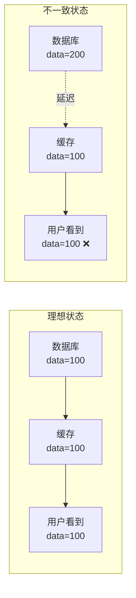
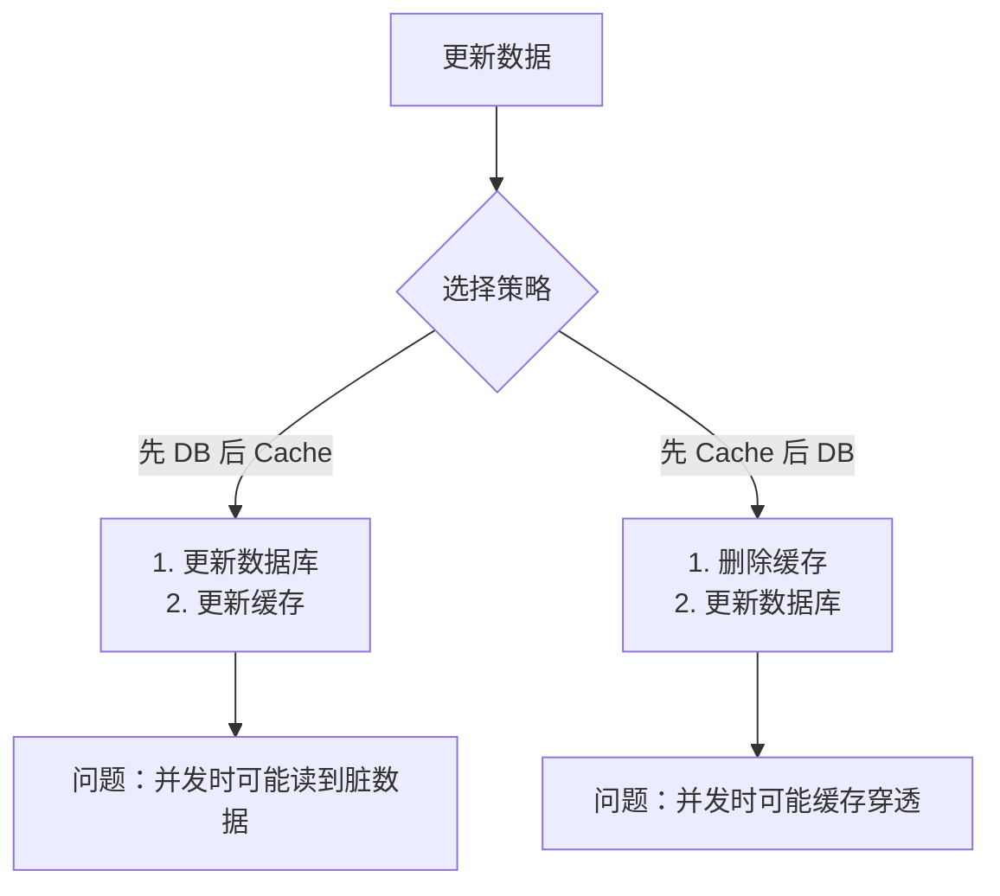
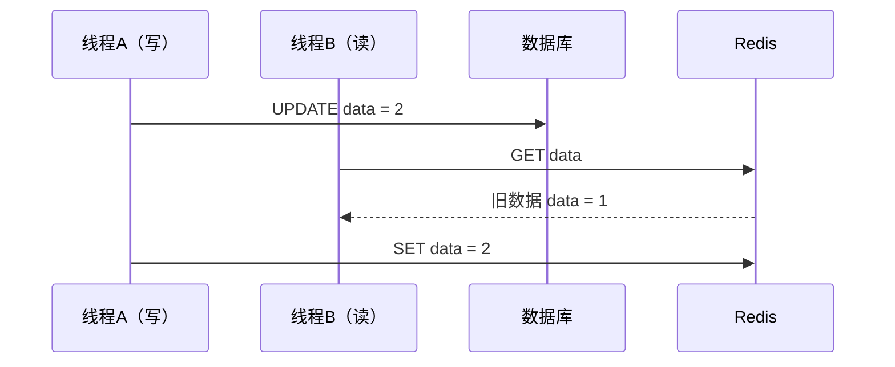
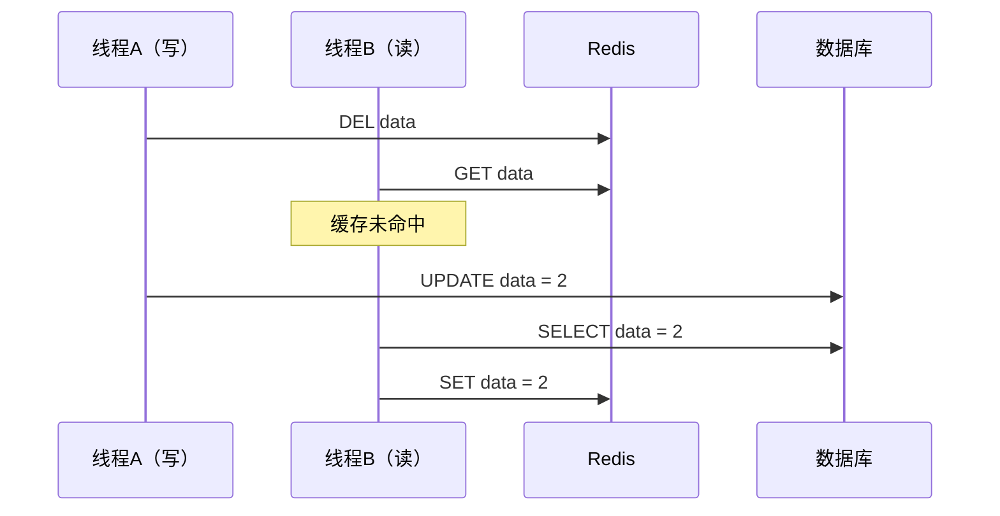
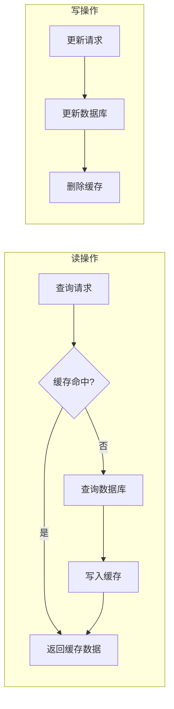
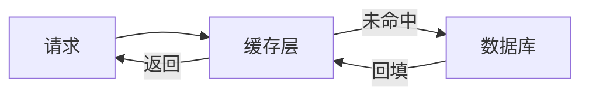
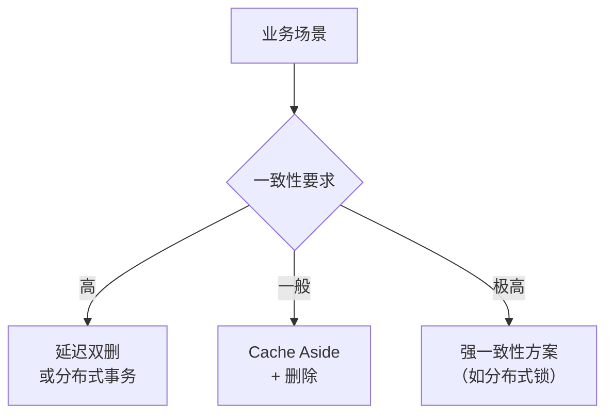

# 缓存一致性

> **目标级别**：P5/P6/P7
> **面试频率**：🔴 高频
> **面试官最关心的 3 个问题**：
> 1. 如何保证缓存与数据库的一致性？
> 2. Cache Aside、Read Through、Write Through 模式有什么区别？
> 3. 先更新数据库还是先更新缓存？如何选择？

面试官问：「如果用户修改了个人信息，你更新了数据库，但还没更新缓存，这时候另一个请求读到了旧缓存数据，用户看到的是旧信息，怎么办？」你说「可以用事务」——然后面试官追问「Redis 不支持跨库事务，你打算怎么处理？」你沉默了。

这就是缓存一致性问题：看似简单，实则处处是坑。

## 一、缓存一致性概述

### 1.1 什么是缓存一致性

**缓存一致性**：缓存中的数据与数据库中的数据保持同步的状态。当数据发生变更时，缓存和数据库的更新需要合理配合，保证最终一致性或强一致性。



### 1.2 一致性级别

| 级别 | 说明 | 特点 | 实现难度 |
|------|------|------|----------|
| **强一致性** | 任何时刻数据完全一致 | 写入后立即可读 | 困难，性能差 |
| **最终一致性** | 允许短暂不一致，最终一致 | 性能好，可接受延迟 | 简单，常用 |

### 1.3 不一致的原因

| 原因 | 说明 |
|------|------|
| **并发读写** | 线程 A 更新数据库，线程 B 读取缓存（还是旧值） |
| **缓存更新失败** | 数据库更新成功，但缓存更新失败 |
| **缓存过期** | 缓存过期后，下次读取从数据库加载新数据 |
| **主从不一致** | Redis 主从不一致，读到从库旧数据 |

## 二、更新缓存与数据库的顺序

### 2.1 两种策略

| 策略 | 操作顺序 | 说明 |
|------|----------|------|
| **先更新数据库，再更新缓存** | `DB → Cache` | 先确保数据库成功，再更新缓存 |
| **先删除缓存，再更新数据库** | `Cache → DB` | 先让其他请求感知到缓存失效 |

### 2.2 策略对比



#### 2.2.1 先更新数据库，再更新缓存

```java
// 策略1：先 DB 后 Cache
public void update(String key, String value) {
    // 1. 更新数据库
    db.update(key, value);

    // 2. 更新缓存
    redis.set(key, value);
}
```

**问题分析**：



| 问题 | 说明 |
|------|------|
| **并发问题** | 线程 A 更新 DB，线程 B 读取缓存（仍是旧值），线程 A 再更新缓存 |
| **浪费资源** | 如果缓存后续不会被读取，更新缓存就是浪费 |
| **更新失败** | DB 更新成功，Cache 更新失败，导致不一致 |

#### 2.2.2 先删除缓存，再更新数据库

```java
// 策略2：先 Cache 后 DB
public void update(String key, String value) {
    // 1. 删除缓存
    redis.del(key);

    // 2. 更新数据库
    db.update(key, value);
}
```

**问题分析**：



| 问题 | 说明 |
|------|------|
| **缓存穿透** | 删除缓存后、写入缓存前这段时间，请求会穿透到数据库 |
| **数据不一致** | 如果不配合延迟双删，可能不一致 |

**💡 解决方案：延迟双删**

```java
public void update(String key, String value) {
    // 1. 删除缓存
    redis.del(key);

    // 2. 更新数据库
    db.update(key, value);

    // 3. 延迟一段时间后再删除缓存（处理并发问题）
    try {
        Thread.sleep(500);
    } catch (InterruptedException e) {
        Thread.currentThread().interrupt();
    }
    redis.del(key);
}
```

## 三、经典模式：Cache Aside

### 3.1 原理

**Cache Aside（旁路缓存）**：最常用的缓存读写模式。



### 3.2 代码实现

```java
public class CacheAsideService {
    private final RedisTemplate<String, String> redis;
    private final JdbcTemplate jdbc;

    /**
     * 读操作：Cache Aside
     */
    public String read(String key) {
        // 1. 先查缓存
        String value = redis.opsForValue().get(key);
        if (value != null) {
            return value;
        }

        // 2. 缓存未命中，查数据库
        value = jdbc.queryForObject(
            "SELECT data FROM table WHERE key = ?",
            key
        );

        // 3. 写入缓存（设置过期时间）
        if (value != null) {
            redis.opsForValue().set(key, value, 1, TimeUnit.HOURS);
        }

        return value;
    }

    /**
     * 写操作：先更新数据库，再删除缓存
     */
    public void write(String key, String value) {
        // 1. 更新数据库
        jdbc.update("UPDATE table SET data = ? WHERE key = ?", value, key);

        // 2. 删除缓存（不是更新，是删除）
        redis.delete(key);
    }
}
```

### 3.3 为什么是删除缓存而不是更新缓存

| 对比 | 删除缓存 | 更新缓存 |
|------|----------|----------|
| **原子性** | 删除是单一操作，更容易保证原子性 | 需要序列化等多个操作 |
| **并发安全** | 删除后由后续请求回填，更安全 | 并发时容易出现不一致 |
| **适用场景** | 读多写少 | 写多读少（但一般不适合缓存） |

## 四、其他读写模式

### 4.1 模式对比

| 模式 | 读操作 | 写操作 | 一致性 | 适用场景 |
|------|--------|--------|--------|----------|
| **Cache Aside** | 缓存未命中则查 DB 并回填 | 先 DB 后删除 Cache | 最终一致 | 读多写少 |
| **Read Through** | 缓存未命中由缓存层查 DB | 同上 | 最终一致 | 读多写少 |
| **Write Through** | 同上 | 先更新缓存，缓存层写 DB | 强一致 | 写多读少 |
| **Write Behind** | 同上 | 先更新缓存，异步写 DB | 最终一致 | 写入性能要求高 |

### 4.2 Read Through（读穿透）

缓存层自动加载数据，应用层无需关心缓存未命中的处理：



### 4.3 Write Through（写穿透）

写入时同步更新缓存和数据库，保证强一致性：

```java
public void write(String key, String value) {
    // 1. 更新缓存
    redis.set(key, value);

    // 2. 同步更新数据库
    db.update(key, value);
}
```

### 4.4 Write Behind（异步写）

写入时只更新缓存，异步批量更新数据库：

```java
public void write(String key, String value) {
    // 1. 只更新缓存
    redis.set(key, value);

    // 2. 异步写数据库
    asyncWriteQueue.add(new WriteRequest(key, value));
}
```

## 五、实际方案选择

### 5.1 方案对比

| 方案 | 一致性 | 复杂度 | 性能 | 推荐场景 |
|------|--------|--------|------|----------|
| **Cache Aside + 删除** | 最终一致 | 低 | 高 | 大多数场景 |
| **Cache Aside + 延迟双删** | 最终一致 | 中 | 中 | 对一致性要求高 |
| **Read Through** | 最终一致 | 低 | 高 | 读多写少 |
| **Write Through** | 强一致 | 高 | 低 | 写多读少 |

### 5.2 业务场景选择



#### 场景一：用户资料（高一致性要求）

```java
public void updateUserProfile(Long userId, UserProfile profile) {
    // 使用分布式锁保证一致性
    RLock lock = redisson.getLock("user:lock:" + userId);
    lock.lock(10, TimeUnit.SECONDS);

    try {
        // 1. 更新数据库
        userDao.update(userId, profile);

        // 2. 删除缓存（而不是更新）
        redis.delete("user:profile:" + userId);

        // 3. 延迟删除（处理并发）
        Thread.sleep(500);
        redis.delete("user:profile:" + userId);
    } finally {
        lock.unlock();
    }
}
```

#### 场景二：商品库存（强一致性要求）

```java
public void updateStock(Long productId, Integer quantity) {
    // 库存更新不能有缓存，必须直接操作数据库
    // 这是因为库存的并发扣减需要严格的一致性

    RLock lock = redisson.getLock("stock:lock:" + productId);
    lock.lock(10, TimeUnit.SECONDS);

    try {
        // 直接操作数据库
        stockDao.decreaseStock(productId, quantity);

        // 不使用缓存，因为库存是强一致需求
    } finally {
        lock.unlock();
    }
}
```

## 六、面试追问链设计

> **第一层**：如何保证缓存与数据库的一致性？
> **第二层**：Cache Aside 模式是什么？为什么删除缓存而不是更新缓存？
> **第三层**：延迟双删是什么？解决什么问题？

> **第一层**：先更新数据库还是先更新缓存？有什么讲究？
> **第二层**：如果数据库更新成功但缓存更新失败怎么办？
> **第三层**：如何保证 Redis 操作和数据库操作的事务性？

> **第一层**：如果业务对一致性要求极高，Cache Aside 够用吗？
> **第二层**：分布式事务能解决这个问题吗？有什么代价？
> **第三层**：TCC 模式能用于缓存一致性吗？

## 七、常见面试陷阱

**⚠️ 陷阱 1**：先更新缓存再更新数据库

这是错误做法。如果缓存更新成功但数据库更新失败，会导致数据永久不一致。

**⚠️ 陷阱 2**：Cache Aside 说成是更新缓存

Cache Aside 的写操作是**删除缓存**，不是更新缓存。很多候选人记错了。

**⚠️ 陷阱 3**：忽略并发问题

Cache Aside 在并发场景下可能不一致，需要配合延迟双删或分布式锁。

## 八、对比总结表

| 维度 | Cache Aside | Read Through | Write Through | Write Behind |
|------|-------------|---------------|---------------|--------------|
| **读一致性** | 最终一致 | 最终一致 | 最终一致 | 最终一致 |
| **写一致性** | 最终一致 | 最终一致 | 强一致 | 最终一致 |
| **实现复杂度** | 低 | 低 | 中 | 高 |
| **性能** | 高 | 高 | 中 | 最高 |
| **数据安全性** | 一般 | 一般 | 高 | 低 |
| **适用场景** | 大多数场景 | 读多写少 | 写多读少 | 写入量大 |

## 九、加分回答

> **💡 面试加分点**：可以提到更复杂的一致性方案：

1. **订阅 MySQL binlog**：使用 Canal 等工具订阅 binlog，异步更新缓存
2. **分布式事务**：使用 Seata 等分布式事务框架
3. **消息队列**：将缓存更新放入消息队列，异步消费

> **💡 面试加分点**：如何检测和处理不一致：

1. **定期巡检**：定时对比缓存和数据库的数据
2. **订阅变更**：监听数据库变更日志
3. **报警机制**：当不一致超过阈值时报警
