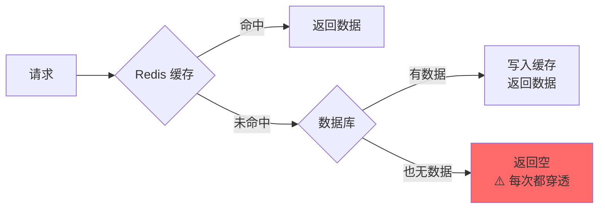
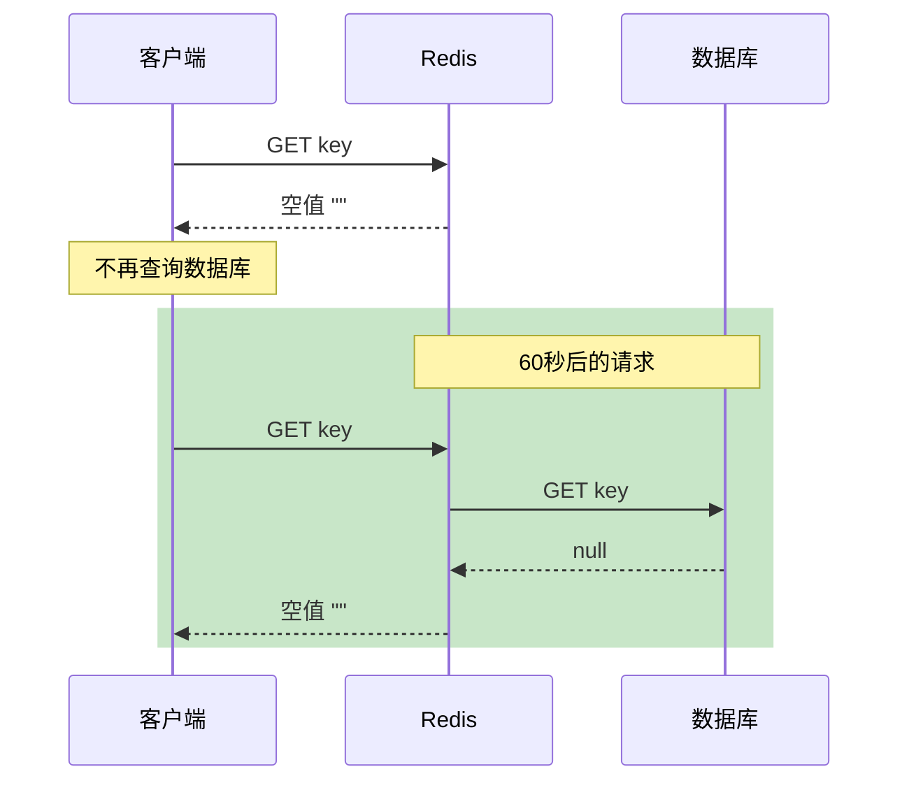
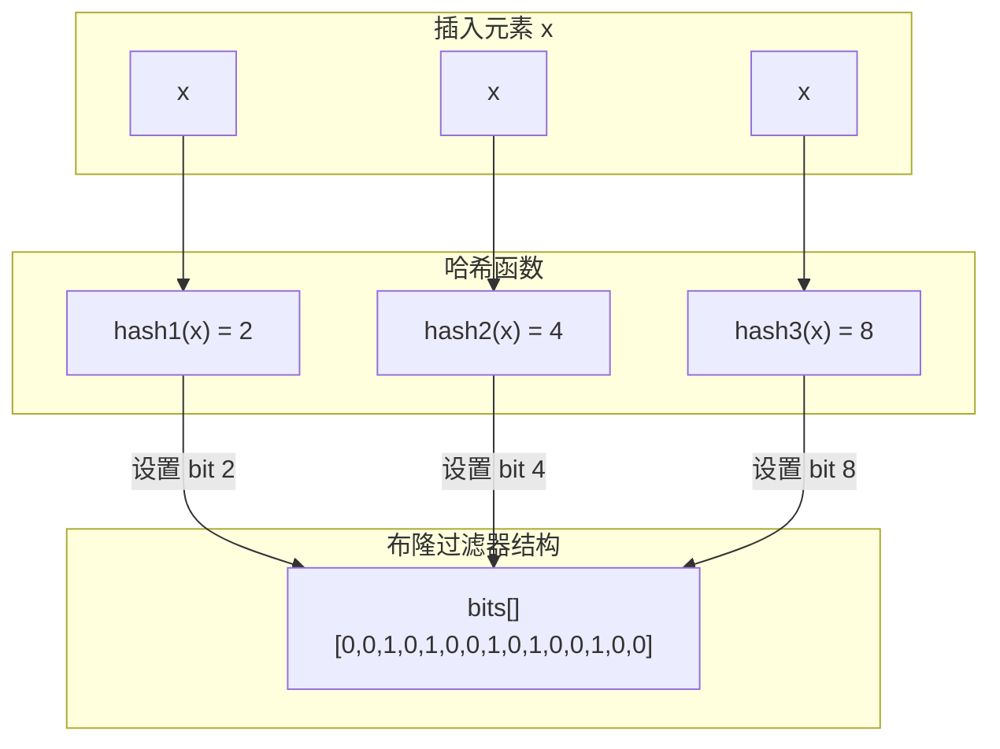
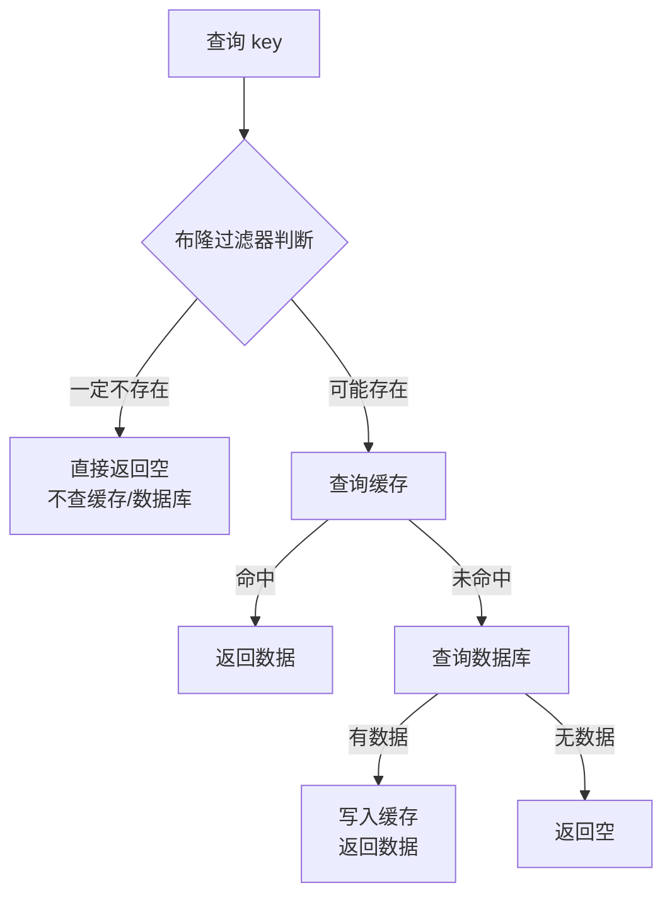
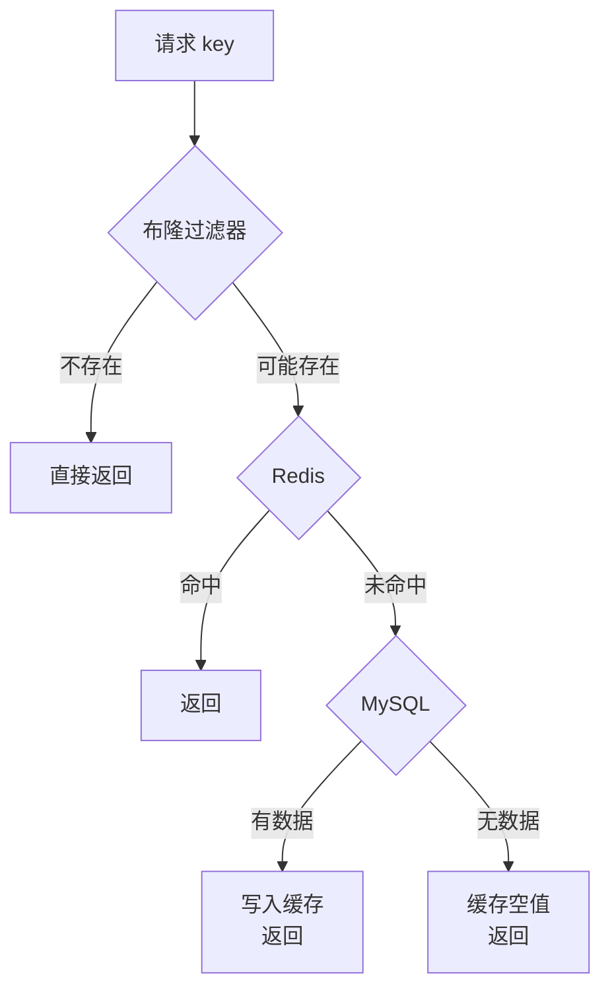

# 缓存穿透与布隆过滤器

> **目标级别**：P5/P6
> **面试频率**：🔴 高频
> **面试官最关心的 3 个问题**：
> 1. 什么是缓存穿透？有什么危害？
> 2. 如何解决缓存穿透？
> 3. 布隆过滤器的原理是什么？有什么优缺点？

面试官问：「如果有人恶意大量请求一个数据库和缓存都不存在的 key，会发生什么？」你说「不会怎样吧」——然后面试官追问「如果每秒 10 万次这样的请求呢？」你沉默了。

这就是缓存穿透的真实威力：它不是让系统变慢，而是直接让数据库宕机。

## 一、什么是缓存穿透

### 1.1 定义

**缓存穿透**：查询一个**既不存在于缓存中、也不存在于数据库中**的数据。由于缓存中没有，每次请求都会穿透到数据库。



### 1.2 危害

| 危害 | 说明 |
|------|------|
| **数据库压力** | 每次请求都打到数据库，数据库可能被打挂 |
| **影响正常请求** | 数据库响应变慢，正常业务也受影响 |
| **被恶意利用** | 攻击者故意构造大量不存在 key 进行攻击 |

### 1.3 常见场景

- 业务本身就不存在的数据（如查询条件错误）
- 恶意攻击：攻击者故意构造大量不存在的 key
- 爬虫爬取不存在的数据

## 二、解决方案

### 2.1 方案对比

| 方案 | 原理 | 优点 | 缺点 | 适用场景 |
|------|------|------|------|----------|
| **缓存空值** | 将空结果也缓存 | 简单易实现 | 内存浪费、数据不一致风险 | 数据为空的情况较少 |
| **布隆过滤器** | 用概率数据结构判断存在性 | 内存占用小、判断快 | 有误判率、无法删除 | 数据相对固定 |
| **参数校验** | 提前拦截非法请求 | 最直接、最有效 | 业务逻辑复杂时难以覆盖 | 能识别出非法参数 |
| **黑名单** | 拦截已知的恶意请求 | 简单直接 | 无法应对未知攻击 | 已知攻击模式 |

### 2.2 方案一：缓存空值

将空结果也缓存起来，设置较短的过期时间：

```java
public String get(String key) {
    // 1. 查询缓存
    String value = redis.get(key);
    if (value != null) {
        return value;
    }

    // 2. 查询数据库
    value = db.query(key);

    // 3. 即使是空值，也缓存起来（设置短过期时间）
    if (value == null) {
        redis.setex(key, 60, ""); // 缓存60秒
        return null;
    }

    // 4. 正常数据写入缓存
    redis.setex(key, 3600, value);
    return value;
}
```



**⚠️ 陷阱 1**：空值缓存时间设置过长

如果商品下架了，空值缓存 1 小时，这 1 小时内用户都看不到商品下架的信息。

**⚠️ 陷阱 2**：空值和正常值混淆

如果 `""` 既表示空值又表示正常数据，需要用特殊标记区分：

```java
// 使用特殊标记
private static final String NULL_MARK = "NULL_VALUE";
redis.setex(key, 60, NULL_MARK);

// 读取时判断
String value = redis.get(key);
if (NULL_MARK.equals(value)) {
    return null;
}
```

### 2.3 方案二：布隆过滤器

#### 2.3.1 原理

布隆过滤器（Bloom Filter）是一种概率数据结构，用于判断一个元素**可能存在**或**一定不存在**。



#### 2.3.2 工作流程



#### 2.3.3 代码实现

```java
public class BloomFilterDemo {
    private final BloomFilter<String> bloomFilter;

    // 预估数据量 100 万，误判率 1%
    public BloomFilterDemo() {
        this.bloomFilter = BloomFilter.create(
            Funnels.stringFunnel(Charset.defaultCharset()),
            1_000_000,
            0.01
        );
    }

    // 初始化：将所有存在的 key 加入布隆过滤器
    public void init() {
        List<String> allKeys = db.getAllKeys();
        allKeys.forEach(bloomFilter::put);
    }

    // 查询
    public String get(String key) {
        // 1. 先判断布隆过滤器
        if (!bloomFilter.mightContain(key)) {
            // 一定不存在，直接返回
            return null;
        }

        // 2. 可能存在，继续查询缓存和数据库
        String value = redis.get(key);
        if (value != null) {
            return value;
        }

        return db.query(key);
    }
}
```

#### 2.3.4 优缺点

| 维度 | 布隆过滤器 |
|------|-----------|
| **内存占用** | 极小（约 1.29 字节/元素，1% 误判率） |
| **查询速度** | `O(k)`，k 为哈希函数个数，通常为 3~5 |
| **误判率** | 可设置，但无法完全避免 |
| **不支持删除** | 不能删除已添加的元素（可使用 Counting Bloom Filter） |
| **数据同步** | 新增数据需要同步到布隆过滤器 |

#### 2.3.5 误判率计算

```bash
# 误判率公式：p = (1 - e^(-kn/m))^k
# 其中：k = 哈希函数个数，n = 元素个数，m = bit 数组大小

# 经验值
n = 1000000, m = 10000000, k = 7 → 误判率 ≈ 0.8%
n = 1000000, m = 13000000, k = 10 → 误判率 ≈ 1%
```

**💡 面试加分点**：布隆过滤器的 bit 数组大小如何选择？

```bash
# 推荐公式：m = -n * ln(p) / (ln(2)^2)
# n = 预期元素个数，p = 误判率

# 示例：100 万元素，1% 误判率
m = -1000000 * ln(0.01) / (ln(2)^2) ≈ 95800000 bits ≈ 11.4 MB
```

### 2.4 方案三：参数校验

最根本的解决方案是做好参数校验，提前拦截非法请求：

```java
// 黑名单机制
private Set<String> blacklist = new HashSet<>();

public String get(String key) {
    // 1. 检查黑名单
    if (blacklist.contains(key)) {
        return null; // 直接返回，不查任何地方
    }

    // 2. 业务逻辑
    return doGet(key);
}

// 更新黑名单（异步）
public void updateBlacklist(String key) {
    blacklist.add(key);
}
```

## 三、实战：组合方案

实际项目中，通常组合使用多种方案：

```java
public class CacheService {
    private final BloomFilter<String> bloomFilter;
    private final RedisTemplate<String, String> redis;
    private final JdbcTemplate jdbc;

    public String get(String key) {
        // 1. 布隆过滤器判断
        if (!bloomFilter.mightContain(key)) {
            log.debug("布隆过滤器判断不存在: {}", key);
            return null;
        }

        // 2. 查询缓存
        String value = redis.opsForValue().get(key);
        if (value != null) {
            return value;
        }

        // 3. 查询数据库
        value = jdbc.queryForObject(
            "SELECT data FROM table WHERE key = ?",
            key
        );

        // 4. 写入缓存（即使是空值）
        if (value == null) {
            redis.opsForValue().set(key, NULL_MARK, Duration.ofMinutes(5));
            return null;
        }

        redis.opsForValue().set(key, value, Duration.ofHours(1));
        return value;
    }
}
```



## 四、面试追问链设计

> **第一层**：什么是缓存穿透？
> **第二层**：如何解决缓存穿透？
> **第三层**：布隆过滤器的原理是什么？有什么优缺点？

> **第一层**：布隆过滤器能完全避免缓存穿透吗？
> **第二层**：布隆过滤器的误判率怎么计算？
> **第三层**：如果要删除布隆过滤器中的元素，怎么办？

> **第一层**：布隆过滤器和 Redis Set 有什么区别？
> **第二层**：什么时候用布隆过滤器？什么时候用 Set？
> **第三层**：如果数据量是 1 亿，布隆过滤器需要多少内存？

## 五、常见面试陷阱

**⚠️ 陷阱 1**：只说布隆过滤器，不说其缺点

布隆过滤器有误判率，不能做到 100% 准确。而且不支持删除（除非用 Counting Bloom Filter）。

**⚠️ 陷阱 2**：布隆过滤器数据不同步

如果新增数据没及时加入布隆过滤器，会导致误判。需要定期重建或使用辅助结构。

**⚠️ 陷阱 3**：空值缓存时间设置不合理

时间太短，起不到防穿透作用；时间太长，数据一致性会出问题。

## 六、对比总结表

| 维度 | 缓存空值 | 布隆过滤器 | 参数校验 | 黑名单 |
|------|----------|-----------|----------|--------|
| **内存占用** | 较高 | 极低 | 无 | 低 |
| **准确性** | 100% | 有误判 | 100% | 100% |
| **性能影响** | 无额外开销 | 无额外开销 | 减少无效请求 | 减少无效请求 |
| **维护成本** | 低 | 中（需同步） | 低 | 中（需更新） |
| **适用场景** | 空数据少 | 数据固定 | 能识别非法参数 | 已知攻击模式 |

## 七、加分回答

> **💡 面试加分点**：可以提到布隆过滤器的变种：

1. **Counting Bloom Filter**：支持删除操作，每个 bit 扩展为计数器
2. **Scalable Bloom Filter**：支持动态扩容
3. **Cuckoo Filter**：支持删除操作，查询性能更好
