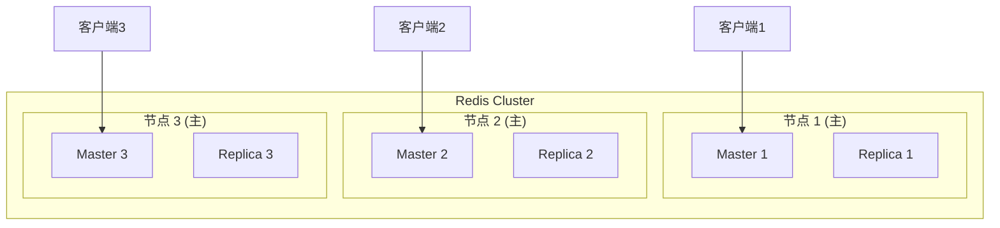
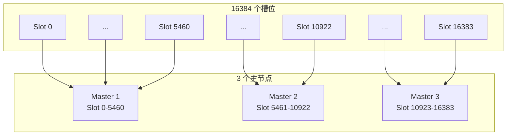
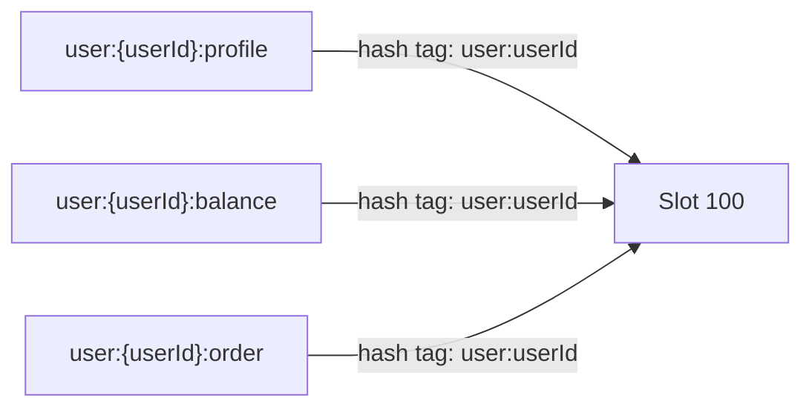
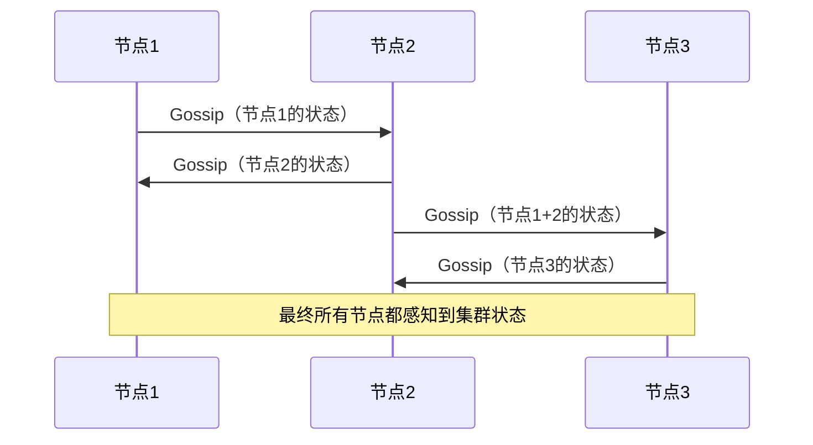
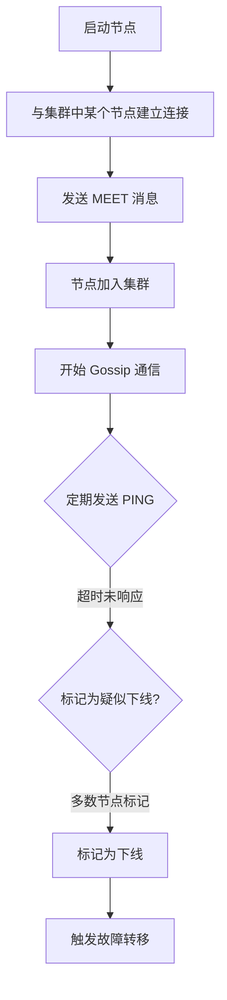
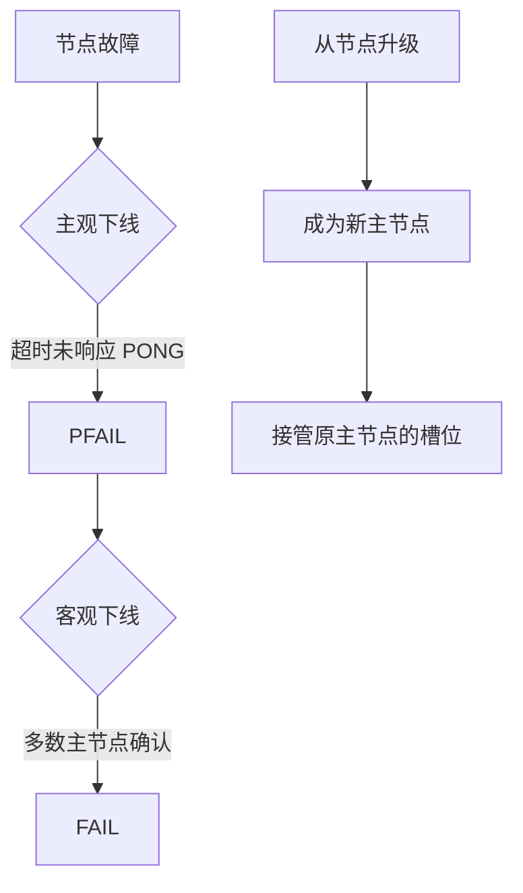
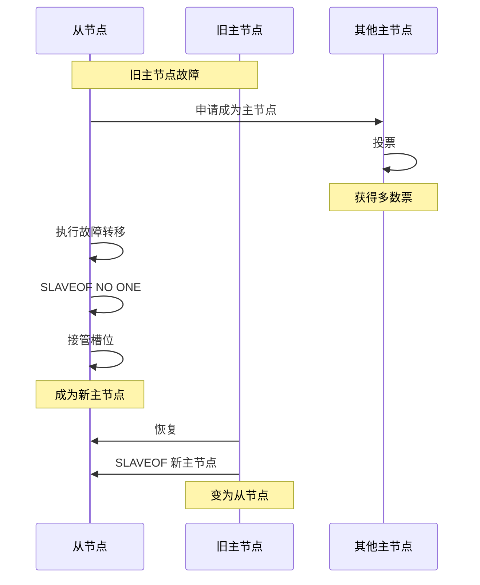
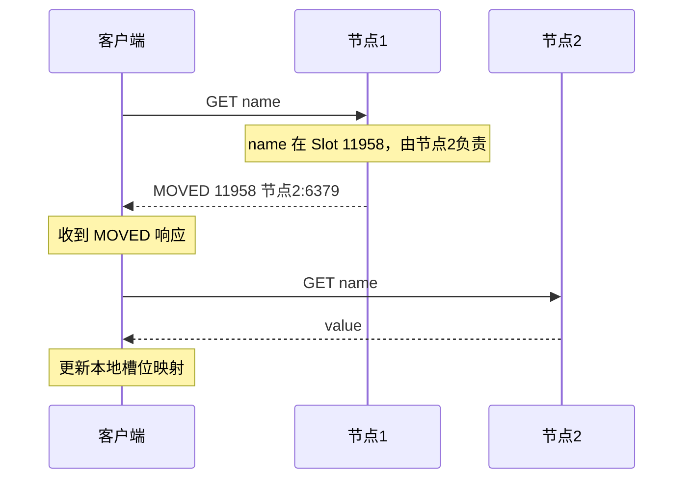
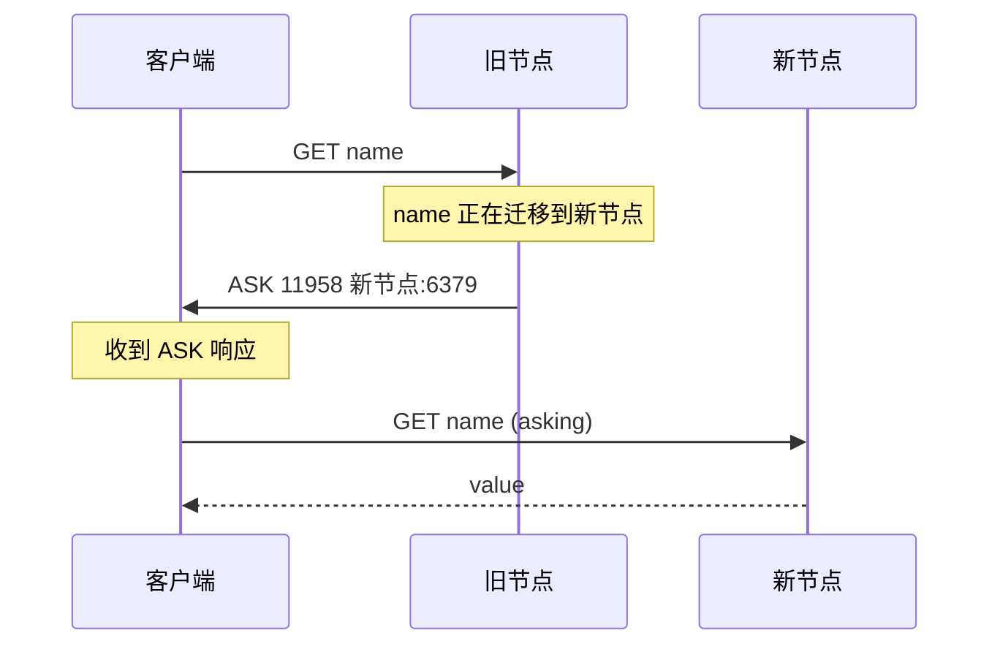

# Redis Cluster 集群

> **目标级别**：P5/P6
> **面试频率**：🔴 高频
> **面试官最关心的 3 个问题**：
> 1. Redis Cluster 是如何实现数据分片的？
> 2. Redis Cluster 如何处理节点故障？
> 3. Redis Cluster 相比哨兵模式有什么优势？

面试官问：「单台 Redis 内存不够用了，怎么办？」你说「加内存」——然后面试官追问「加内存也撑不住呢？需要存 1TB 数据怎么办？」你沉默了。

这就是 Redis Cluster 的价值：水平扩展，突破单机内存限制。

## 一、Redis Cluster 概述

### 1.1 什么是 Redis Cluster

**Redis Cluster**：Redis 官方提供的分布式集群方案，支持数据分片和自动故障转移。



### 1.2 集群特点

| 特点 | 说明 |
|------|------|
| **数据分片** | 将数据分散到多个主节点 |
| **高可用** | 每个主节点可以有从节点 |
| **去中心化** | 节点间通过 Gossip 协议通信 |
| **自动故障转移** | 节点故障自动切换 |

### 1.3 集群 vs 哨兵

| 维度 | Redis Cluster | Redis Sentinel |
|------|---------------|----------------|
| **定位** | 数据分片 + 高可用 | 高可用（无分片） |
| **节点角色** | 多主多从 | 一主多从 |
| **数据分布** | 16384 个槽位 | 不分片 |
| **客户端** | 智能客户端 | 普通客户端 |
| **槽位迁移** | 支持在线迁移 | 不支持 |
| **适用场景** | 大数据量 | 高可用 |

## 二、数据分片原理

### 2.1 槽位（Slot）机制

Redis Cluster 将整个数据集划分为 **16384 个槽位**，每个主节点负责一部分槽位。



### 2.2 键的 Slot 计算

```bash
# CRC16 算法计算 slot
slot = CRC16(key) % 16384

# 示例
SET name "zhang"
# key="name" 的 CRC16 = 11958
# slot = 11958 % 16384 = 11958

SET user:1:name "zhang"
# key="user:1:name" 的 CRC16 = 4732
# slot = 4732 % 16384 = 4732
```

### 2.3 Hash Tag

为了将多个相关 key 放在同一个槽位，Redis 支持 Hash Tag：

```bash
# 使用 Hash Tag
SET user:1:profile "..."   # slot 由 "user:1" 决定
SET user:1:balance "..."   # slot 由 "user:1" 决定

# 两个 key 会在同一个 slot
# 便于实现事务或 Lua 脚本
```



## 三、集群通信协议

### 3.1 Gossip 协议

Redis Cluster 节点间使用 Gossip 协议进行通信：



| 消息类型 | 说明 |
|----------|------|
| **ping** | 探测其他节点是否存活 |
| **pong** | 响应 ping |
| **meet** | 新节点加入集群 |
| **fail** | 节点下线通知 |
| **publish** | 广播发布消息 |

### 3.2 节点通信流程



## 四、故障检测与转移

### 4.1 故障检测



### 4.2 故障转移过程



### 4.3 集群最小配置

```bash
# 3 主 3 从的最小集群
# 节点数 >= 6（3 主 + 3 从）
# 主节点数必须为奇数（用于投票）

# 容忍 1 个节点故障：至少 3 主 3 从
# 容忍 2 个节点故障：至少 5 主 5 从
```

## 五、客户端路由

### 5.1 MOVED 重定向



### 5.2 ASK 重定向

ASK 重定向用于槽位迁移过程中：



| 重定向类型 | 说明 | 场景 |
|------------|------|------|
| **MOVED** | 槽位永久迁移 | 迁移完成 |
| **ASK** | 槽位正在迁移 | 迁移中 |

### 5.3 智能客户端

```java
// Jedis Cluster
Set<HostAndPort> nodes = new HashSet<>();
nodes.add(new HostAndPort("127.0.0.1", 7001));
nodes.add(new HostAndPort("127.0.0.1", 7002));
nodes.add(new HostAndPort("127.0.0.1", 7003));

JedisCluster jedis = new JedisCluster(nodes);
String value = jedis.get("name"); // 自动路由
```

智能客户端会缓存槽位映射，减少重定向。

## 六、集群配置

### 6.1 创建集群

```bash
# 准备 6 个 Redis 实例
redis-server --port 7001 --cluster-enabled yes
redis-server --port 7002 --cluster-enabled yes
...

# 创建集群（3 主 3 从）
redis-cli --cluster create 127.0.0.1:7001 127.0.0.1:7002 127.0.0.1:7003 \
                        127.0.0.1:7004 127.0.0.1:7005 127.0.0.1:7006 \
                        --cluster-replicas 1

# --cluster-replicas 1 表示每个主节点 1 个从节点
```

### 6.2 集群管理命令

```bash
# 查看集群状态
redis-cli -c -p 7001 cluster info

# 查看节点列表
redis-cli -c -p 7001 cluster nodes

# 查看槽位分配
redis-cli -c -p 7001 cluster slots

# 手动故障转移
redis-cli -c -p 7004 cluster failover

# 添加节点
redis-cli --cluster add-node 127.0.0.1:7007 127.0.0.1:7001

# 迁移槽位
redis-cli --cluster reshard 127.0.0.1:7001
```

### 6.3 配置文件

```bash
# redis.conf
cluster-enabled yes
cluster-config-file nodes-7001.conf
cluster-node-timeout 15000
cluster-replica-validity-factor 10
cluster-migration-barrier 1
```

## 七、面试追问链设计

> **第一层**：Redis Cluster 是如何实现数据分片的？
> **第二层**：16384 个槽位是怎么分配的？
> **第三层**：Hash Tag 是什么？解决什么问题？

> **第一层**：Redis Cluster 如何处理节点故障？
> **第二层**：MOVED 和 ASK 重定向有什么区别？
> **第三层**：客户端如何知道数据在哪个节点？

> **第一层**：Redis Cluster 和哨兵模式有什么区别？
> **第二层**：Redis Cluster 能保证强一致性吗？
> **第三层**：槽位迁移过程中，客户端如何处理？

## 八、常见面试陷阱

**⚠️ 陷阱 1**：认为 Cluster 可以替代 Sentinel

Cluster 解决的是数据分片问题，Sentinel 解决的是高可用问题。两者定位不同，可以结合使用。

**⚠️ 陷阱 2**：忽视 MOVED 重定向的性能影响

如果槽位映射缓存不正确，每次请求都可能触发重定向，影响性能。

**⚠️ 陷阱 3**：不理解 Cluster 的局限性

Cluster 不支持跨槽位的事务（需要使用 Lua 脚本），也不支持跨槽位的多键操作（除非使用 Hash Tag）。

## 九、对比总结表

| 维度 | 单机 Redis | Sentinel | Cluster |
|------|------------|----------|---------|
| **数据量** | 受单机内存限制 | 同单机 | 可水平扩展 |
| **高可用** | 无 | 自动切换 | 自动切换 |
| **写能力** | 单机 | 单机 | 多机 |
| **槽位** | 无 | 无 | 16384 |
| **客户端** | 普通 | 普通 | 智能 |
| **事务** | 完整支持 | 完整支持 | Lua 脚本 |

## 十、加分回答

> **💡 面试加分点**：Redis Cluster 的通信机制：

1. **Gossip 协议**：最终一致性
2. **节点发现**：新节点通过 MEET 加入
3. **心跳检测**：节点间定期 ping/pong

> **💡 面试加分点**：槽位迁移过程：

```bash
# 1. 设置目标节点接收槽位
redis-cli -c -p 7007 cluster setslot 12182 importing 127.0.0.1:7001

# 2. 设置源节点迁出槽位
redis-cli -c -p 7001 cluster setslot 12182 migrating 127.0.0.1:7007

# 3. 迁移键
redis-cli -c -p 7001 cluster getkeysinslot 12182 100
```

> **💡 面试加分点**：Redis Cluster 5.0+ 改进：

1. **原生支持 TLS**
2. **更好的故障检测**
3. **节点管理命令增强**
