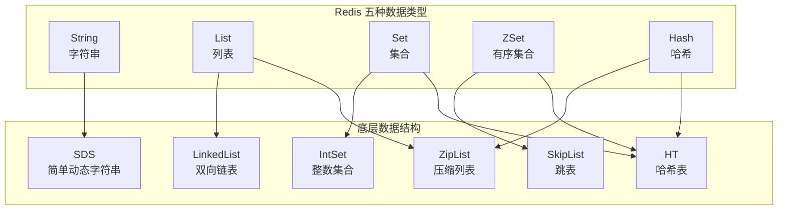
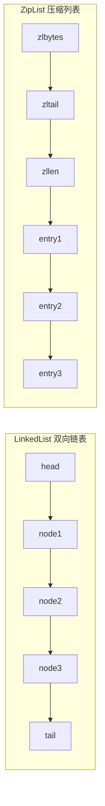
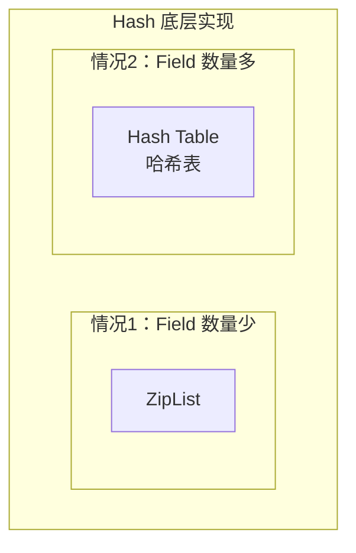
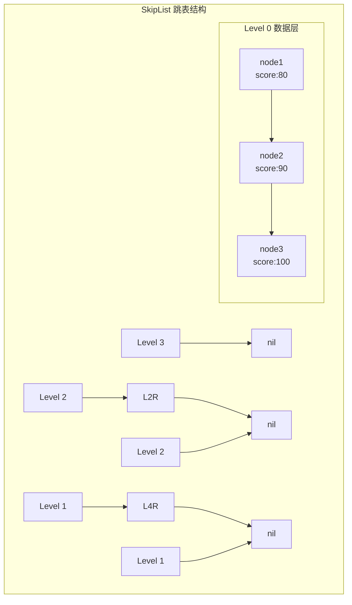

# Redis 数据结构及场景

> **目标级别**：P5/P6
> **面试频率**：🔴 高频
> **面试官最关心的 3 个问题**：
> 1. Redis 有哪五种数据类型？
> 2. 每种数据类型的底层实现是什么？
> 3. 如何根据业务场景选择合适的数据结构？

面试官问：「Redis 支持哪些数据类型？」你说「String、List、Set、ZSet、Hash」——然后面试官紧接着追问「那 ZSet 的底层是什么？为什么不直接用红黑树？」你沉默了。

这就是 Redis 数据结构面试的真实面貌：不仅要回答"是什么"，还要回答"为什么这样设计"。

## 一、五种数据类型总览



## 二、String（字符串）

### 2.1 基本命令

```bash
# 设置值
SET key value
SET key value NX PX 1000  # NX：不存在才设置，PX：毫秒级过期

# 获取值
GET key

# 批量操作
MSET key1 value1 key2 value2
MGET key1 key2

# 计数
INCR count
INCRBY count 10
DECR count
DECRBY count 5
```

### 2.2 应用场景

| 场景 | 示例 | 说明 |
|------|------|------|
| **缓存对象** | `SET user:1 '{"name":"张三","age":18}'` | JSON 序列化后存储 |
| **计数器** | `INCR views:article:123` | 文章访问量统计 |
| **分布式锁** | `SET lock:product NX PX 3000` | 互斥锁实现 |
| **限流** | `INCR rate:limit:123` | 接口限流 |
| **Session 共享** | `SET session:abc123 "user info"` | 用户会话存储 |

### 2.3 底层实现：SDS

SDS（Simple Dynamic String）是 Redis 自定义的字符串结构，相比 C 字符串有以下优势：

| 特性 | C 字符串 | SDS |
|------|----------|-----|
| 获取长度 | `O(n)` 遍历 | `O(1)` 保存长度 |
| 缓冲区溢出 | 容易发生 | 自动扩容 |
| 二进制安全 | 否（遇 `\0` 截断） | 是 |
| 修改次数 | 每次需重新分配 | 预分配+惰性释放 |
| 内存分配 | 频繁 | 空间预分配 |

更多细节请参考：[String 底层 SDS 原理](/questions/redis/sds)

## 三、List（列表）

### 3.1 基本命令

```bash
# 插入
LPUSH list item          # 头部插入
RPUSH list item          # 尾部插入
LINSERT list BEFORE pivot item  # 指定位置插入

# 查询
LRANGE list 0 -1         # 获取全部
LINDEX list 2            # 按索引获取

# 删除
LPOP list
RPOP list
LREM list count value    # 移除指定元素
```

### 3.2 应用场景

| 场景 | 示例 | 说明 |
|------|------|------|
| **消息队列** | `LPUSH msg 消息; BRPOP queue 0` | 轻量级队列 |
| **最新列表** | `LPUSH feeds:user:1 内容; LTRIM feeds:user:1 0 99` | 关注动态 |
| **排行榜** | `LPUSH rank:game 100; ZREVRANGE rank:game 0 9` | 分数排序 |
| **栈结构** | `LPUSH stack a; LPOP stack` | LIFO |

### 3.3 底层实现



**编码转换规则**：

- 列表长度 `< 512` 且每个元素 `< 64` 字节 → ZipList
- 否则 → LinkedList

| 编码 | 优点 | 缺点 |
|------|------|------|
| ZipList | 内存紧凑，节省空间 | 插入删除需移动元素，`O(n)` |
| LinkedList | 头尾操作 `O(1)` | 每个节点额外指针，内存开销大 |

## 四、Hash（哈希）

### 4.1 基本命令

```bash
# 设置
HSET user:1 name "张三"
HSET user:1 age 18
HMSET user:1 name "张三" age 18  # 批量设置

# 获取
HGET user:1 name
HMGET user:1 name age           # 批量获取
HGETALL user:1                   # 获取全部字段

# 计数
HINCRBY user:1 age 1
```

### 4.2 应用场景

| 场景 | 示例 | 说明 |
|------|------|------|
| **对象存储** | `HSET user:1 name "张三" age 18` | 比 JSON 更灵活 |
| **购物车** | `HSET cart:1 goods:101 2 goods:102 1` | 商品数量映射 |
| **配置缓存** | `HSET config:api timeout 5000 retry 3` | 配置项管理 |

### 4.3 底层实现



**编码转换规则**：

- Hash 键值对数量 `< 512` 且每个字段值 `< 64` 字节 → ZipList
- 否则 → Hash Table（dict）

| 编码 | 适用场景 | 说明 |
|------|----------|------|
| ZipList | 小对象存储 | 按顺序存储，节省内存 |
| Hash Table | 大对象或频繁操作 | `O(1)` 单字段操作 |

## 五、Set（集合）

### 5.1 基本命令

```bash
# 添加
SADD tags "java" "redis"
SREM tags "java"               # 移除

# 查询
SMEMBERS tags                  # 获取全部
SISMEMBER tags "redis"        # 判断是否存在
SCARD tags                     # 获取集合大小

# 集合运算
SINTER set1 set2               # 交集
SUNION set1 set2               # 并集
SDIFF set1 set2                # 差集
```

### 5.2 应用场景

| 场景 | 示例 | 说明 |
|------|------|------|
| **标签系统** | `SADD tags:article:1 "java" "redis"` | 文章标签 |
| **黑名单** | `SADD blacklist "user:123"` | 用户黑名单 |
| **好友关系** | `SADD friends:1 "2" "3" "4"` | 共同好友 |
| **抽奖** | `SADD lottery:ticket:1 user:1 user:2` | 参与用户 |

### 5.3 底层实现

**编码转换规则**：

- Set 只包含整数且数量 `< 512` → IntSet（整数集合）
- 否则 → Hash Table

| 编码 | 适用场景 | 时间复杂度 |
|------|----------|------------|
| IntSet | 纯整数、小规模 | 查询 `O(log n)` |
| Hash Table | 任意类型数据 | 查询 `O(1)` |

## 六、ZSet（有序集合）

### 6.1 基本命令

```bash
# 添加
ZADD leaderboard 100 "user:1"
ZADD leaderboard 90 "user:2"
ZADD leaderboard 80 "user:3"

# 查询
ZREVRANGE leaderboard 0 9 WITHSCORES  # 降序获取前10名
ZRANGE leaderboard 0 9 WITHSCORES      # 升序获取前10名

# 排名
ZRANK leaderboard "user:1"            # 获取排名
ZREVRANK leaderboard "user:1"         # 降序排名
```

### 6.2 应用场景

| 场景 | 示例 | 说明 |
|------|------|------|
| **排行榜** | `ZADD rank:game 100 "user:1"` | 游戏积分排行 |
| **热搜榜单** | `ZADD hot:search 999 "热搜词"` | 实时热搜 |
| **延迟队列** | `ZADD delay:queue timestamp "task"` | 定时任务 |
| **滑动窗口** | `ZADD rate:123 timestamp` | 接口限流 |

### 6.3 底层实现：跳表



ZSet 使用**跳表 + 哈希表**组合实现：

- **跳表**：支持按分数排序的 `O(log n)` 查找
- **哈希表**：支持 `O(1)` 的成员查找

更多细节请参考：[ZSet 底层跳表原理](/questions/redis/skiplist)

## 七、数据结构对比总结

| 数据类型 | 底层结构 | 适用场景 | 复杂度 |
|----------|----------|----------|--------|
| String | SDS | 缓存、计数器、锁 | `O(1)` |
| List | LinkedList/ZipList | 队列、消息队列、最新列表 | 头尾 `O(1)`，中间 `O(n)` |
| Hash | HashTable/ZipList | 对象存储、配置缓存 | `O(1)` |
| Set | HashTable/IntSet | 标签、集合运算、黑名单 | `O(1)` |
| ZSet | SkipList + HashTable | 排行榜、热搜、延迟队列 | `O(log n)` |

## 八、面试追问链设计

> **第一层**：Redis 有哪五种数据类型？
> **第二层**：每种数据类型的底层实现是什么？
> **第三层**：ZSet 为什么用跳表而不是红黑树？

> **第一层**：SDS 比 C 字符串好在哪里？
> **第二层**：SDS 的扩容机制是怎样的？
> **第三层**：为什么 ZipList 适合小数据存储？

> **第一层**：ZSet 的 score 有什么作用？
> **第二层**：ZSet 如何实现排行榜功能？
> **第三层**：如果要获取「用户 A 的排名」，如何高效实现？

## 九、常见面试陷阱

**⚠️ 陷阱 1**：误认为 List 就是队列
- List 可以用作轻量级队列，但不支持消息确认、重试等机制
- 生产环境建议使用专业消息队列（RabbitMQ、Kafka）

**⚠️ 陷阱 2**：忽视编码转换
- 很多候选人不知道 ZipList 和 LinkedList 的转换条件
- 实际项目中，如果数据量超过阈值，性能会突然下降

**⚠️ 陷阱 3**：ZSet 只记分数，忘记哈希表
- ZSet 的跳表用于排序，哈希表用于快速查找
- 两者缺一不可，面试时要说出「双数据结构」的设计

## 十、加分回答

> **💡 面试加分点**：如果能说出 Redis 3.2+ 引入的 QuickList 和 ListPack，会给面试官留下深刻印象：
>
> 1. **QuickList**：结合 LinkedList 和 ZipList 的优点，用多个 ZipList 组成链表
> 2. **ListPack**：取代 ZipList，解决级联更新问题，内存更紧凑
> 3. **Stream**：Redis 5.0 引入的 stream 类型，用于实现消息队列
