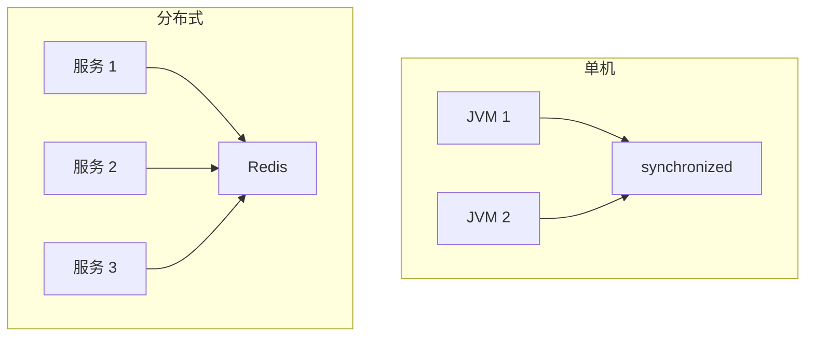
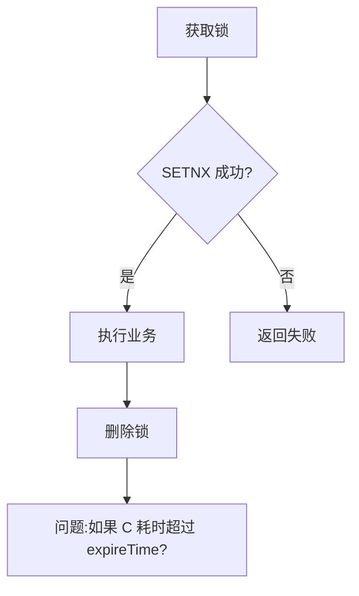
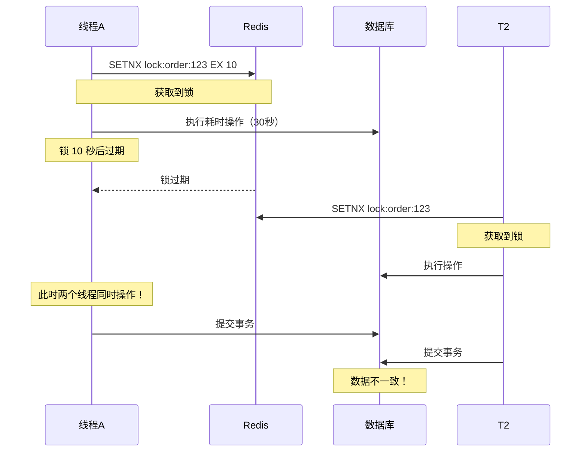
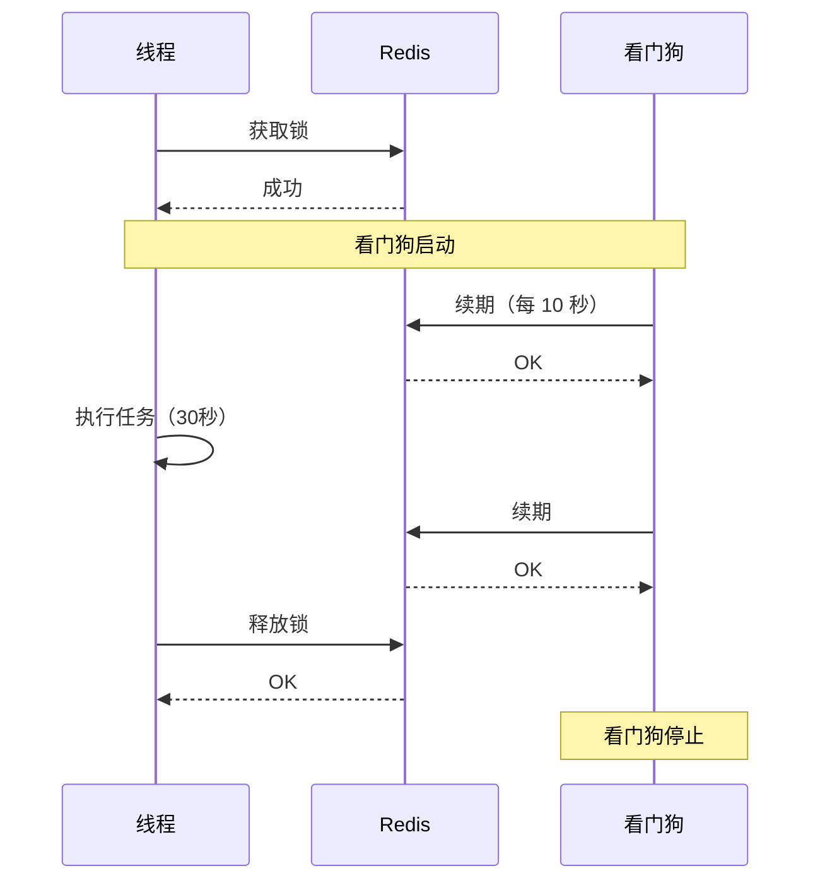
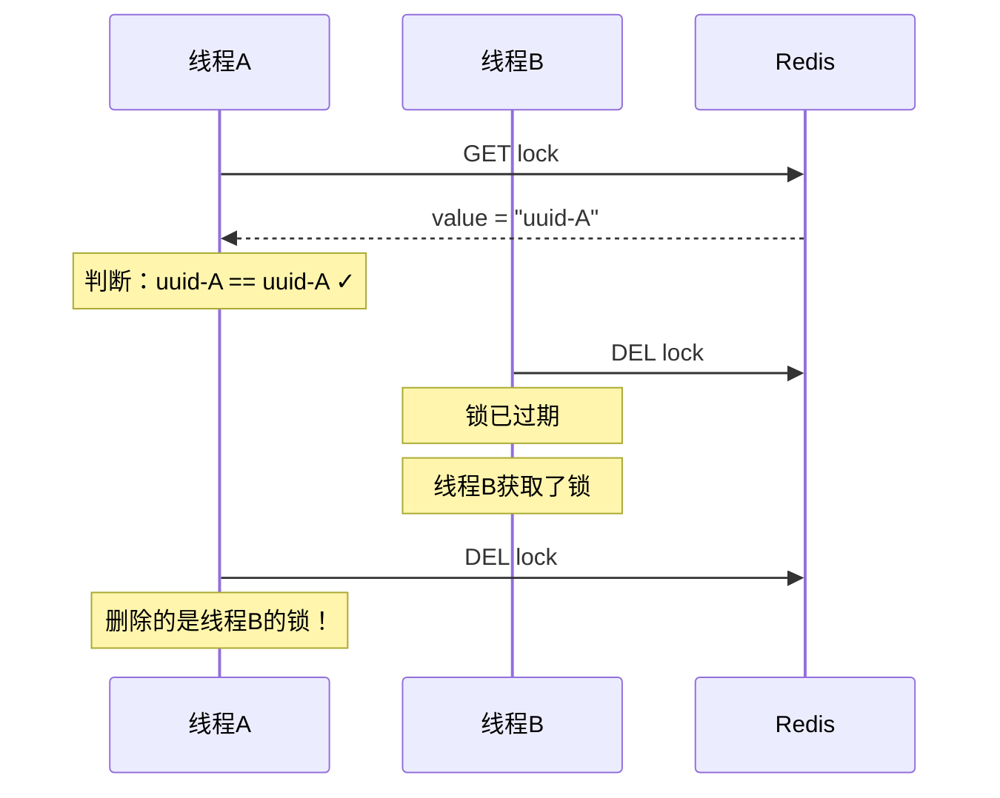
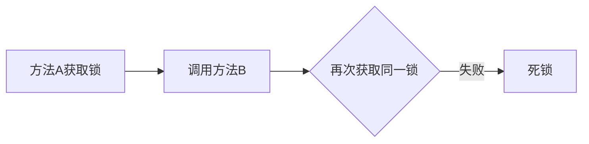

# Redis 分布式锁

> **目标级别**：P5/P6
> **面试频率**：🔴 高频
> **面试官最关心的 3 个问题**：
> 1. 如何用 Redis 实现分布式锁？
> 2. Redis 分布式锁有哪些问题？如何解决？
> 3. SETNX 的过期时间设置多少合适？

面试官问：「多个服务实例同时抢一个任务，怎么保证只有一个实例能抢到？」你说「用 synchronized」——然后面试官追问「synchronized 是 JVM 锁，只能锁单个实例，多实例部署怎么办？」你沉默了。

这就是分布式锁的价值：跨 JVM 进程、跨服务器的互斥机制。

## 一、分布式锁概述

### 1.1 什么是分布式锁

**分布式锁**：在分布式系统中，用于控制多个进程对共享资源的互斥访问。



### 1.2 分布式锁应具备的特性

| 特性 | 说明 |
|------|------|
| **互斥性** | 任意时刻只能有一个客户端持有锁 |
| **可重入性** | 同一个客户端可以多次获取同一把锁 |
| **死锁避免** | 锁必须能自动释放，避免死锁 |
| **性能保障** | 加锁/释放锁的性能要足够高 |
| **公平性** | 锁获取的顺序应该是公平的 |

## 二、简单实现：SETNX

### 2.1 基本实现

```java
public class SimpleRedisLock {
    private final RedisTemplate<String, String> redis;
    private final String lockKey;
    private final String lockValue;
    private final long expireTime;

    public SimpleRedisLock(RedisTemplate<String, String> redis,
                           String lockKey,
                           long expireTime,
                           TimeUnit timeUnit) {
        this.redis = redis;
        this.lockKey = lockKey;
        this.lockValue = UUID.randomUUID().toString();
        this.expireTime = timeUnit.toSeconds(expireTime);
    }

    /**
     * 获取锁
     */
    public boolean tryLock() {
        // SETNX + 过期时间（原子操作）
        Boolean result = redis.opsForValue().setIfAbsent(
            lockKey,
            lockValue,
            expireTime,
            TimeUnit.SECONDS
        );
        return Boolean.TRUE.equals(result);
    }

    /**
     * 释放锁
     */
    public void unlock() {
        // 只释放自己的锁
        String currentValue = redis.opsForValue().get(lockKey);
        if (lockValue.equals(currentValue)) {
            redis.delete(lockKey);
        }
    }
}
```

### 2.2 使用示例

```java
@Service
public class OrderService {
    private final RedisTemplate<String, String> redis;

    public void createOrder(String orderId) {
        String lockKey = "lock:order:" + orderId;
        SimpleRedisLock lock = new SimpleRedisLock(redis, lockKey, 30, TimeUnit.SECONDS);

        try {
            if (lock.tryLock()) {
                // 抢到锁，执行下单逻辑
                doCreateOrder(orderId);
            } else {
                // 未抢到锁，提示稍后重试
                throw new RuntimeException("系统繁忙，请稍后重试");
            }
        } finally {
            lock.unlock();
        }
    }
}
```

### 2.3 问题分析



| 问题 | 说明 | 严重性 |
|------|------|--------|
| **锁过期，业务未完成** | 业务执行时间超过过期时间，锁被释放 | 高 |
| **释放别人的锁** | 判断不原子，可能释放其他请求的锁 | 高 |
| **不可重入** | 同一个线程无法多次获取同一把锁 | 中 |

## 三、问题一：锁过期，业务未完成

### 3.1 问题描述



### 3.2 解决方案：看门狗机制

```java
public class RedisLockWithWatchdog {
    private final RedissonClient redisson;

    public void doWithLock(String lockKey, Runnable task) {
        RLock lock = redisson.getLock(lockKey);
        // lock.lock() 会自动续期（看门狗机制）
        // 默认每 10 秒续期一次，锁过期时间 30 秒
        lock.lock();

        try {
            task.run();
        } finally {
            lock.unlock();
        }
    }
}
```



### 3.3 看门狗配置

```java
// 方式1：自动续期
RLock lock = redisson.getLock("myLock");
lock.lock();  // 锁自动续期，内部默认每 10 秒续一次

// 方式2：指定过期时间（不续期）
RLock lock = redisson.getLock("myLock");
lock.lock(10, TimeUnit.SECONDS);  // 10 秒后自动释放

// 方式3：尝试获取 + 指定过期时间
boolean acquired = lock.tryLock(10, 30, TimeUnit.SECONDS);
// 30 秒内未获取到锁则返回失败
```

## 四、问题二：释放别人的锁

### 4.1 问题描述

释放锁时，判断和删除不是原子操作：



### 4.2 解决方案：Lua 脚本

```java
public class RedisLock {
    private final RedisTemplate<String, String> redis;
    private static final String UNLOCK_SCRIPT =
        "if redis.call('get', KEYS[1]) == ARGV[1] then " +
        "    return redis.call('del', KEYS[1]) " +
        "else " +
        "    return 0 " +
        "end";

    public void unlock(String lockKey, String lockValue) {
        redis.execute(
            new DefaultRedisScript<>(UNLOCK_SCRIPT, Long.class),
            Collections.singletonList(lockKey),
            lockValue
        );
    }
}
```

```bash
# 等价的 Redis 命令
if redis.call("get", KEYS[1]) == ARGV[1] then
    return redis.call("del", KEYS[1])
else
    return 0
end
```

## 五、问题三：不可重入

### 5.1 问题描述



### 5.2 解决方案：重入锁

```java
public class ReentrantRedisLock {
    private final RedisTemplate<String, String> redis;
    private final Map<String, Integer> localLockCount = new ConcurrentHashMap<>();
    private static final String LOCK_PREFIX = "redisson:lock:";

    public boolean tryLock(String key, long expireTime, TimeUnit unit) {
        String lockKey = LOCK_PREFIX + key;
        String lockValue = UUID.randomUUID().toString();

        // 本地计数
        int count = localLockCount.getOrDefault(key, 0);
        if (count > 0) {
            // 已持有锁，可重入
            localLockCount.put(key, count + 1);
            return true;
        }

        // 尝试获取锁
        Boolean acquired = redis.opsForValue().setIfAbsent(
            lockKey, lockValue, expireTime, unit
        );

        if (Boolean.TRUE.equals(acquired)) {
            localLockCount.put(key, 1);
            return true;
        }

        return false;
    }

    public void unlock(String key) {
        String lockKey = LOCK_PREFIX + key;

        // 本地计数
        int count = localLockCount.getOrDefault(key, 0);
        if (count > 1) {
            localLockCount.put(key, count - 1);
            return;
        }

        // 释放锁
        localLockCount.remove(key);
        redis.delete(lockKey);
    }
}
```

## 六、完整实现

### 6.1 使用 Redisson

Redisson 是最成熟的 Redis 分布式锁实现：

```java
@Service
public class OrderService {
    @Autowired
    private RedissonClient redisson;

    public void createOrder(String orderId) {
        String lockKey = "lock:order:" + orderId;
        RLock lock = redisson.getLock(lockKey);

        try {
            // 尝试获取锁，等待 10 秒，锁自动续期
            boolean acquired = lock.tryLock(10, -1, TimeUnit.SECONDS);
            if (!acquired) {
                throw new RuntimeException("系统繁忙，请稍后重试");
            }

            // 执行业务
            doCreateOrder(orderId);

        } catch (InterruptedException e) {
            Thread.currentThread().interrupt();
            throw new RuntimeException("操作被中断");
        } finally {
            // 释放锁
            if (lock.isHeldByCurrentThread()) {
                lock.unlock();
            }
        }
    }
}
```

### 6.2 特性对比

| 特性 | 手写 SETNX | Redisson |
|------|-----------|----------|
| **原子性** | 需 Lua 脚本 | 原生支持 |
| **可重入** | 需额外实现 | 原生支持 |
| **看门狗** | 需额外实现 | 原生支持 |
| **公平锁** | 需额外实现 | 支持 |
| **读写锁** | 不支持 | 支持 |
| **信号量** | 不支持 | 支持 |

## 七、面试追问链设计

> **第一层**：如何用 Redis 实现分布式锁？
> **第二层**：SETNX 和 SETNX + EX 有什么区别？
> **第三层**：锁过期了业务还没执行完怎么办？

> **第一层**：释放锁时为什么要判断 value？
> **第二层**：如果判断和删除不是原子操作会怎样？
> **第三层**：如何用 Lua 脚本保证原子性？

> **第一层**：Redis 分布式锁和 Zookeeper 分布式锁有什么区别？
> **第二层**：Redis 分布式锁有什么局限？
> **第三层**：什么情况下不适合用 Redis 分布式锁？

## 八、常见面试陷阱

**⚠️ 陷阱 1**：SETNX 和 EX 分开写

```java
// 错误：分开写不是原子操作
redis.setnx(lockKey, value);
redis.expire(lockKey, 10);

// 正确：原子操作
redis.set(lockKey, value, 10, TimeUnit.SECONDS);
```

**⚠️ 陷阱 2**：锁过期时间设置不当

设置太短：业务未完成锁就过期，导致并发。
设置太长：服务挂了要等很久锁才释放。

**⚠️ 陷阱 3**：释放锁时没判断是否是自己的锁

如果锁已过期，被其他线程获取，此时释放会把别人的锁删掉。

## 九、对比总结表

| 维度 | SETNX 手写 | Redisson | Zookeeper |
|------|-----------|----------|-----------|
| **实现复杂度** | 高 | 低 | 中 |
| **可靠性** | 一般 | 高 | 高 |
| **性能** | 高 | 高 | 中 |
| **可重入** | 需实现 | 原生支持 | 原生支持 |
| **看门狗** | 需实现 | 原生支持 | 无 |
| **主从切换** | 丢锁风险 | RedLock 方案 | 自动切换 |
| **使用场景** | 简单场景 | 推荐使用 | 高可靠场景 |

## 十、加分回答

> **💡 面试加分点**：Redisson 锁的实现原理：

1. **发布订阅**：使用 Redis 的 pub/sub 机制实现等待队列
2. **看门狗**：后台线程定期续期
3. **Lua 脚本**：保证判断和删除的原子性

> **💡 面试加分点**：分布式锁的其他实现：

1. **数据库乐观锁**：使用 version 字段实现
2. **Zookeeper**：临时有序节点 + watch
3. **Consul**：类似 Zookeeper 的实现
