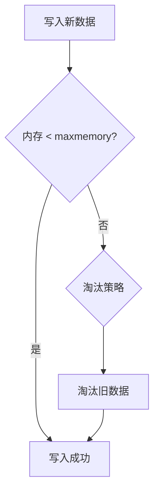
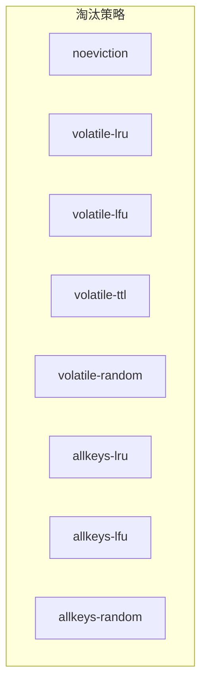
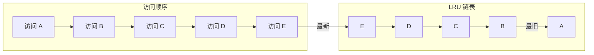
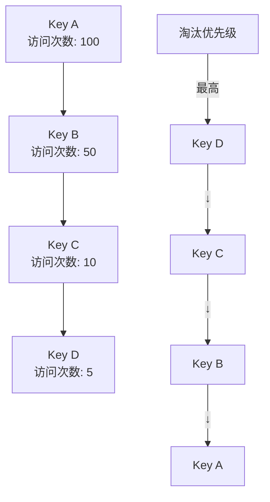
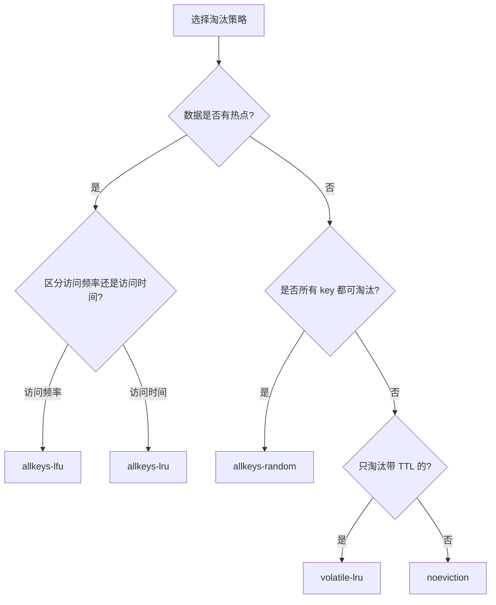
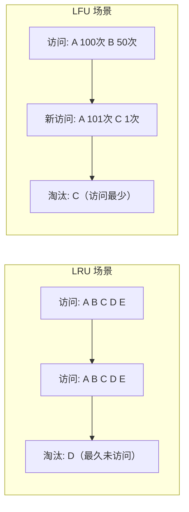
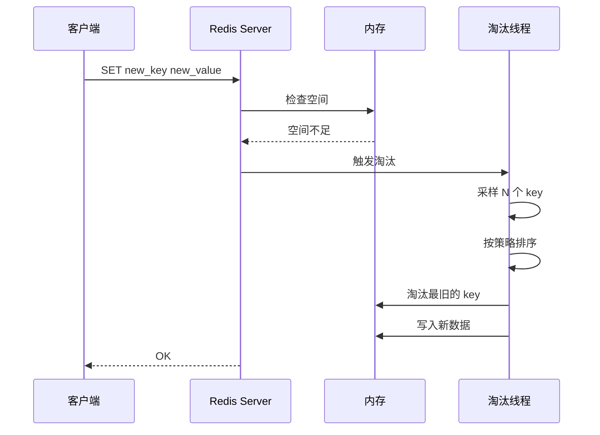

# 缓存淘汰策略

> **目标级别**：P5/P6
> **面试频率**：🔴 高频
> **面试官最关心的 3 个问题**：
> 1. Redis 有哪些缓存淘汰策略？
> 2. LRU 和 LFU 有什么区别？
> 3. 如何选择合适的淘汰策略？

面试官问：「Redis 内存用满了，新数据还能写入吗？」你说「不能」——然后面试官追问「那 Redis 会怎么处理？是直接拒绝写入还是删除一些数据？」你沉默了。

这就是 Redis 淘汰策略的核心问题：当内存不足时，Redis 必须做出选择。

## 一、Redis 内存管理

### 1.1 内存限制

Redis 默认会尽可能使用机器的所有可用内存，但可以通过 `maxmemory` 配置限制：

```bash
# redis.conf
maxmemory 2gb
maxmemory-policy allkeys-lru
```

### 1.2 内存满的表现



| `maxmemory-policy` | 行为 |
|--------------------|------|
| **noeviction** | 拒绝写入，返回错误（默认） |
| **volatile-*** | 只淘汰带过期时间的 key |
| **allkeys-*** | 淘汰所有 key |

## 二、八种淘汰策略

### 2.1 策略总览



| 策略 | 说明 | 适用场景 |
|------|------|----------|
| **noeviction** | 不淘汰，新写入返回错误 | 默认，数据重要 |
| **volatile-lru** | 从带过期时间的 key 中淘汰最久未使用的 | 有过期时间区分的业务 |
| **volatile-lfu** | 从带过期时间的 key 中淘汰使用频率最低的 | 有热点区分的业务 |
| **volatile-ttl** | 从带过期时间的 key 中淘汰 TTL 最短的 | 优先删除快过期的数据 |
| **volatile-random** | 从带过期时间的 key 中随机淘汰 | 随机淘汰 |
| **allkeys-lru** | 从所有 key 中淘汰最久未使用的 | 通用场景，推荐 |
| **allkeys-lfu** | 从所有 key 中淘汰使用频率最低的 | 有明显热点的业务 |
| **allkeys-random** | 从所有 key 中随机淘汰 | 随机淘汰 |

### 2.2 LRU 算法（Least Recently Used）

**LRU**：淘汰最久未被访问的数据。



Redis 的 LRU 实现（近似 LRU）：

```c
// Redis 使用采样方式进行 LRU
// 配置：maxmemory-samples 5（默认采样 5 个 key）

typedef struct redisObject {
    unsigned type:4;
    unsigned encoding:4;
    unsigned lru:LRU_BITS;  // 24 位，记录最近访问时间
    int refcount;
    void *ptr;
} robj;
```

### 2.3 LFU 算法（Least Frequently Used）

**LFU**：淘汰使用频率最低的数据。

```c
// LFU 使用 16 位记录访问频率
typedef struct redisObject {
    // ...
    unsigned lru:LRU_BITS;  // 复用 LRU 字段存储 LFU
} robj;

// LFU 字段结构
// 高 16 位：last decrement time
// 低 8 位：counter（访问次数）
```



### 2.4 TTL 算法

**TTL**：淘汰剩余生存时间（TTL）最短的 key。

```bash
# Redis 根据 key 的 TTL 淘汰
Key A: TTL = 3600 秒
Key B: TTL = 1800 秒  # 优先淘汰
Key C: TTL = 600 秒   # 最优先淘汰
```

## 三、代码配置

### 3.1 Redis 配置

```bash
# redis.conf

# 最大内存（1GB）
maxmemory 1gb

# 淘汰策略
maxmemory-policy allkeys-lru

# LRU/LFU 采样数量（越大越精确，越大越慢）
maxmemory-samples 5
```

### 3.2 Spring Boot 配置

```yaml
# application.yml
spring:
  redis:
    host: localhost
    port: 6379
```

```java
@Configuration
public class RedisConfig {
    @Bean
    public RedisTemplate<String, String> redisTemplate(
            RedisConnectionFactory factory) {
        RedisTemplate<String, String> template = new RedisTemplate<>();
        template.setConnectionFactory(factory);

        // 设置淘汰策略
        RedisProperties properties = new RedisProperties();
        template.execute((RedisCallback<Void>) connection -> {
            connection.serverCommands().setConfig(
                "maxmemory-policy", "allkeys-lru"
            );
            return null;
        });

        return template;
    }
}
```

## 四、如何选择淘汰策略

### 4.1 选择流程



### 4.2 场景推荐

| 场景 | 推荐策略 | 原因 |
|------|----------|------|
| **通用缓存** | allkeys-lru | 优先保留热点数据 |
| **有明确热点** | allkeys-lfu | 精确区分访问频率 |
| **Session 管理** | allkeys-lru | 最近使用的最重要 |
| **验证码/临时数据** | volatile-ttl | 优先删除快过期的 |
| **数据安全优先** | noeviction | 拒绝写入，保护数据 |
| **缓存预热** | volatile-lru | 只淘汰有过期时间的 |

### 4.3 面试对比：LRU vs LFU

| 维度 | LRU | LFU |
|------|-----|-----|
| **全称** | Least Recently Used | Least Frequently Used |
| **淘汰依据** | 最近访问时间 | 访问频率 |
| **优点** | 简单，适应变化快 | 精确识别热点 |
| **缺点** | 可能误杀偶发性热点 | 不适应变化，一段时间不访问就会淘汰 |
| **适用场景** | 访问模式变化快的场景 | 访问模式稳定的场景 |



## 五、Redis LRU 实现细节

### 5.1 近似 LRU

Redis 使用的是**近似 LRU** 算法，不是精确 LRU：

```c
// 近似 LRU 算法
// 随机采样 5 个 key，选择最久未使用的淘汰

robj *lookupKey(redisDb *db, robj *key) {
    // 采样
    evictionPool *pool = server.evictionPool;
    int samples = server.maxmemory_samples;

    for (int i = 0; i < samples; i++) {
        robj *candidate = getRandomKey(db);
        // 比较 LRU 时间戳，选择最旧的加入淘汰池
        if (candidate->lru < pool[max].lru) {
            pool[max] = candidate;
        }
    }
}
```

### 5.2 LRU 精度配置

```bash
# maxmemory-samples 越大，越接近精确 LRU，但性能越差
maxmemory-samples 5   # 快速但不精确（默认）
maxmemory-samples 10  # 更精确
maxmemory-samples 16  # 非常接近精确 LRU
```

**💡 面试加分点**：为什么使用近似 LRU？

1. **性能考虑**：精确 LRU 需要维护一个有序链表，每次访问都要更新时间戳
2. **内存考虑**：精确 LRU 需要额外的内存维护访问顺序
3. **效果差异**：在实际场景中，近似 LRU 的效果与精确 LRU 差异不大

## 六、淘汰过程



## 七、面试追问链设计

> **第一层**：Redis 有哪些淘汰策略？
> **第二层**：LRU 和 LFU 有什么区别？
> **第三层**：Redis 的 LRU 是精确的吗？为什么？

> **第一层**：如何选择合适的淘汰策略？
> **第二层**：allkeys-lru 和 volatile-lru 有什么区别？
> **第三层**：如果缓存满了，Redis 会怎么做？

> **第一层**：LFU 的 counter 会衰减吗？
> **第二层**：LFU 和 LRU 在热点 key 识别上谁更准确？
> **第三层**：如何配置 LFU 的衰减参数？

## 八、常见面试陷阱

**⚠️ 陷阱 1**：不知道默认策略是 noeviction

Redis 默认的 `maxmemory-policy` 是 `noeviction`，意味着内存满了之后会拒绝写入。

**⚠️ 陷阱 2**：混淆 LRU 和 LFU

LRU 关注访问时间，LFU 关注访问频率。两者适用场景不同。

**⚠️ 陷阱 3**：认为 Redis LRU 是精确的

Redis 使用的是近似 LRU，通过采样实现，性能和内存效率更好。

## 九、对比总结表

| 策略 | 淘汰范围 | 淘汰依据 | 推荐场景 |
|------|----------|----------|----------|
| **noeviction** | 不淘汰 | - | 数据安全优先 |
| **allkeys-lru** | 所有 key | 最近访问时间 | 通用场景 |
| **allkeys-lfu** | 所有 key | 访问频率 | 热点明确 |
| **allkeys-random** | 所有 key | 随机 | 无规律数据 |
| **volatile-lru** | 带 TTL 的 key | 最近访问时间 | 有过期时间区分 |
| **volatile-lfu** | 带 TTL 的 key | 访问频率 | TTL + 热点 |
| **volatile-ttl** | 带 TTL 的 key | TTL 最短 | 优先删除快过期 |
| **volatile-random** | 带 TTL 的 key | 随机 | TTL + 随机 |

## 十、加分回答

> **💡 面试加分点**：Redis 4.0+ 引入的 LFU

1. **LFU 的优势**：能区分高频热点和低频数据
2. **Counter 衰减**：一段时间不访问，counter 会自动衰减
3. **配置参数**：
   - `lfu-log-factor 10`：频率 counter 的增长系数
   - `lfu-decay-time 1`：衰减周期（分钟）

> **💡 面试加分点**：热点 key 检测

```bash
# 使用 Redis 5.0+ 的 MEMORY USAGE 查看 key 内存
redis-cli MEMORY USAGE hotkey

# 使用 Redis 5.0+ 的 OBJECT ENCODING 查看编码
redis-cli OBJECT ENCODING hotkey
```
