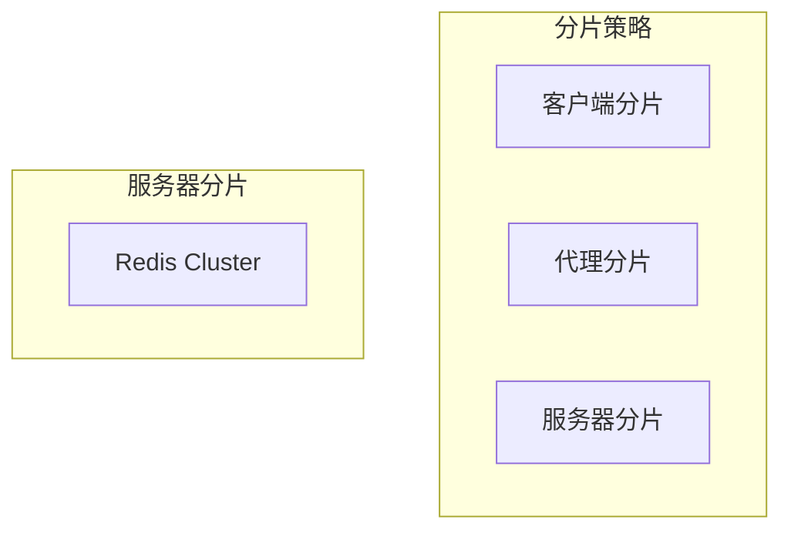
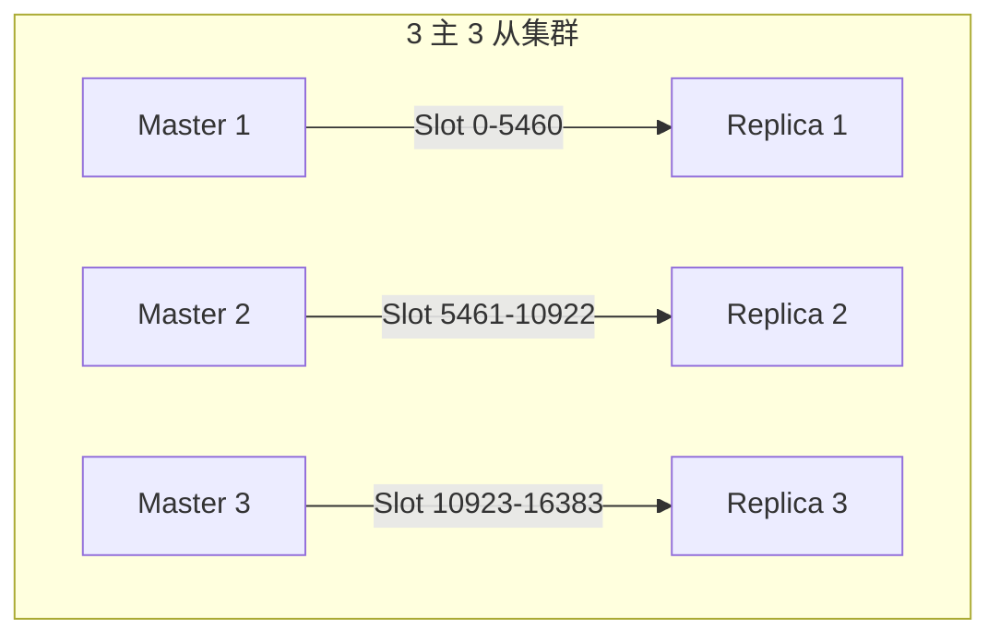
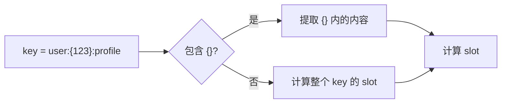
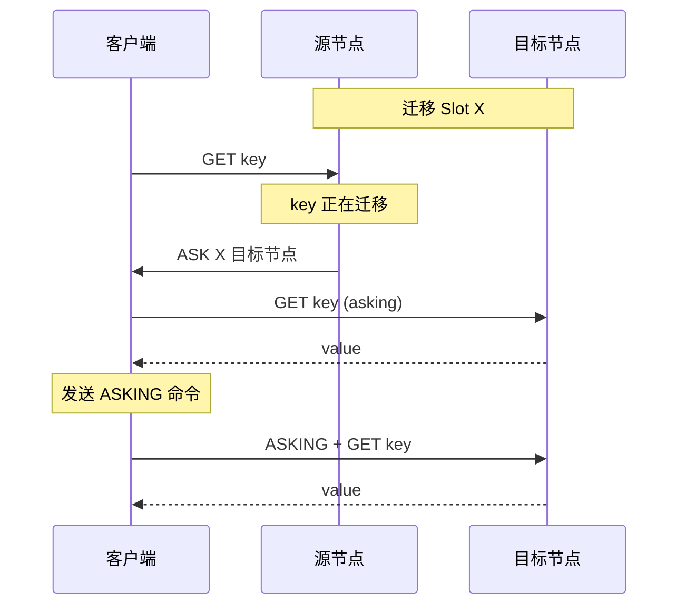
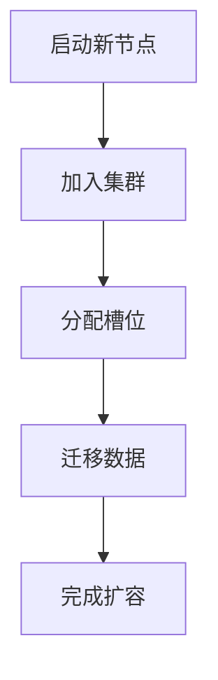
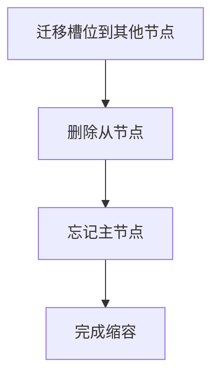

# Redis 集群数据分片

> **目标级别**：P5/P6
> **面试频率**：🟡 中频
> **面试官最关心的 3 个问题**：
> 1. Redis 集群是如何分片的？
> 2. Hash Tag 是什么？解决什么问题？
> 3. 槽位迁移过程中如何保证服务可用？

面试官问：「Redis 集群有 3 个主节点，每个节点负责多少槽位？」你说「不知道」——然后面试官追问「如果要把某个 key 从节点 A 迁移到节点 B，需要怎么操作？」你沉默了。

这就是数据分片的核心问题：如何均匀分布数据，以及如何动态调整数据位置。

## 一、分片基础

### 1.1 为什么需要分片

| 问题 | 单机 Redis | 集群 |
|------|------------|------|
| **内存限制** | 受单机内存限制 | 可横向扩展 |
| **并发能力** | 单机 CPU | 多机并发 |
| **可用性** | 单点故障 | 自动故障转移 |

### 1.2 分片策略



| 策略 | 原理 | 代表方案 |
|------|------|----------|
| **客户端分片** | 客户端计算数据所在节点 | Jedis Consistent Hashing |
| **代理分片** | 通过代理转发请求 | Twemproxy、Codis |
| **服务器分片** | Redis 原生支持 | Redis Cluster |

## 二、槽位机制详解

### 2.1 槽位数量

Redis Cluster 有 **16384 个槽位**（slot），为什么是这个数字？

```bash
# 16384 = 2^14

# CRC16 计算后取模
slot = CRC16(key) % 16384
```

| 设计考量 | 说明 |
|----------|------|
| **网络开销** | 槽位信息需要通过网络传播，16384 个约 2KB |
| **心跳包大小** | 每秒发送心跳，槽位信息不能太大 |
| **槽位分配** | 16384 可被大多数节点数整除 |

### 2.2 槽位分配



```bash
# 查看槽位分配
redis-cli -c -p 7001 cluster slots

# 输出示例
1) 1) (integer) 0
   2) (integer) 5460
   3) 1) "127.0.0.1"
      2) (integer) 7001
      3) "节点ID"

2) 1) (integer) 5461
   3) (integer) 10922
   ...
```

### 2.3 Key 到 Slot 的映射

```java
/**
 * CRC16 计算 slot
 */
public static int getSlot(String key) {
    // 1. 计算 CRC16
    int crc = CRC16(key.getBytes());

    // 2. 取模 16384
    return crc % 16384;
}

// Redis 源码实现
int clusterKeyHashSlot(char *key, int keylen) {
    int hash;
    int slot;

    // 处理 hash tag
    char *hashstart;
    char *hashend;

    hashstart = strchr(key, '{');
    if (hashstart) {
        hashend = strchr(hashstart + 1, '}');
        if (hashend) {
            keylen = hashend - key;
            key = hashstart + 1;
        }
    }

    // 计算 CRC16 并取模
    hash = crc16(key, keylen);
    slot = hash % CLUSTER_SLOTS;
    return slot;
}
```

## 三、Hash Tag

### 3.1 什么是 Hash Tag

**Hash Tag**：用 `{...}` 包裹 key 的某部分，用于强制将多个 key 放在同一个槽位。

```bash
# 不使用 Hash Tag
SET user:1:profile "data1"    # slot 取决于整个 key
SET user:2:profile "data2"    # slot 取决于整个 key
# 两个 key 的 slot 可能不同

# 使用 Hash Tag
SET user:{1}:profile "data1"  # slot 取决于 "1"
SET user:{1}:balance "data2"  # slot 取决于 "1"
# 两个 key 一定在同一个 slot
```

### 3.2 Hash Tag 计算规则



```bash
# 示例
key = "user:{123}:profile"
# 提取 hash tag: "123"
# 计算 CRC16("123") % 16384 = slot 4567

key = "user:{123}:balance"
# 提取 hash tag: "123"
# 计算 CRC16("123") % 16384 = slot 4567

# 两个 key 一定在同一个 slot！
```

### 3.3 使用场景

| 场景 | 示例 | 说明 |
|------|------|------|
| **跨键操作** | `SUNION user:{1}:friends user:{1}:followers` | 同一用户的数据在同槽 |
| **事务** | 多键在同一槽位，可执行事务 | Lua 脚本中多键操作 |
| **pipeline** | 多命令在同槽，可 pipeline | 减少网络往返 |

```java
// 错误示例：跨槽位操作会报错
jedis.set("user:1:profile", "...");
jedis.set("user:2:profile", "...");
jedis.mget("user:1:profile", "user:2:profile"); // ❌ 可能报错

// 正确示例：使用 Hash Tag
jedis.set("user:{1}:profile", "...");
jedis.set("user:{1}:balance", "...");
jedis.mget("user:{1}:profile", "user:{1}:balance"); // ✓ 同一槽位
```

## 四、槽位迁移

### 4.1 为什么需要迁移

| 场景 | 说明 |
|------|------|
| **添加节点** | 新节点需要从其他节点迁移槽位 |
| **删除节点** | 节点下线，槽位迁移到其他节点 |
| **负载均衡** | 槽位分布不均需要重新分配 |
| **节点故障** | 从节点升级后需要重新分配 |

### 4.2 迁移流程



### 4.3 迁移命令

```bash
# 1. 查看槽位状态
redis-cli -c -p 7001 cluster slots

# 2. 迁移槽位（交互式）
redis-cli --cluster-reshard 127.0.0.1:7001

# 3. 指定迁移多少个槽位到目标节点
# How many slots do you want to move (1-16384)? 4096
# What is the receiving node ID? <目标节点ID>

# 4. 选择源节点
# Please enter all the source node IDs.
#   Type 'all' to use all the nodes as source nodes
#   Type 'done' when you done
# Source node 1: all
```

### 4.4 在线迁移

```bash
# 使用 redis-cli 迁移单个 key
redis-cli --cluster import 127.0.0.1:7007 --cluster-from 127.0.0.1:7001 --cluster-keys key1,key2

# 或者使用 redis-trib.rb
./redis-trib.rb import 127.0.0.1:7007 --from 127.0.0.1:7001
```

## 五、集群扩缩容

### 5.1 扩容流程



```bash
# 1. 启动新节点
redis-server --port 7007 --cluster-enabled yes

# 2. 添加到集群
redis-cli --cluster add-node 127.0.0.1:7007 127.0.0.1:7001

# 3. 重新分配槽位
redis-cli --cluster-reshard 127.0.0.1:7001

# 4. 验证
redis-cli -c -p 7007 cluster nodes
```

### 5.2 缩容流程



```bash
# 1. 先迁移槽位
redis-cli --cluster-reshard 127.0.0.1:7001

# 2. 删除从节点
redis-cli --cluster del-node 127.0.0.1:7008 <从节点ID>

# 3. 删除主节点
redis-cli --cluster del-node 127.0.0.1:7007 <主节点ID>
```

## 六、面试追问链设计

> **第一层**：Redis Cluster 是如何分片的？
> **第二层**：为什么是 16384 个槽位？
> **第三层**：Hash Tag 是什么？解决什么问题？

> **第一层**：槽位迁移过程中，客户端如何处理？
> **第二层**：ASK 和 MOVED 重定向有什么区别？
> **第三层**：如何在线迁移数据？

> **第一层**：如果某个节点挂了，数据会丢失吗？
> **第二层**：集群如何保证高可用？
> **第三层**：槽位分配不均匀怎么办？

## 七、常见面试陷阱

**⚠️ 陷阱 1**：认为所有 key 操作都支持

Redis Cluster 不支持跨槽位的多键操作，除非使用 Hash Tag 将它们放在同一槽位。

**⚠️ 陷阱 2**：忽视迁移过程中的可用性

槽位迁移期间，客户端需要处理 ASK 重定向，否则会报错。

**⚠️ 陷阱 3**：Hash Tag 使用不当

如果 Hash Tag 只有一个空字符串 `{""}` 或不完整的 `{}`，会导致所有 key 集中在同一槽位。

## 八、对比总结表

| 维度 | 客户端分片 | Twemproxy | Redis Cluster |
|------|------------|-----------|---------------|
| **实现位置** | 客户端 | 代理层 | 服务器 |
| **槽位迁移** | 不支持 | 不支持 | 支持 |
| **客户端复杂度** | 高 | 低 | 中 |
| **单点故障** | 无 | 代理 | 无 |
| **动态扩容** | 需改代码 | 需重启代理 | 在线迁移 |

## 九、加分回答

> **💡 面试加分点**：Redis Cluster 的通信机制：

1. **Gossip 协议**：节点间传播集群状态
2. **心跳检测**：每 1 秒发送 ping/pong
3. **故障检测**：多个节点确认才标记下线

> **💡 面试加分点**：槽位迁移优化：

1. **批量迁移**：一次迁移多个 key
2. **迁移锁**：避免迁移过程中数据不一致
3. **TTL 保护**：为迁移中的 key 设置 TTL

> **💡 面试加分点**：与其他分片方案对比：

| 方案 | 优点 | 缺点 |
|------|------|------|
| **Redis Cluster** | 原生支持，在线迁移 | 客户端需要智能路由 |
| **Codis** | 兼容性好，Dashboard | 中间件，可能单点 |
| **Twemproxy** | 简单，轻量 | 不支持在线迁移 |
