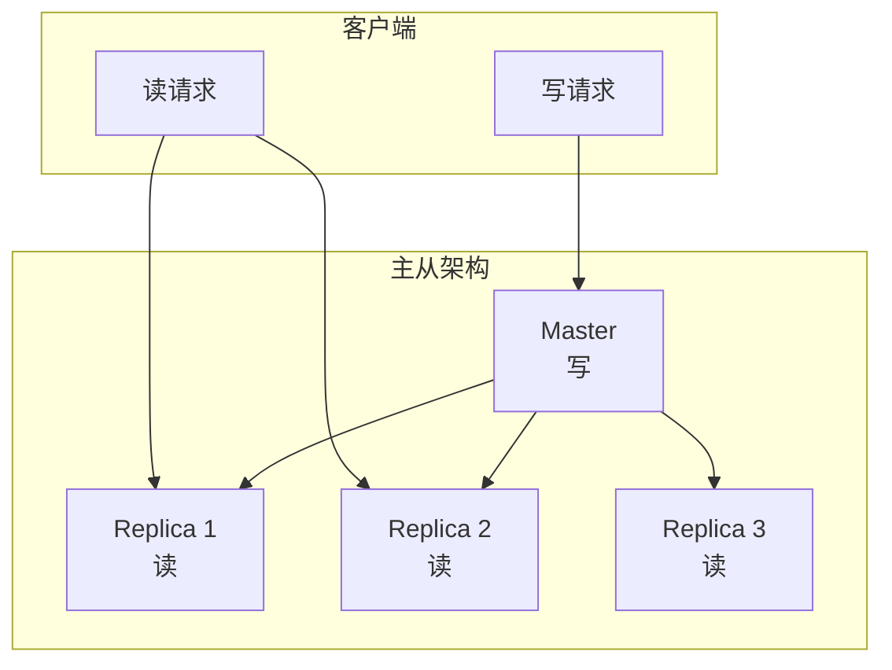
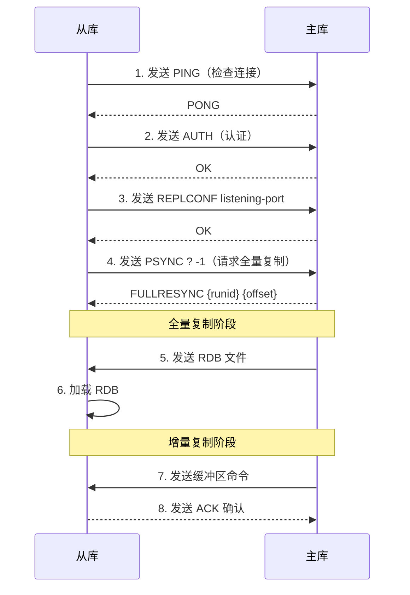
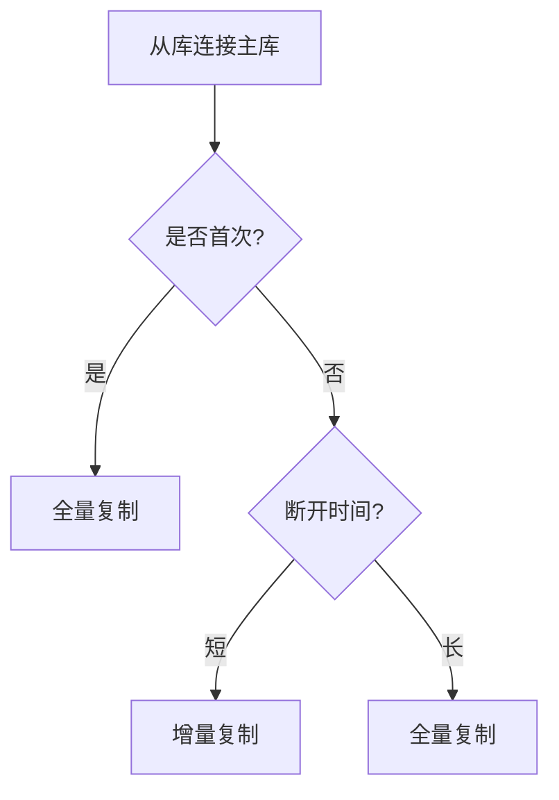
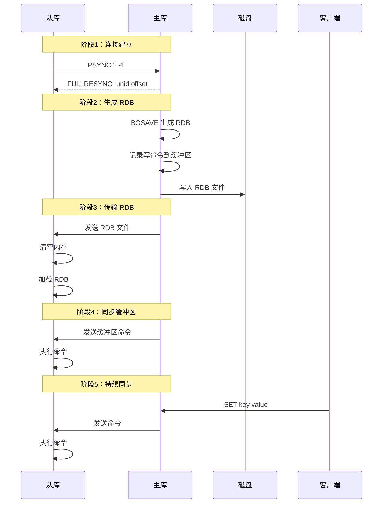
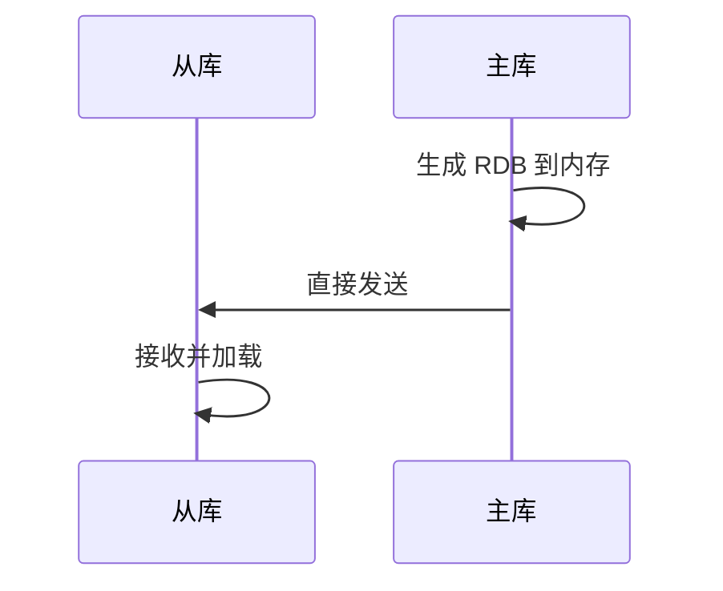
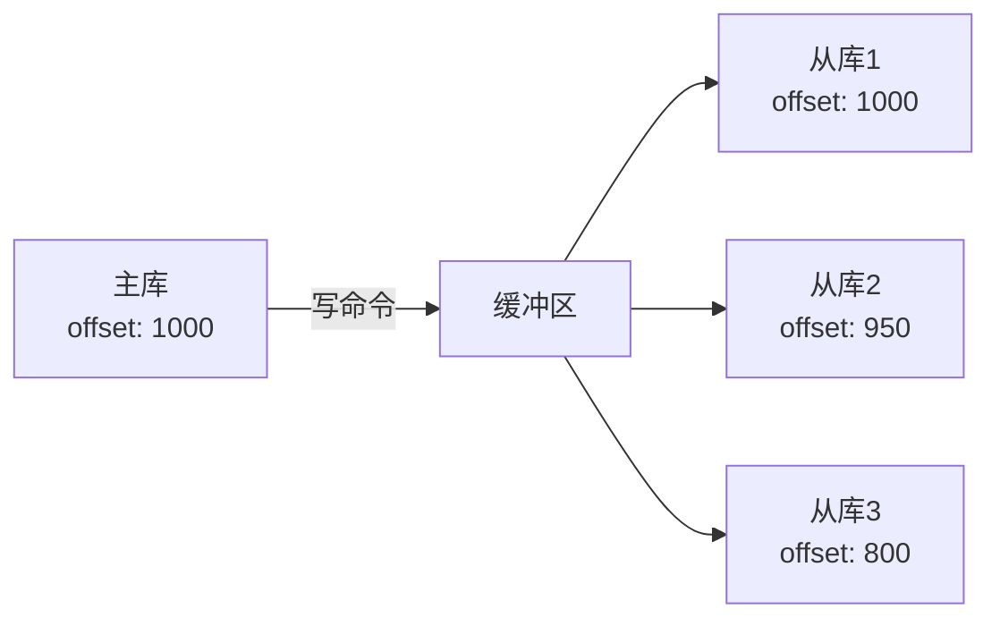
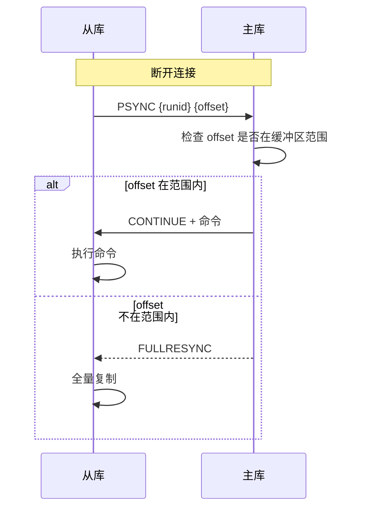
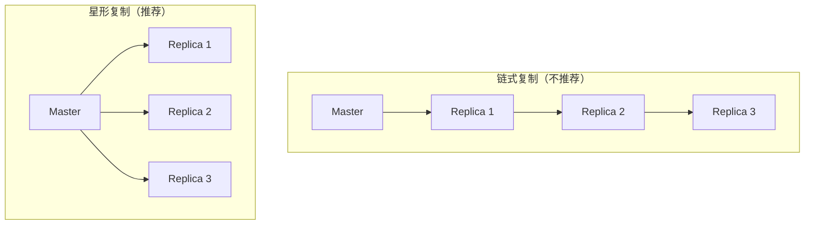
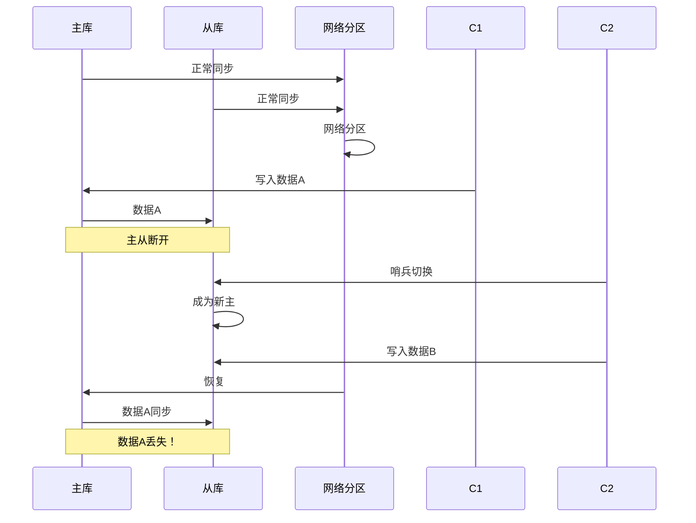
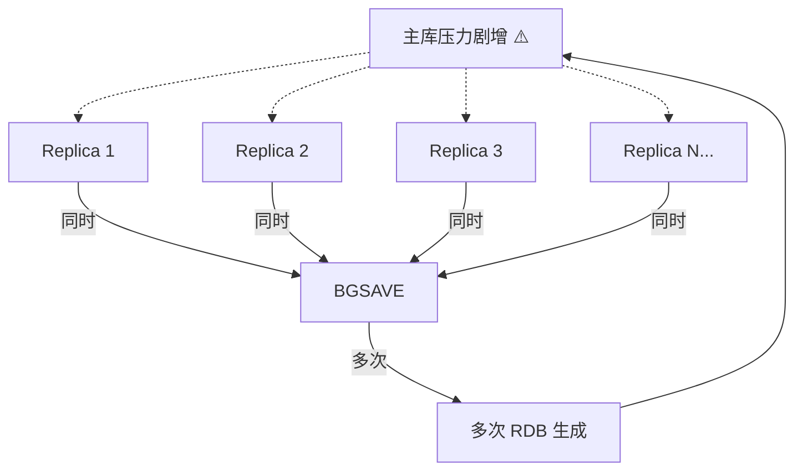

# Redis 主从复制

> **目标级别**：P5/P6
> **面试频率**：🔴 高频
> **面试官最关心的 3 个问题**：
> 1. Redis 主从复制是怎么工作的？
> 2. 全量复制和增量复制有什么区别？
> 3. 主从复制有哪些常见问题？

面试官问：「Redis 主从复制过程中，如果网络断了，从库是怎么恢复的？」你说「重新同步」——然后面试官追问「是全部重新同步吗？会不会太慢了？」你沉默了。

这就是主从复制的核心：如何高效地保持主从数据一致。

## 一、主从复制概述

### 1.1 为什么需要主从复制

| 需求 | 说明 |
|------|------|
| **数据备份** | 从库作为数据副本，防止数据丢失 |
| **读写分离** | 主库写，从库读，分担压力 |
| **故障恢复** | 主库挂了可以切换到从库 |
| **水平扩展** | 可以增加从库数量提高读性能 |



### 1.2 配置方式

#### 1.2.1 命令配置（临时生效）

```bash
# 在从库上执行
redis-cli
127.0.0.1:6379> SLAVEOF 127.0.0.1 6379
OK

# 取消复制
127.0.0.1:6379> SLAVEOF NO ONE
```

#### 1.2.2 配置文件配置（永久生效）

```bash
# redis.conf（从库配置）
replicaof 127.0.0.1 6379
replica-serve-stale-data yes  # 主库不可用时是否提供旧数据
replica-read-only yes         # 从库只读
repl-diskless-sync no         # 是否使用无盘复制
```

## 二、复制原理

### 2.1 复制流程



### 2.2 数据同步类型

| 类型 | 触发条件 | 说明 |
|------|----------|------|
| **全量复制** | 从库第一次连接 / 主从断开太久 | 发送完整的 RDB 文件 |
| **增量复制** | 主从断开后重新连接 | 发送断开期间的写命令 |



## 三、全量复制

### 3.1 流程详解



### 3.2 存在的问题

| 问题 | 说明 | 影响 |
|------|------|------|
| **RDB 生成耗时** | 主库 BGSAVE 需要 fork，可能阻塞 | 响应延迟增加 |
| **RDB 传输耗时** | 大 RDB 文件传输慢 | 同步时间长 |
| **从库加载慢** | 从库清空数据、加载 RDB | 短暂不可用 |
| **主库压力** | 同时服务客户端和传输 RDB | 性能下降 |

### 3.3 无盘复制

Redis 2.8.18 支持无盘复制，主库不写磁盘直接传输：

```bash
# redis.conf
repl-diskless-sync yes
repl-diskless-sync-delay 5  # 等待更多从库连接
```



## 四、增量复制

### 4.1 原理：复制偏移量



| 概念 | 说明 |
|------|------|
| **主库 offset** | 主库已发送的字节数 |
| **从库 offset** | 从库已接收的字节数 |
| **repl_backlog** | 环形缓冲区，保存最近的命令 |

### 4.2 增量复制流程



### 4.3 repl_backlog 配置

```bash
# redis.conf
repl-backlog-size 1mb     # 缓冲区大小，默认 1MB
repl-backlog-ttl 3600     # 从库断开后缓冲区保留时间
```

**缓冲区大小计算**：
```
缓冲区大小 = 主库每秒写入量 × 最大断开时间
```

例如：主库每秒写 10MB，最大断开 1 分钟，则需要 `10MB × 60 = 600MB`

## 五、主从复制优化

### 5.1 配置优化

```bash
# redis.conf（主库配置）

# 无盘复制
repl-diskless-sync yes
repl-diskless-sync-delay 5

# 复制缓冲区大小
repl-backlog-size 16mb

# 从库数量（用于估算缓冲区大小）
listens-replica-announce-ip 10.0.0.1
```

```bash
# redis.conf（从库配置）

# 只读模式（从 Redis 6.0 支持）
replica-read-only yes

# 允许旧数据（主库不可用时）
replica-serve-stale-data yes

# 并行同步
repl-parallel-syncs 5
```

### 5.2 架构优化



| 复制方式 | 优点 | 缺点 |
|----------|------|------|
| **星形复制** | 延迟低，主从独立 | 主库压力大 |
| **链式复制** | 主库压力小 | 延迟逐级增加 |

## 六、常见问题

### 6.1 脑裂问题



**解决方案**：
1. 配置 `min-replicas-to-write` 和 `min-replicas-max-lag`
2. 使用哨兵或集群监控

### 6.2 复制风暴

大量从库同时重启，导致主库压力过大：



**解决方案**：从库逐个重启，或使用无盘复制。

## 七、面试追问链设计

> **第一层**：Redis 主从复制是怎么工作的？
> **第二层**：全量复制和增量复制有什么区别？
> **第三层**：repl_backlog 是什么？有什么作用？

> **第一层**：主从复制过程中，主库挂了会怎样？
> **第二层**：从库升级为主库后，原主库恢复怎么办？
> **第三层**：如何避免复制风暴？

> **第一层**：从库数据延迟怎么办？
> **第二层**：如何监控主从同步状态？
> **第三层**：读写分离时如何保证数据一致性？

## 八、常见面试陷阱

**⚠️ 陷阱 1**：认为主从复制是同步的

Redis 主从复制是**异步**的，主库执行完命令后立即返回，不等待从库确认。

**⚠️ 陷阱 2**：混淆全量复制和增量复制的触发条件

从库断开连接后，是否全量复制取决于 `repl_backlog` 缓冲区是否能容纳断开的命令。

**⚠️ 陷阱 3**：忽视复制延迟

主从复制有延迟，如果业务对一致性要求高，不能简单做读写分离。

## 九、对比总结表

| 维度 | 全量复制 | 增量复制 |
|------|----------|----------|
| **触发条件** | 首次连接 / 断开太久 | 断开时间短 |
| **传输内容** | 完整 RDB + 缓冲区命令 | 缓冲区命令 |
| **数据量** | 全量数据 | 增量数据 |
| **耗时** | 长 | 短 |
| **主库压力** | 大（BGSAVE + 传输） | 小 |
| **网络开销** | 大 | 小 |

## 十、加分回答

> **💡 面试加分点**：复制相关的 Redis 命令：

```bash
# 查看复制状态
INFO replication

# 从库视角
role:slave
master_host:127.0.0.1
master_port:6379
master_link_status:up

# 查看复制延迟
INFO replication | grep lag
master_repl_offset:12345
repl_backlog_active:1
repl_backlog_size:1048576
```

> **💡 面试加分点**：复制安全性配置：

```bash
# 主库配置：要求至少 N 个从库确认
min-replicas-to-write 2
min-replicas-max-lag 10  # 从库延迟 <= 10 秒
```

> **💡 面试加分点**：Redis 7.0 的副本功能改进：

1. **副本可以接受读请求**：即使与主库断开也可以提供旧数据
2. **更高效的复制协议**：减少网络开销
