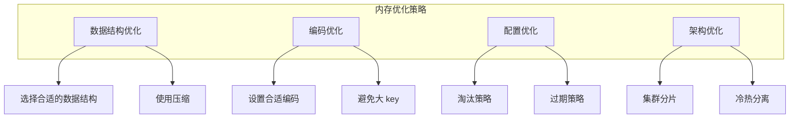
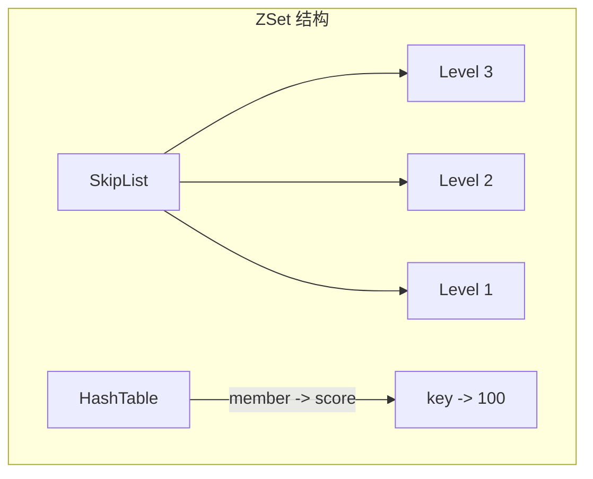
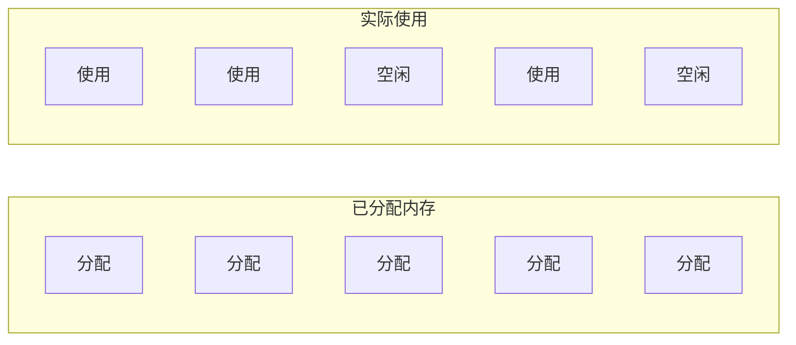

# Redis 内存优化

> **目标级别**：P6/P7
> **面试频率**：🟡 中频
> **面试官最关心的 3 个问题**：
> 1. Redis 内存使用过高怎么办？
> 2. 如何优化 Redis 内存占用？
> 3. Redis 内存碎片是什么原因？

面试官问：「Redis 内存快满了，怎么优化？」你说「加内存」——然后面试官追问「加内存成本太高，有没有什么方法在不扩容的情况下解决问题？」你沉默了。

这就是 Redis 内存优化的价值：用更少的内存存更多的数据。

## 一、内存优化概述

### 1.1 为什么要优化内存

| 问题 | 影响 |
|------|------|
| **内存不足** | Redis 可能拒绝写入 |
| **内存碎片** | 实际使用效率低 |
| **成本高** | 大内存服务器成本高 |
| **性能下降** | 触发淘汰策略 |

### 1.2 内存分析命令

```bash
# 查看内存使用
redis-cli INFO memory

# 示例输出
used_memory: 104857600
used_memory_human: 100M
used_memory_rss: 125829120
used_memory_rss_human: 120M
mem_fragmentation_ratio: 1.20
mem_allocator: jemalloc-5.2.1

# 查看 key 统计
redis-cli INFO stats | grep keys

# 查看数据库键数量
redis-cli DBSIZE

# 采样查看大 key
redis-cli --bigkeys
```

## 二、内存优化策略

### 2.1 内存优化总览



### 2.2 选择合适的数据结构

| 数据类型 | 低内存占用法 | 说明 |
|----------|-------------|------|
| **String** | 短字符串合并 | 多个短 key 可合并 |
| **Hash** | 使用 Hash 而非 String | field 共享 key 前缀 |
| **List** | 控制长度 | 避免无限增长 |
| **Set** | 使用 IntSet | 整数小集合用 IntSet |
| **ZSet** | 控制元素数量 | 使用 ZREMRANGEBYRANK |

## 三、数据结构优化

### 3.1 String 优化

#### 3.1.1 SDS 内存布局

```c
// SDS 结构
struct sdshdr {
    int len;      // 4 字节
    int free;     // 4 字节
    char buf[];   // 柔性数组
};
```

| 字符串长度 | SDS 内存 | C 字符串内存 |
|------------|----------|--------------|
| 10 字节 | 25 字节 | 11 字节 |
| 100 字节 | 117 字节 | 101 字节 |
| 1000 字节 | 1017 字节 | 1001 字节 |

#### 3.1.2 短字符串合并

```bash
# 低效：多个 key
SET user:1:name "张三"
SET user:1:age "18"
SET user:1:city "北京"

# 高效：合并为一个 key
SET user:1 "{'name':'张三','age':'18','city':'北京'}"
```

### 3.2 Hash 优化

```bash
# 低效：每个属性一个 key
SET user:1:name "张三"     # 约 40 字节
SET user:1:age "18"        # 约 35 字节
SET user:1:city "北京"     # 约 38 字节
# 总计：约 113 字节

# 高效：使用 Hash
HSET user:1 name "张三"    # key 前缀共享
HSET user:1 age "18"
HSET user:1 city "北京"
# 总计：约 60 字节
```

### 3.3 ZSet 优化

ZSet 使用跳表 + 哈希表：



| 优化方法 | 说明 |
|----------|------|
| **设置合理的 score** | 避免浮点数精度问题 |
| **定期删除低分元素** | `ZREMRANGEBYRANK` |
| **使用 ZRANGEBYSCORE** | 只查询需要的范围 |

## 四、编码优化

### 4.1 编码类型

| 数据类型 | 编码类型 | 说明 |
|----------|----------|------|
| String | `int` / `embstr` / `raw` | 根据长度选择 |
| List | `ziplist` / `linkedlist` | 小列表用压缩列表 |
| Hash | `ziplist` / `hashtable` | 小哈希用压缩列表 |
| Set | `intset` / `hashtable` | 整数集合 |
| ZSet | `ziplist` / `skiplist` | 小有序集合用压缩列表 |

### 4.2 查看编码

```bash
# 查看 key 的编码类型
redis-cli OBJECT ENCODING user:1
"ziplist"

# 查看 key 的内存占用
redis-cli MEMORY USAGE user:1
(integer) 82
```

### 4.3 编码转换规则

```bash
# Hash 编码转换
# 条件：字段数 < 512 且 每个字段 < 64 字节 → ziplist
# 否则 → hashtable

# Set 编码转换
# 条件：只包含整数且数量 < 512 → intset
# 否则 → hashtable

# ZSet 编码转换
# 条件：元素数 < 128 且 每个元素 < 64 字节 → ziplist
# 否则 → skiplist
```

### 4.4 手动设置编码

```bash
# redis.conf 配置编码阈值
hash-max-ziplist-entries 512
hash-max-ziplist-value 64

zset-max-ziplist-entries 128
zset-max-ziplist-value 64

list-max-ziplist-entries 512
list-max-ziplist-value 64
```

## 五、大 key 优化

### 5.1 什么是大 key

| 类型 | 大 key 定义 |
|------|-------------|
| String | value > 10KB |
| Hash | field 数 > 5000 |
| List | 元素数 > 10000 |
| Set | 元素数 > 10000 |
| ZSet | 元素数 > 10000 |

### 5.2 发现大 key

```bash
# 方法1：redis-cli --bigkeys
redis-cli --bigkeys

# 方法2：使用 SCAN + DEBUG OBJECT
redis-cli SCAN 0 | head -100 | xargs -I {} redis-cli DEBUG OBJECT {} | grep serialized_length

# 方法3：使用 RDB 分析工具
redis-rdb-tools --key -c memory dump.rdb
```

### 5.3 大 key 处理

```java
// 场景：删除大 Hash
public void deleteBigHash(String key) {
    // 方法1：渐进式删除
    Long size = redis.opsForHash().size(key);
    while (size > 0) {
        redis.opsForHash().delete(key,
            redis.opsForHash().scan(key, ScanOptions.scanOptions().count(1000).build()).stream().toArray()
        );
        size = redis.opsForHash().size(key);
    }

    // 方法2：使用 UNLINK（非阻塞删除）
    redis.delete(key);  // 默认异步删除大 key
}

// 场景：拆分大 Hash
public void splitBigHash(String sourceKey) {
    // 按范围拆分成多个小 Hash
    for (int i = 0; i < 10; i++) {
        String newKey = sourceKey + ":" + i;
        // 迁移数据
    }
}
```

## 六、内存碎片

### 6.1 什么是内存碎片



| 指标 | 说明 |
|------|------|
| **mem_fragmentation_ratio** | used_memory_rss / used_memory |
| **正常范围** | 1.0 ~ 1.5 |
| **危险范围** | `>` 1.5 |

### 6.2 内存碎片原因

| 原因 | 说明 |
|------|------|
| **jemalloc 分配策略** | 按固定大小分配内存块 |
| **大 key 删除** | 删除后内存不归还 |
| **频繁修改** | 数据结构扩展/收缩 |

### 6.3 处理内存碎片

```bash
# 方法1：重启 Redis（不推荐）
# 会丢失数据

# 方法2：配置内存碎片清理
redis-cli CONFIG SET activedefrag yes
redis-cli CONFIG SET active-defrag-ignore-bytes 100mb
redis-cli CONFIG SET active-defrag-threshold-lower 10

# 方法3：低峰期进行内存整理
redis-cli MEMORY PURGE
```

```bash
# redis.conf 配置
activedefrag yes
active-defrag-ignore-bytes 100mb
active-defrag-threshold-lower 10
active-defrag-threshold-upper 100
active-defrag-max-scan-fields 1000
```

## 七、实战优化建议

### 7.1 String 优化

```java
// 低效：使用多个 String
for (User user : users) {
    redis.opsForValue().set("user:" + user.getId() + ":name", user.getName());
    redis.opsForValue().set("user:" + user.getId() + ":age", user.getAge());
    redis.opsForValue().set("user:" + user.getId() + ":city", user.getCity());
}

// 高效：使用 Hash 或 JSON
for (User user : users) {
    redis.opsForHash().putAll("user:" + user.getId(),
        Map.of(
            "name", user.getName(),
            "age", String.valueOf(user.getAge()),
            "city", user.getCity()
        )
    );
}
```

### 7.2 合理设置过期时间

```java
// 低效：不过期的缓存
redis.opsForValue().set("config", json);

// 高效：设置过期时间
redis.opsForValue().set("config", json, Duration.ofHours(1));

// 更高效：缓存+更新机制
public String getConfig(String key) {
    String value = redis.opsForValue().get(key);
    if (value == null) {
        value = loadFromDB(key);
        redis.opsForValue().set(key, value, Duration.ofHours(1));
    }
    return value;
}
```

### 7.3 使用压缩

```java
// 使用压缩减少内存
public void compressData() {
    String original = "很长很长的字符串...";

    // 使用 gzip 压缩
    ByteArrayOutputStream bos = new ByteArrayOutputStream();
    GZIPOutputStream gzip = new GZIPOutputStream(bos);
    gzip.write(original.getBytes());
    gzip.close();

    byte[] compressed = bos.toByteArray();
    redis.opsForValue().set("key", Base64.getEncoder().encodeToString(compressed));
}
```

## 八、面试追问链设计

> **第一层**：Redis 内存使用过高怎么办？
> **第二层**：如何发现大 key？
> **第三层**：内存碎片是什么原因？如何处理？

> **第一层**：如何选择合适的数据结构来节省内存？
> **第二层**：ziplist 和 hashtable 有什么区别？
> **第三层**：如何避免大 key？

> **第一层**：Redis 的内存碎片率怎么看？
> **第二层**：内存碎片整理会影响性能吗？
> **第三层**：有哪些常见的内存优化技巧？

## 九、常见面试陷阱

**⚠️ 陷阱 1**：忽视大 key 的影响

大 key 会导致内存分配不均、阻塞主线程等问题。

**⚠️ 陷阱 2**：不理解内存碎片

内存碎片率高会导致实际内存使用远超数据大小。

**⚠️ 陷阱 3**：过度优化

如果内存充足，没必要过度优化，增加复杂度。

## 十、对比总结表

| 优化方法 | 节省内存 | 实现难度 | 适用场景 |
|----------|----------|----------|----------|
| **选择合适数据结构** | 中 | 低 | 所有场景 |
| **使用 Hash 而非 String** | 高 | 低 | 对象缓存 |
| **编码优化** | 中 | 低 | 小数据集 |
| **大 key 拆分** | 中 | 中 | 大对象 |
| **压缩存储** | 高 | 中 | 长字符串 |
| **设置过期时间** | 高 | 低 | 所有场景 |

## 十一、加分回答

> **💡 面试加分点**：Redis 内存相关命令：

```bash
# 查看内存统计
redis-cli INFO memory

# 查看 key 内存占用
redis-cli MEMORY USAGE key

# 查看 key 编码
redis-cli OBJECT ENCODING key

# 内存优化建议
redis-cli MEMORY DOCTOR
```

> **💡 面试加分点**：Redis 7.0 内存优化：

1. **Hash 表压缩**：Redis 7.0 对小 Hash 进行了优化
2. **更好的内存碎片管理**：改进了 jemalloc 的使用
3. **Sharded Lua Tables**：Lua 脚本内存优化
