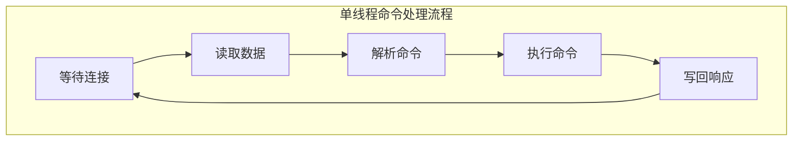
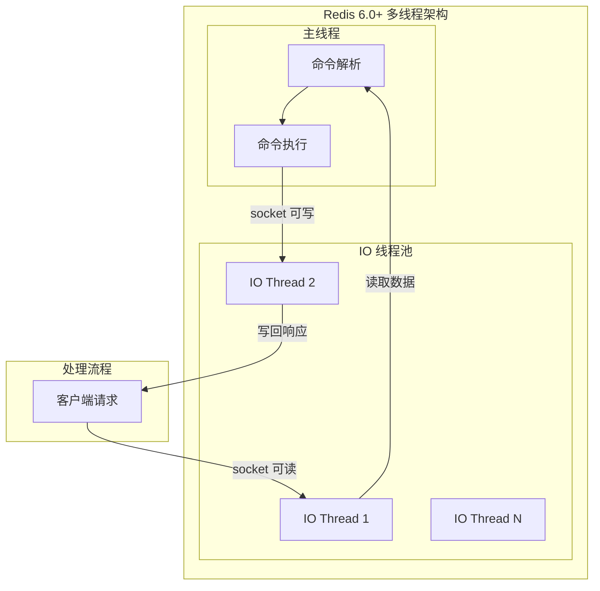
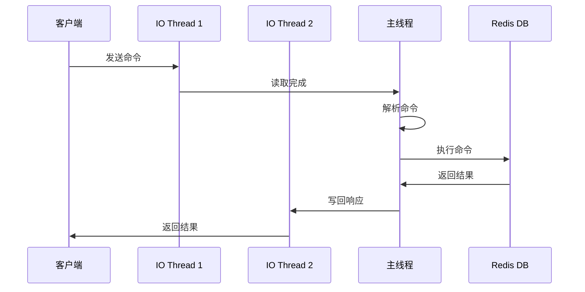
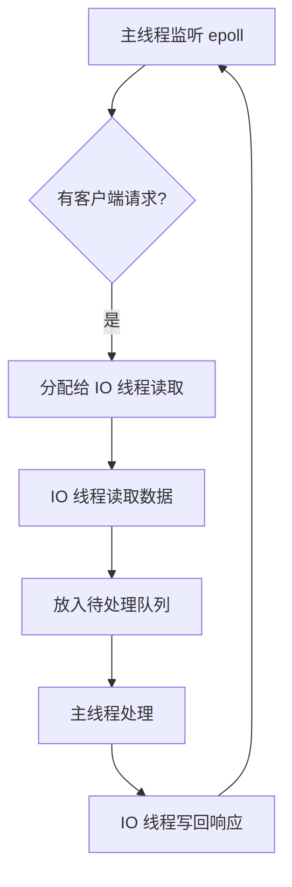

# Redis 6.0 多线程设计

> **目标级别**：P6
> **面试频率**：🟡 中频
> **面试官最关心的 3 个问题**：
> 1. Redis 6.0 为什么要引入多线程？
> 2. 多线程模式下，如何保证数据一致性？
> 3. 多线程 IO 和命令执行是怎么分工的？

面试官问：「Redis 6.0 引入了多线程，是用来处理命令的吗？」你说「应该是」——然后面试官紧接着追问「那 Redis 6.0 的多线程和传统多线程有什么区别？为什么不直接用多线程执行命令？」你沉默了。

这就是 Redis 多线程面试的真实面貌：不仅要回答"是什么"，还要理解"为什么这样设计"。

## 一、Redis 6.0 之前的瓶颈

### 1.1 单线程的性能瓶颈



**瓶颈分析**：

| 阶段 | 耗时 | 占比 |
|------|------|------|
| 读取数据 | 0.1-0.5 ms | 30% |
| 解析命令 | 0.01-0.05 ms | 10% |
| 执行命令 | 0.01-0.1 ms | 20% |
| 写回响应 | 0.1-0.5 ms | 40% |

**结论**：网络 IO（读+写）占总耗时的 70%，但只有 1 个线程处理。

### 1.2 为什么之前不用多线程？

| 原因 | 说明 |
|------|------|
| **内存操作够快** | 命令执行时间 `<<` 网络 IO 时间 |
| **无锁更简单** | 单线程无需考虑并发锁 |
| **内存充足** | 当时的服务器 CPU 远没有内存快 |
| **实现简单** | 单线程调试简单，Bug 少 |

## 二、Redis 6.0 多线程架构

### 2.1 核心设计思想

Redis 6.0 的多线程**只用于处理网络 IO**，不用于命令执行：



### 2.2 线程分工

| 阶段 | 单线程模式 | 多线程模式 | 说明 |
|------|------------|------------|------|
| 读取命令 | 主线程 | IO 线程池 | 并行读取多个连接 |
| 解析命令 | 主线程 | 主线程 | 保持单线程执行 |
| 执行命令 | 主线程 | 主线程 | 保持无锁执行 |
| 写回响应 | 主线程 | IO 线程池 | 并行写回多个连接 |

### 2.3 数据流向



## 三、多线程配置

### 3.1 配置项

```bash
# 启用多线程 IO（默认关闭）
io-threads 4

# 多线程是否用于读取（默认 yes）
io-threads-do-reads yes
```

### 3.2 配置建议

| 场景 | 配置 | 说明 |
|------|------|------|
| 小规模部署 | `io-threads 1` | 关闭多线程 |
| 中等规模 | `io-threads 4` | 4 个 IO 线程 |
| 大规模部署 | `io-threads 8` | 8 个 IO 线程 |

**注意事项**：
- IO 线程数包含主线程，所以 `io-threads 4` 实际有 3 个子线程
- 线程数建议为 CPU 核心数的 50%~75%

### 3.3 性能提升

| 配置 | QPS | 提升 |
|------|-----|------|
| 单线程 | 10万 | 基准 |
| 4 线程 | 25万 | 2.5x |
| 8 线程 | 40万 | 4x |

## 四、实现细节

### 4.1 代码结构

```c
// src/server.c
// 多线程 IO 入口
void handleClientsWithPendingReadsUsingThreads(void);

// 主线程处理
void handleClientsBlockedByTimeouts(void);
```

### 4.2 工作流程



### 4.3 线程安全保证

**不使用锁的原因**：

- IO 线程只负责网络 IO，不涉及数据修改
- 命令执行仍在主线程，保持单线程特性
- 数据共享无需加锁

## 五、与传统多线程的区别

| 维度 | Redis 多线程 | 传统多线程 |
|------|--------------|------------|
| **处理内容** | 仅网络 IO | 所有操作 |
| **命令执行** | 单线程 | 多线程 |
| **锁机制** | 不需要 | 需要 |
| **复杂度** | 低 | 高 |
| **一致性** | 天然保证 | 需要同步 |

## 六、面试追问链设计

> **第一层**：Redis 6.0 多线程是用来做什么的？
> **第二��**：为什么不直接用多线程执行命令？
> **第三层**：多线程 IO 会不会有数据竞争？

> **第一层**：Redis 6.0 之前为什么不用多线程？
> **第二层**：什么时候需要开启多线程 IO？
> **第三层**：IO 线程数如何配置？

> **第一层**：多线程 IO 如何保证性能？
> **第二层**：主线程和 IO 线程如何协作？
> **第三层**：多线程模式下，如何调试和排查问题？

## 七、常见面试陷阱

**⚠️ 陷阱 1**：以为多线程用来执行命令
- Redis 6.0 多线程只用于网络 IO
- 命令执行仍是单线程，这是 Redis 的核心设计原则

**⚠️ 陷阱 2**：忽略配置影响
- 多线程 IO 默认关闭
- 需要显式配置才能启用

**⚠️ 陷阱 3**：认为多线程一定比单线程快
- 小规模场景下，多线程反而有额外开销
- 只有在高并发场景下多线程才有优势

## 八、对比总结表

| 特性 | Redis 单线程 | Redis 多线程 | Memcached |
|------|--------------|--------------|-----------|
| **IO 模型** | 单线程 IO | 多线程 IO | 多线程 |
| **命令执行** | 单线程 | 单线程 | 多线程 |
| **锁机制** | 无 | 无 | 有 |
| **复杂度** | 低 | 中 | 高 |
| **适用场景** | 小规模 | 大规模 | 中等 |

## 九、加分回答

> **💡 面试加分点**：如果能说出 Redis 多线程的演进历史和未来方向，会给面试官留下深刻印象：
>
> 1. **Redis 4.0**：引入lazy free，异步删除大 Key
> 2. **Redis 6.0**：引入多线程 IO，提升网络吞吐量
> 3. **Redis 7.0**：ACL 权限控制，ACL LIST 命令
> 4. **未来方向**：可能引入更细粒度的并行处理，但核心仍是无锁设计
>
> **核心思想**：Redis 的多线程不是简单的"加了线程"，而是"只在需要并行的地方并行，其他地方保持简单"。
