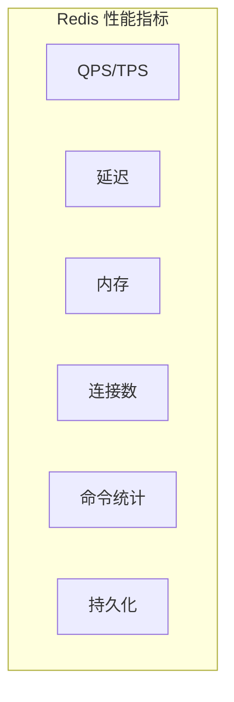

# Redis 性能调优

> **目标级别**：P6/P7
> **面试频率**：🟡 中频
> **面试官最关心的 3 个问题**：
> 1. Redis 有哪些性能指标？如何监控？
> 2. Redis 慢查询是什么原因？如何解决？
> 3. 如何提升 Redis 的整体性能？

面试官问：「Redis 响应变慢了，怎么排查？」你说「重启试试」——然后面试官追问「重启能解决问题吗？如果是慢查询导致的呢？」你沉默了。

这就是 Redis 性能调优的核心：找到瓶颈，对症下药。

## 一、性能指标监控

### 1.1 关键性能指标



| 指标 | 监控命令 | 正常范围 |
|------|----------|----------|
| **QPS** | `INFO stats` / `instantaneous_ops/sec` | 10万+ |
| **延迟** | `LATENCY LATENCYHISTOGRAM` | `< 1ms` |
| **内存使用** | `INFO memory` / `used_memory` | `< maxmemory` |
| **连接数** | `INFO clients` / `connected_clients` | `< maxclients` |
| **CPU** | `INFO cpu` | 合理范围 |
| **持久化** | `INFO persistence` | 正常 |

### 1.2 监控命令

```bash
# 查看所有统计信息
redis-cli INFO

# 只看 stats
redis-cli INFO stats

# 查看命令统计
redis-cli INFO commandstats

# 查看客户端
redis-cli INFO clients

# 查看持久化
redis-cli INFO persistence

# 实时 QPS
redis-cli --latency-history
```

### 1.3 Redis 慢查询

```bash
# 查看慢查询日志
redis-cli SLOWLOG GET 10

# 示例输出
1) 1) (integer) 12345
   2) (integer) 1677123456
   3) (integer) 5000
   4) 1) "GET"
      2) "user:12345"

# 查看慢查询配置
redis-cli CONFIG GET slowlog-log-slower-than
redis-cli CONFIG GET slowlog-max-len
```

## 二、慢查询优化

### 2.1 慢查询原因

| 原因 | 说明 | 解决 |
|------|------|------|
| **大 key 操作** | KEYS, SMEMBERS, LRANGE | 使用 SCAN 替代 |
| **全表扫描** | 未使用索引的命令 | 避免使用 |
| **O(n) 操作** | 某些命令时间复杂度高 | 优化数据结构 |
| **持久化阻塞** | BGSAVE, AOF rewrite | 优化持久化配置 |
| **内存交换** | 使用 swap | 增加内存 |

### 2.2 避免 KEYS 命令

```bash
# 低效：使用 KEYS（阻塞）
redis-cli KEYS "user:*"
# O(n) 时间复杂度，会阻塞主线程

# 高效：使用 SCAN（非阻塞）
redis-cli SCAN 0 MATCH "user:*" COUNT 100
# 返回游标，每次少量，全量扫描不阻塞
```

### 2.3 使用 Pipeline

```java
// 低效：多次网络往返
for (String key : keys) {
    String value = redis.get(key);  // 每次网络往返
}

// 高效：使用 Pipeline
List<Object> values = redis.executePipelined((RedisCallback<Object>) connection -> {
    for (String key : keys) {
        connection.stringCommands().get(key.getBytes());
    }
    return null;
});
```

### 2.4 Pipeline vs MGET

```bash
# 使用 Pipeline
redis-cli --pipe << EOF
GET key1
GET key2
GET key3
GET key4
GET key5
EOF

# 使用 MGET
redis-cli MGET key1 key2 key3 key4 key5
```

| 方法 | 适用场景 | 性能 |
|------|----------|------|
| Pipeline | 批量执行不同命令 | 高 |
| MGET | 批量获取同一类型 key | 最高 |
| MSET | 批量设置同一类型 key | 最高 |

## 三、持久化优化

### 3.1 RDB 优化

```bash
# redis.conf
save 900 1      # 900 秒内有 1 个 key 变化
save 300 10     # 300 秒内有 10 个 key 变化
save 60 10000   # 60 秒内有 10000 个 key 变化

# 禁用 RDB
save ""

# 无盘复制（Redis 2.8.18+）
repl-diskless-sync yes
repl-diskless-sync-delay 5
```

### 3.2 AOF 优化

```bash
# redis.conf

# AOF 策略
appendonly yes
appendfsync everysec   # 每秒同步（推荐）

# AOF 重写
auto-aof-rewrite-percentage 100
auto-aof-rewrite-min-size 64mb

# AOF 内存映射
aof-use-rdb-preamble yes  # 使用 RDB 格式重写
```

### 3.3 持久化策略对比

| 策略 | 优点 | 缺点 | 适用场景 |
|------|------|------|----------|
| **everysec** | 性能与安全平衡 | 可能丢失 1 秒 | 大多数场景 |
| **always** | 数据不丢失 | 性能差 | 数据重要 |
| **no** | 性能最好 | 丢失多 | 可接受数据丢失 |

## 四、内存优化

### 4.1 合理设置 maxmemory

```bash
# 设置最大内存（建议留 20% 余量）
maxmemory 8gb

# 淘汰策略
maxmemory-policy allkeys-lru

# 淘汰采样数量
maxmemory-samples 5
```

### 4.2 选择合适的数据结构

```java
// 低效：使用 String 存储用户信息
redis.opsForValue().set("user:1", serialize(user));
redis.opsForValue().get("user:1");

// 高效：使用 Hash 存储用户信息
redis.opsForHash().putAll("user:1", userMap);
redis.opsForHash().entries("user:1");

// 高效：使用 Hash + 字段过期
redis.opsForHash().put("session:abc", "lastAccess", String.valueOf(now));
redis.expire("session:abc", Duration.ofHours(1));
```

### 4.3 避免大 key

```java
// 低效：存储大列表
redis.opsForList().push("biglist", item);  // 无限增长

// 高效：分片存储
int shard = Math.abs(key.hashCode() % SHARD_COUNT);
redis.opsForList().push("biglist:" + shard, item);

// 高效：定期清理
redis.opsForList().trim("biglist", 0, 10000);
```

## 五、网络优化

### 5.1 连接池优化

```java
// Jedis 连接池配置
JedisPoolConfig config = new JedisPoolConfig();
config.setMaxTotal(200);         // 最大连接数
config.setMaxIdle(50);           // 最大空闲连接
config.setMinIdle(10);           // 最小空闲连接
config.setMaxWait(Duration.ofMillis(3000));
config.setTestOnBorrow(true);    // 借用时检测
config.setTestOnReturn(false);
config.setTestWhileIdle(true);   // 空闲时检测

JedisPool pool = new JedisPool(config, "127.0.0.1", 6379);
```

| 参数 | 说明 | 建议值 |
|------|------|--------|
| **maxTotal** | 最大连接数 | CPU 核心数 * 2 |
| **maxIdle** | 最大空闲连接 | 与 maxTotal 相同 |
| **minIdle** | 最小空闲连接 | 预热后保持 |
| **maxWait** | 最大等待时间 | 3 秒 |

### 5.2 TCP 优化

```bash
# redis.conf

# 启用 TCP Keepalive
tcp-keepalive 300

# 禁用 TCP Nagle 算法
tcp-nodelay yes

# 客户端输出缓冲区
client-output-buffer-limit normal 256mb 64mb 60
client-output-buffer-limit replica 256mb 64mb 60
client-output-buffer-limit pubsub 32mb 8mb 60
```

### 5.3 客户端优化

```java
// 低效：每次请求都创建连接
Jedis jedis = new Jedis("127.0.0.1", 6379);
jedis.get("key");
jedis.close();

// 高效：使用连接池
JedisPool pool = new JedisPool(config, "127.0.0.1", 6379);
try (Jedis jedis = pool.getResource()) {
    jedis.get("key");
}
```

## 六、CPU 优化

### 6.1 CPU 使用分析

```bash
# 查看 CPU 使用
redis-cli INFO cpu

# 查看主进程 CPU
redis-cli INFO cpu | grep used_cpu_sys

# 查看子进程 CPU
redis-cli INFO cpu | grep used_cpu_sys_children
```

### 6.2 避免 CPU 瓶颈

| 操作 | 说明 | 优化 |
|------|------|------|
| **BGSAVE** | 后台保存消耗 CPU | 使用 AOF 或调整触发条件 |
| **AOF 重写** | 压缩 AOF 文件 | 使用混合持久化 |
| **复杂命令** | O(n) 或 O(nlogn) | 使用 Pipeline 或 Lua |
| **频繁序列化** | 对象序列化 | 使用 Hash 或更小的对象 |

### 6.3 Lua 脚本优化

```lua
-- 低效：多次网络往返
for i = 1, 100 do
    redis.call('INCR', 'counter:' .. i)
end

-- 高效：单次执行
redis.call('INCRBY', 'counter:1', 100)
```

## 七、实战调优清单

### 7.1 系统层面

```bash
# 网络优化
sysctl -w net.core.somaxconn=65535
sysctl -w net.ipv4.tcp_max_syn_backlog=65535
sysctl -w vm.overcommit_memory=1

# 内存优化
sysctl -w vm.swappiness=1
echo never > /sys/kernel/mm/transparent_hugepage/enabled

# 文件描述符
ulimit -n 100000
```

### 7.2 Redis 配置

```bash
# redis.conf 优化配置

# 内存
maxmemory 8gb
maxmemory-policy allkeys-lru
maxmemory-samples 5

# 网络
tcp-keepalive 300
tcp-nodelay yes

# 持久化
appendonly yes
appendfsync everysec

# 客户端
timeout 300
tcp-backlog 65535
```

### 7.3 监控告警

```yaml
# Prometheus + Redis Exporter
redis_exporter:
  enabled: true
  port: 9121

# Grafana 仪表盘
- Redis QPS
- Redis 内存使用
- Redis 延迟
- Redis 连接数
- Redis 慢查询数量
```

## 八、面试追问链设计

> **第一层**：Redis 有哪些性能指标？如何监控？
> **第二层**：如何发现 Redis 的慢查询？
> **第三层**：慢查询是什么原因？如何解决？

> **第一层**：如何提升 Redis 的整体性能？
> **第二层**：Pipeline 和普通命令有什么区别？
> **第三层**：连接池应该如何配置？

> **第一层**：Redis 持久化会影响性能吗？
> **第二层**：BGSAVE 和 AOF rewrite 有什么区别？
> **第三层**：如何避免持久化对性能的影响？

## 九、常见面试陷阱

**⚠️ 陷阱 1**：使用 KEYS 命令

KEYS 命令是 O(n) 操作，会阻塞主线程，在生产环境禁止使用。

**⚠️ 陷阱 2**：不做慢查询监控

没有监控就没有优化，Redis 慢查询是性能问题的主要来源。

**⚠️ 陷阱 3**：忽视连接池配置

连接池配置不当会导致连接耗尽或资源浪费。

## 十、对比总结表

| 优化方向 | 方法 | 效果 | 复杂度 |
|----------|------|------|--------|
| **慢查询** | 使用 SCAN 替代 KEYS | 高 | 低 |
| **批量操作** | 使用 Pipeline/MGET | 高 | 低 |
| **持久化** | 调整策略 | 中 | 中 |
| **内存** | 选择合适数据结构 | 高 | 中 |
| **网络** | TCP 优化 | 中 | 低 |
| **连接** | 连接池配置 | 中 | 低 |

## 十一、加分回答

> **💡 面试加分点**：Redis 性能测试工具：

```bash
# 使用 redis-benchmark
redis-benchmark -h 127.0.0.1 -p 6379 -n 100000 -c 50

# 测试特定命令
redis-benchmark -h 127.0.0.1 -p 6379 -n 10000 -c 50 -t GET,SET

# 延迟测试
redis-cli --latency
redis-cli --latency-history
redis-cli --latency-dist
```

> **💡 面试加分点**：Redis 7.0 性能改进：

1. **多线程 IO**：Redis 6.0+ 支持多线程 IO
2. **更好的内存碎片管理**：自动清理碎片
3. **新的命令**：新的命令可能有更好的性能
