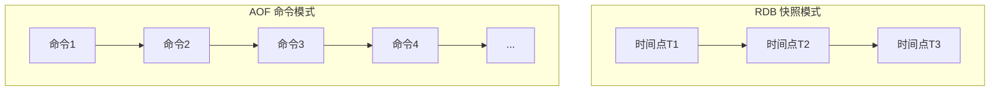
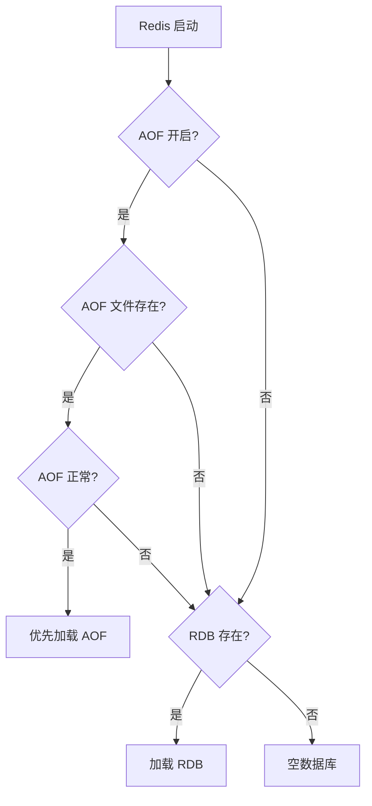
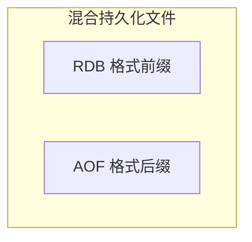
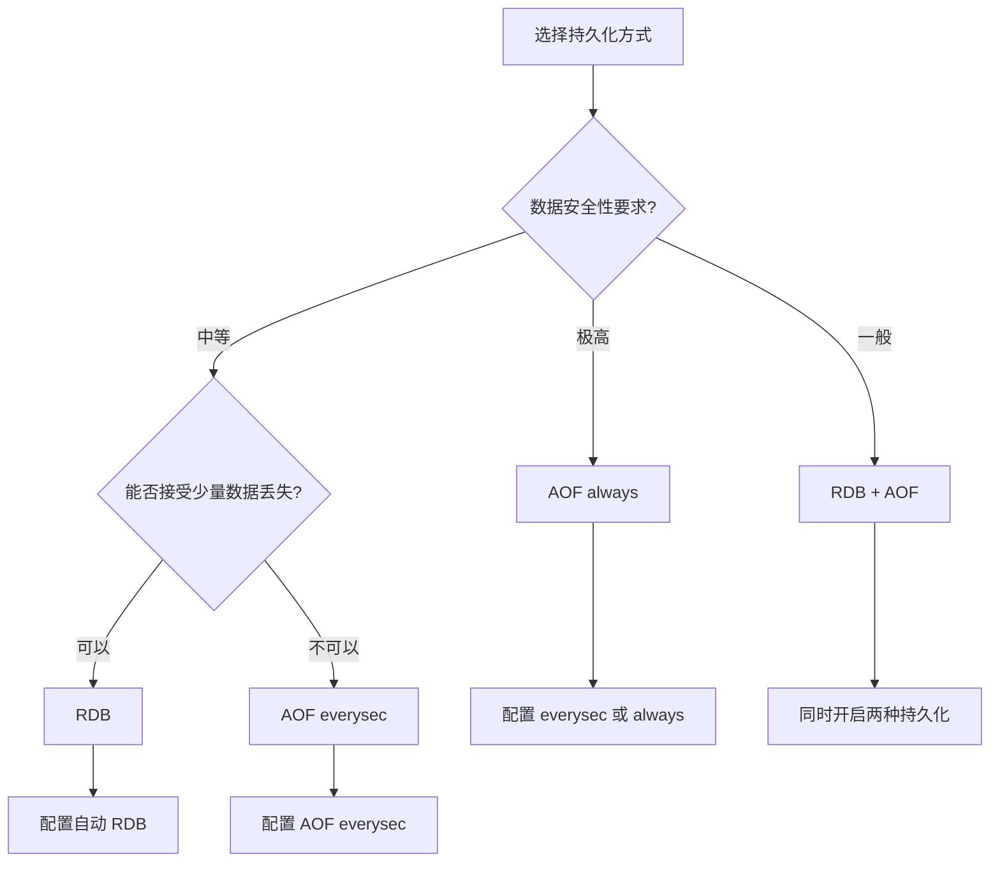

# RDB vs AOF 对比与选型

> **目标级别**：P5/P6
> **面试频率**：🔴 高频
> **面试官最关心的 3 个问题**：
> 1. RDB 和 AOF 有什么区别？如何选型？
> 2. 能不能同时使用 RDB 和 AOF？
> 3. Redis 4.0 的混合持久化是什么？

面试官问：「Redis 持久化用 RDB 还是 AOF？」你说「用 AOF」——然后面试官紧接着追问「为什么？什么场景下应该用 RDB？」你沉默了。

这就是 Redis 持久化选型面试的真实面貌：不仅要说出区别，还要理解"为什么这样选"。

## 一、核心对比



## 二、详细对比表

| 维度 | RDB | AOF |
|------|-----|-----|
| **持久化方式** | 全量快照 | 增量追加 |
| **文件格式** | 二进制 | 文本命令 |
| **文件大小** | 小 | 大 |
| **恢复速度** | 快 | 慢 |
| **数据完整性** | 可能丢失数据 | 可配置完整性 |
| **性能影响** | fork 时短暂阻塞 | 刷盘时阻塞 |
| **磁盘占用** | 低 | 高 |
| **可读性** | 否（二进制） | 是（文本） |
| **压缩** | 自动 | 无 |

## 三、RDB 适用场景

| 场景 | 原因 | 说明 |
|------|------|------|
| **冷备份** | 文件紧凑 | 可压缩后上传到云存储 |
| **容灾恢复** | 恢复快 | 系统崩溃后快速恢复 |
| **数据迁移** | 格式通用 | 不同 Redis 版本可加载 |
| **开发测试** | 简单 | 快速构建测试数据 |
| **大数据量** | 内存效率高 | 避免 AOF 文件过大 |

### 3.1 配置示例

```bash
# 每小时自动备份
save 3600 1

# 只保留最近 7 天的备份
rename-components.sh dump.rdb dump-$(date +%Y%m%d%H).rdb
```

## 四、AOF 适用场景

| 场景 | 原因 | 说明 |
|------|------|------|
| **实时性要求高** | 丢失最多 1 秒 | 金融、订单等场景 |
| **数据安全性要求高** | 可配置策略 | everysec/always |
| **增量数据重要** | 无全量丢失 | 频繁写入的场景 |
| **审计需求** | 命令可读 | 可追溯操作历史 |
| **主从切换** | 增量同步 | 从库需要增量同步 |

### 4.1 配置示例

```bash
# 开启 AOF
appendonly yes

# everysec 刷盘策略（推荐）
appendfsync everysec

# 自动重写
auto-aof-rewrite-percentage 100
auto-aof-rewrite-min-size 64mb
```

## 五、同时使用

### 5.1 配置方式

```bash
# 开启 RDB
save 900 1
save 300 10
save 60 10000

# 开启 AOF
appendonly yes
appendfsync everysec
```

### 5.2 加载顺序



### 5.3 加载优先级

1. 如果 AOF 开启且文件完整，优先加载 AOF
2. 否则加载 RDB
3. 如果都没有，加载空数据库

## 六、混合持久化

### 6.1 Redis 4.0+ 混合持久化

Redis 4.0 引入了混合持久化，兼顾 RDB 和 AOF 的优点：



### 6.2 配置

```bash
# 开启混合持久化
aof-use-rdb-preamble yes
```

### 6.3 优缺点

| 优点 | 缺点 |
|------|------|
| 恢复速度快 | 文件可读性降低 |
| 数据完整性好 | 部分版本兼容性 |
| 重写效率高 | 配置稍复杂 |

## 七、选型决策树



## 八、最佳实践

### 8.1 配置推荐

```bash
# 通用配置（平衡性能和安全）
save 900 1
save 300 10
save 60 10000

appendonly yes
appendfsync everysec
auto-aof-rewrite-percentage 100
auto-aof-rewrite-min-size 64mb
```

### 8.2 高安全配置

```bash
# 数据安全优先
save 900 1
save 300 10

appendonly yes
appendfsync always
```

### 8.3 高性能配置

```bash
# 性能优先
save 3600 1

appendonly yes
appendfsync no
```

### 8.4 Redis 7.0+ 配置

```bash
# Redis 7.0 多部分 AOF
appendonly yes
aof-timestamp-enabled yes
aof-truncate-clipped-type-change yes
```

## 九、面试追问链设计

> **第一层**：RDB 和 AOF 有什么区别？
> **第二层**：什么场景下用 RDB，什么场景下用 AOF？
> **第三层**：能不能同时使用？

> **第一层**：Redis 4.0 的混合持久化是什么？
> **第二层**：混合持久化有什么优缺点？
> **第三层**：什么场景下适合用混合持久化？

> **第一层**：AOF 文件太大怎么办？
> **第二层**：AOF 重写会阻塞主进程吗？
> **第三层**：如何监控 AOF 文件大小？

## 十、常见面试陷阱

**⚠️ 陷阱 1**：认为 AOF 一定比 RDB 安全
- AOF 的 everysec 策略可能丢失 1 秒数据
- 如果配置为 no，可能丢失更多

**⚠️ 陷阱 2**：忽视同时使用的开销
- 同时使用会占用更多磁盘空间
- 重写 AOF 时可能触发 RDB

**⚠️ 陷阱 3**：不了解混合持久化的限制
- 混合持久化不是所有版本都支持
- 不同 Redis 版本可能有兼容性问题

## 十一、对比总结表

| 场景 | 推荐方案 | 原因 |
|------|----------|------|
| **一般缓存** | RDB | 数据可丢失，性能优先 |
| **金融系统** | AOF always | 数据安全优先 |
| **订单系统** | AOF everysec | 平衡性能和安全 |
| **开发测试** | RDB | 恢复快，数据量小 |
| **跨机房容灾** | RDB + 云存储 | 文件紧凑，易传输 |
| **日志审计** | AOF | 命令可读，可追溯 |

## 十二、加分回答

> **💡 面试加分点**：如果能说出持久化的高级配置和运维实践，会给面试官留下深刻印象：
>
> 1. **AOF 性能优化**：使用 SSD + 独立文件系统
> 2. **RDB 并行备份**：多个子进程同时备份不同分片
> 3. **持久化监控**：使用 `redis-cli --bigkeys` 监控大 Key
> 4. **异常恢复**：使用 `redis-check-aof/rdb` 工具修复损坏文件
>
> ```bash
> # 持久化状态监控
> redis-cli info persistence
> # aof_current_size: 123456789
> # aof_base_size: 98765432
> # rdb_last_save_time: 1234567890
> ```
