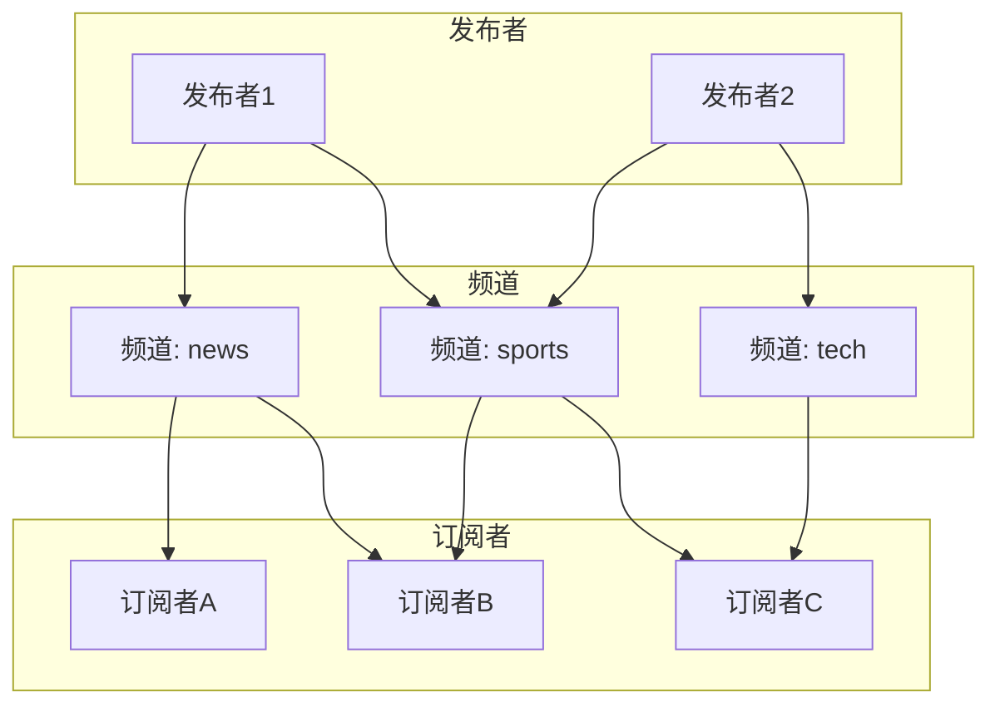
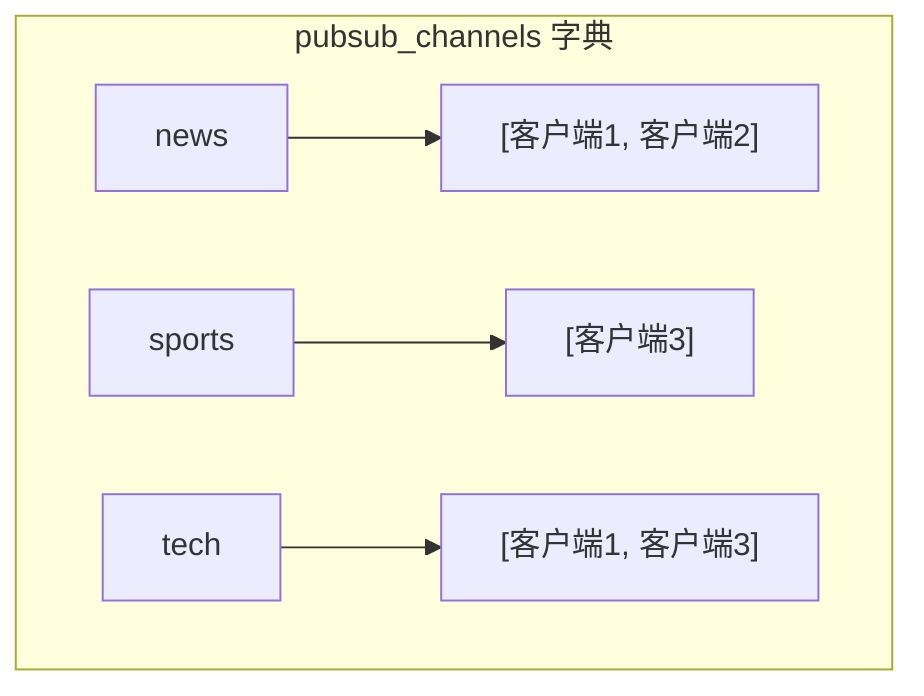
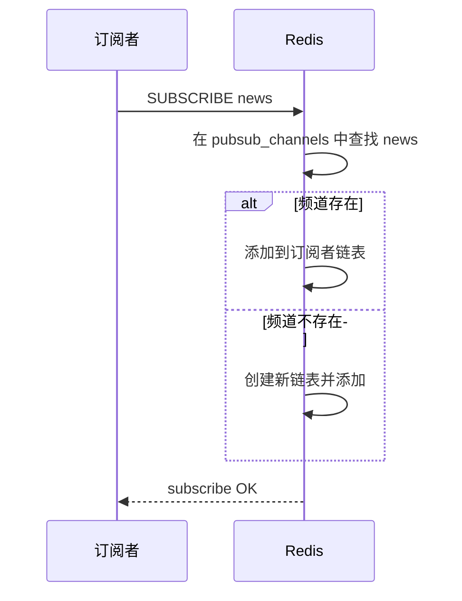
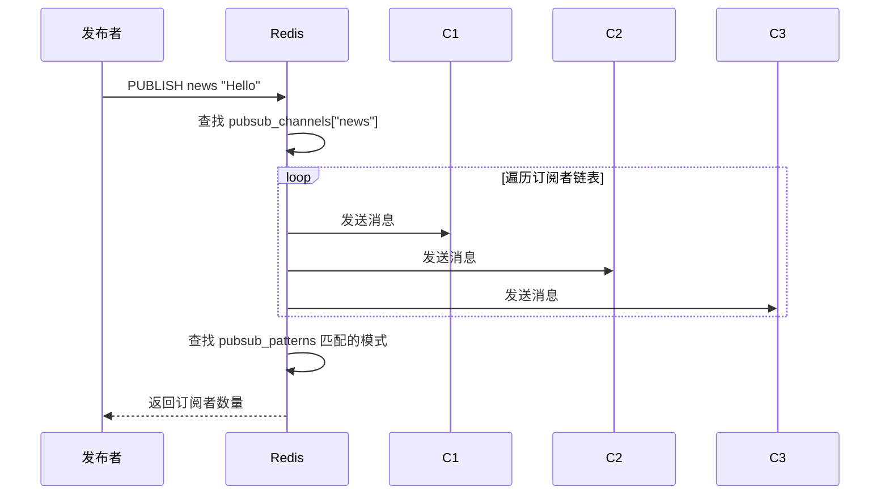
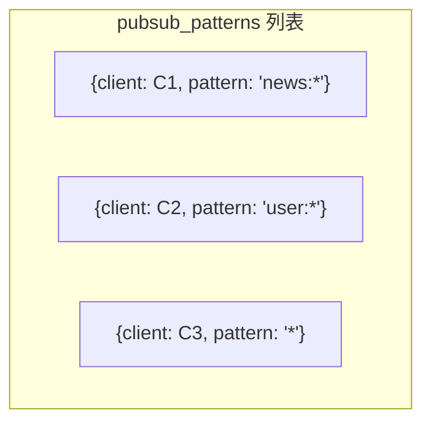

# Redis 发布订阅

> **目标级别**：P5/P6
> **面试频率**：🟢 低频
> **面试官最关心的 3 个问题**：
> 1. Redis 发布订阅的原理是什么？
> 2. Redis 发布订阅有什么特点？
> 3. Redis 发布订阅有哪些应用场景？

面试官问：「Redis 能实现消息队列吗？」你说「可以」——然后面试官追问「Redis 发布订阅是可靠的吗？消息会丢失吗？」你沉默了。

这就是 Redis 发布订阅的本质：它是广播，不是队列。

## 一、发布订阅概述

### 1.1 什么是发布订阅

**发布订阅（Pub/Sub）**：一种消息传递模式，发布者发送消息到频道，订阅者订阅频道接收消息。



### 1.2 基本命令

| 命令 | 说明 |
|------|------|
| **PUBLISH** | 向频道发布消息 |
| **SUBSCRIBE** | 订阅一个或多个频道 |
| **PSUBSCRIBE** | 按模式订阅频道 |
| **UNSUBSCRIBE** | 取消订阅 |
| **PUNSUBSCRIBE** | 按模式取消订阅 |
| **PUBSUB CHANNELS** | 查看活跃频道 |

### 1.3 基本使用

```bash
# 订阅频道（终端1）
127.0.0.1:6379> SUBSCRIBE news
Reading messages... (press Ctrl-C to quit)
1) "subscribe"
2) "news"
3) (integer) 1

# 发布消息（终端2）
127.0.0.1:6379> PUBLISH news "Hello World"
(integer) 1

# 订阅者收到
终端1> 1) "message"
终端1> 2) "news"
终端1> 3) "Hello World"

# 按模式订阅
127.0.0.1:6379> PSUBSCRIBE news.*
1) "psubscribe"
2) "news.*"
3) (integer) 1
```

## 二、发布订阅原理

### 2.1 数据结构

Redis 使用字典（dict）存储频道和订阅者：

```c
// Redis 内部结构
typedef struct redisServer {
    dict *pubsub_channels;    // 频道字典：频道名 -> 订阅者链表
    list *pubsub_patterns;    // 模式字典：模式 -> 订阅者链表
} redisServer;
```



### 2.2 订阅流程



### 2.3 发布流程



## 三、模式订阅

### 3.1 模式匹配

```bash
# 订阅所有 news 相关的频道
127.0.0.1:6379> PSUBSCRIBE news.*

# 支持通配符
# * 匹配任意字符
# ? 匹配单个字符
# [...] 匹配指定字符集

# 示例
PSUBSCRIBE user:*      # 匹配 user:1, user:2, user:100
PSUBSCRIBE news:*:2024 # 匹配 news:sports:2024
```

### 3.2 模式订阅数据结构

```c
typedef struct pubsubPattern {
    redisClient *client;  // 订阅者
    robj *pattern;       // 模式
} pubsubPattern;
```



## 四、消息队列实现

### 4.1 使用 List 实现队列

Redis 发布订阅不保证消息持久化，使用 List 实现可靠队列：

```bash
# 生产者：使用 LPUSH 添加消息
127.0.0.1:6379> LPUSH queue:orders '{"id":1,"product":"A"}'
(integer) 1

# 消费者：使用 BRPOP 阻塞获取
127.0.0.1:6379> BRPOP queue:orders 0
1) "queue:orders"
2) "{\"id\":1,\"product\":\"A\"}"
```

```java
// 生产者
public void sendMessage(String queue, String message) {
    redisTemplate.opsForList().leftPush(queue, message);
}

// 消费者
public String receiveMessage(String queue) {
    return redisTemplate.opsForList().rightPop(queue);
}

// 阻塞消费者
public String blockingReceive(String queue, long timeout) {
    return redisTemplate.opsForList().rightPop(
        queue, timeout, TimeUnit.SECONDS
    );
}
```

### 4.2 消息确认机制

```java
// 使用两个队列实现确认
public void processOrder(String orderId) {
    // 1. 从队列获取消息
    String message = redis.opsForList().rightPop("queue:orders");

    // 2. 处理业务
    processOrder(orderId);

    // 3. 处理成功，删除消息（这里简化处理，实际应该用数据库记录）
    // 如果处理失败，放回队列或死信队列
}

// 死信队列：处理失败的消息
public void moveToDeadLetter(String message) {
    redis.opsForList().leftPush("queue:orders:dlq", message);
}
```

### 4.3 方案对比

| 维度 | 发布订阅 | List 队列 | Stream |
|------|----------|-----------|--------|
| **消息持久化** | ❌ | ✅ | ✅ |
| **消息确认** | ❌ | 部分 | ✅ |
| **消费者组** | ❌ | ❌ | ✅ |
| **消息回溯** | ❌ | ❌ | ✅ |
| **消息堆积** | 不支持 | 支持 | 支持 |
| **可靠性** | 低 | 中 | 高 |

## 五、应用场景

### 5.1 实时消息推送

```java
// 发布消息
public void publishNews(String category, String content) {
    String channel = "news:" + category;
    redis.convertAndSend(channel, content);
}

// 订阅消息
@PostConstruct
public void subscribe() {
    redisTemplate.execute(new RedisMessageListenerContainer() {
        @Override
        protected void doRegister(RedisMessageListenerContainer container) {
            container.addMessageListener((message, pattern) -> {
                String channel = new String(message.getChannel());
                String content = new String(message.getBody());
                System.out.println("收到消息: " + channel + " -> " + content);
            }, new PatternTopic("news:*"));
        }
    });
}
```

### 5.2 排行榜广播

```java
// 更新排行榜时广播
public void updateLeaderboard(String gameId, String userId, int score) {
    // 更新排行榜
    redis.opsForZSet().add("leaderboard:" + gameId, userId, score);

    // 广播排行榜变化
    redis.convertAndSend("leaderboard:" + gameId, userId + ":" + score);
}
```

### 5.3 实时日志收集

```java
// 应用端
public void log(String level, String message) {
    String channel = "log:" + level;
    redis.convertAndSend(channel, message);
}

// 日志收集端
@PostConstruct
public void subscribe() {
    redisTemplate.getConnectionFactory()
        .getConnection()
        .pSubscribe(new PatternMessageListener() {
            @Override
            public void onMessage(byte[] pattern, byte[] channel, byte[] message) {
                String level = new String(channel);
                String content = new String(message);
                logCollector.collect(level, content);
            }
        }, "log:*".getBytes());
}
```

## 六、面试追问链设计

> **第一层**：Redis 发布订阅是怎么实现的？
> **第二层**：Redis 发布订阅有什么特点？
> **第三层**：Redis 发布订阅能作为消息队列吗？

> **第一层**：订阅者掉线后，消息会保留吗？
> **第二层**：发布者发布消息时，订阅者不在线会怎样？
> **第三层**：如何实现可靠的消息传递？

> **第一层**：Redis Stream 和发布订阅有什么区别？
> **第二层**：Redis Stream 有什么优势？
> **第三层**：如何用 Redis Stream 实现可靠队列？

## 七、常见面试陷阱

**⚠️ 陷阱 1**：误以为发布订阅是可靠的

Redis 发布订阅是"发完即忘"，订阅者不在线时消息会丢失。

**⚠️ 陷阱 2**：忽视消息堆积问题

如果订阅者消费速度慢于发布速度，消息会堆积在 Redis 内存中。

**⚠️ 陷阱 3**：混淆消息模式和频道

- 频道订阅：`SUBSCRIBE channel`
- 模式订阅：`PSUBSCRIBE pattern`

## 八、对比总结表

| 维度 | 发布订阅 | List 队列 | Stream |
|------|----------|-----------|--------|
| **消息模型** | 广播 | 队列 | Stream |
| **持久化** | ❌ | ✅ | ✅ |
| **ACK** | ❌ | ❌ | ✅ |
| **消费者组** | ❌ | ❌ | ✅ |
| **回溯** | ❌ | ❌ | ✅ |
| **延迟队列** | ❌ | ✅ | ✅ |

## 九、加分回答

> **💡 面试加分点**：Redis Stream（Redis 5.0+）：

Redis Stream 是专门为消息队列设计的，支持：
- 消费者组
- 消息确认
- 消息 ID
- 消息回溯

> **💡 面试加分点**：Redis 发布订阅的配置参数：

```bash
# 客户端输出缓冲区大小
client-output-buffer-limit pubsub 32mb 8mb 60

# pubsub clients-hiwater pubsub-clients
# pubsub clients-lowater pubsub-clients
```

> **💡 面试加分点**：生产环境替代方案：

1. **Redis Stream**：Redis 5.0+ 的消息队列方案
2. **Kafka/RabbitMQ**：专业消息队列
3. **RocketMQ**：阿里巴巴开源的消息队列
