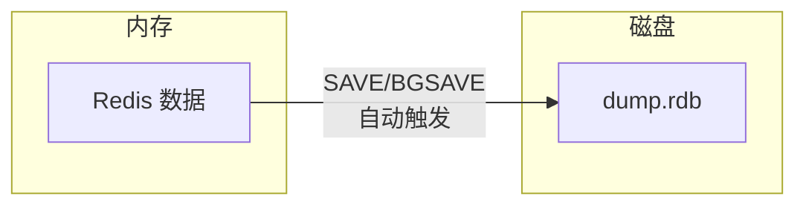
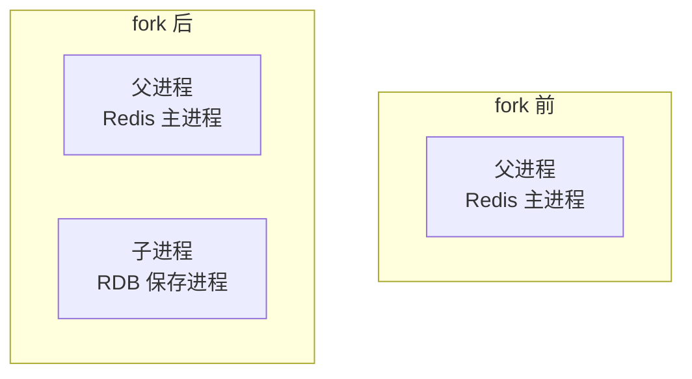
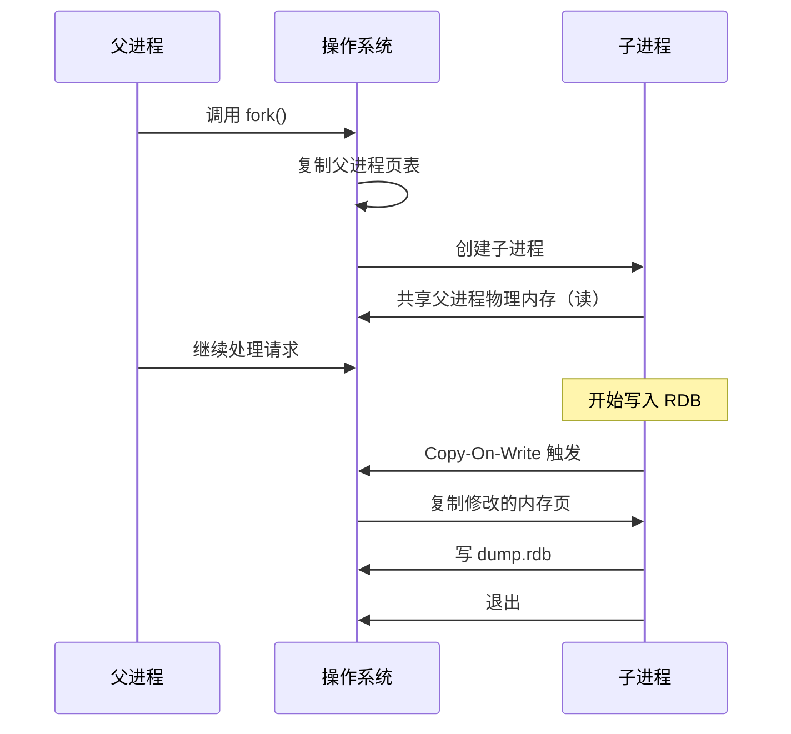
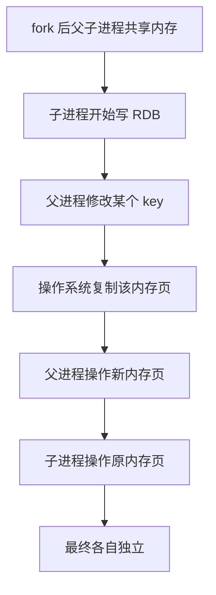
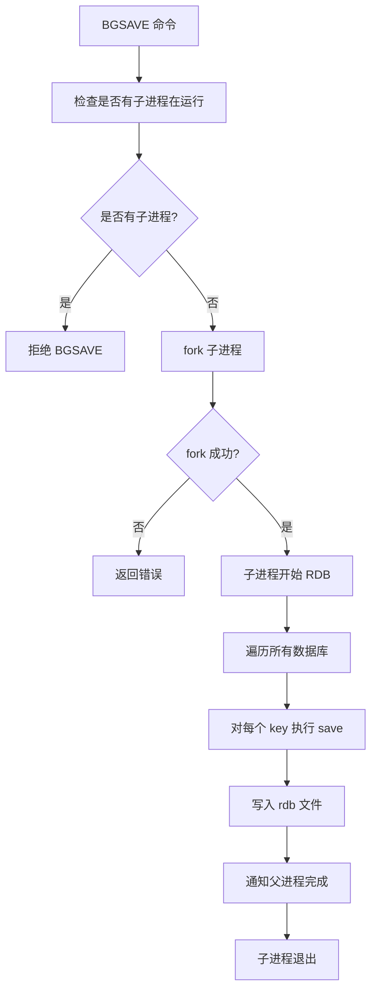

# RDB 持久化原理

> **目标级别**：P5/P6
> **面试频率**：🔴 高频
> **面试官最关心的 3 个问题**：
> 1. RDB 持久化是什么？什么时候触发？
> 2. RDB 的实现原理是什么？
> 3. RDB 有什么优缺点？适合什么场景？

面试官问：「Redis 的 RDB 是什么？」你说「是持久化的一种」——然后面试官紧接着追问「RDB 是怎么生成的？fork 是什么？Copy-On-Write 又是什么？」你沉默了。

这就是 Redis 持久化面试的真实面貌：不仅要回答"是什么"，还要理解"底层原理"。

## 一、RDB 简介

### 1.1 什么是 RDB

RDB（Redis Database）是将 Redis 在内存中的数据**持久化到磁盘**的二进制文件。



### 1.2 文件格式

```bash
# RDB 文件位置
redis.conf: dir ./  # 工作目录
redis.conf: dbfilename dump.rdb

# 文件结构
+----------------+
|  RDB HEADER    |  # 5 字节：REDIS 标识 + 版本号
+----------------+
|  DB VERSION     |  # 4 字节：RDB 版本
+----------------+
|  SELECT DB      |  # 数据库选择
+----------------+
|  KEY-VALUE PAIRS|  # 键值对数据
+----------------+
|  EOF            |  # 1 字节：结束标记 0xFF
+----------------+
|  CHECK SUM      |  # 8 字节：CRC64 校验和
+----------------+
```

## 二、触发方式

### 2.1 手动触发

| 命令 | 说明 | 阻塞 |
|------|------|------|
| `SAVE` | 同步保存，阻塞主进程 | ✅ 完全阻塞 |
| `BGSAVE` | 异步保存，fork 子进程 | ❌ 后台运行 |

```bash
# 同步保存（阻塞主进程）
redis> SAVE
OK

# 异步保存（后台运行）
redis> BGSAVE
Background saving started
```

### 2.2 自动触发

```bash
# redis.conf 配置
save 900 1      # 900 秒内至少有 1 个 key 变化
save 300 10     # 300 秒内至少有 10 个 key 变化
save 60 10000   # 60 秒内至少有 10000 个 key 变化

# 禁止 RDB 持久化
save ""
```

### 2.3 其他触发方式

```bash
# 主从复制时，从库自动触发
# 执行 SHUTDOWN 时，如果没有开启 AOF，会自动触发 RDB
# 执行 FLUSHALL/FLUSHDB（可配置）
```

## 三、核心原理：fork

### 3.1 fork 的作用

fork 是 Linux 系统调用，用于**创建一个子进程**：



### 3.2 fork 执行流程



### 3.3 Copy-On-Write（写时复制）



**关键点**：
- fork 后父子进程共享物理内存
- 只有修改时才复制内存页
- 最大限度减少内存复制开销

## 四、RDB 生成流程

### 4.1 流程图



### 4.2 数据序列化

```c
// RDB 写入的数据类型
typedef struct {
    int type;           // 数据类型
    void *value;        // 值
    long long expire;   // 过期时间
} rioItem;

// 保存 key-value
void rdbSaveKeyValuePair(rio *rdb, robj *key, robj *val, long long expire) {
    // 1. 写入过期时间
    if (expire > 0) rdbSaveMillisTimeAppend(rdb, expire);

    // 2. 写入数据类型
    rdbWriteType(rdb, val->type);

    // 3. 写入 key
    rdbSaveStringObject(rdb, key);

    // 4. 写入 value
    rdbSaveObject(rdb, val);
}
```

## 五、优缺点分析

### 5.1 优点

| 优点 | 说明 |
|------|------|
| **文件紧凑** | 二进制格式，适合备份和传输 |
| **恢复快** | 全量加载，启动快 |
| **性能高** | fork + Copy-On-Write，开销小 |
| **容错性强** | 支持远程备份 |

### 5.2 缺点

| 缺点 | 说明 |
|------|------|
| **可能丢失数据** | 上次快照后的数据会丢失 |
| **阻塞主进程** | SAVE 命令会阻塞 |
| **fork 开销** | 内存越大，fork 时间越长 |
| **不是增量** | 每次都是全量快照 |

## 六、面试追问链设计

> **第一层**：RDB 是什么？什么时候触发？
> **第二层**：fork 是什么？Copy-On-Write 是什么？
> **第三层**：fork 在大内存机器上会有什么问题？

> **第一层**：RDB 和 AOF 有什么区别？
> **第二层**：什么场景下应该用 RDB？
> **第三层**：能不能同时使用 RDB 和 AOF？

> **第一层**：BGSAVE 的时候能处理请求吗？
> **第二层**：BGSAVE 和 SAVE 有什么区别？
> **第三层**：fork 失败的原因有哪些？

## 七、常见面试陷阱

**⚠️ 陷阱 1**：说 fork 是"复制数据"
- fork 不是复制数据，而是共享数据
- 只有修改时才复制（Copy-On-Write）

**⚠️ 陷阱 2**：忽视 fork 的副作用
- fork 会阻塞主进程一段时间
- 内存越大，fork 时间越长

**⚠️ 陷阱 3**：不了解 RDB 的恢复速度
- RDB 是二进制文件，加载比 AOF 快
- 适合作为冷备份

## 八、对比总结表

| 维度 | RDB | AOF |
|------|-----|-----|
| **文件格式** | 二进制 | 文本命令 |
| **文件大小** | 小 | 大 |
| **恢复速度** | 快 | 慢 |
| **数据完整性** | 可能有丢失 | 可配置完整性 |
| **写入方式** | 全量快照 | 增量追加 |
| **优先级** | 自动/手动 | 自动 |

## 九、加分回答

> **💡 面试加分点**：如果能说出 RDB 的底层实现细节，会给面试官留下深刻印象：
>
> 1. **RDB 版本号**：不同版本有不同的压缩算法
> 2. **CRC64 校验**：保证文件完整性
> 3. **多数据库支持**：RDB 可以保存多个数据库的数据
> 4. **增量信息**：可以记录从某个时间点后的变更
>
> ```bash
> # 查看 RDB 文件信息
> redis-cli --rdb dump.rdb
> # 或者使用 redis-check-rdb 工具
> redis-check-rdb dump.rdb
> ```
