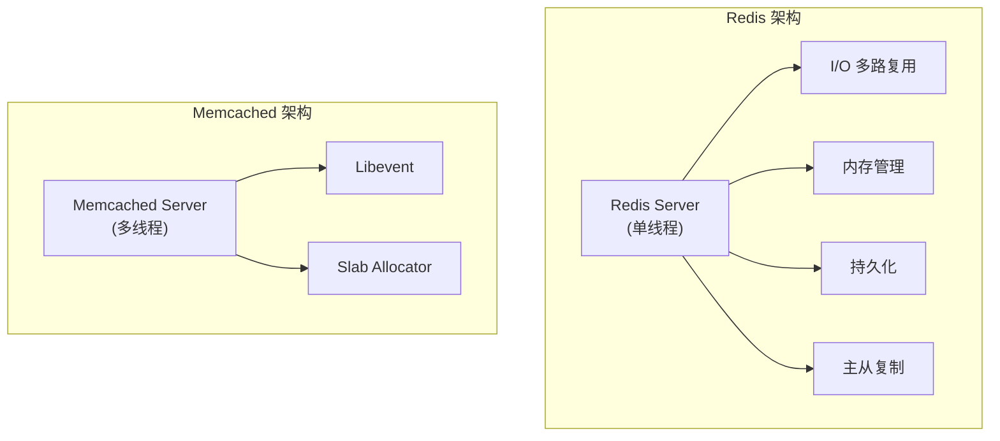
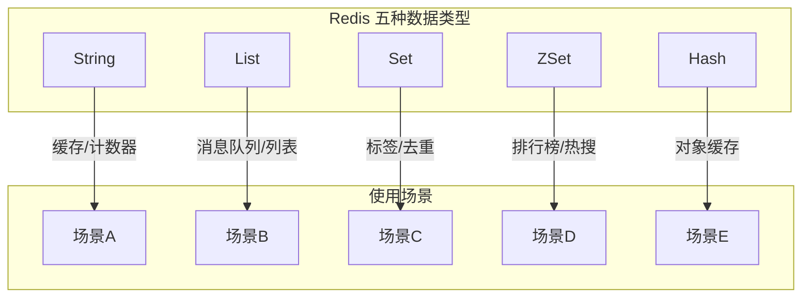
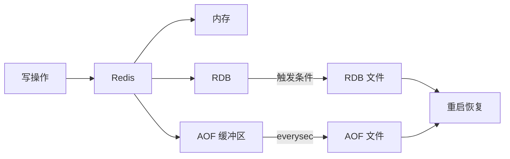
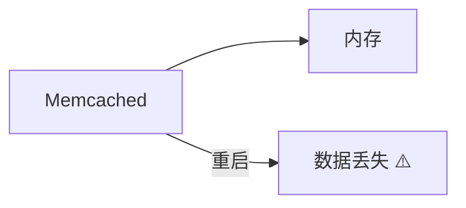
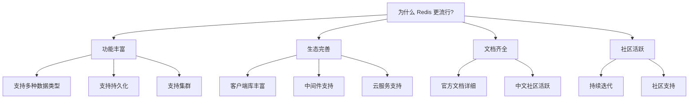
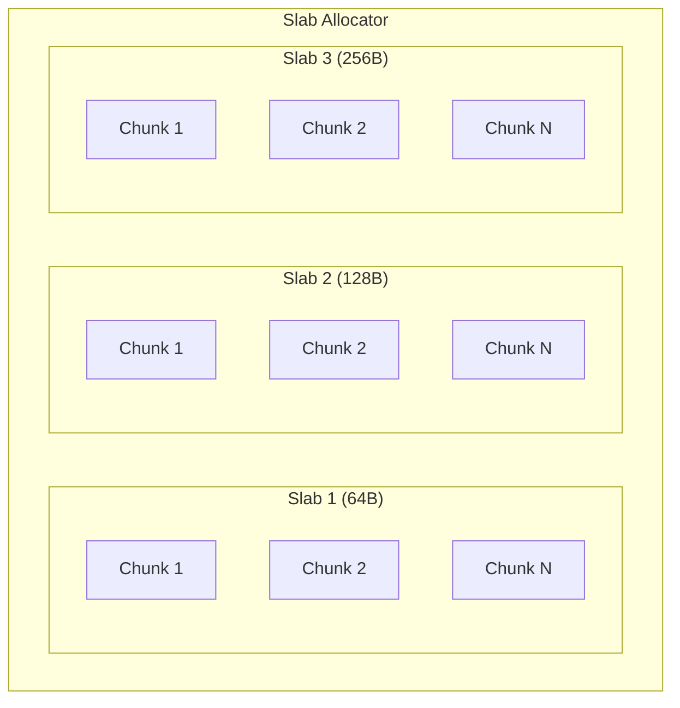
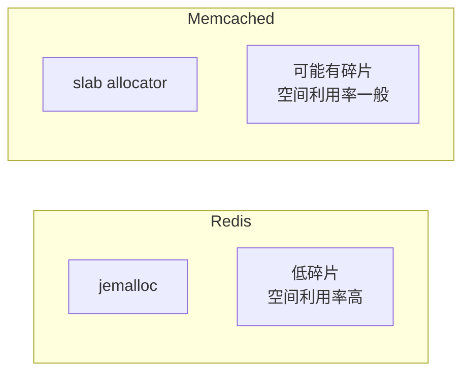
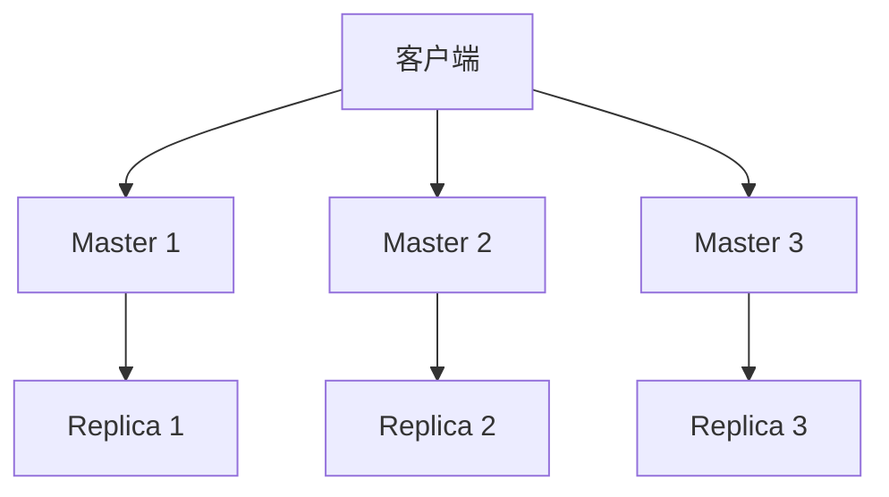
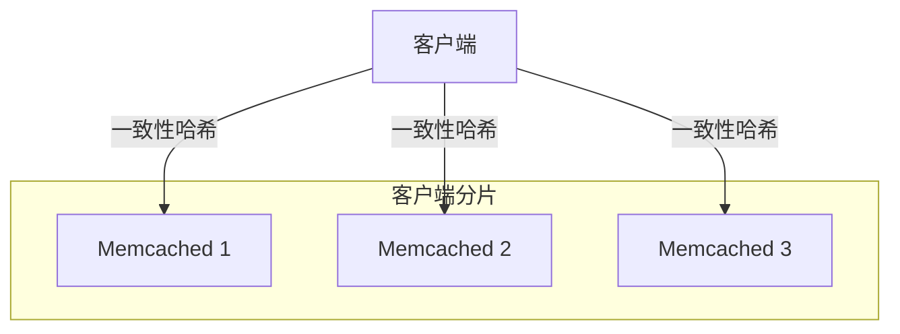
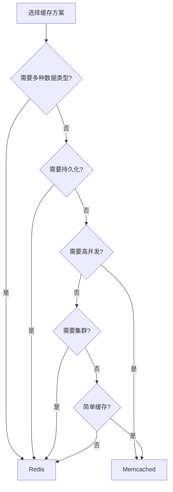

# Redis 与 Memcached 对比

> **目标级别**：P5/P6
> **面试频率**：🟡 中频
> **面试官最关心的 3 个问题**：
> 1. Redis 和 Memcached 有什么区别？
> 2. 什么场景下应该用 Redis？什么场景下用 Memcached？
> 3. 为什么 Redis 比 Memcached 更流行？

面试官问：「你们项目里用的是 Redis，为什么不用 Memcached？」你说「公司技术选型」——然后面试官追问「Memcached 也支持缓存，Redis 也支持缓存，它们的区别是什么？什么时候该用哪个？」你沉默了。

这就是 Redis vs Memcached 的核心问题。

## 一、基本对比

### 1.1 核心差异

| 维度 | Redis | Memcached |
|------|-------|-----------|
| **支持数据类型** | String, List, Set, ZSet, Hash, Stream | 仅 String |
| **持久化** | 支持 RDB + AOF | 不支持 |
| **复制** | 支持主从复制 | 不支持 |
| **集群** | 原生支持 Cluster | 需要客户端实现 |
| **线程模型** | 单线程 + IO 多路复用 | 多线程 |
| **内存管理** | 自有实现（SDS） | slab allocator |
| **架构** | 单进程多线程 | 多进程多线程 |

### 1.2 架构对比



## 二、数据类型对比

### 2.1 Redis 支持的数据类型



### 2.2 Memcached 仅支持 String

Memcached 的 value 只能是字符串：

```bash
# Memcached 只能存储字符串
set key 0 3600 5
value
STORED

# 如果要存对象，需要序列化
set user:1 0 3600 50
{"name":"张三","age":18}
STORED
```

### 2.3 数据类型对比表

| 操作 | Redis | Memcached |
|------|-------|-----------|
| `SET key value` | ✅ | ✅ |
| `GET key` | ✅ | ✅ |
| `INCR counter` | ✅ | ✅ |
| `HSET key f v` | ✅ | ❌ |
| `SADD set v` | ✅ | ❌ |
| `ZADD zset score v` | ✅ | ❌ |
| `LPUSH list v` | ✅ | ❌ |

## 三、持久化对比

### 3.1 Redis 持久化



| 方式 | 说明 | 优点 | 缺点 |
|------|------|------|------|
| **RDB** | 定时生成快照 | 恢复快 | 可能丢数据 |
| **AOF** | 记录所有写命令 | 数据完整 | 文件大、恢复慢 |
| **混合持久化** | RDB + AOF | 兼顾两者 | 配置复杂 |

### 3.2 Memcached 不支持持久化



Memcached 重启后数据全部丢失，需要重新预热。

## 四、性能对比

### 4.1 单机性能

| 测试场景 | Redis | Memcached | 说明 |
|----------|-------|-----------|------|
| **GET** | ~50万 QPS | ~60万 QPS | 相差不大 |
| **SET** | ~20万 QPS | ~30万 QPS | Memcached 略高 |
| **内存效率** | SDS 优化 | slab allocator | Redis 更省内存 |

### 4.2 性能差异原因

| 原因 | Redis | Memcached |
|------|-------|-----------|
| **架构** | 单线程，无锁竞争 | 多线程，更高并发 |
| **内存分配** | SDS + jemalloc | slab allocator |
| **网络模型** | IO 多路复用 | epoll |

### 4.3 为什么 Redis 更流行



## 五、内存管理对比

### 5.1 Redis 内存管理

Redis 使用 **jemalloc** + 自有 SDS 优化：

| 特性 | 说明 |
|------|------|
| **SDS 优化** | 预分配 + 惰性释放 |
| **内存碎片** | 低（jemalloc） |
| **大对象** | 支持，最大 512MB |

### 5.2 Memcached 内存管理

Memcached 使用 **slab allocator**：



| 特性 | 说明 |
|------|------|
| **固定大小** | 按 slab 大小分配 |
| **内存碎片** | 可能较高（内部碎片） |
| **过期策略** | LRU |

### 5.3 内存碎片对比



## 六、集群对比

### 6.1 Redis 集群



- 原生支持 Cluster
- 16384 个槽位
- 自动故障转移

### 6.2 Memcached 集群

Memcached 需要客户端实现分片：



| 特性 | Redis | Memcached |
|------|-------|-----------|
| **集群方式** | 原生 Cluster | 客户端分片 |
| **数据迁移** | 在线迁移 | 需要客户端支持 |
| **高可用** | 支持主从 | 不支持 |

## 七、选择建议

### 7.1 选择 Redis 的场景

| 场景 | 推荐原因 |
|------|----------|
| **需要多种数据结构** | String, List, Set, Hash, ZSet |
| **需要持久化** | 缓存数据需要重启后保留 |
| **需要分布式** | Redis Cluster / 主从复制 |
| **计数器/排行榜** | INCR, ZSet |
| **消息队列** | List, Stream |
| **Session 共享** | 可持久化，支持集群 |

### 7.2 选择 Memcached 的场景

| 场景 | 推荐原因 |
|------|----------|
| **纯缓存** | 不需要持久化 |
| **大并发访问** | 多线程性能好 |
| **简单缓存** | 只存 String |
| **PHP 环境** | 原生 session handler |
| **内存效率** | 不想维护 Redis |

### 7.3 决策流程



## 八、面试追问链设计

> **第一层**：Redis 和 Memcached 有什么区别？
> **第二层**：Redis 比 Memcached 好在哪里？
> **第三层**：什么场景下用 Memcached 比 Redis 更好？

> **第一层**：Redis 单线程为什么比 Memcached 多线程快？
> **第二层**：slab allocator 和 jemalloc 有什么区别？
> **第三层**：Memcached 的多线程有什么优势？

> **第一层**：Redis 的持久化有什么意义？
> **第二层**：Memcached 重启后数据丢失怎么办？
> **第三层**：如何保证缓存数据不丢失？

## 九、常见面试陷阱

**⚠️ 陷阱 1**：认为 Redis 一定比 Memcached 快

在纯 String 缓存场景下，Memcached 可能更快。但 Redis 功能更丰富。

**⚠️ 陷阱 2**：忽视 Memcached 的优势

Memcached 在简单缓存场景下仍然是一个好的选择。

**⚠️ 陷阱 3**：不知道 Memcached 不支持持久化

Memcached 重启后数据全部丢失，这是一个重要区别。

## 十、对比总结表

| 维度 | Redis | Memcached |
|------|-------|-----------|
| **数据类型** | 多种 | 仅 String |
| **持久化** | ✅ RDB + AOF | ❌ |
| **主从复制** | ✅ | ❌ |
| **Cluster** | ✅ 原生 | ❌ 需客户端 |
| **性能** | 高 | 很高 |
| **内存效率** | 高 | 中 |
| **架构** | 单线程 | 多线程 |
| **适用场景** | 复杂缓存 | 简单缓存 |

## 十一、加分回答

> **💡 面试加分点**：可以补充一些细节：

1. **Redis 6.0 多线程**：Redis 6.0 引入了多线程 IO，提升网络吞吐量
2. **Memcached 限制**：value 最大 1MB，Redis 最大 512MB
3. **协议差异**：Redis 支持 RESP 协议，Memcached 支持文本协议和二进制协议

> **💡 面试加分点**：实际选型建议：

- 如果不确定，先选 Redis（功能更丰富）
- 如果确定只需要 String 缓存，可以考虑 Memcached
- 如果是 PHP 环境，可以考虑 Memcached（原生支持）
