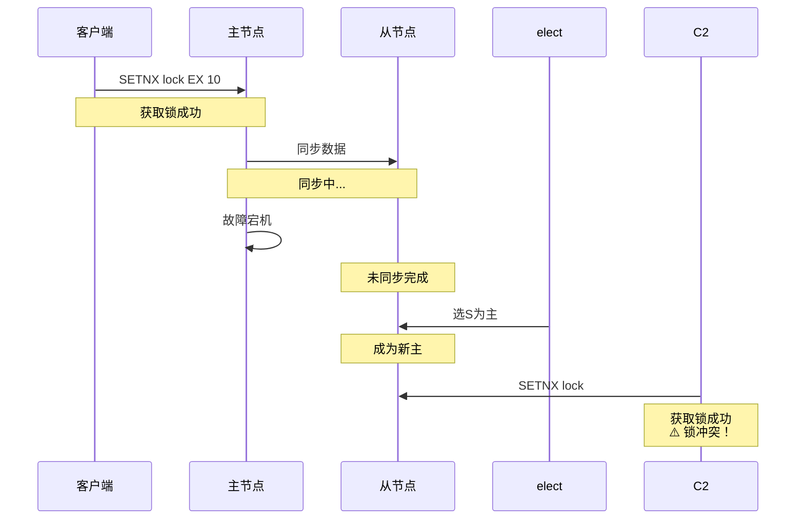
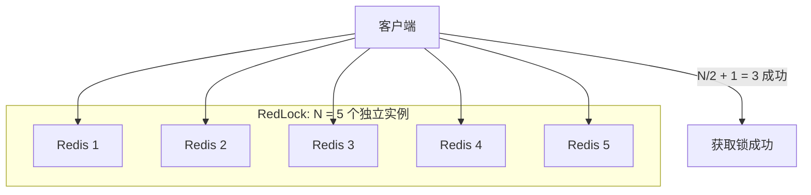
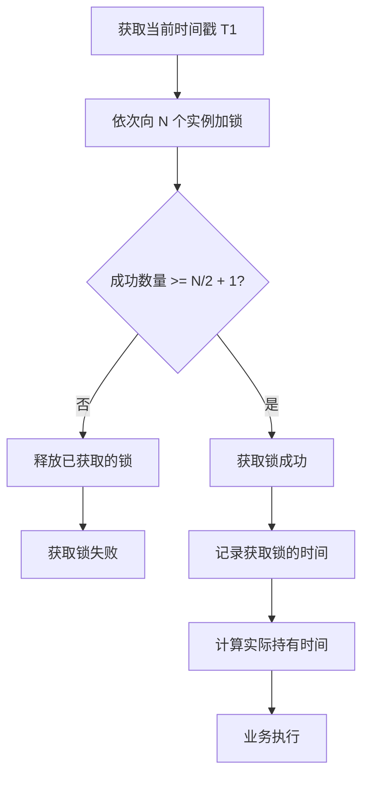
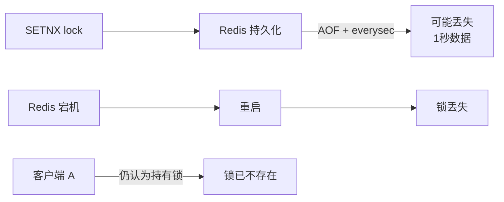
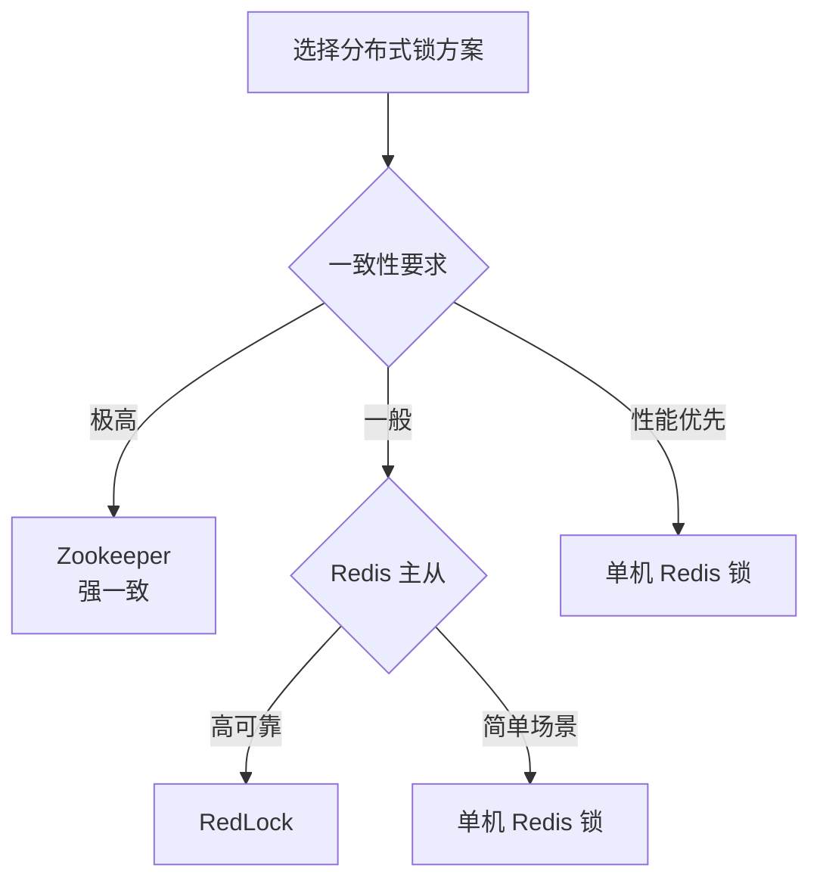

# RedLock 算法与争议

> **目标级别**：P6/P7
> **面试频率**：🟡 中频
> **面试官最关心的 3 个问题**：
> 1. RedLock 算法是什么？如何实现？
> 2. RedLock 有什么争议？为什么有人批评它？
> 3. 单机 Redis 锁和 RedLock 应该如何选择？

面试官问：「Redis 主从模式下，主节点加了锁，还没同步到从节点就挂了，新主节点被选出来后锁就丢失了，怎么办？」你说「用 RedLock」——然后面试官追问「你知道 RedLock 有争议吗？为什么有人说它不可靠？」你沉默了。

这就是 RedLock 的核心问题：分布式锁的可靠性与性能之间的权衡。

## 一、RedLock 概述

### 1.1 问题背景

普通 Redis 分布式锁在主从模式下存在以下问题：



**核心问题**：主从异步复制，导致锁丢失。

### 1.2 RedLock 解决思路

**RedLock**：向 N 个独立 Redis 实例获取锁，超过半数成功则算获取成功。



## 二、RedLock 算法详解

### 2.1 算法步骤



### 2.2 代码实现

```java
public class RedissonRedLock implements Lock {
    private final RedissonNode[] nodes;
    private final int quorums;
    private final long lockWaitTime;

    public RedissonRedLock(RedissonNode... nodes) {
        this.nodes = nodes;
        this.quorums = nodes.length / 2 + 1;
        this.lockWaitTime = 30000; // 30 秒
    }

    @Override
    public boolean tryLock(long waitTime, long leaseTime, TimeUnit unit) {
        long startTime = System.currentTimeMillis();
        long endTime = startTime + unit.toMillis(waitTime);

        // 1. 获取所有节点的锁
        List<RLock> acquiredLocks = new ArrayList<>();

        for (RLock node : nodes) {
            try {
                // 尝试获取锁，等待时间要均匀分布
                long remainTime = endTime - System.currentTimeMillis();
                if (remainTime <= 0) {
                    break;
                }

                boolean acquired = node.tryLock(
                    remainTime,
                    leaseTime,
                    TimeUnit.MILLISECONDS
                );

                if (acquired) {
                    acquiredLocks.add(node);
                }
            } catch (Exception e) {
                // 单节点失败，继续尝试其他节点
            }
        }

        // 2. 检查是否达到 quorum
        if (acquiredLocks.size() >= quorums) {
            // 计算实际持有时间
            long actualExpireTime =
                startTime - System.currentTimeMillis() + leaseTime;
            return true;
        } else {
            // 3. 未达到 quorum，释放所有锁
            for (RLock lock : acquiredLocks) {
                try {
                    lock.unlock();
                } catch (Exception e) {
                    // 忽略
                }
            }
            return false;
        }
    }
}
```

### 2.3 关键参数

```java
// Redisson 配置
Config config = new Config();
config.useSingleServer()...;

// 创建 5 个独立节点（可以是单机多端口或分布式）
RedissonRedLock redLock = new RedissonRedLock(
    redisson1.getLock("myLock"),
    redisson2.getLock("myLock"),
    redisson3.getLock("myLock"),
    redisson4.getLock("myLock"),
    redisson5.getLock("myLock")
);

// 获取锁
redLock.tryLock(10, 30, TimeUnit.SECONDS);
```

## 三、RedLock 的争议

### 3.1 Martin Kleppmann 的批评

2016 年，分布式系统专家 Martin Kleppmann 发表文章《How to do distributed locking》，对 RedLock 提出了严厉批评。

#### 3.1.1 争议点一：时钟跳跃

```mermaid
flowchart TD
    A["客户端 A"] -->|"获取锁<br/>过期时间 10s"| B["Redis 1"]
    A -->|"获取锁<br/>过期时间 10s"| C["Redis 2"]

    D["时间跳跃<br/>+5s"] --> A

    A -->|"持有锁中..."| E["执行业务"]
    E --> F["10s 后..."]
    F --> G["Redis 认为锁已过期"]
    G --> H["客户端 B 获取锁"]

    Note over A,E,H: A 还在执行，B 已获取锁 ⚠️
```

| 问题 | 说明 |
|------|------|
| **NTP 服务调整时间** | 系统时间突然跳跃，可能导致锁提前或延迟过期 |
| **虚拟机暂停** | VM 暂停导致客户端时间与 Redis 时间不同步 |
| **GC 暂停** | GC 期间客户端暂停，时间与 Redis 不同步 |

#### 3.1.2 争议点二：持久化问题



如果 Redis 使用 `appendfsync = everysec`（每秒同步），在宕机重启后可能丢失最多 1 秒的数据，导致锁失效。

### 3.2 Antirez 的回应

Redis 作者 Antirez 随后发表文章回应：

1. **时钟问题不是 Redis 的问题**：任何分布式系统都面临时钟问题
2. **持久化可以配置**：可以使用 `appendfsync = always` 解决
3. **RedLock 适用于对可靠性要求不高的场景**

### 3.3 争议总结

| 批评点 | 说明 | RedLock 回应 |
|--------|------|-------------|
| **时钟跳跃** | 可能导致锁提前失效 | 任何系统都有时钟问题 |
| **持久化丢失** | 可能丢失 1 秒数据 | 可配置为 always |
| **假设不合理** | 假设 N 个时钟同步 | 可使用时钟漂移检测 |
| **实现复杂** | 需要 5 个独立 Redis | 成本高 |

## 四、实际应用选择

### 4.1 场景分析



### 4.2 方案对比

| 方案 | 一致性 | 性能 | 实现复杂度 | 适用场景 |
|------|--------|------|------------|----------|
| **单机 Redis 锁** | 最终一致 | 高 | 低 | 对可靠性要求不高 |
| **RedLock** | 多数一致 | 中 | 高 | 需要高可用 |
| **Zookeeper 锁** | 强一致 | 中 | 中 | 对可靠性要求高 |
| **Chubby（Google）** | 强一致 | 低 | 高 | 核心系统 |

### 4.3 RedLock 适用场景

**适用**：
- 对可用性要求高
- 可以接受短暂的不可用
- 需要跨数据中心的高可用

**不适用**：
- 对强一致性要求极高
- 需要跨事务的正确性
- 金融、支付等核心业务

## 五、面试追问链设计

> **第一层**：RedLock 算法是什么？
> **第二层**：RedLock 有什么争议？为什么被批评？
> **第三层**：什么场景下应该用 RedLock？

> **第一层**：RedLock 和普通 Redis 锁有什么区别？
> **第二层**：RedLock 需要几个节点？为什么是多数原则？
> **第三层**：RedLock 的锁过期时间怎么设置？

> **第一层**：RedLock 能完全解决主从复制问题吗？
> **第二层**：如果只有 3 个节点，RedLock 的可靠性如何？
> **第三层**：有什么比 RedLock 更可靠的方案？

## 六、常见面试陷阱

**⚠️ 陷阱 1**：认为 RedLock 是万能的

RedLock 只能提高可用性，不能保证强一致性。有些人误以为用了 RedLock 就万无一失。

**⚠️ 陷阱 2**：不理解多数原则

RedLock 需要多数节点（N/2+1）获取锁成功才算成功，不是所有节点。

**⚠️ 陷阱 3**：忽视持久化问题

如果 Redis 配置不当（不用 always 持久化），即使有 RedLock 也可能丢锁。

## 七、对比总结表

| 维度 | 单机 Redis 锁 | RedLock | Zookeeper 锁 |
|------|---------------|---------|--------------|
| **CAP 模型** | AP | AP | CP |
| **一致性** | 最终一致 | 多数一致 | 强一致 |
| **可靠性** | 单点故障 | N/2 容错 | N/2 容错 |
| **性能** | 高 | 中 | 中 |
| **实现复杂度** | 低 | 高 | 中 |
| **持久化** | 可配置 | 可配置 | 自身保证 |
| **时钟依赖** | 是 | 是 | 否 |

## 八、加分回答

> **💡 面试加分点**：Redisson 对 RedLock 的改进：

1. **分段锁**：将 key 拆分为多个段，锁住多个段
2. **联锁（MultiLock）**：同时锁多个 key
3. **红锁（RedLock）**：标准的 RedLock 实现

> **💡 面试加分点**：更可靠的分布式锁方案：

1. **Zookeeper**：使用临时有序节点，Leader 选举保证一致性
2. **Etcd**：基于 Raft 协议，保证强一致性
3. ** Consul**：类似 etcd，基于 Raft

> **💡 面试加分点**：如果必须用 Redis 锁，如何提高可靠性：

1. **使用 RedLock**：提高可用性
2. **合理的锁续期**：看门狗机制
3. **合理的过期时间**：业务执行时间 + 缓冲时间
4. **使用 always 持久化**：避免数据丢失
